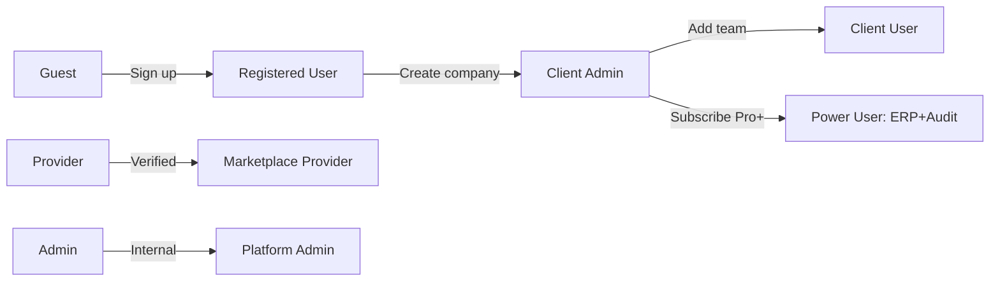

# APEX Financial Platform — Master Blueprint Index
# منصة APEX المالية — فهرس المخطط الرئيسي

> **Version 3.5 — TRULY FINAL** · Generated 2026-04-30 · 100% documentation coverage
> **الإصدار 3.5 — النهائي تماماً** · تم الإنشاء 2026-04-30 · تغطية كاملة 100%
>
> 🎯 **Documentation is now complete. Read 31 for roadmap, 32-34 for visual+templates+diagrams. Then execute.**
> 🎯 **التوثيق مكتمل الآن. اقرأ 31 للخارطة، 32-34 للبصري والقوالب والمخططات. ثم نفّذ.**

---

## 🎯 Purpose / الهدف

**EN:** This `APEX_BLUEPRINT/` folder is the **single source of truth** for restructuring, reorganizing, and completing the APEX platform. Every existing screen, route, button, API endpoint, role, and subscription tier is documented here with research-backed best practices from global ERP/audit/SaaS systems.

**AR:** هذا المجلد `APEX_BLUEPRINT/` هو **المصدر الموحد للحقيقة** لإعادة هيكلة وتنظيم واستكمال منصة APEX. كل شاشة وكل مسار وكل زر وكل نقطة API وكل دور وكل خطة اشتراك موثقة هنا مع أفضل الممارسات المدعومة بأبحاث من أنظمة ERP/تدقيق/SaaS العالمية.

**Audience:** Claude Code, lead engineers, product owners.
**الجمهور:** Claude Code، مهندسو القيادة، مالكو المنتج.

---

## 📚 Document Map / خريطة الوثائق

| # | File | Purpose (EN) | الغرض (AR) |
|---|------|--------------|-----------|
| 00 | `00_MASTER_INDEX.md` | This file — entry point | هذا الملف — نقطة الدخول |
| 01 | `01_ARCHITECTURE_OVERVIEW.md` | System architecture diagrams | مخططات معمارية النظام |
| 02 | `02_USER_JOURNEYS_FLOWCHART.md` | Per-user-type journeys | رحلات لكل نوع مستخدم |
| 03 | `03_NAVIGATION_MAP.md` | Flutter routes (~257 in `router.dart`) | مسارات Flutter (~257) |
| 04 | `04_SCREENS_AND_BUTTONS_CATALOG.md` | Every screen, every button | كل شاشة، كل زر |
| 05 | `05_API_ENDPOINTS_MASTER.md` | Backend endpoints (~770 decorators) | نقاط API الخلفية (~770) |
| 06 | `06_PERMISSIONS_AND_PLANS_MATRIX.md` | RBAC × Plans matrix | مصفوفة الصلاحيات × الخطط |
| 07 | `07_DATA_MODEL_ER.md` | Database ER diagrams | مخططات ER لقاعدة البيانات |
| 08 | `08_GLOBAL_BENCHMARKS.md` | Research synthesis | تركيب الأبحاث العالمية |
| 09 | `09_GAPS_AND_REWORK_PLAN.md` | Bugs, gaps, rework plan | الثغرات وخطة الإصلاح |
| 10 | `10_CLAUDE_CODE_INSTRUCTIONS.md` | Executable playbook for Claude Code | دليل تنفيذي لـ Claude Code |
| 11 | `11_INTEGRATION_GUIDE.md` | How to extend existing infrastructure | كيفية توسيع البنية الموجودة |
| 12 | `12_SAP_DEEP_DIVE.md` | SAP S/4HANA Cloud detailed extraction | تعمق في SAP |
| 13 | `13_ODOO_DEEP_DIVE.md` | Odoo 17 Accounting detailed | تعمق في Odoo |
| 14 | `14_FRAPPE_DEEP_DIVE.md` | Frappe Framework patterns + DocType model | تعمق في Frappe |
| 15 | `15_DDD_BOUNDED_CONTEXTS.md` | DDD analysis + APEX rearchitecture | السياقات المحدودة |
| 16 | `16_BUSINESS_PROCESSES.md` | O2C, P2P, R2R, H2R, A2R, ZATCA cycles | العمليات التجارية |
| 17 | `17_STATE_MACHINES.md` | State machines for every entity | آلات الحالة |
| 18 | `18_SECURITY_AND_THREAT_MODEL.md` | OWASP/STRIDE/PDPL/GDPR/SOC 2 | الأمان والامتثال |
| 19 | `19_DEPLOYMENT_TOPOLOGY.md` | Multi-region, DR, CI/CD, monitoring | طوبولوجيا النشر |
| 20 | `20_INTEGRATION_ECOSYSTEM.md` | Banking, payments, ZATCA, FTA, ETA, AI | منظومة التكامل |
| 21 | `21_INDUSTRY_TEMPLATES.md` | Per-industry feature packs (12 verticals) | قوالب الصناعات |
| 22 | `22_MARKETING_AND_GTM.md` | STP, 4Ps, AARRR, GTM, pricing | التسويق والإطلاق |
| 23 | `23_AUDIT_DEEP.md` | ISA, SOCPA, PCAOB, IIA standards | معايير المراجعة |
| 24 | `24_CRM_MODULE_DESIGN.md` | CRM: leads, pipeline, opportunities, quotes | إدارة علاقات العملاء |
| 25 | `25_PROJECT_MANAGEMENT.md` | PM: projects, tasks, Gantt, timesheets, billing | إدارة المشاريع |
| 26 | `26_DOCUMENT_MANAGEMENT_SYSTEM.md` | DMS: storage, OCR, versions, e-signature | إدارة المستندات |
| 27 | `27_HR_PAYROLL_SAUDI_DEEP.md` | HR/Payroll: Mudad, Qiwa, GOSI, Muqeem, WPS, Nitaqat, EOSB | HR و Payroll السعودي |
| 28 | `28_BUSINESS_INTELLIGENCE.md` | BI: ClickHouse, Cube.dev, Embedded analytics, AI queries | الذكاء التجاري والتحليلات |
| 29 | `29_CUSTOMER_SUCCESS_OPS.md` | CS: Health score, lifecycle, playbooks, NRR, churn prevention | نجاح العملاء |
| 30 | `30_HELPDESK_AND_SUPPORT.md` | Helpdesk: Tickets, SLA, AI agents, KB, multi-channel, status page | الدعم وخدمة العملاء |
| **31** | **`31_PATH_TO_EXCELLENCE.md`** ⭐ | **Synthesis: 12-month roadmap to integration & superiority** | **الطريق إلى التكامل والأفضلية** |
| 32 | `32_VISUAL_UI_LIBRARY.md` | ASCII wireframes for every screen + 4 states + tooltips + validation | مكتبة الواجهة البصرية |
| 33 | `33_OUTPUT_SAMPLES_AND_TEMPLATES.md` | 12 email templates + PDF samples + onboarding tour + help articles | عينات المخرجات والقوالب |
| **34** | **`34_COMPLETE_DIAGRAMS_CATALOG.md`** ⭐ | **All UML + DFD + BPMN + Network + IA + Sitemap (95% SE coverage)** | **فهرس المخططات الكامل** |

**Interactive nav:** open `index.html` in a browser for clickable navigation.

---

## 🚀 How Claude Code Should Use This Blueprint
## كيف يجب على Claude Code استخدام هذا المخطط

### Phase 1: Understand (Read Before Coding)
**EN:** Before writing any new code, Claude Code MUST read in this order:
1. `00_MASTER_INDEX.md` (this file)
2. `01_ARCHITECTURE_OVERVIEW.md` — understand the layered architecture
3. `09_GAPS_AND_REWORK_PLAN.md` — understand what's broken
4. `10_CLAUDE_CODE_INSTRUCTIONS.md` — exact rules for code placement

**AR:** قبل كتابة أي كود جديد، يجب على Claude Code قراءة الملفات بهذا الترتيب:
1. `00_MASTER_INDEX.md` (هذا الملف)
2. `01_ARCHITECTURE_OVERVIEW.md` — فهم البنية الطبقية
3. `09_GAPS_AND_REWORK_PLAN.md` — معرفة ما هو معطل
4. `10_CLAUDE_CODE_INSTRUCTIONS.md` — القواعد الدقيقة لوضع الكود

### Phase 2: Locate (Find the Right Spot)
**EN:** When asked to add a new feature:
- Find the user journey it belongs to in `02_USER_JOURNEYS_FLOWCHART.md`
- Find the screen it attaches to in `04_SCREENS_AND_BUTTONS_CATALOG.md`
- Find the existing API endpoint or determine where to add a new one in `05_API_ENDPOINTS_MASTER.md`
- Confirm permission/plan gating in `06_PERMISSIONS_AND_PLANS_MATRIX.md`

**AR:** عند طلب إضافة ميزة جديدة:
- ابحث عن رحلة المستخدم التي تنتمي إليها في `02_USER_JOURNEYS_FLOWCHART.md`
- ابحث عن الشاشة المرفقة بها في `04_SCREENS_AND_BUTTONS_CATALOG.md`
- ابحث عن نقطة API الموجودة أو حدد مكان إضافة جديدة في `05_API_ENDPOINTS_MASTER.md`
- تأكد من تقييد الصلاحية/الخطة في `06_PERMISSIONS_AND_PLANS_MATRIX.md`

### Phase 3: Implement (Use Existing Infrastructure)
**EN:** Re-use what's already built. `11_INTEGRATION_GUIDE.md` shows exactly how to:
- Add a new route to `lib/core/router.dart` (NOT to main.dart)
- Wire a new endpoint to `app/main.py` (correct phase folder)
- Hook into Copilot, Notifications, Audit Log, Permissions
- Write tests in the existing test files

**AR:** أعد استخدام ما هو مبني بالفعل. `11_INTEGRATION_GUIDE.md` يوضح بالضبط كيفية:
- إضافة مسار جديد إلى `lib/core/router.dart` (وليس إلى main.dart)
- ربط نقطة جديدة بـ `app/main.py` (مجلد المرحلة الصحيح)
- الربط بـ Copilot والإشعارات وسجل التدقيق والصلاحيات
- كتابة الاختبارات في ملفات الاختبار الموجودة

### Phase 4: Validate (Stay Consistent)
**EN:** Before committing:
- Run `pytest tests/ -v` (must keep all ~2,330 tests green; verify count with `py -m pytest tests/ --collect-only -q | tail -3`)
- Verify Arabic RTL renders correctly
- Confirm role/plan gating in both backend and frontend
- Update the relevant blueprint document if behavior changed

**AR:** قبل الالتزام:
- شغّل `pytest tests/ -v` (يجب الحفاظ على ~2,330 اختبار خضراء)
- تحقق من ظهور RTL العربي بشكل صحيح
- أكد تقييد الدور/الخطة في كل من الخلفية والواجهة
- حدّث وثيقة المخطط ذات الصلة إذا تغير السلوك

---

## 📊 Platform Numbers at a Glance / أرقام المنصة

> **Counts re-verified 2026-05-04 by G-DOCS-2 (Sprint 14).** The
> reproducer command for each measured metric is in the rightmost
> column — re-run to confirm currency before quoting these numbers.

| Metric | Value | المقياس | Reproducer |
|--------|-------|---------|------------|
| Backend phases + sprint dirs | 11 phases + 7 sprint-named dirs | المراحل الخلفية | `ls -d app/phase* app/sprint*` |
| API endpoint decorators | ~770 | نقاط API (~770) | `grep -rE "@(router\|app)\.(get\|post\|put\|delete\|patch)" app/ --include="*.py" \| wc -l` |
| GoRoute entries (`router.dart`) | ~257 | المسارات الأمامية (~257) | `grep -c "GoRoute(" apex_finance/lib/core/router.dart` |
| User roles | 5 (guest, registered_user, client_user, client_admin, provider_user) | أدوار المستخدمين | — |
| Subscription plans | 5 (free, pro, business, expert, enterprise) | خطط الاشتراك | — |
| SQLAlchemy ORM model classes | ~200 (199 `Base` + 1 `AuditBase`) | نماذج قاعدة البيانات (~200) | Python script counting `^class \w+\(Base\):` patterns under `app/` |
| Alembic revisions (linear chain) | 7 | إصدارات Alembic | `ls alembic/versions/*.py \| wc -l` |
| Test files | 134 | ملفات الاختبارات | `ls tests/test_*.py \| wc -l` |
| Tests collected | 2,330 | الاختبارات المؤتمتة | `py -m pytest tests/ --collect-only -q \| tail -3` |
| Themes | 12 (6 families × light/dark) | السمات | — |
| Blueprint documents | 44 (this folder) | وثائق المخطط (44) | `find APEX_BLUEPRINT -maxdepth 1 -name "*.md" \| wc -l` |
| Mermaid diagrams | 200+ (across blueprint) | المخططات (200+) | — |
| SE diagram type coverage | 95% (UML 12/14, C4 L1-3, BPMN, DFD, IA) | تغطية المخططات | — |
| Global systems researched | 30+ (SAP, Odoo, Frappe, NetSuite, Dynamics, CaseWare, AuditBoard, MindBridge, Xero, QBO, Wave, Zoho, Daftra, Qoyod, ZATCA, FTA, ETA, ISA, SOCPA, PCAOB, IIA, Stripe, SAMA Open Banking, ...) | الأنظمة المرجعية | — |
| Bounded contexts proposed | 20 | السياقات المحدودة | — |
| Domain events catalog | 86+ | أحداث المجال (86+) | — |
| Industry templates | 12 verticals | قوالب الصناعات (12) | — |

> **Drift note (2026-05-03 → 2026-05-04):** the original blueprint
> figures of "240+ endpoints / 70+ routes / 109 tables / 204 tests
> / 35 blueprint docs" were retired by the 2026-05-03 Status Audit
> (`35_STATUS_AUDIT_2026-05-03.md`) and updated to fresh counts here.
> See `09 § 20.1 G-DOCS-2` for the full closure history.

---

## 🎯 The 5 Core User Journeys / رحلات المستخدم الأساسية الخمس

> Full diagrams in `02_USER_JOURNEYS_FLOWCHART.md`. Quick summary:



**Journey codes used throughout the blueprint:**
- **J1:** Guest → Registered (`/register` → `/login` → `/app`)
- **J2:** New Tenant Setup (`/onboarding` → `/settings/entities` → COA upload)
- **J3:** Daily Accounting (Sales/Purchase/Banking/JE)
- **J4:** Period Close & Reporting (TB → Adjustments → FS → ZATCA)
- **J5:** Audit Engagement (Engagement → Sampling → Workpapers → Report)

---

## 🔄 Document Lifecycle / دورة حياة الوثيقة

**EN:** This blueprint is meant to **stay in sync with the codebase**. When Claude Code:
- Adds a screen → update `04_SCREENS_AND_BUTTONS_CATALOG.md`
- Adds an endpoint → update `05_API_ENDPOINTS_MASTER.md`
- Changes role/plan logic → update `06_PERMISSIONS_AND_PLANS_MATRIX.md`
- Closes a gap → cross out the line in `09_GAPS_AND_REWORK_PLAN.md`

**AR:** هذا المخطط يجب أن يظل **متزامناً مع الكود**. عندما يقوم Claude Code بـ:
- إضافة شاشة ← حدّث `04_SCREENS_AND_BUTTONS_CATALOG.md`
- إضافة نقطة API ← حدّث `05_API_ENDPOINTS_MASTER.md`
- تغيير منطق الدور/الخطة ← حدّث `06_PERMISSIONS_AND_PLANS_MATRIX.md`
- إغلاق ثغرة ← اشطب السطر في `09_GAPS_AND_REWORK_PLAN.md`

---

## 📞 Reference: Existing Root-Level Docs to Reconcile
## مرجع: الوثائق الموجودة في الجذر التي يجب التوفيق معها

| File | Status | Action |
|------|--------|--------|
| `APEX_UNIFIED_BLUEPRINT_V3.md` (48KB) | Outdated v3, predates Sprints 5-6 | Archive, this blueprint supersedes |
| `INTEGRATION_PLAN_V2.md` (42KB) | Useful for migration history | Keep as historical reference |
| `STATE_OF_APEX.md` (10KB) | Current snapshot | Cross-link from `09_GAPS_AND_REWORK_PLAN.md` |
| `APEX_GLOBAL_RESEARCH_210.md` (27KB) | Earlier research | Subsumed by `08_GLOBAL_BENCHMARKS.md` |
| `TESTING_GUIDE_AR.md` (35KB) | Active testing guide | Reference from `10_CLAUDE_CODE_INSTRUCTIONS.md` |
| `AUDIT_20_WAVES.md` (15KB) | Earlier audit notes | Subsumed by `09_GAPS_AND_REWORK_PLAN.md` |
| `FINAL_REVIEW_50_WAVES.md` (10KB) | Earlier review | Archive |

---

## ⚙️ Quick Tech Stack Reference

```
Backend:   FastAPI 0.115 · Python 3.11 · SQLAlchemy 2 · PostgreSQL/SQLite · JWT HS256
Frontend:  Flutter Web · Riverpod · GoRouter · Google Fonts IBM Plex Sans Arabic
AI:        Anthropic Claude (Copilot, Knowledge Brain)
Payments:  Stripe (toggle: PAYMENT_BACKEND=mock|stripe)
Email:     SendGrid / SMTP / console (toggle: EMAIL_BACKEND)
Storage:   Local FS / S3 (toggle: STORAGE_BACKEND)
Deploy:    Render.com (backend) + GitHub Pages (frontend)
ZATCA:     UBL 2.1 XML, TLV QR code, CSID/PCSID onboarding (Saudi Phase 2)
Tests:     pytest (~2,330 tests collected — 2026-05-04) · Black 120ch · Ruff · Bandit
```

---

**Next step → Open `01_ARCHITECTURE_OVERVIEW.md`**
**الخطوة التالية ← افتح `01_ARCHITECTURE_OVERVIEW.md`**
