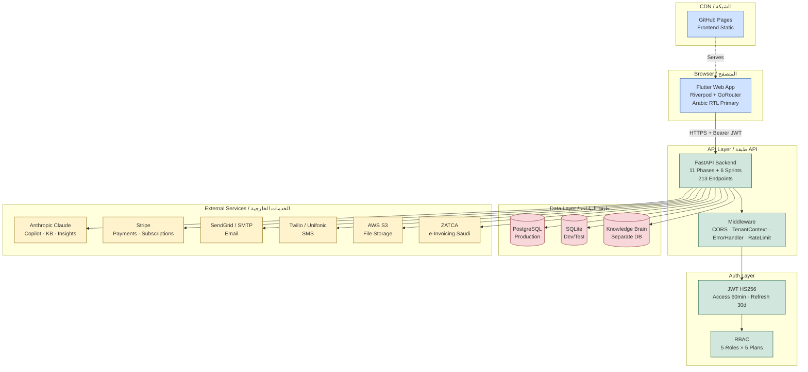
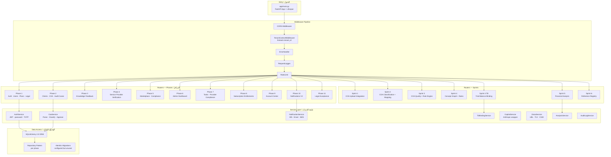
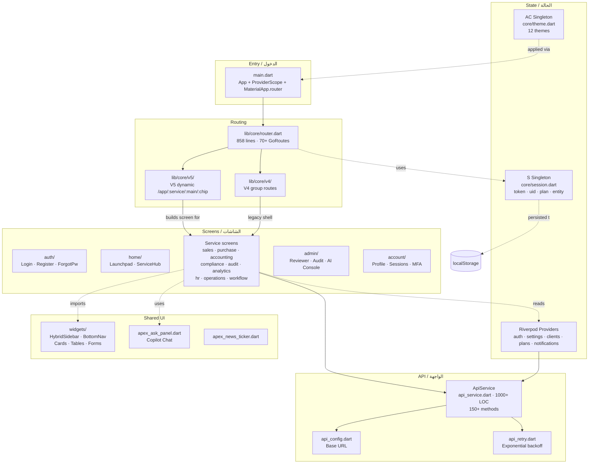
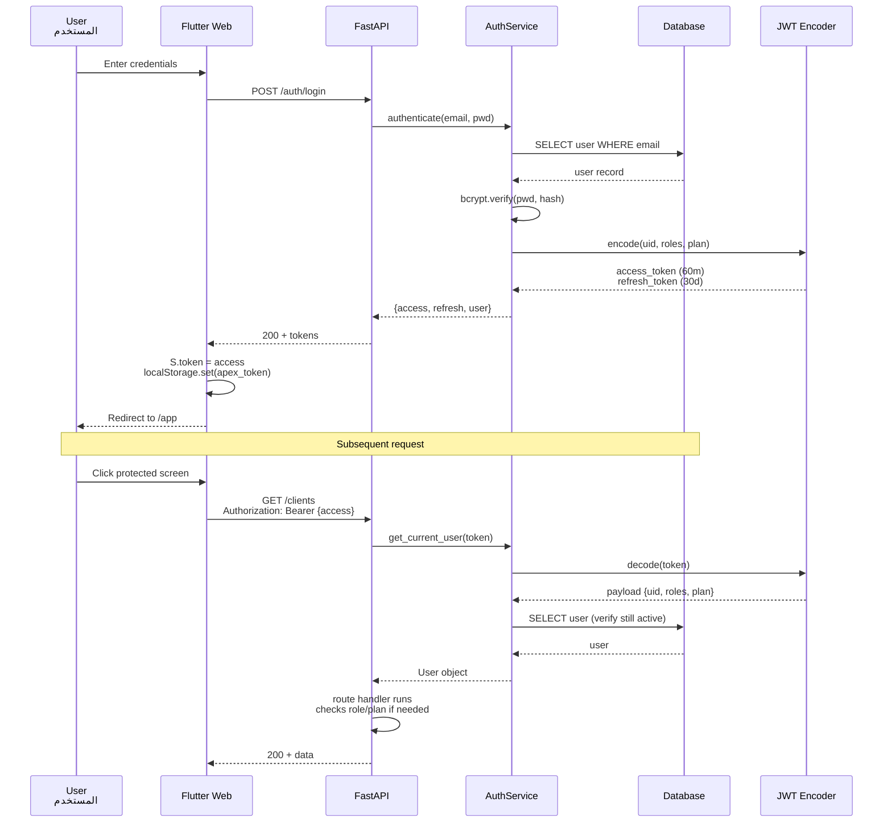
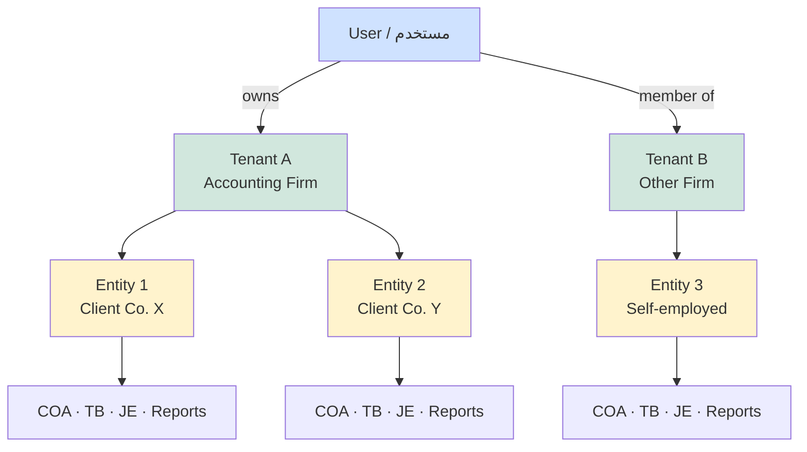
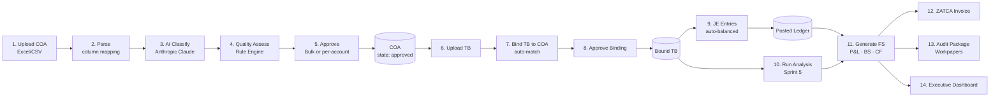
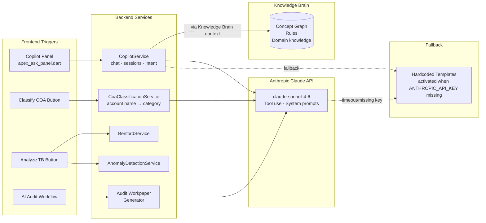
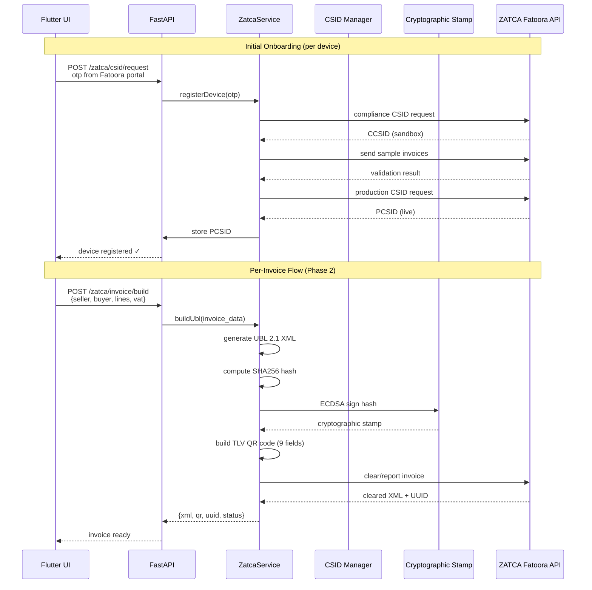
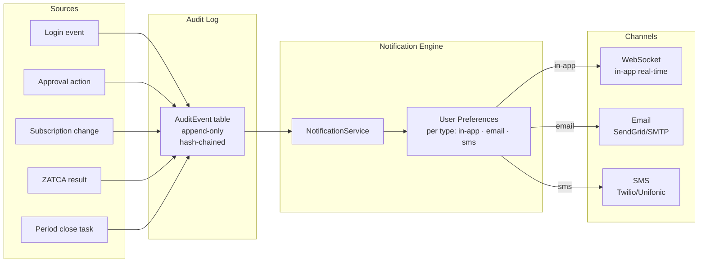
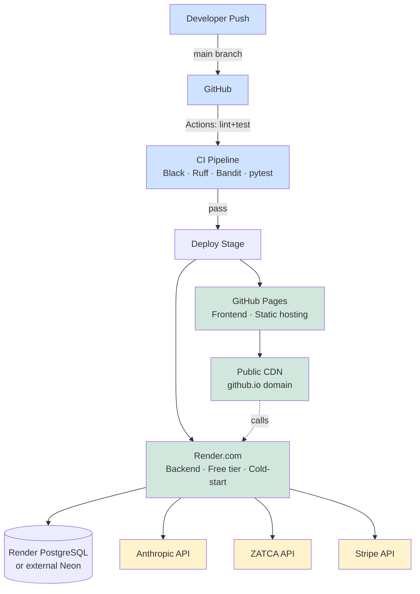

# 01 — Architecture Overview / نظرة عامة على البنية المعمارية

> Reference: Continues from `00_MASTER_INDEX.md`. Next: `02_USER_JOURNEYS_FLOWCHART.md`.

---

## 1. High-Level System Architecture / البنية على المستوى العالي



---

## 2. Backend Layered Architecture / البنية الخلفية الطبقية



**Key conventions / القواعد الأساسية:**
- Each phase router is conditionally loaded in `app/main.py` via `try/except` flags (`HAS_P1`, `HAS_P2`, … `HAS_P11`).
- All phase models live in `app/phaseN/models/`.
- All phase routes live in `app/phaseN/routes/`.
- Services live in `app/phaseN/services/` and import models from same phase.
- `app/core/auth_utils.py` is the **single source of truth** for `JWT_SECRET`.

---

## 3. Frontend Layered Architecture / البنية الأمامية الطبقية



**Key conventions:**
- `lib/main.dart` is monolithic (3500 lines) — **DO NOT add new classes there**. New screens → `lib/screens/{service}/`.
- All API calls go through `ApiService`.
- All theming via `AC.*` (no hardcoded colors).
- All session reads via `S.*` (no direct `localStorage` reads).
- Arabic strings hardcoded; future migration to ARB l10n is in `09_GAPS_AND_REWORK_PLAN.md`.

---

## 4. Authentication & Authorization Flow / التحقق والتصريح



**Permission enforcement layers:**
1. **JWT decode** — token signature must match `JWT_SECRET`
2. **`get_current_user` dependency** — extracts user from header or `apex_token` cookie
3. **Manual role check** — `if "client_admin" not in current_user.roles: raise 403`
4. **Admin secret** — admin endpoints require `X-Admin-Secret` header (`ADMIN_SECRET` env)
5. **Tenant isolation** — `TenantContextMiddleware` injects `tenant_id`; queries filter by it
6. **Plan entitlement** — `entitlements/me` returns feature limits; UI gates accordingly

Full matrix in `06_PERMISSIONS_AND_PLANS_MATRIX.md`.

---

## 5. Multi-Tenancy Model / نموذج تعدد المستأجرين



**Scoping rules:**
- `S.tenantId` and `S.entityId` set after onboarding
- Every Pilot ERP endpoint scoped by `entity_id` path param
- `TenantContextMiddleware` rejects cross-tenant access
- A user can be in multiple tenants with different roles per tenant (`UserRole` table)

---

## 6. Data Flow: COA → TB → Financial Statements
## تدفق البيانات: دليل الحسابات ← ميزان المراجعة ← القوائم المالية



**Endpoint chain (full):**
```
POST /coa/uploads                           → CoaUpload row
POST /coa/uploads/{id}/parse                → CoaAccount rows
POST /coa/classify/{id}                     → Anthropic enrichment
POST /coa/uploads/{id}/assess               → quality score
POST /coa/bulk-approve/{id}                 → state=approved
POST /tb/uploads                            → TbUpload row
POST /tb/uploads/{tb_id}/bind               → bind to COA
POST /tb/uploads/{tb_id}/approve-binding    → bound state
POST /je/build                              → balanced JE
POST /analysis/full                         → FullAnalysis row
GET  /api/v1/pilot/entities/{id}/income-statement
GET  /api/v1/pilot/entities/{id}/balance-sheet
GET  /api/v1/pilot/entities/{id}/cash-flow
POST /zatca/invoice/build                   → UBL XML + TLV QR
```

---

## 7. AI Integration Topology / طوبولوجيا تكامل الذكاء الاصطناعي



**Key files:**
- `app/copilot/services/copilot_service.py` — chat orchestration
- `app/sprint4/services/concept_graph_service.py` — KB context retrieval
- `app/phase2/services/coa_classification_service.py` — AI classification
- `app/sprint5_analysis/services/benford_service.py` — anomaly detection

---

## 8. ZATCA Integration Pipeline / خط أنابيب تكامل ZATCA



**Files:**
- `app/zatca/services/zatca_service.py`
- `app/zatca/services/csid_manager.py`
- `app/zatca/services/ubl_builder.py`
- `app/zatca/services/qr_tlv.py`

---

## 9. Notifications & Audit Log Topology



**Files:**
- `app/phase10/services/notification_service.py`
- `app/core/audit_log.py`

---

## 10. Deployment Topology / طوبولوجيا النشر



**Cold-start mitigation (Render free tier):**
- Frontend has retry logic in `lib/core/api_retry.dart`
- First request after 15-min idle takes ~30s
- Health check `/health` runs every 5min via cron-job.org (config in `render.yaml`)

---

## 11. Environment Variables Reference

| Variable | Layer | Purpose | Production Required? |
|----------|-------|---------|----------------------|
| `JWT_SECRET` | Backend | JWT signing | **YES** (32+ chars) |
| `ADMIN_SECRET` | Backend | Admin endpoint auth | **YES** |
| `CORS_ORIGINS` | Backend | Allowed origins | **YES** (no `*`) |
| `DATABASE_URL` | Backend | Postgres connection | **YES** |
| `KB_DATABASE_URL` | Backend | Knowledge Brain DB | Optional |
| `ANTHROPIC_API_KEY` | Backend | Claude API | Required for AI |
| `EMAIL_BACKEND` | Backend | `console`/`smtp`/`sendgrid` | YES |
| `SMTP_*` or `SENDGRID_API_KEY` | Backend | Email creds | YES if email |
| `PAYMENT_BACKEND` | Backend | `mock`/`stripe` | YES |
| `STRIPE_SECRET_KEY` | Backend | Stripe API | YES if stripe |
| `STORAGE_BACKEND` | Backend | `local`/`s3` | YES |
| `S3_BUCKET`, `AWS_*` | Backend | S3 creds | YES if s3 |
| `ZATCA_BASE_URL` | Backend | Fatoora endpoint | YES if Phase 2 |
| `ZATCA_CSID_*` | Backend | Per-device CSID | YES if Phase 2 |
| `ENVIRONMENT` | Backend | `development`/`production` | YES |
| `API_BASE` | Frontend | Backend URL | YES (build-time `--dart-define`) |

Full list in `.env.example`.

---

## 12. Architecture Decisions / قرارات معمارية

### Why Phase-based instead of feature-modules?
**EN:** APEX evolved iteratively; each phase added a vertical slice (auth → clients → COA → providers → marketplace, etc.). Phases are conditionally loadable, allowing partial deployments.

**Trade-off:** Some functional overlap (e.g., `/compliance/journal-entries` and `/accounting/je-list` historically existed in two phases — now deduplicated via redirects in Phase 26).

**Future direction:** Continue phase pattern but enforce ownership:
- Each phase owns its DB tables (no cross-phase FK chains except to `User`)
- Each phase has its own router prefix where possible
- Cross-cutting concerns (auth, audit, notifications) live in `app/core/`

### Why monolithic main.dart?
**EN:** Initial speed; classes added inline. **THIS IS A KNOWN GAP** — see `09_GAPS_AND_REWORK_PLAN.md` for splitting plan.

**Rule going forward:** new screens → `lib/screens/{service}/{screen_name}_screen.dart`.

### Why two router systems (V4, V5)?
**EN:** V5 (current) is dynamic service-based. V4 is older group-based. Both coexist for backward compatibility. Long-term: deprecate V4 once all routes proven via V5.

---

**Continue → `02_USER_JOURNEYS_FLOWCHART.md`**
