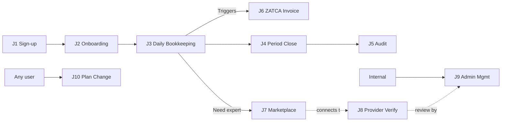

# 02 — User Journeys Flowcharts / مخططات رحلات المستخدمين

> Reference: continues from `01_ARCHITECTURE_OVERVIEW.md`. Next: `03_NAVIGATION_MAP.md`.
> **Note:** Every node references a route or component. Cross-reference with `03_NAVIGATION_MAP.md` for paths and `04_SCREENS_AND_BUTTONS_CATALOG.md` for in-screen actions.

---

## Journey Index / فهرس الرحلات

| Code | Journey | Primary Actor | Plan(s) |
|------|---------|---------------|---------|
| **J1** | First-Time Visitor → Account Creation | Guest | All |
| **J2** | New Tenant Onboarding | Registered User → Client Admin | All |
| **J3** | Daily Bookkeeping | Client Admin / Client User | Pro+ |
| **J4** | Period Close & Financial Statements | Client Admin | Business+ |
| **J5** | Audit Engagement (External / Internal) | Provider / Audit Firm | Expert+ |
| **J6** | ZATCA E-Invoice Submission | Client Admin | Pro+ |
| **J7** | Marketplace: Hire a Professional | Client Admin | All |
| **J8** | Service Provider Verification & Listing | Provider | Provider plan |
| **J9** | Admin Platform Management | Platform Admin | Internal |
| **J10** | Subscription Upgrade / Downgrade | Any user | All |

---

## J1 — First-Time Visitor → Account Creation
## J1 — الزائر لأول مرة ← إنشاء الحساب

```mermaid
flowchart TD
    START([User opens app URL]) --> LANDING{Has session<br/>token?}
    LANDING -->|Yes| APP[/app — Launchpad]
    LANDING -->|No| LOGIN[/login<br/>SlideAuthScreen]

    LOGIN --> CHOICE{Action?}
    CHOICE -->|Sign in| FORM_LOGIN[Enter username/email<br/>+ password]
    CHOICE -->|Sign up| REGISTER[/register<br/>RegScreen]
    CHOICE -->|Forgot| FORGOT[/forgot-password<br/>ForgotPasswordScreen]
    CHOICE -->|Demo| DEMO[Auto-fill: shady / Aa@123456]

    FORM_LOGIN -->|Click 'Login'| API_LOGIN[POST /auth/login]
    DEMO --> API_LOGIN
    API_LOGIN -->|200 + tokens| SAVE_TOKEN[S.token = access<br/>localStorage]
    API_LOGIN -->|401| ERR_LOGIN[Show error toast]
    ERR_LOGIN --> FORM_LOGIN

    REGISTER --> FORM_REG[Username · Email<br/>Display Name · Password]
    FORM_REG -->|Click 'Register'| API_REG[POST /auth/register]
    API_REG -->|200| AUTO_LOGIN[Auto-call login]
    API_REG -->|409 username taken| ERR_REG[Show error]
    ERR_REG --> FORM_REG
    AUTO_LOGIN --> SAVE_TOKEN

    FORGOT --> FORM_FP[Enter email]
    FORM_FP -->|Submit| API_FP[POST /auth/forgot-password]
    API_FP --> EMAIL_SENT[Show: 'Check your inbox']
    EMAIL_SENT -.email link.-> RESET_PWD[/reset-password?token=...]
    RESET_PWD --> NEW_PWD[Enter new password]
    NEW_PWD --> API_RESET[POST /auth/reset-password]
    API_RESET --> LOGIN

    SAVE_TOKEN --> CHECK_LEGAL{Has accepted<br/>latest legal?<br/>GET /legal/pending}
    CHECK_LEGAL -->|Pending docs| LEGAL_PAGE[/legal<br/>Show terms/privacy]
    LEGAL_PAGE -->|Accept all| ACCEPT_API[POST /legal/accept-all]
    ACCEPT_API --> ONBOARDING_CHECK
    CHECK_LEGAL -->|All accepted| ONBOARDING_CHECK{Has tenant<br/>+ entity?}

    ONBOARDING_CHECK -->|No| ONBOARDING_WIZ[/onboarding/wizard]
    ONBOARDING_CHECK -->|Yes| APP

    ONBOARDING_WIZ -->|Continue J2| J2_START([Go to J2])

    classDef start fill:#cfe2ff
    class START start
    classDef api fill:#fff3cd
    class API_LOGIN,API_REG,API_FP,API_RESET,ACCEPT_API api
    classDef screen fill:#d1e7dd
    class LOGIN,REGISTER,FORGOT,RESET_PWD,LEGAL_PAGE,ONBOARDING_WIZ screen
```

**API endpoints used:** `POST /auth/login`, `POST /auth/register`, `POST /auth/forgot-password`, `POST /auth/reset-password`, `GET /legal/pending`, `POST /legal/accept-all`.

**Permissions:** All public (no auth required for sign-up flow).

**Plan gating:** Sign-up creates user with `free` plan automatically.

---

## J2 — New Tenant Onboarding / دخول مستأجر جديد

```mermaid
flowchart TD
    J2_START([Logged-in, no entity]) --> WIZ_STEP1[/onboarding/wizard<br/>Step 1: Welcome]
    WIZ_STEP1 -->|Click 'Start'| WIZ_STEP2[Step 2: Company Info<br/>name · name_ar · email<br/>phone · CR · VAT]
    WIZ_STEP2 -->|Save Draft| DRAFT_API[POST /onboarding/draft<br/>step=company]

    WIZ_STEP2 -->|Next| WIZ_STEP3[Step 3: Legal Entity Type<br/>GET /legal-entity-types]
    WIZ_STEP3 -->|Next| WIZ_STEP4[Step 4: Sector<br/>GET /sectors → main<br/>GET /sectors/X/sub]
    WIZ_STEP4 -->|Next| WIZ_STEP5[Step 5: Plan Selection<br/>Free/Pro/Business/Expert]
    WIZ_STEP5 -->|Free| WIZ_STEP6
    WIZ_STEP5 -->|Paid| STRIPE[Stripe Checkout<br/>Card · Apple Pay]
    STRIPE -->|Success| WIZ_STEP6

    WIZ_STEP6[Step 6: Confirm + Create] -->|Submit| CREATE_API[POST /clients<br/>creates Client + Entity]
    CREATE_API -->|201| TENANT_SET[S.tenantId = ...<br/>S.entityId = ...]
    TENANT_SET --> CHOICE_NEXT{Next action?}

    CHOICE_NEXT -->|Upload COA| J3_COA([Go to COA Upload])
    CHOICE_NEXT -->|Skip for now| APP[/app — Launchpad]
    CHOICE_NEXT -->|Demo data| SEED_DEMO[POST /api/v1/ai/onboarding/seed-demo]
    SEED_DEMO --> APP

    classDef start fill:#cfe2ff
    class J2_START start
    classDef step fill:#d1e7dd
    class WIZ_STEP1,WIZ_STEP2,WIZ_STEP3,WIZ_STEP4,WIZ_STEP5,WIZ_STEP6 step
    classDef api fill:#fff3cd
    class DRAFT_API,CREATE_API,SEED_DEMO,STRIPE api
```

**Wizard Steps Detail / تفاصيل خطوات المعالج:**

| Step | Screen | Required Fields | API |
|------|--------|-----------------|-----|
| 1 | Welcome | — | — |
| 2 | Company | `name`, `name_ar`, `email`, `phone`, `cr_number`, `vat_number`, `address` | `POST /onboarding/draft` |
| 3 | Legal Entity | `legal_entity_type` (dropdown) | `GET /legal-entity-types` |
| 4 | Sector | `main_sector`, `sub_sector` | `GET /sectors`, `GET /sectors/{m}/sub` |
| 5 | Plan | `plan_code` | `GET /plans` |
| 6 | Confirm | All above | `POST /clients` |

**Permissions:** `registered_user` (any).

**Plan gating:** Free plan = 1 entity max; upgrading required for additional entities.

---

## J3 — Daily Bookkeeping / المحاسبة اليومية

```mermaid
flowchart TD
    APP([/app Launchpad]) --> COPILOT_PROMPT[Hero card: Copilot<br/>'What do you want to do?']
    APP --> SVC_GRID[Service tile grid<br/>Sales · Purchase · Accounting<br/>Operations · Compliance · Audit<br/>Analytics · HR · Workflow]

    SVC_GRID -->|Click Sales| SALES_HUB[/sales — Service Hub]
    SALES_HUB --> SALES_TILES[Customers · Invoices · Aging<br/>Recurring · Quotes · Memos]

    SALES_TILES -->|Click Customers| CUST_LIST[/sales/customers<br/>CustomersListScreen]
    CUST_LIST --> CUST_ACTION{Action?}
    CUST_ACTION -->|+ New| NEW_CUST[Modal: customer form]
    NEW_CUST -->|Save| API_CUST[POST /api/v1/pilot/customers]
    CUST_ACTION -->|Click row| CUST360[/operations/customer-360/:id]

    SALES_TILES -->|Click Invoices| INV_LIST[/sales/invoices<br/>InvoicesListScreen]
    INV_LIST --> INV_ACTION{Action?}
    INV_ACTION -->|+ New invoice| NEW_INV[Modal/screen<br/>customer · lines · VAT]
    NEW_INV -->|Save Draft| API_INV[POST /api/v1/pilot/sales-invoices]
    NEW_INV -->|Save & Issue| API_INV2[POST + /issue]
    API_INV2 -->|If ZATCA enabled| ZATCA_FLOW([Trigger J6])
    INV_ACTION -->|Record payment| PAY_PAGE[/sales/payment/:invoiceId]
    PAY_PAGE -->|Submit| API_PAY[POST /api/v1/pilot/customer-payments]

    SVC_GRID -->|Click Purchase| PURCH_HUB[/purchase Hub]
    PURCH_HUB --> PURCH_TILES[Vendors · Bills · Aging · Payments]
    PURCH_TILES -->|Vendors| VEND_LIST[/purchase/vendors]
    PURCH_TILES -->|Bills| BILL_LIST[/purchase/bills]
    BILL_LIST -->|+ New| NEW_BILL[POST /api/v1/pilot/purchase-invoices]

    SVC_GRID -->|Accounting| ACCT_HUB[/accounting Hub]
    ACCT_HUB --> JE[/accounting/je-list<br/>Journal Entries]
    JE -->|+ New JE| JE_BUILDER[/compliance/journal-entry-builder]
    JE_BUILDER -->|Save| API_JE[POST /api/v1/pilot/journal-entries]
    ACCT_HUB --> COA[/accounting/coa-v2<br/>COA Tree]
    ACCT_HUB --> BANK_REC[/accounting/bank-rec-v2<br/>Bank Reconciliation]

    SVC_GRID -->|Operations| OPS_HUB[/operations Hub]
    OPS_HUB --> RCPT[/operations/receipt-capture<br/>OCR upload]
    OPS_HUB --> POS[/operations/pos-sessions<br/>POS sessions]
    OPS_HUB --> INV[/operations/inventory-v2]
    OPS_HUB --> FA[/operations/fixed-assets-v2]

    classDef hub fill:#cfe2ff
    class SALES_HUB,PURCH_HUB,ACCT_HUB,OPS_HUB hub
    classDef api fill:#fff3cd
    class API_CUST,API_INV,API_INV2,API_PAY,API_JE api
```

**Permissions:** `client_admin` (full), `client_user` (limited per role assignment).

**Plan gating:**
- Free: read-only daily ops, 1 invoice/month
- Pro: 100 invoices/month, basic AR/AP
- Business: unlimited transactions + bank rec
- Expert: + AI categorization, OCR, inventory v2
- Enterprise: + multi-entity consolidation

---

## J4 — Period Close & Financial Statements
## J4 — إقفال الفترة وإصدار القوائم المالية

```mermaid
flowchart TD
    APP([/app]) -->|Click Operations → Period Close| PC[/operations/period-close]
    PC --> CHECKLIST[Period Close Checklist<br/>tasks · dependencies · status]
    CHECKLIST -->|Start period close| API_PC_START[POST /api/v1/ai/period-close/start]
    API_PC_START --> TASKS[Task list:<br/>1. Bank rec<br/>2. AR/AP confirms<br/>3. Accruals<br/>4. Depreciation<br/>5. Adjustments<br/>6. Variance review<br/>7. FS generation<br/>8. Lock period]

    TASKS -->|Click task| TASK_DETAIL[Task screen with subtasks]
    TASK_DETAIL -->|Mark complete| API_TASK_DONE[POST /api/v1/ai/period-close/tasks/:id/complete]

    TASKS -->|All tasks done| GEN_FS[Generate Financial Statements]
    GEN_FS -->|Click 'Generate'| FS_HUB[/compliance/financial-statements]
    FS_HUB --> FS_TYPE{Statement type?}

    FS_TYPE -->|Income Statement| API_IS[GET /api/v1/pilot/entities/:id/income-statement]
    FS_TYPE -->|Balance Sheet| API_BS[GET .../balance-sheet]
    FS_TYPE -->|Cash Flow| API_CF[GET .../cash-flow]
    FS_TYPE -->|Trial Balance| API_TB[GET .../trial-balance]

    API_IS & API_BS & API_CF & API_TB --> RENDER[Rendered FS<br/>PDF · XLSX · Print]
    RENDER --> SHARE{Distribute?}
    SHARE -->|Email| EMAIL[Email PDF to recipients]
    SHARE -->|Sign-off| SIGNOFF[Multi-step approval]
    SHARE -->|Lock| LOCK_PD[POST /period-close/lock]

    API_IS --> RATIO[/compliance/ratios<br/>Compute ratios]
    RATIO --> EXEC[/compliance/executive<br/>Executive Dashboard]
    EXEC --> AUDIT_PKG[Build Audit Package<br/>→ Triggers J5]

    classDef step fill:#d1e7dd
    class CHECKLIST,TASKS,FS_HUB,RENDER step
    classDef api fill:#fff3cd
    class API_PC_START,API_TASK_DONE,API_IS,API_BS,API_CF,API_TB api
```

**Plan gating:** Business+ unlocks period close; Expert+ unlocks variance & ratio analytics; Enterprise unlocks multi-entity consolidation.

---

## J5 — Audit Engagement / مهمة المراجعة

```mermaid
flowchart TD
    APP([/app]) -->|Click Audit hub| AUDIT_HUB[/audit-hub]
    AUDIT_HUB --> ENG_LIST[/audit/engagements<br/>Engagement workspace]
    ENG_LIST -->|+ New engagement| NEW_ENG[New Engagement Modal<br/>client · year · scope]
    NEW_ENG -->|Submit| API_ENG[POST /audit/cases]
    API_ENG --> ENG_DASH[Engagement Dashboard]

    ENG_DASH --> PHASE_TABS{Phase?}

    PHASE_TABS -->|1. Planning| PLANNING[Risk Assessment<br/>Materiality<br/>Audit program]
    PLANNING --> RISK_REG[/compliance/risk-register]

    PHASE_TABS -->|2. Fieldwork| FIELDWORK[Procedures<br/>Sampling · Testing]
    FIELDWORK --> SAMPLING[/audit/sampling<br/>Stat / judgmental]
    SAMPLING -->|Generate sample| API_SAMPLE[POST /audit/cases/:id/samples]
    FIELDWORK --> BENFORD[/audit/benford<br/>Benford's Law]
    BENFORD -->|Run| API_BEN[POST /ai/benford/analyze]
    FIELDWORK --> WP[/audit/workpapers]
    WP -->|+ New WP| API_WP[POST /audit/cases/:id/workpapers]
    WP --> ANOMALY[/audit/anomaly/:id]

    PHASE_TABS -->|3. Review| REVIEW[Reviewer queue<br/>sign-offs]
    REVIEW -->|Submit for review| API_REV[POST /audit/workpapers/:id/review]
    REVIEW --> EQR{EQR required?}
    EQR -->|Yes| EQR_SIGN[EQR Concurrence]
    EQR -->|No| FINDINGS

    PHASE_TABS -->|4. Findings| FINDINGS[Findings list<br/>Material weakness<br/>Significant deficiency<br/>Mgmt letter items]
    FINDINGS -->|+ New| API_FIND[POST /audit/cases/:id/findings]

    PHASE_TABS -->|5. Reporting| REPORTING[Audit Report Builder]
    REPORTING -->|SOCPA template| TEMPLATE[Apply audit template<br/>GET /audit/templates]
    REPORTING --> SIGN[Partner sign-off]
    SIGN --> ARCHIVE[Archive engagement<br/>POST /archive/upload]

    classDef phase fill:#cfe2ff
    class PLANNING,FIELDWORK,REVIEW,FINDINGS,REPORTING phase
    classDef api fill:#fff3cd
    class API_ENG,API_SAMPLE,API_BEN,API_WP,API_REV,API_FIND api
```

**Permissions:** Audit-firm tenant with Provider role; engagement partner has sign-off authority.

**Plan gating:** Expert plan for audit features; Enterprise for multi-engagement portfolio + EQR workflows.

**Reference patterns adopted:** CaseWare workflow phases (Planning → Fieldwork → Review → Reporting), MindBridge's anomaly-driven approach, AuditBoard's RCM model.

---

## J6 — ZATCA E-Invoice Submission / إصدار فاتورة إلكترونية ZATCA

```mermaid
flowchart TD
    INV([User clicks 'Issue Invoice']) --> CHECK_CSID{Device has<br/>PCSID?}
    CHECK_CSID -->|No| ONBOARD[/compliance/zatca-status<br/>CSID Onboarding]
    ONBOARD --> OTP_PORTAL[Open Fatoora portal externally<br/>Generate OTP]
    OTP_PORTAL --> ENTER_OTP[Enter OTP in APEX]
    ENTER_OTP -->|Submit within 1hr| API_CSID[POST /zatca/csid/request]
    API_CSID -->|CCSID issued| SAMPLE[Send sample invoices]
    SAMPLE --> API_PCSID[Production CSID issued]
    API_PCSID --> READY[Device ready]

    CHECK_CSID -->|Yes| BUILD[/compliance/zatca-invoice<br/>Invoice Builder]
    READY --> BUILD

    BUILD --> FORM[Fill: seller · buyer<br/>lines · VAT (15%)<br/>currency · invoice type]
    FORM -->|Click 'Build'| API_BUILD[POST /zatca/invoice/build]

    API_BUILD --> SERVER[Backend:<br/>1. Generate UBL 2.1 XML<br/>2. SHA256 hash<br/>3. ECDSA signature<br/>4. TLV QR code (9 fields)<br/>5. Send to Fatoora]

    SERVER -->|Cleared| RESPONSE[Response:<br/>UUID · cleared XML · QR]
    RESPONSE --> RENDER[/compliance/zatca-invoice/:id<br/>ZatcaInvoiceViewerScreen]
    RENDER --> ACTIONS{Actions?}
    ACTIONS -->|Print PDF| PDF[Print A4 with QR]
    ACTIONS -->|Send to buyer| EMAIL_BUYER[Email PDF + XML]
    ACTIONS -->|Reissue| BUILD

    SERVER -->|Failed| RETRY[/compliance/zatca-status<br/>Queue & retry]
    RETRY --> API_QUEUE[POST /zatca/queue/enqueue]

    classDef api fill:#fff3cd
    class API_CSID,API_PCSID,API_BUILD,API_QUEUE api
    classDef screen fill:#d1e7dd
    class ONBOARD,BUILD,FORM,RENDER,RETRY screen
```

**Plan gating:** Pro+ unlocks ZATCA Phase 2; Free plan limited to Phase 1 generation only (no clearance).

---

## J7 — Marketplace: Hire a Professional / السوق: استئجار محترف

```mermaid
flowchart TD
    USER([Client Admin]) --> CATALOG[/service-catalog<br/>ServiceCatalogScreen]
    CATALOG --> FILTER[Filter by:<br/>category · price · rating]
    FILTER --> SVC_DETAIL[Service detail card]
    SVC_DETAIL -->|View provider| PROV_PROFILE[Provider Profile<br/>verified · rating · portfolio]
    PROV_PROFILE -->|Request| NEW_REQ[/marketplace/new-request<br/>NewServiceRequestScreen]

    NEW_REQ --> FORM[Title · Description<br/>Budget · Deadline]
    FORM -->|Submit| API_NEW[POST /marketplace/requests]
    API_NEW --> PENDING[Request created<br/>status: pending]

    PENDING -.notification to provider.-> PROV_INBOX[Provider sees in /provider-kanban]
    PROV_INBOX -->|Provider accepts| API_ASSIGN[POST /marketplace/requests/:id/assign]
    API_ASSIGN -->|Notification| USER_NOTIF[Client sees: 'Provider accepted']

    USER_NOTIF -->|Click| REQ_DETAIL[/service-request/detail]
    REQ_DETAIL --> CHAT[Provider ↔ Client messages]
    REQ_DETAIL --> MILESTONES[Milestones · deliverables]

    MILESTONES -->|Provider marks done| API_STATUS[POST /marketplace/requests/:id/status<br/>status: completed]
    API_STATUS -->|Client confirms| RATE[/marketplace/requests/:id/rate]
    RATE -->|Submit rating| API_RATE[POST /marketplace/requests/:id/rate]

    API_RATE --> CLOSED[Request closed · provider rated]

    classDef api fill:#fff3cd
    class API_NEW,API_ASSIGN,API_STATUS,API_RATE api
```

---

## J8 — Provider Verification & Listing / التحقق من مقدم الخدمة وإدراجه

```mermaid
flowchart TD
    SIGNUP([User signs up]) --> CHOICE{User type?}
    CHOICE -->|Provider| PROV_REG[Provider registration form]
    PROV_REG --> SUBMIT[Submit:<br/>professional info<br/>certifications · CV]
    SUBMIT -->|API| API_REG[POST /service-providers/register]
    API_REG --> PENDING[Status: pending verification]

    PENDING --> DOC_UPLOAD[/admin/providers/documents<br/>Upload license · ID · cert]
    DOC_UPLOAD -->|Each doc| API_DOC[POST /service-providers/documents]

    PENDING --> ADMIN_REVIEW[Admin queue:<br/>/admin/providers/verify]
    ADMIN_REVIEW --> ADMIN_DECIDE{Verify?}
    ADMIN_DECIDE -->|Approve| API_APPROVE[POST /service-providers/:id/approve]
    API_APPROVE --> APPROVED[Status: verified<br/>Provider listed in marketplace]
    ADMIN_DECIDE -->|Reject| API_REJECT[POST /service-providers/:id/reject]
    API_REJECT --> NOTIFY_REJECT[Notify provider · reason]
    NOTIFY_REJECT --> RESUBMIT[Provider re-submits]
    RESUBMIT --> ADMIN_REVIEW

    APPROVED --> CONTINUE[Provider can now bid<br/>on marketplace requests]
    APPROVED -->|Periodic| COMPLIANCE_CHECK[/admin/providers/compliance<br/>Renewal · audits]

    classDef api fill:#fff3cd
    class API_REG,API_DOC,API_APPROVE,API_REJECT api
```

---

## J9 — Admin Platform Management / إدارة المنصة

```mermaid
flowchart TD
    ADMIN([Admin user · X-Admin-Secret]) --> ADMIN_HOME[/admin/* hub]

    ADMIN_HOME --> POLICIES[/admin/policies<br/>PolicyManagementScreen]
    POLICIES -->|Edit terms| EDIT_POLICY[Edit · version · publish]
    EDIT_POLICY --> API_POLICY[PUT /legal/policies/:id]

    ADMIN_HOME --> AUDIT_LOG[/admin/audit<br/>AuditLogScreen]
    AUDIT_LOG --> FILTER_LOG[Filter: date · user · action]
    AUDIT_LOG --> CHAIN[/admin/audit-chain<br/>Hash-chain viewer]

    ADMIN_HOME --> AI_QUEUE[/admin/ai-suggestions<br/>AiSuggestionsInboxScreen]
    AI_QUEUE -->|Review suggestion| ACCEPT_REJECT[Accept / Reject]
    ACCEPT_REJECT -->|Accept| API_ACCEPT[POST /knowledge-feedback/:id/promote-rule]

    ADMIN_HOME --> AI_CONSOLE[/admin/ai-console<br/>Ops · cost · errors]
    AI_CONSOLE --> METRICS[Token usage · latency · errors]

    ADMIN_HOME --> PROV_VERIFY[/admin/providers/verify<br/>see J8]
    ADMIN_HOME --> PROV_COMP[/admin/providers/compliance]

    ADMIN_HOME --> USERS[/admin/users<br/>User management]
    USERS -->|Suspend| API_SUSPEND[POST /admin/suspend]
    USERS -->|Lift| API_LIFT[POST /admin/suspend/:id/lift]

    ADMIN_HOME --> STATS[/stats<br/>Dashboard KPIs]
    STATS --> EXPORT[Export CSV/PDF]

    classDef api fill:#fff3cd
    class API_POLICY,API_ACCEPT,API_SUSPEND,API_LIFT api
```

**Auth:** Requires both JWT + `X-Admin-Secret` header (or admin/super_admin role).

---

## J10 — Subscription Upgrade / Downgrade / تغيير خطة الاشتراك

```mermaid
flowchart TD
    USER([Logged-in user]) --> CURR[/subscription<br/>SubscriptionScreen]
    CURR --> SHOW_CURRENT[Current plan: free<br/>Days remaining · usage]
    CURR -->|Upgrade| COMPARE[/plans/compare<br/>PlanComparisonScreen]
    COMPARE --> TABLE[Feature comparison table]
    TABLE -->|Select Pro/Business/Expert| UPGRADE_PAGE[/upgrade-plan<br/>UpgradePlanScreen]

    UPGRADE_PAGE --> CHECKOUT{Payment backend?}
    CHECKOUT -->|stripe| STRIPE_CO[Stripe Checkout<br/>card · apple pay · google pay]
    CHECKOUT -->|mock| MOCK[Mock approve]
    STRIPE_CO -->|Success| API_UP[POST /subscriptions/upgrade<br/>plan_name=pro]
    MOCK --> API_UP
    STRIPE_CO -->|Failed| ERROR[Retry payment]

    API_UP --> WEBHOOK[Stripe webhook<br/>updates UserSubscription]
    WEBHOOK --> ENT_REFRESH[Refresh entitlements]
    ENT_REFRESH --> SHOW_NEW[Show new plan + features unlocked]

    CURR -->|Downgrade| DOWNGRADE_FORM[Choose lower plan + reason]
    DOWNGRADE_FORM --> API_DOWN[POST /subscriptions/downgrade]
    API_DOWN --> END_CYCLE[Effective: end of current billing cycle]

    CURR -->|Cancel| CANCEL_FORM[Cancellation reason]
    CANCEL_FORM --> API_CANCEL[POST /subscriptions/cancel]

    classDef api fill:#fff3cd
    class API_UP,API_DOWN,API_CANCEL,WEBHOOK api
```

---

## Cross-Journey Touchpoints / نقاط الاتصال بين الرحلات



---

## Journey Coverage Matrix / مصفوفة تغطية الرحلات

| Journey | Plan: Free | Pro | Business | Expert | Enterprise |
|---------|------------|-----|----------|--------|------------|
| J1 Sign-up | ✓ | ✓ | ✓ | ✓ | ✓ |
| J2 Onboarding | 1 entity | 5 entities | 20 entities | ∞ | ∞ |
| J3 Daily | read-only after limit | 100 inv/mo | ∞ | ∞ | ∞ + multi-entity |
| J4 Period Close | ✗ | manual only | ✓ | ✓ + AI | ✓ + consolidation |
| J5 Audit | ✗ | ✗ | basic | ✓ | ✓ + EQR + AI |
| J6 ZATCA | Phase 1 only | Phase 2 | Phase 2 | Phase 2 + queue | + bulk + multi-CSID |
| J7 Marketplace post | ✓ | ✓ | ✓ | ✓ | ✓ |
| J8 Provider verify | n/a | n/a | n/a | provider plan | provider+enterprise |
| J9 Admin | ✗ | ✗ | ✗ | ✗ | n/a (internal only) |
| J10 Plan change | ✓ | ✓ | ✓ | ✓ | ✓ (custom contract) |

Full feature matrix: see `06_PERMISSIONS_AND_PLANS_MATRIX.md`.

---

**Continue → `03_NAVIGATION_MAP.md`**
