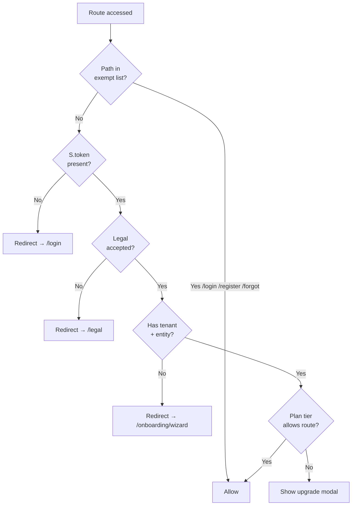

# 03 — Navigation Map / خريطة التنقل

> Reference: continues from `02_USER_JOURNEYS_FLOWCHART.md`. Next: `04_SCREENS_AND_BUTTONS_CATALOG.md`.
> **Source of truth:** `lib/core/router.dart` (858 lines, 70+ GoRoutes).

---

## 1. Top-Level Navigation Tree / شجرة التنقل العليا

```mermaid
graph TB
    ROOT[/<br/>Root]
    ROOT --> LOGIN[/login]
    ROOT --> REGISTER[/register]
    ROOT --> FORGOT[/forgot-password]
    ROOT --> APP[/app<br/>Main Launchpad]

    APP --> SVC_HUBS[Service Hubs]
    APP --> WORKFLOWS[Workflows]
    APP --> ACCOUNT_AREA[Account Area]
    APP --> ADMIN_AREA[Admin Area]
    APP --> COA_FLOW[COA Flow]

    SVC_HUBS --> H1[/sales]
    SVC_HUBS --> H2[/purchase]
    SVC_HUBS --> H3[/accounting]
    SVC_HUBS --> H4[/operations]
    SVC_HUBS --> H5[/compliance]
    SVC_HUBS --> H6[/audit]
    SVC_HUBS --> H7[/analytics]
    SVC_HUBS --> H8[/hr]
    SVC_HUBS --> H9[/workflow]
    SVC_HUBS --> H10[/settings-hub]

    WORKFLOWS --> W1[/onboarding/wizard]
    WORKFLOWS --> W2[/today]
    WORKFLOWS --> W3[/financial-ops]
    WORKFLOWS --> W4[/financial-statements]
    WORKFLOWS --> W5[/reports]

    ACCOUNT_AREA --> A1[/profile/edit]
    ACCOUNT_AREA --> A2[/password/change]
    ACCOUNT_AREA --> A3[/account/sessions]
    ACCOUNT_AREA --> A4[/account/mfa]
    ACCOUNT_AREA --> A5[/account/activity]
    ACCOUNT_AREA --> A6[/account/close]
    ACCOUNT_AREA --> A7[/subscription]
    ACCOUNT_AREA --> A8[/plans/compare]
    ACCOUNT_AREA --> A9[/notifications]
    ACCOUNT_AREA --> A10[/legal]

    ADMIN_AREA --> AD1[/admin/policies]
    ADMIN_AREA --> AD2[/admin/audit]
    ADMIN_AREA --> AD3[/admin/audit-chain]
    ADMIN_AREA --> AD4[/admin/ai-suggestions]
    ADMIN_AREA --> AD5[/admin/ai-console]
    ADMIN_AREA --> AD6[/admin/providers/verify]
    ADMIN_AREA --> AD7[/admin/providers/compliance]
    ADMIN_AREA --> AD8[/admin/reviewer]

    COA_FLOW --> C1[/coa/upload]
    COA_FLOW --> C2[/coa/mapping]
    COA_FLOW --> C3[/coa/quality]
    COA_FLOW --> C4[/coa/review]
    COA_FLOW --> C5[/coa/journey]
    COA_FLOW --> C6[/tb/binding]
    COA_FLOW --> C7[/analysis/full]
    COA_FLOW --> C8[/analysis/result]

    classDef root fill:#cfe2ff
    class ROOT,APP root
    classDef hub fill:#d1e7dd
    class SVC_HUBS,WORKFLOWS,ACCOUNT_AREA,ADMIN_AREA,COA_FLOW hub
```

---

## 2. Sales Service / خدمة المبيعات

```mermaid
graph LR
    SALES[/sales<br/>ServiceHub]
    SALES --> S_CUST[/sales/customers<br/>List]
    SALES --> S_INV[/sales/invoices<br/>List]
    SALES --> S_AGE[/sales/aging<br/>AR Aging]
    SALES --> S_REC[/sales/recurring<br/>Recurring]
    SALES --> S_QU[/sales/quotes<br/>Quotes]
    SALES --> S_MM[/sales/memos<br/>Credit Memos]

    S_CUST -->|Click row| S_360[/operations/customer-360/:id<br/>360 view]
    S_INV -->|Record payment| S_PAY[/sales/payment/:invoiceId]
    S_INV -.if ZATCA enabled.-> ZATCA[/compliance/zatca-invoice]
```

---

## 3. Purchase Service / خدمة المشتريات

```mermaid
graph LR
    PURCH[/purchase<br/>ServiceHub]
    PURCH --> P_VEND[/purchase/vendors]
    PURCH --> P_BILLS[/purchase/bills]
    PURCH --> P_AGE[/purchase/aging<br/>AP Aging]

    P_VEND -->|Click row| P_360[/operations/vendor-360/:id]
    P_BILLS -->|Record payment| P_PAY[/purchase/payment/:billId]
    P_BILLS -.tied to.-> PO[/operations/purchase-cycle<br/>PO workflow]
```

---

## 4. Accounting Service / خدمة المحاسبة

```mermaid
graph LR
    ACCT[/accounting<br/>ServiceHub]
    ACCT --> JE[/accounting/je-list<br/>Journal Entries]
    ACCT --> COAV2[/accounting/coa-v2<br/>COA Tree v2]
    ACCT --> COAEDIT[/accounting/coa/edit<br/>COA Editor]
    ACCT --> BANKREC[/accounting/bank-rec-v2<br/>Bank Reconciliation]

    JE -->|Click + New| JEB[/compliance/journal-entry-builder]
    JE -->|Click row| JED[/compliance/journal-entry/:id]
    COAV2 --> COA1[/coa-tree<br/>legacy view]
```

---

## 5. Operations Service / خدمة العمليات

```mermaid
graph LR
    OPS[/operations<br/>ServiceHub]
    OPS --> O_360C[/operations/customer-360/:id]
    OPS --> O_360V[/operations/vendor-360/:id]
    OPS --> O_UJ[/operations/universal-journal<br/>SAP-style]
    OPS --> O_PC[/operations/period-close<br/>Checklist]
    OPS --> O_POS[/operations/pos-sessions]
    OPS --> O_PSALE[/operations/pos-quick-sale]
    OPS --> O_PCYCLE[/operations/purchase-cycle]
    OPS --> O_LSC[/operations/live-sales-cycle]
    OPS --> O_RC[/operations/receipt-capture<br/>OCR]
    OPS --> O_INV[/operations/inventory-v2]
    OPS --> O_FA[/operations/fixed-assets-v2]
    OPS --> O_PETTY[/operations/petty-cash]
    OPS --> O_STOCK[/operations/stock-card]
    OPS --> O_CONS[/operations/consolidation-ui]
```

---

## 6. Compliance Service (Largest Module) / خدمة الامتثال (الأكبر)

```mermaid
graph TB
    COMP[/compliance<br/>ComplianceHubScreen]

    subgraph "ZATCA / VAT / Tax"
        COMP --> Z1[/compliance/zatca-invoice]
        COMP --> Z2[/compliance/zatca-status]
        COMP --> Z3[/compliance/zakat]
        COMP --> Z4[/compliance/vat-return]
        COMP --> Z5[/compliance/tax-timeline]
        COMP --> Z6[/compliance/tax-calendar]
        COMP --> Z7[/compliance/wht-v2<br/>WHT]
        COMP --> Z8[/compliance/deferred-tax]
        Z1 --> Z1V[/compliance/zatca-invoice/:id]
    end

    subgraph "Financial Statements"
        COMP --> FS[/compliance/financial-statements]
        COMP --> CF[/compliance/cashflow]
        COMP --> CFS[/compliance/cashflow-statement]
        COMP --> RAT[/compliance/ratios]
        COMP --> EXEC[/compliance/executive]
        COMP --> VAL[/compliance/valuation]
    end

    subgraph "Schedules"
        COMP --> DEP[/compliance/depreciation]
        COMP --> AMORT[/compliance/amortization]
        COMP --> LEASE[/compliance/lease-v2<br/>IFRS-16]
        COMP --> CONS[/compliance/consolidation-v2]
    end

    subgraph "JE Builder"
        COMP --> JEB[/compliance/journal-entry-builder]
        JEB --> JED[/compliance/journal-entry/:id]
    end

    subgraph "Specialized"
        COMP --> PR[/compliance/payroll<br/>analysis]
        COMP --> BE[/compliance/breakeven]
        COMP --> INV[/compliance/investment]
        COMP --> WC[/compliance/working-capital]
        COMP --> DSCR[/compliance/dscr]
        COMP --> FX[/compliance/fx-converter]
        COMP --> OCR[/compliance/ocr]
        COMP --> IFRS[/compliance/ifrs-tools]
        COMP --> TP[/compliance/transfer-pricing]
        COMP --> ISL[/compliance/islamic-finance]
    end

    subgraph "Audit & Risk"
        COMP --> AT[/compliance/audit-trail]
        COMP --> AT2[/compliance/activity-log-v2]
        COMP --> AW[/compliance/audit-workflow-ai]
        COMP --> RR[/compliance/risk-register]
        COMP --> KYC[/compliance/kyc-aml]
    end

    classDef hub fill:#cfe2ff
    class COMP hub
```

**Note:** Many `/compliance/*` paths now redirect to canonical homes (e.g., `/compliance/journal-entries` → `/accounting/je-list`). Full redirect table in section 14 below.

---

## 7. Audit Hub / مركز المراجعة

```mermaid
graph LR
    AUDIT[/audit-hub<br/>or /audit]
    AUDIT --> ENG[/audit/engagements]
    AUDIT --> ENG2[/audit/engagement-workspace<br/>alias]
    AUDIT --> WP[/audit/workpapers]
    AUDIT --> SAMP[/audit/sampling]
    AUDIT --> BEN[/audit/benford]
    AUDIT --> ANO[/audit/anomaly/:id]
    AUDIT --> AW[/audit-workflow]
```

---

## 8. Analytics & HR / التحليلات والموارد البشرية

```mermaid
graph LR
    AN[/analytics<br/>ServiceHub]
    AN --> AN1[/analytics/budget-variance-v2]
    AN --> AN2[/analytics/multi-currency-v2]
    AN --> AN3[/analytics/health-score-v2]
    AN --> AN4[/analytics/cash-flow-forecast]
    AN --> AN5[/analytics/investment-portfolio-v2]
    AN --> AN6[/analytics/project-profitability]
    AN --> AN7[/analytics/cost-variance-v2]
    AN --> AN8[/analytics/budget-builder]

    HR[/hr<br/>ServiceHub]
    HR --> HR1[/hr/employees]
    HR --> HR2[/hr/payroll-run]
    HR --> HR3[/hr/timesheet]
    HR --> HR4[/hr/expense-reports]
```

---

## 9. COA → TB → Analysis Workflow / تدفق الدليل ← الميزان ← التحليل

```mermaid
graph TB
    START([User clicks 'Upload COA']) --> UPLOAD[/coa/upload]
    UPLOAD -->|file selected| MAPPING[/coa/mapping<br/>Map columns]
    MAPPING -->|columns mapped| QUALITY[/coa/quality<br/>QA score]
    QUALITY -->|review issues| REVIEW[/coa/review<br/>Approve accounts]
    REVIEW -->|approved| JOURNEY[/coa/journey<br/>Compliance check]
    JOURNEY --> CHECK[/coa/compliance-check]
    JOURNEY --> SIM[/coa/financial-simulation]
    JOURNEY --> ROADMAP[/coa/roadmap]

    REVIEW -->|state: approved| TB_UPLOAD[/tb/binding<br/>Upload TB]
    TB_UPLOAD --> TB_BIND[Auto-match TB to COA]
    TB_BIND --> TB_APPROVE[Approve binding]
    TB_APPROVE --> ANALYSIS[/analysis/full<br/>Run analysis]
    ANALYSIS --> RESULT[/analysis/result]
    RESULT --> FS[/financial-statements<br/>or /compliance/financial-statements]
```

---

## 10. Marketplace / السوق

```mermaid
graph LR
    USER[Client Admin]
    USER --> CAT[/service-catalog]
    CAT --> NEW[/marketplace/new-request]
    NEW --> DETAIL[/service-request/detail]

    PROV[Provider]
    PROV --> KAN[/provider-kanban]
    KAN --> DETAIL

    DETAIL --> RATE[Rate · Close]
```

---

## 11. Knowledge Brain & Copilot / دماغ المعرفة والمساعد

```mermaid
graph LR
    AC[/copilot<br/>CopilotScreen]
    AC --> KB[/knowledge/brain]
    AC --> KS[/knowledge/search]
    AC --> KF[/knowledge/feedback]
    AC --> KC[/knowledge/console]

    KF -->|Submit| ADM[/admin/ai-suggestions<br/>Admin queue]
    ADM -->|Promote| RULES[(Rule Engine)]
```

---

## 12. Settings Hub / مركز الإعدادات

```mermaid
graph LR
    SET[/settings-hub<br/>or /settings]
    SET --> S1[/settings/unified<br/>Unified Settings]
    SET --> S2[/settings/entities<br/>Entity Setup]
    SET --> S3[/settings/bank-feeds]
    SET --> S4[/account/mfa]
    SET --> S5[/notifications/prefs]
    SET --> S6[/theme-generator]
    SET --> S7[/white-label]
```

---

## 13. Notifications / الإشعارات

```mermaid
graph LR
    NTOP[Top bar bell icon] --> NPANEL[/notifications/panel<br/>Side panel]
    NPANEL -->|See all| NCEN[/notifications<br/>Center]
    NPANEL -->|Click item| NDET[/notifications/:id<br/>Detail]
    NCEN --> NPREF[/notifications/prefs<br/>Preferences]
```

---

## 14. Redirect Map (Phase 26 dedup) / خريطة التحويلات

| Old Path | Redirects To | Reason |
|----------|--------------|--------|
| `/compliance/journal-entries` | `/accounting/je-list` | Functional dedup |
| `/compliance/budget-variance` | `/analytics/budget-variance-v2` | Moved to analytics |
| `/compliance/bank-rec` | `/accounting/bank-rec-v2` | v2 supersedes |
| `/compliance/inventory` | `/operations/inventory-v2` | Moved to ops |
| `/compliance/aging` | `/sales/aging` | Moved to sales |
| `/compliance/health-score` | `/analytics/health-score-v2` | Moved + v2 |
| `/compliance/cost-variance` | `/analytics/cost-variance-v2` | Moved + v2 |
| `/compliance/wht` | `/compliance/wht-v2` | v2 supersedes |
| `/compliance/consolidation` | `/compliance/consolidation-v2` | v2 supersedes |
| `/compliance/lease` | `/compliance/lease-v2` | IFRS-16 v2 |
| `/compliance/fixed-assets` | `/operations/fixed-assets-v2` | Moved + v2 |
| `/compliance/bank-rec-ai` | `/accounting/bank-rec-v2` | Merged |
| `/compliance/depreciation-ai` | `/compliance/depreciation` | Merged AI into base |
| `/compliance/multi-currency` | `/analytics/multi-currency-v2` | Moved + v2 |
| `/operations/hub` | `/financial-ops` | Renamed |
| `/operations/je-creator` | `/compliance/journal-entry-builder` | Single JE builder |
| `/operations/financial-statements` | `/compliance/financial-statements` | Single FS home |
| `/operations/financial-analysis` | `/compliance/ratios` | Single ratios home |
| `/accounting/coa` | `/coa-tree` | Single tree |
| `/accounting/journal-entries` | `/compliance/journal-entries` | Old → old → JE list |
| `/accounting/trial-balance` | `/compliance/financial-statements` | TB inside FS |
| `/accounting/period-close` | `/operations/period-close` | Moved |
| `/setup` | `/settings/entities` | Renamed |
| `/setup/entity` | `/settings/entities` | Renamed |
| `/account` | `/settings/unified` | Merged |
| `/integrations` | `/settings/unified` | Merged |
| `/clients/create` | `/settings/entities?action=new-company` | Single create flow |
| `/clients/new` | `/settings/entities?action=new-company` | Single create flow |
| `/clients/onboarding` | `/settings/entities?action=new-company` | Single create flow |
| `/onboarding/wizard` | `/settings/entities?action=new-company` | Wizard inside settings |
| `/launchpad` | `/app` | Single launchpad |
| `/apps` | `/app` | Single launchpad |
| `/all` | `/app` | Single launchpad |
| `/reports/hub` | `/reports` | Single reports |

---

## 15. Dynamic Routes (V5 pattern) / المسارات الديناميكية

```
/app/:service              → ApexV5ServiceShell (redirects to first main module)
/app/:service/apps         → AppsHubScreen (Odoo-style grid)
/app/:service/:main        → main module (redirects to dashboard chip)
/app/:service/:main/:chip  → specific working screen (dynamic builder)
/workspace/:id             → V5WorkspaceShell (role-based home)
```

**Service IDs:** `sales`, `purchase`, `accounting`, `operations`, `compliance-hub`, `audit-hub`, `analytics`, `hr-hub`, `workflow-hub`, `settings-hub`.

**Main module / chip naming convention:** lowercase-kebab (e.g., `dashboard`, `customers`, `invoices`, `aging`).

---

## 16. Auth Guard Logic / منطق حارس التحقق



**Exempt paths:** `/login`, `/register`, `/forgot-password`, `/reset-password`, `/legal` (read-only).

**Bottom nav visibility:** hidden on auth/onboarding routes, visible elsewhere.

---

## 17. Sprint Demo Routes / مسارات تجريب السبرنت

These are feature-flag/demo routes used for incremental rollout. Should be hidden from production navigation but kept for QA:

| Path | Purpose |
|------|---------|
| `/sprint35-foundation` | Sprint 35 demo |
| `/sprint37-experience` | Sprint 37 demo |
| `/sprint38-composable` | Sprint 38 demo |
| `/sprint39-erp` | Sprint 39 demo |
| `/sprint40-payroll` | Sprint 40 demo |
| `/sprint41-procurement` | Sprint 41 demo |
| `/sprint42-longterm` | Sprint 42 demo |
| `/sprint43-platform` | Sprint 43 demo |
| `/sprint44-operations` | Sprint 44 demo |
| `/uae-corp-tax` | UAE corp tax preview |
| `/payments-playground` | Payment integrations demo |
| `/ap-pipeline-demo` | AP pipeline viz |
| `/bank-ocr-demo` | Bank statement OCR |
| `/gosi-demo` | GOSI calculator |
| `/eosb-demo` | EOSB calculator |
| `/whatsapp-demo` | WhatsApp business |
| `/syncfusion-grid` | Grid component demo |
| `/showcase` | Component showcase (Cmd+K) |
| `/whats-new` | Feature announcements hub |
| `/apex-map` | Capability map |

**Recommendation:** Move all demo routes behind a `/demo/*` namespace and add `if (kReleaseMode) hide` guard.

---

## 18. Total Route Counts / عدد المسارات الإجمالي

| Category | Count |
|----------|-------|
| Auth (public) | 3 |
| Service hubs | 11 |
| Sales screens | 7 |
| Purchase screens | 4 |
| Accounting screens | 4 |
| Operations screens | 14 |
| Compliance screens | 38 |
| Audit screens | 6 |
| Analytics screens | 8 |
| HR screens | 4 |
| Workflow / Reports | 3 |
| Account & Settings | 13 |
| Subscription/Plans | 3 |
| Notifications | 4 |
| Clients/Providers | 5 |
| Knowledge & Admin | 12 |
| COA & TB & Analysis | 13 |
| Marketplace | 3 |
| Sprint demos | 20 |
| Other (showcase, theme, etc.) | 7 |
| **TOTAL routes** | **182** (incl. aliases & redirects, ~70 unique screens) |

---

**Continue → `04_SCREENS_AND_BUTTONS_CATALOG.md`**
