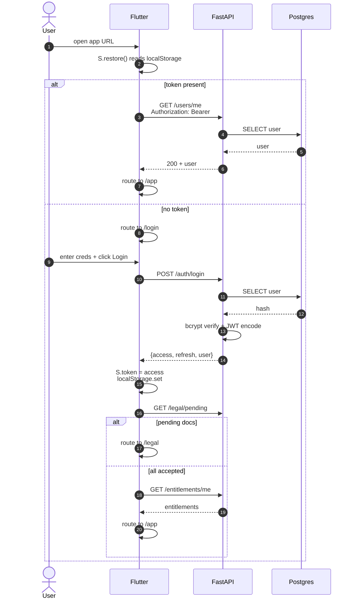
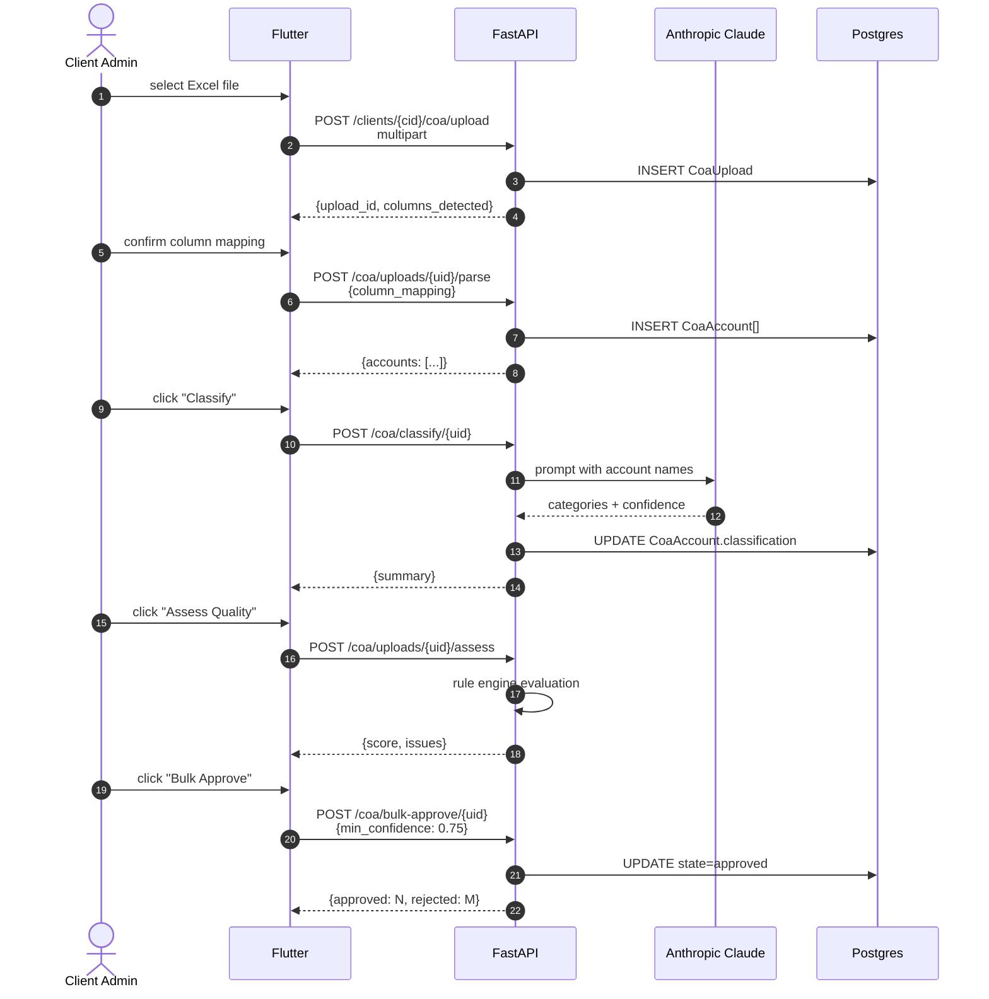
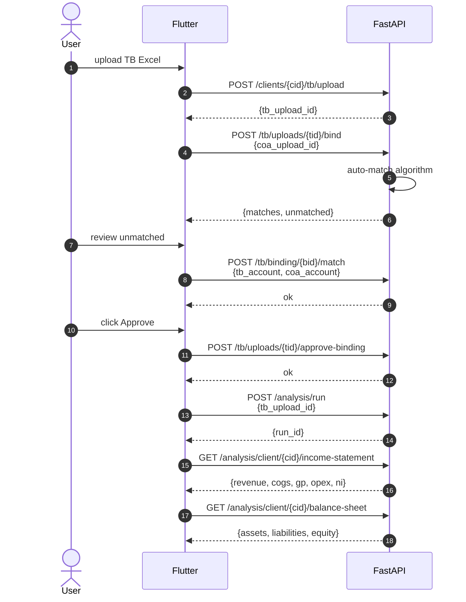
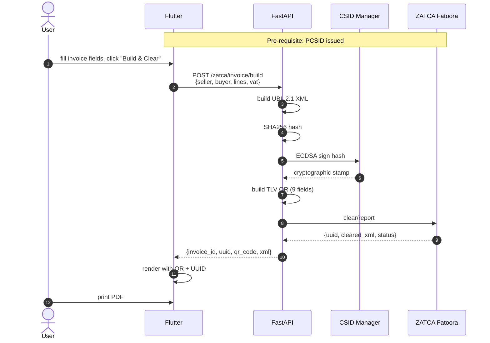
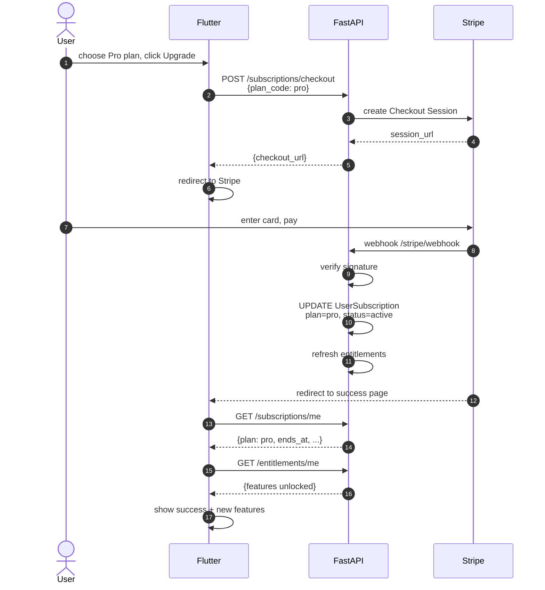
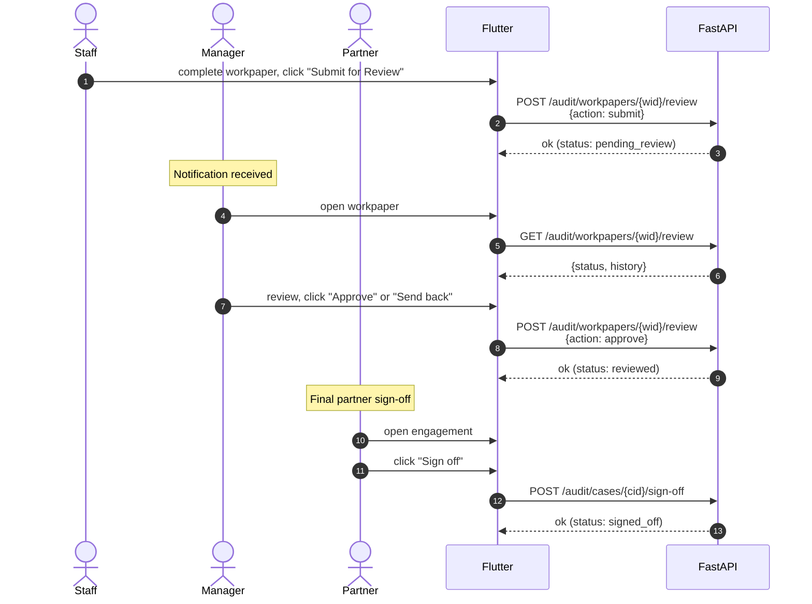

# 05 — API Endpoints Master / مرجع نقاط API الرئيسي

> Reference: continues from `04_SCREENS_AND_BUTTONS_CATALOG.md`. Next: `06_PERMISSIONS_AND_PLANS_MATRIX.md`.
> **Source of truth:** routers in `app/phase{1-11}/routes/` and `app/sprint{1-6}/routes/`.

---

## 1. Endpoint Inventory by Phase / فهرس النقاط حسب المرحلة

**Total: ~770 endpoint decorators across 11 Phases + 7 sprint-named directories + Pilot/AI/ZATCA/Copilot/COA-Engine/Knowledge-Brain modules.** (2026-05-04 G-DOCS-2 re-measure; the original "240+" figure was retired by the 2026-05-03 Status Audit which counted 761.)

> Reproducer: `grep -rE "@(router|app)\.(get|post|put|delete|patch)" app/ --include="*.py" | wc -l`
>
> **Catalog drift warning.** This document was hand-maintained against the
> original ~240 endpoints; the per-phase tables below reflect that
> snapshot, not the current ~770. Per-endpoint backfill is out of scope
> for G-DOCS-2 — it would take ~10 hours of manual work and would
> drift again within weeks. The right fix is **G-DOCS-3** (deferred
> Sprint 15+) which auto-generates this catalog from FastAPI's
> `app.routes` at CI time. Until then, treat the per-phase tables
> below as design-intent reference and `/docs` (Swagger UI) as the
> live source of truth.

### Phase 1 — Auth & Account Management (35 endpoints)

| METHOD | PATH | AUTH | PURPOSE | FRONTEND CALLER |
|--------|------|------|---------|-----------------|
| POST | `/auth/register` | none | Register new user | `RegScreen` |
| POST | `/auth/login` | none | Issue tokens | `SlideAuthScreen` |
| POST | `/auth/refresh` | none | Refresh access token | `ApiService` interceptor |
| POST | `/auth/logout` | JWT | Invalidate session | Avatar menu |
| POST | `/auth/logout-all` | JWT | Revoke all sessions | `/account/sessions` |
| POST | `/auth/forgot-password` | none | Send reset email | `ForgotPasswordScreen` |
| POST | `/auth/reset-password` | none | Complete reset | reset link page |
| POST | `/auth/change-password` | JWT | Update password | `/password/change` |
| POST | `/auth/email/send-verification` | JWT | Email verify link | profile screen |
| POST | `/auth/email/verify` | JWT | Verify email | verify link page |
| GET | `/auth/email/status` | JWT | Verify status | profile |
| POST | `/auth/social/google` | none | Google OAuth | login |
| POST | `/auth/social/apple` | none | Apple OAuth | login |
| POST | `/auth/mobile/send-code` | none | SMS code | mobile auth flow |
| POST | `/auth/mobile/verify` | none | Verify SMS | mobile auth flow |
| GET | `/auth/totp/status` | JWT | TOTP status | `/account/mfa` |
| POST | `/auth/totp/setup` | JWT | Init 2FA | `/account/mfa` |
| POST | `/auth/totp/verify` | JWT | Verify 2FA code | `/account/mfa` |
| POST | `/auth/totp/disable` | JWT | Disable 2FA | `/account/mfa` |
| GET | `/users/me` | JWT | Get profile | header avatar |
| PUT | `/users/me` | JWT | Update profile | `/profile/edit` |
| GET | `/users/me/security` | JWT | Security events | `/account/sessions` |
| GET | `/users/me/sessions` | JWT | List sessions | `/account/sessions` |
| DELETE | `/users/me/sessions/{sid}` | JWT | Revoke | `/account/sessions` |
| GET | `/plans` | none | List plans | `/plans/compare` |
| GET | `/plans/{plan_code}` | none | Plan detail | `/plans/compare` |
| GET | `/legal/policies` | none | List policies | `/legal` |
| GET | `/legal/policy/{type}` | none | Get policy | `/legal` |
| POST | `/legal/accept` | JWT | Accept | `/legal` |
| GET | `/legal/acceptance/check` | JWT | Check if accepted | guard |
| GET | `/legal/acceptance/history` | JWT | History | `/account/activity` |
| POST | `/account/closure` | JWT | Request closure | `/account/close` |
| POST | `/account/reactivate` | JWT | Reactivate | (post-closure) |

### Phase 2 — Clients, COA Upload, Audit Cases (35 endpoints)

| METHOD | PATH | AUTH | PURPOSE | FRONTEND CALLER |
|--------|------|------|---------|-----------------|
| POST | `/clients` | JWT | Create client | onboarding wizard |
| GET | `/clients` | JWT | List clients | `/clients` |
| GET | `/clients/{cid}` | JWT | Client detail | `/client-detail` |
| PUT | `/clients/{cid}` | JWT | Update client | client edit |
| POST | `/clients/{cid}/documents` | JWT | Upload doc | client docs |
| GET | `/clients/{cid}/documents` | JWT | List docs | client docs |
| POST | `/clients/{cid}/members` | JWT | Add team member | client team |
| GET | `/clients/{cid}/members` | JWT | List team | client team |
| POST | `/clients/{cid}/upload` | JWT | Upload COA | `CoaUploadScreen` (legacy) |
| GET | `/clients/{cid}/readiness` | JWT | Onboarding readiness | dashboard |
| GET | `/clients/{cid}/results` | JWT | Analysis results | `/analysis/result` |
| GET | `/services/catalog` | none/JWT | List services | `/service-catalog` |
| GET | `/services/catalog/{code}` | none/JWT | Service detail | catalog detail |
| POST | `/audit/cases` | JWT | Create engagement | `/audit/engagements` |
| GET | `/audit/cases` | JWT | List engagements | `/audit/engagements` |
| GET | `/audit/cases/{cid}` | JWT | Engagement detail | engagement workspace |
| POST | `/audit/cases/{cid}/samples` | JWT | Define sample | `/audit/sampling` |
| GET | `/audit/cases/{cid}/samples` | JWT | List samples | sampling tab |
| POST | `/audit/cases/{cid}/workpapers` | JWT | Create WP | `/audit/workpapers` |
| GET | `/audit/cases/{cid}/workpapers` | JWT | List WPs | workpapers tab |
| POST | `/audit/workpapers/{wid}/review` | JWT | Submit for review | workpaper detail |
| GET | `/audit/workpapers/{wid}/review` | JWT | Review status | workpaper detail |
| POST | `/audit/cases/{cid}/findings` | JWT | Add finding | findings tab |
| GET | `/audit/cases/{cid}/findings` | JWT | List findings | findings tab |
| GET | `/audit/templates` | none/JWT | List templates | report builder |
| POST | `/archive/upload` | JWT | Archive doc | `/archive` |
| DELETE | `/archive/items/{aid}` | JWT | Delete archived | `/archive` |
| POST | `/archive/items/{aid}/attach` | JWT | Attach | `/archive` |
| GET | `/account/archive` | JWT | User archive | `/archive` |
| GET | `/clients/{cid}/archive` | JWT | Client archive | client docs |
| GET | `/onboarding/draft` | JWT | Get draft | wizard |
| POST | `/onboarding/draft` | JWT | Save draft | wizard |
| GET | `/legal-entity-types` | none | List types | wizard step 3 |
| GET | `/sectors` | none | List sectors | wizard step 4 |
| GET | `/sectors/{m}/sub` | none | Sub-sectors | wizard step 4 |
| GET | `/stage-notes/{svc}/{stage}` | none | Stage guidance | onboarding |
| GET | `/clients/{cid}/required-documents` | JWT | List req docs | dashboard |

### Phase 3 — Knowledge Feedback (6 endpoints)

| METHOD | PATH | AUTH | PURPOSE | CALLER |
|--------|------|------|---------|--------|
| POST | `/knowledge-feedback` | JWT | Submit feedback | `/knowledge/feedback` |
| GET | `/knowledge-feedback` | JWT | List submissions | knowledge feedback |
| POST | `/knowledge-feedback/{id}/review` | JWT Reviewer | Review | `/admin/reviewer` |
| GET | `/knowledge-feedback/review-queue` | JWT Reviewer | Pending | `/admin/reviewer` |
| GET | `/knowledge-feedback/candidate-rules` | JWT Reviewer | List candidates | reviewer console |
| POST | `/knowledge-feedback/{id}/promote-rule` | JWT Admin | Promote | reviewer console |

### Phase 4 — Service Provider Onboarding (8 endpoints)

| METHOD | PATH | AUTH | PURPOSE | CALLER |
|--------|------|------|---------|--------|
| POST | `/service-providers/register` | JWT | Provider apply | provider signup |
| GET | `/service-providers/me` | JWT Provider | Get profile | provider profile |
| PUT | `/service-providers/me` | JWT Provider | Update profile | provider profile |
| POST | `/service-providers/documents` | JWT Provider | Upload doc | `/admin/providers/documents` |
| GET | `/service-providers/verification-queue` | JWT Admin | Pending verifications | `/admin/providers/verify` |
| POST | `/service-providers/{pid}/review` | JWT Admin | Review | admin verify |
| POST | `/service-providers/{pid}/approve` | JWT Admin | Approve | admin verify |
| POST | `/service-providers/{pid}/reject` | JWT Admin | Reject | admin verify |

### Phase 5 — Marketplace & Compliance (12 endpoints)

| METHOD | PATH | AUTH | PURPOSE | CALLER |
|--------|------|------|---------|--------|
| GET | `/marketplace/providers` | JWT | List verified | `/service-catalog` |
| POST | `/marketplace/requests` | JWT Client | Post request | `/marketplace/new-request` |
| GET | `/marketplace/requests` | JWT | List requests | catalog |
| GET | `/marketplace/requests/{rid}` | JWT | Request detail | `/service-request/detail` |
| POST | `/marketplace/requests/{rid}/assign` | JWT Provider | Accept | provider kanban |
| POST | `/marketplace/requests/{rid}/status` | JWT | Update status | request detail |
| POST | `/marketplace/requests/{rid}/rate` | JWT | Rate | request detail |
| POST | `/compliance/check/{rid}` | JWT Admin | Run check | admin compliance |
| GET | `/admin/suspensions` | JWT Admin | List suspensions | admin |
| POST | `/admin/suspend` | JWT Admin | Suspend | admin |
| POST | `/admin/suspend/{sid}/lift` | JWT Admin | Lift | admin |
| POST | `/suspensions/{sid}/appeal` | JWT Provider | Appeal | provider |

### Phase 6 — Admin Dashboard (5 endpoints)

| METHOD | PATH | AUTH | PURPOSE | CALLER |
|--------|------|------|---------|--------|
| GET | `/stats` | JWT Admin | Dashboard KPIs | admin home |
| GET | `/audit-log` | JWT Admin | Audit log | `/admin/audit` |
| GET | `/admin/users` | JWT Admin | List users | admin users |
| POST | `/admin/users/{uid}/role` | JWT Admin | Set role | admin users |
| GET | `/admin/users/{uid}/details` | JWT Admin | User detail | admin users |

### Phase 7 — Tasks & Provider Compliance (5 endpoints)

| METHOD | PATH | AUTH | PURPOSE |
|--------|------|------|---------|
| POST | `/tasks/submit` | JWT | Submit task |
| GET | `/tasks` | JWT | List tasks |
| GET | `/tasks/{tid}` | JWT | Task detail |
| POST | `/tasks/{tid}/status` | JWT | Update |
| GET | `/provider-compliance/{pid}` | JWT Admin | Provider compliance |

### Phase 8 — Subscription & Entitlements (10 endpoints)

| METHOD | PATH | AUTH | PURPOSE | CALLER |
|--------|------|------|---------|--------|
| GET | `/subscriptions/me` | JWT | Current sub | `/subscription` |
| GET | `/plans/compare` | JWT | Compare | `/plans/compare` |
| GET | `/subscriptions/payment-history` | JWT | Payment history | `/subscription` |
| POST | `/subscriptions/checkout` | JWT | Init checkout | `/upgrade-plan` |
| POST | `/subscriptions/verify-payment` | JWT | Verify | post-checkout |
| POST | `/subscriptions/upgrade` | JWT | Upgrade | upgrade flow |
| POST | `/subscriptions/downgrade` | JWT | Downgrade | downgrade flow |
| GET | `/entitlements/me` | JWT | Get entitlements | global gate |
| GET | `/entitlements/check/{feat}` | JWT | Check feature | feature gates |
| POST | `/subscriptions/cancel` | JWT | Cancel | subscription |

### Phase 9 — Account Center (10 endpoints)

| METHOD | PATH | AUTH | PURPOSE | CALLER |
|--------|------|------|---------|--------|
| GET | `/profile` | JWT | Get (alias) | profile |
| PUT | `/profile` | JWT | Update (alias) | profile |
| GET | `/sessions` | JWT | List sessions | sessions |
| POST | `/sessions/{sid}/logout` | JWT | Logout | sessions |
| POST | `/sessions/logout-all` | JWT | Logout all | sessions |
| GET | `/activity` | JWT | Activity history | `/account/activity` |
| POST | `/activity` | JWT | Log action | (internal) |
| POST | `/forgot-password` | none | Reset (alias) | forgot pw |
| POST | `/reset-password` | none | Reset (alias) | reset pw |
| POST | `/closure` | JWT | Closure (alias) | close account |

### Phase 10 — Notifications V2 (7 endpoints)

| METHOD | PATH | AUTH | PURPOSE | CALLER |
|--------|------|------|---------|--------|
| GET | `/notifications` | JWT | List | `/notifications` |
| GET | `/notifications/count` | JWT | Unread count | bell badge |
| GET | `/notifications/preferences` | JWT | Prefs | `/notifications/prefs` |
| PUT | `/notifications/preferences` | JWT | Update prefs | `/notifications/prefs` |
| POST | `/notifications/mark-read` | JWT | Mark read | inbox |
| POST | `/notifications/mark-all-read` | JWT | Mark all | inbox |
| POST | `/notifications/emit` | JWT Service | Emit | (server-side) |

### Phase 11 — Legal Acceptance (6 endpoints)

| METHOD | PATH | AUTH | PURPOSE | CALLER |
|--------|------|------|---------|--------|
| GET | `/legal/documents` | JWT | List docs | `/legal` |
| GET | `/legal/pending` | JWT | Pending docs | guard |
| GET | `/legal/my-acceptances` | JWT | History | `/legal` |
| POST | `/legal/accept/{did}` | JWT | Accept | `/legal` |
| POST | `/legal/accept-all` | JWT | Accept all | `/legal` |
| GET | `/legal/policies` | JWT | List policies | `/admin/policies` |

### Sprint 1 — COA Upload Integration (6 endpoints)

| METHOD | PATH | AUTH | PURPOSE |
|--------|------|------|---------|
| POST | `/clients/{cid}/coa/upload` | JWT | Upload COA |
| GET | `/coa/uploads/{uid}` | JWT | Get upload |
| GET | `/coa/uploads/{uid}/accounts` | JWT | List accounts |
| POST | `/coa/uploads/{uid}/parse` | JWT | Parse |
| POST | `/coa/knowledge-feedback` | JWT | Submit feedback |
| GET | `/coa/knowledge-feedback` | JWT | Get feedback |

### Sprint 2 — COA Classification & Mapping (7 endpoints)

| METHOD | PATH | AUTH | PURPOSE |
|--------|------|------|---------|
| POST | `/coa/classify/{uid}` | JWT | AI classify |
| POST | `/coa/debug-classify/{uid}` | JWT | Debug |
| GET | `/coa/classification-summary/{uid}` | JWT | Summary |
| GET | `/coa/mapping/{uid}` | JWT | Mapping |
| PUT | `/coa/account/{aid}` | JWT | Update account |
| POST | `/coa/approve/{aid}` | JWT | Approve account |
| POST | `/coa/bulk-approve/{uid}` | JWT | Bulk approve |

### Sprint 3 — COA Quality & Rule Engine (10 endpoints)

| METHOD | PATH | AUTH | PURPOSE |
|--------|------|------|---------|
| POST | `/coa/uploads/{uid}/assess` | JWT | Quality assess |
| GET | `/coa/uploads/{uid}/assessment` | JWT | Get assessment |
| POST | `/coa/uploads/{uid}/approve-coa` | JWT | Approve COA |
| POST | `/coa/uploads/{uid}/reject-coa` | JWT | Reject COA |
| GET | `/coa/uploads/{uid}/approval-check` | JWT | Readiness |
| GET | `/coa/uploads/{uid}/approval-history` | JWT | History |
| POST | `/coa/accounts/{aid}/create-rule` | JWT | Create rule |
| GET | `/clients/{cid}/coa-rules` | JWT | Get rules |
| POST | `/clients/{cid}/coa-rules` | JWT | Create rule |
| DELETE | `/coa/rules/{rid}` | JWT | Delete rule |

### Sprint 4 — Concept Graph & Rules (15 endpoints)

| METHOD | PATH | AUTH | PURPOSE |
|--------|------|------|---------|
| GET | `/knowledge/concepts` | JWT | List concepts |
| POST | `/knowledge/concepts` | JWT | Create |
| GET | `/knowledge/concepts/{cid}` | JWT | Detail |
| PUT | `/knowledge/concepts/{cid}` | JWT | Update |
| GET | `/knowledge/rules/active` | JWT | List rules |
| POST | `/knowledge/rules/candidate` | JWT | Submit candidate |
| GET | `/knowledge/rules/candidates` | JWT | List candidates |
| POST | `/knowledge/rules/candidates/{rid}/promote` | JWT Admin | Promote |
| GET | `/knowledge/conflicts` | JWT | List conflicts |
| POST | `/knowledge/conflicts/detect` | JWT Admin | Detect |
| POST | `/knowledge/aliases` | JWT | Create alias |
| GET | `/knowledge/aliases/pending` | JWT | List pending |
| POST | `/knowledge/aliases/{aid}/review` | JWT Admin | Review |
| GET | `/knowledge/source-systems` | JWT | List systems |
| POST | `/knowledge/source-systems` | JWT | Register |

### Sprint 4 TB — Trial Balance Binding (7 endpoints)

| METHOD | PATH | AUTH | PURPOSE |
|--------|------|------|---------|
| POST | `/clients/{cid}/tb/upload` | JWT | Upload TB |
| GET | `/tb/uploads/{tid}` | JWT | Get upload |
| POST | `/tb/uploads/{tid}/bind` | JWT | Bind |
| GET | `/tb/uploads/{tid}/binding-results` | JWT | Get results |
| GET | `/tb/uploads/{tid}/binding-summary` | JWT | Summary |
| POST | `/tb/binding/{bid}/match` | JWT | Remap |
| POST | `/tb/uploads/{tid}/approve-binding` | JWT | Approve |

### Sprint 5 — Financial Analysis (8 endpoints)

| METHOD | PATH | AUTH | PURPOSE |
|--------|------|------|---------|
| POST | `/analysis/run` | JWT | Init analysis |
| GET | `/analysis/runs/{rid}` | JWT | Get run |
| GET | `/analysis/client/{cid}/runs` | JWT | List runs |
| GET | `/analysis/client/{cid}/income-statement` | JWT | IS |
| GET | `/analysis/client/{cid}/balance-sheet` | JWT | BS |
| GET | `/analysis/client/{cid}/full-report` | JWT | Full report |
| GET | `/analysis/validate/{cid}/{tbid}` | JWT | Validate |
| GET | `/analysis/compare/{rid1}/{rid2}` | JWT | Compare |

### Sprint 6 — Reference Registry (10 endpoints)

| METHOD | PATH | AUTH | PURPOSE |
|--------|------|------|---------|
| GET | `/programs/funding` | JWT | List funding programs |
| GET | `/programs/support` | JWT | List support |
| GET | `/programs/licenses` | JWT | List licenses |
| GET | `/references/authorities` | JWT | List authorities |
| GET | `/references/documents` | JWT | List documents |
| GET | `/references/updates` | JWT | List updates |
| POST | `/references/authorities` | JWT Admin | Add |
| POST | `/references/documents` | JWT Admin | Add |
| POST | `/references/updates/{uid}/review` | JWT Admin | Review |
| POST | `/eligibility/funding/{cid}` | JWT | Assess funding |
| POST | `/eligibility/licensing/{cid}` | JWT | Assess licensing |
| POST | `/eligibility/support/{cid}` | JWT | Assess support |
| GET | `/eligibility/client/{cid}/history` | JWT | History |

### Pilot ERP (30+ endpoints) / `/api/v1/pilot/*`

| METHOD | PATH | PURPOSE |
|--------|------|---------|
| GET | `/api/v1/pilot/entities/{eid}/customers` | List customers |
| POST | `/api/v1/pilot/customers` | Create customer |
| POST | `/api/v1/pilot/sales-invoices` | Create invoice |
| POST | `/api/v1/pilot/sales-invoices/{iid}/issue` | Issue |
| POST | `/api/v1/pilot/customer-payments` | Record payment |
| GET | `/api/v1/pilot/entities/{eid}/vendors` | List vendors |
| GET | `/api/v1/pilot/entities/{eid}/products` | List products |
| GET | `/api/v1/pilot/entities/{eid}/journal-entries` | List JE |
| POST | `/api/v1/pilot/journal-entries` | Create JE |
| GET | `/api/v1/pilot/entities/{eid}/trial-balance` | TB |
| GET | `/api/v1/pilot/entities/{eid}/income-statement` | IS |
| GET | `/api/v1/pilot/entities/{eid}/balance-sheet` | BS |
| GET | `/api/v1/pilot/entities/{eid}/cash-flow` | CF |
| POST | `/pilot/entities/{eid}/fiscal-periods/seed` | Seed periods |
| GET | `/api/v1/pilot/entities/{eid}/purchase-orders` | List POs |
| POST | `/api/v1/pilot/purchase-orders` | Create PO |
| POST | `/api/v1/pilot/purchase-orders/{pid}/approve` | Approve |
| POST | `/api/v1/pilot/purchase-orders/{pid}/issue` | Issue |
| GET | `/api/v1/pilot/purchase-orders/{pid}/receipts` | Receipts |
| GET | `/api/v1/pilot/entities/{eid}/purchase-invoices` | List PIs |
| POST | `/api/v1/pilot/purchase-invoices/{piid}/post` | Post |
| POST | `/api/v1/pilot/vendor-payments` | Vendor payment |
| GET | `/api/v1/pilot/branches/{bid}/pos-sessions` | POS sessions |
| POST | `/api/v1/pilot/branches/{bid}/pos-sessions` | Create POS session |
| POST | `/api/v1/pilot/pos-sessions/{sid}/close` | Close (Z-Report) |
| GET | `/api/v1/pilot/pos-sessions/{sid}/z-report` | Z-Report |
| GET | `/api/v1/pilot/tenants/{tid}/branches` | List branches |
| GET | `/api/v1/pilot/entities/{eid}/branches` | Entity branches |
| POST | `/api/v1/pilot/goods-receipts` | Goods receipt |

### AI / Copilot (15+ endpoints)

| METHOD | PATH | PURPOSE |
|--------|------|---------|
| POST | `/copilot/chat` | Chat message |
| POST | `/copilot/sessions` | New session |
| GET | `/copilot/sessions` | List sessions |
| GET | `/copilot/sessions/{sid}/messages` | Messages |
| POST | `/copilot/detect-intent` | Intent classification |
| POST | `/copilot/sessions/{sid}/close` | Close session |
| POST | `/api/v1/ai/onboarding/complete` | AI onboarding |
| POST | `/api/v1/ai/onboarding/seed-demo` | Seed demo data |
| POST | `/ai/benford/analyze` | Benford analysis |
| POST | `/ai/journal-entry/sample` | JE sample |
| GET | `/api/v1/ai/audit/workpapers` | List AI WPs |
| GET | `/api/v1/ai/audit/workpapers/{wid}` | Get AI WP |
| POST | `/api/v1/ai/period-close/start` | Start period close |
| GET | `/api/v1/ai/period-close` | List |
| GET | `/api/v1/ai/period-close/{cid}` | Detail |
| POST | `/api/v1/ai/period-close/tasks/{tid}/complete` | Complete task |
| POST | `/api/v1/ai/universal-journal/query` | Query universal journal |
| GET | `/api/v1/ai/universal-journal/document-flow/{type}/{id}` | Doc flow |

### ZATCA (10 endpoints)

| METHOD | PATH | PURPOSE |
|--------|------|---------|
| POST | `/zatca/invoice/build` | Build UBL + clear |
| GET | `/zatca/queue/stats` | Queue stats |
| GET | `/zatca/queue/{id}` | Queue item |
| POST | `/zatca/queue/enqueue` | Enqueue invoice |
| POST | `/zatca/csid/request` | Request CSID |
| GET | `/zatca/csid/stats` | CSID stats |
| GET | `/zatca/csid/{id}` | CSID detail |

### Finance Computations (25+ endpoints)

| POST | `/tax/zakat/compute` | Compute zakat |
| POST | `/tax/vat/return` | VAT return |
| POST | `/ratios/compute` | Financial ratios |
| POST | `/depreciation/compute` | Depreciation |
| POST | `/cashflow/compute` | Cash flow |
| POST | `/amortization/compute` | Amortization |
| POST | `/payroll/compute` | Payroll |
| POST | `/breakeven/compute` | Break-even |
| POST | `/investment/analyze` | Investment |
| POST | `/budget/variance` | Budget variance |
| POST | `/bank-rec/compute` | Bank rec |
| POST | `/inventory/valuate` | Inventory valuation |
| POST | `/aging/report` | Aging |
| POST | `/working-capital/analyze` | Working capital |
| POST | `/health-score/compute` | Health score |
| POST | `/dscr/analyze` | DSCR |
| POST | `/wacc/compute` | WACC |
| POST | `/dcf/analyze` | DCF |
| POST | `/je/build` | Build JE |
| GET | `/compliance/audit/verify` | Verify audit chain |
| POST | `/ai/guardrails/evaluate` | AI guardrails |

### Misc

| GET | `/health` | Health check (no auth) |
| GET | `/api/v1/employees` | List employees |
| POST | `/api/v1/employees` | Create employee |

---

## 2. Critical Sequence Diagrams / مخططات تسلسل حرجة

### S1 — Login + Session Restore



### S2 — COA Upload → Approval Pipeline



### S3 — TB Binding → Financial Statements



### S4 — ZATCA Invoice Submission (Phase 2)



### S5 — Subscription Upgrade



### S6 — Audit Engagement Workpaper Sign-off



---

## 3. HTTP Conventions / المعايير

### Request format
- Body: JSON (`Content-Type: application/json`)
- File uploads: `multipart/form-data`
- Auth: `Authorization: Bearer {access_token}` (header) or `apex_token` cookie (fallback)

### Response format (success)
```json
{ "success": true, "data": { ... } }
```

### Response format (error)
```json
{ "success": false, "error": "Human readable message" }
```

**HTTP codes used:**
- 200 OK — read or update
- 201 Created — POST that creates resource
- 204 No Content — DELETE
- 400 Bad Request — validation error
- 401 Unauthorized — missing/invalid token
- 403 Forbidden — role/plan not allowed
- 404 Not Found — resource missing
- 409 Conflict — duplicate (e.g., username taken)
- 422 Unprocessable Entity — Pydantic validation
- 429 Too Many Requests — rate limit
- 500 Internal Server Error — generic (no traceback leaked)

### Pagination convention
- Query params: `?page=1&page_size=50`
- Response: `{ "items": [...], "total": N, "page": 1, "page_size": 50 }`

### Idempotency
- POST endpoints accepting `Idempotency-Key` header for create operations (TODO: not enforced everywhere — see gaps doc).

---

## 4. Endpoint Naming Issues / مشاكل في تسمية النقاط

(See `09_GAPS_AND_REWORK_PLAN.md` for detailed fix plan.)

**Problems detected:**
1. Some Phase 9 paths shadow Phase 1 (e.g., `/forgot-password` exists in both — Phase 9 is alias).
2. Pilot endpoints inconsistent: `/api/v1/pilot/*` vs `/pilot/*` (some legacy without `/api/v1`).
3. Compliance compute endpoints are unversioned (`/ratios/compute` should be `/api/v1/finance/ratios/compute`).
4. No consistent prefix for AI endpoints (`/ai/*`, `/api/v1/ai/*`, `/copilot/*` mixed).
5. Singular vs plural inconsistencies (e.g., `/notifications/preferences` vs `/legal/policies`).

**Recommended target convention:**
```
/api/v1/{phase_or_module}/{resource}[/{id}][/{action}]

Examples:
/api/v1/auth/login
/api/v1/auth/totp/setup
/api/v1/users/me
/api/v1/clients/{id}/documents
/api/v1/erp/sales-invoices
/api/v1/erp/sales-invoices/{id}/issue
/api/v1/finance/ratios/compute
/api/v1/zatca/invoices/build
/api/v1/audit/cases/{id}/workpapers
/api/v1/admin/users/{id}/role
```

Migration strategy: keep old paths as aliases (302 redirect or duplicate route) for 1 release cycle, then deprecate.

---

## 5. Endpoint × Plan Matrix Summary

(Full matrix in `06_PERMISSIONS_AND_PLANS_MATRIX.md`.)

| Endpoint group | Free | Pro | Business | Expert | Enterprise |
|----------------|------|-----|----------|--------|------------|
| Auth (login/register) | ✓ | ✓ | ✓ | ✓ | ✓ |
| User profile | ✓ | ✓ | ✓ | ✓ | ✓ |
| Plans & subscriptions | ✓ | ✓ | ✓ | ✓ | ✓ |
| Clients (1) | ✓ | (5) | (20) | ∞ | ∞ |
| COA upload | (manual) | ✓ | ✓ | ✓ + AI | ✓ + AI |
| TB bind & analysis | ✗ | ✓ | ✓ | ✓ | ✓ |
| Pilot ERP daily | read-only | 100 inv/mo | ∞ | ∞ | ∞ |
| ZATCA Phase 2 | ✗ | ✓ | ✓ | ✓ + queue | ✓ + bulk |
| Audit cases | ✗ | ✗ | basic | ✓ | ✓ + EQR |
| AI Copilot | 5 msg/day | 50/day | 500/day | ∞ | ∞ |
| Finance computations | basic | ✓ | ✓ | ✓ | ✓ |
| Knowledge Brain | read | read | read | edit | edit |
| Admin | ✗ | ✗ | ✗ | ✗ | n/a (internal) |

---

**Continue → `06_PERMISSIONS_AND_PLANS_MATRIX.md`**
