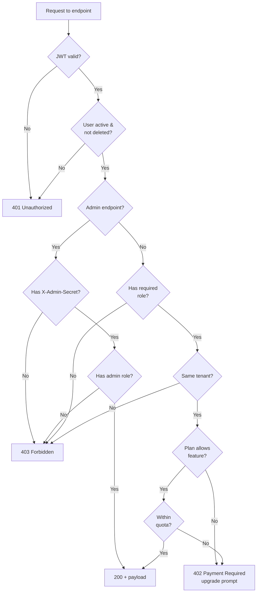

# 06 — Permissions & Plans Matrix / مصفوفة الصلاحيات والخطط

> Reference: continues from `05_API_ENDPOINTS_MASTER.md`. Next: `07_DATA_MODEL_ER.md`.

---

## 1. Roles / الأدوار

APEX defines **5 user roles** (RoleCode enum, table `app/phase1/models/platform_models.py`):

| Code | EN Name | AR Name | Description |
|------|---------|---------|-------------|
| `guest` | Guest | زائر | Unauthenticated; can browse `/legal`, `/plans`, `/services/catalog` |
| `registered_user` | Registered user | مستخدم مسجل | Logged in but no company yet |
| `client_user` | Client user | مستخدم العميل | Team member added to a client/entity, limited access |
| `client_admin` | Client admin | مدير العميل | Full access to a client/entity (owner) |
| `provider_user` | Service provider | مقدم خدمة | Marketplace professional (auditor, accountant, consultant) |

**Internal admin roles** (not in standard enum, controlled by `X-Admin-Secret` header + DB flag):
- `admin` — Platform admin
- `super_admin` — Engineer/SRE level
- `reviewer` — Knowledge feedback reviewer

---

## 2. Subscription Plans / خطط الاشتراك

Source: `app/phase1/models/platform_models.py` Plan model + PlanFeature.

| Code | EN Name | AR Name | Monthly SAR | Max Users | Max Clients | Target |
|------|---------|---------|-------------|-----------|-------------|--------|
| `free` | Free | مجاني | 0 | 1 | 1 | Trial / sole proprietor |
| `pro` | Pro | احترافي | 299 | 5 | 5 | Small accountant |
| `business` | Business | أعمال | 999 | 20 | 20 | SMB |
| `expert` | Expert | خبير | 2,999 | ∞ | ∞ | Audit firm |
| `enterprise` | Enterprise | مؤسسة | Custom | ∞ | ∞ | Large org / banks |

---

## 3. Master RBAC × Plan Matrix / المصفوفة الرئيسية

Format: `Role / Plan` cell shows access level.
- ✓ = full access
- R = read-only
- L = limited (with cap)
- ✗ = blocked
- — = not applicable

### 3.1 Authentication & Profile

| Feature | guest | registered_user | client_user | client_admin | provider_user |
|---------|-------|-----------------|-------------|--------------|---------------|
| Sign up | ✓ | — | — | — | ✓ |
| Login | ✓ | ✓ | ✓ | ✓ | ✓ |
| Forgot password | ✓ | ✓ | ✓ | ✓ | ✓ |
| View own profile | ✗ | ✓ | ✓ | ✓ | ✓ |
| Edit own profile | ✗ | ✓ | ✓ | ✓ | ✓ |
| Change password | ✗ | ✓ | ✓ | ✓ | ✓ |
| Enable MFA | ✗ | ✓ | ✓ | ✓ | ✓ |
| Manage own sessions | ✗ | ✓ | ✓ | ✓ | ✓ |
| Close account | ✗ | ✓ | — | ✓ | ✓ |
| Accept legal | ✗ | ✓ | ✓ | ✓ | ✓ |
| View public plans | ✓ | ✓ | ✓ | ✓ | ✓ |

### 3.2 Tenant / Entity Management

| Feature | client_user | client_admin |
|---------|-------------|--------------|
| Create new entity | ✗ | ✓ (subject to plan limits) |
| Edit entity profile | ✗ | ✓ |
| Switch active entity | ✓ (only assigned ones) | ✓ |
| Add team member | ✗ | ✓ |
| Remove team member | ✗ | ✓ |
| Set member role | ✗ | ✓ |
| Archive entity | ✗ | ✓ |

### 3.3 COA / TB / Analysis

| Feature | client_user | client_admin | Plan: Free | Pro | Business | Expert | Enterprise |
|---------|-------------|--------------|-----------|-----|----------|--------|------------|
| Upload COA Excel | R | ✓ | manual | ✓ | ✓ | ✓ | ✓ |
| Map columns | R | ✓ | manual | ✓ | ✓ | ✓ | ✓ |
| AI classify accounts | R | ✓ | ✗ | ✓ | ✓ | ✓ + retraining | ✓ |
| Quality assess | R | ✓ | ✗ | ✓ | ✓ | ✓ | ✓ |
| Approve accounts | ✗ | ✓ | ✗ | ✓ | ✓ | ✓ | ✓ |
| Bulk approve | ✗ | ✓ | ✗ | ✗ | ✓ | ✓ | ✓ |
| Custom rules | ✗ | ✓ | ✗ | ✗ | ✓ | ✓ | ✓ |
| Upload TB | R | ✓ | ✗ | ✓ | ✓ | ✓ | ✓ |
| Bind TB | ✗ | ✓ | ✗ | ✓ | ✓ | ✓ | ✓ |
| Run analysis | ✓ | ✓ | ✗ | ✓ | ✓ | ✓ | ✓ |
| Compare runs | ✓ | ✓ | ✗ | ✗ | ✓ | ✓ | ✓ |

### 3.4 Daily ERP (Sales / Purchase / Banking)

| Feature | client_user | client_admin | Plan: Free | Pro | Business | Expert | Enterprise |
|---------|-------------|--------------|-----------|-----|----------|--------|------------|
| Create customer | ✓ | ✓ | 5 max | 100 | ∞ | ∞ | ∞ |
| Create vendor | ✓ | ✓ | 5 max | 100 | ∞ | ∞ | ∞ |
| Create invoice | ✓ | ✓ | 1/month | 100/mo | ∞ | ∞ | ∞ |
| Issue invoice | L | ✓ | ✗ | ✓ | ✓ | ✓ | ✓ |
| Record payment | ✓ | ✓ | ✗ | ✓ | ✓ | ✓ | ✓ |
| Recurring invoices | ✗ | ✓ | ✗ | ✗ | ✓ | ✓ | ✓ |
| Quotes | ✓ | ✓ | ✗ | ✓ | ✓ | ✓ | ✓ |
| Credit memos | L | ✓ | ✗ | ✓ | ✓ | ✓ | ✓ |
| Customer 360 | ✓ | ✓ | ✗ | ✗ | ✓ | ✓ | ✓ |
| AR aging | ✓ | ✓ | ✗ | ✓ | ✓ | ✓ | ✓ |
| Bank reconciliation | ✗ | ✓ | ✗ | ✗ | ✓ | ✓ | ✓ |
| Auto bank match (AI) | ✗ | ✓ | ✗ | ✗ | ✗ | ✓ | ✓ |
| POS sessions | ✓ | ✓ | ✗ | ✓ | ✓ | ✓ | ✓ |
| Inventory v2 | ✓ | ✓ | ✗ | ✗ | ✓ | ✓ | ✓ |
| Fixed Assets v2 | ✓ | ✓ | ✗ | ✗ | ✓ | ✓ | ✓ |
| Multi-branch | ✗ | ✓ | ✗ | ✗ | 3 max | 10 max | ∞ |
| Receipt OCR | ✓ | ✓ | ✗ | ✗ | 100/mo | 1000/mo | ∞ |

### 3.5 Period Close & Financial Statements

| Feature | client_user | client_admin | Plan: Free | Pro | Business | Expert | Enterprise |
|---------|-------------|--------------|-----------|-----|----------|--------|------------|
| Generate TB | ✓ | ✓ | ✗ | ✓ | ✓ | ✓ | ✓ |
| Generate IS / BS / CF | ✓ | ✓ | ✗ | ✓ | ✓ | ✓ | ✓ |
| Manual JE | L | ✓ | ✗ | ✓ | ✓ | ✓ | ✓ |
| Period close checklist | ✗ | ✓ | ✗ | ✗ | ✓ | ✓ | ✓ |
| AI period close assist | ✗ | ✓ | ✗ | ✗ | ✗ | ✓ | ✓ |
| Lock period | ✗ | ✓ | ✗ | ✗ | ✓ | ✓ | ✓ |
| Multi-entity consolidation | ✗ | ✓ | ✗ | ✗ | ✗ | ✓ | ✓ |
| Compare period vs budget | ✓ | ✓ | ✗ | ✓ | ✓ | ✓ | ✓ |

### 3.6 Tax & Compliance

| Feature | client_user | client_admin | Plan: Free | Pro | Business | Expert | Enterprise |
|---------|-------------|--------------|-----------|-----|----------|--------|------------|
| Zakat calculator | ✓ | ✓ | basic | ✓ | ✓ | ✓ | ✓ |
| VAT return | ✗ | ✓ | ✗ | ✓ | ✓ | ✓ | ✓ |
| WHT v2 | ✗ | ✓ | ✗ | ✗ | ✓ | ✓ | ✓ |
| Deferred tax | ✗ | ✓ | ✗ | ✗ | ✓ | ✓ | ✓ |
| Transfer pricing | ✗ | ✓ | ✗ | ✗ | ✗ | ✓ | ✓ |
| ZATCA Phase 1 generation | ✗ | ✓ | ✓ | ✓ | ✓ | ✓ | ✓ |
| ZATCA Phase 2 clearance | ✗ | ✓ | ✗ | ✓ (1 device) | ✓ (3 devices) | ✓ (10 devices) | ✓ (∞) |
| ZATCA bulk submission | ✗ | ✓ | ✗ | ✗ | ✗ | ✓ | ✓ |
| ZATCA queue retry | ✗ | ✓ | ✗ | ✗ | ✓ | ✓ | ✓ |
| UAE FTA e-invoicing | ✗ | ✓ | ✗ | ✗ | ✗ | ✓ | ✓ |
| Tax calendar | ✓ | ✓ | ✗ | ✓ | ✓ | ✓ | ✓ |

### 3.7 Audit Module

| Feature | client_user | client_admin | provider_user (audit firm) | Plan: Free | Pro | Business | Expert | Enterprise |
|---------|-------------|--------------|----------------------------|-----------|-----|----------|--------|------------|
| Create engagement | ✗ | ✗ | ✓ | ✗ | ✗ | basic | ✓ | ✓ |
| Define samples | — | — | ✓ | ✗ | ✗ | ✓ | ✓ | ✓ |
| Statistical sampling (MUS) | — | — | ✓ | ✗ | ✗ | ✗ | ✓ | ✓ |
| Workpapers | — | — | ✓ | ✗ | ✗ | basic | ✓ | ✓ |
| Reviewer sign-off | — | — | ✓ Manager+ | ✗ | ✗ | ✗ | ✓ | ✓ |
| EQR sign-off | — | — | ✓ Partner | ✗ | ✗ | ✗ | ✗ | ✓ |
| Benford's law | — | — | ✓ | ✗ | ✗ | ✗ | ✓ | ✓ |
| Anomaly detection | — | — | ✓ | ✗ | ✗ | ✗ | ✓ | ✓ |
| Findings classification | — | — | ✓ | ✗ | ✗ | ✗ | ✓ | ✓ |
| Audit report generation | — | — | ✓ | ✗ | ✗ | ✗ | ✓ | ✓ |
| Multi-engagement portfolio | — | — | ✓ | ✗ | ✗ | ✗ | ✗ | ✓ |
| Continuous monitoring | — | — | ✓ | ✗ | ✗ | ✗ | ✗ | ✓ |

### 3.8 AI / Copilot / Knowledge

| Feature | client_user | client_admin | Plan: Free | Pro | Business | Expert | Enterprise |
|---------|-------------|--------------|-----------|-----|----------|--------|------------|
| Copilot chat | ✓ | ✓ | 5 msg/day | 50/day | 500/day | ∞ | ∞ |
| Multi-turn sessions | ✓ | ✓ | ✗ | ✓ | ✓ | ✓ | ✓ |
| Intent detection | ✓ | ✓ | ✗ | ✓ | ✓ | ✓ | ✓ |
| Knowledge Brain search | ✓ | ✓ | ✓ | ✓ | ✓ | ✓ | ✓ |
| Knowledge Brain edit | ✗ | ✗ | ✗ | ✗ | ✗ | reviewer only | reviewer only |
| Submit feedback | ✓ | ✓ | ✓ | ✓ | ✓ | ✓ | ✓ |
| Promote rule (admin) | ✗ | ✗ | ✗ | ✗ | ✗ | reviewer | reviewer |
| Custom AI rules | ✗ | ✓ | ✗ | ✗ | ✗ | ✓ | ✓ |
| Audit AI workflows | ✗ | ✓ | ✗ | ✗ | ✗ | ✓ | ✓ |
| AI period close assist | ✗ | ✓ | ✗ | ✗ | ✗ | ✓ | ✓ |
| AI workpaper generator | — | — | ✗ | ✗ | ✗ | ✓ (provider) | ✓ |

### 3.9 Marketplace

| Feature | client_user | client_admin | provider_user |
|---------|-------------|--------------|---------------|
| Browse catalog | ✓ | ✓ | ✓ |
| Post service request | ✗ | ✓ | ✗ |
| Bid on requests | — | — | ✓ (verified) |
| Accept request | — | — | ✓ |
| Send messages | ✓ | ✓ | ✓ |
| Submit deliverables | — | — | ✓ |
| Approve deliverables | ✗ | ✓ | — |
| Rate provider | ✗ | ✓ | — |
| Rate client | — | — | ✓ |

### 3.10 Settings & Account

| Feature | client_user | client_admin |
|---------|-------------|--------------|
| Theme switch | ✓ | ✓ |
| Language switch | ✓ | ✓ |
| Notification prefs | ✓ | ✓ |
| Bank feed setup | ✗ | ✓ |
| White label (custom domain) | ✗ | ✓ Enterprise only |
| Theme generator | ✗ | ✓ Enterprise only |
| API keys | ✗ | ✓ Expert+ |
| Integrations | ✗ | ✓ Business+ |

### 3.11 Admin (Platform-Internal)

| Feature | admin | super_admin | reviewer |
|---------|-------|-------------|----------|
| Policy management | ✓ | ✓ | ✗ |
| Audit log viewer | R | ✓ | R |
| Audit chain verify | ✓ | ✓ | ✗ |
| AI suggestions queue | ✓ | ✓ | ✓ |
| Promote rule | ✓ | ✓ | ✓ |
| AI console | R | ✓ | ✗ |
| Provider verification | ✓ | ✓ | ✗ |
| Provider compliance | ✓ | ✓ | ✗ |
| Suspend user | ✓ | ✓ | ✗ |
| Lift suspension | ✓ | ✓ | ✗ |
| User management | ✓ | ✓ | ✗ |
| Set user role | ✗ | ✓ | ✗ |
| Database access | ✗ | ✓ | ✗ |
| System metrics | R | ✓ | ✗ |

---

## 4. Plan Feature Limits / حدود الخطط

Source: `PlanFeature` table seeded at startup.

```
free:
  coa_uploads: 1/month
  coa_classification: disabled
  invoices: 1/month
  customers: 5
  vendors: 5
  ai_messages: 5/day
  zatca_phase2: disabled
  audit_cases: 0
  storage_mb: 100
  api_calls: 1000/day

pro:
  coa_uploads: 10/month
  coa_classification: enabled
  invoices: 100/month
  customers: 100
  vendors: 100
  ai_messages: 50/day
  zatca_phase2_devices: 1
  audit_cases: 0
  storage_mb: 5000
  api_calls: 50000/day
  recurring_invoices: enabled
  multi_currency: limited (3 currencies)

business:
  coa_uploads: 50/month
  invoices: unlimited
  customers: unlimited
  vendors: unlimited
  ai_messages: 500/day
  zatca_phase2_devices: 3
  audit_cases: 5/year
  storage_mb: 50000
  api_calls: 500000/day
  bank_reconciliation: enabled
  inventory_v2: enabled
  fixed_assets_v2: enabled
  branches: 3
  receipt_ocr: 100/month

expert:
  coa_uploads: unlimited
  ai_messages: unlimited
  zatca_phase2_devices: 10
  audit_cases: unlimited
  storage_mb: unlimited
  api_calls: unlimited
  branches: 10
  consolidation: enabled
  ai_audit_workflows: enabled
  ai_period_close: enabled
  custom_rules: enabled
  uae_einvoicing: enabled
  bulk_zatca: enabled

enterprise:
  everything in expert
  + multi_entity_consolidation
  + custom_integrations
  + white_label
  + dedicated_account_manager
  + sla_99_9
  + on_prem_option
  + custom_contracts
  + eqr_workflows
  + continuous_monitoring
```

---

## 5. Backend Enforcement / تطبيق الصلاحيات في الخلفية

### 5.1 JWT Decoding & User Resolution

**File:** `app/core/auth_utils.py`
```python
async def get_current_user(
    request: Request,
    db: Session = Depends(get_db),
) -> User:
    token = (
        request.headers.get("Authorization", "").removeprefix("Bearer ")
        or request.cookies.get("apex_token")
    )
    payload = decode_jwt(token, settings.JWT_SECRET)
    user = db.query(User).filter(User.id == payload["sub"]).first()
    if not user or user.is_deleted:
        raise HTTPException(401, "Invalid token")
    user._roles = payload["roles"]
    user._plan = payload.get("plan")
    return user
```

### 5.2 Role Check Pattern

```python
def require_role(*roles: str):
    def _check(current_user: User = Depends(get_current_user)):
        if not any(r in current_user._roles for r in roles):
            raise HTTPException(403, "Insufficient permissions")
        return current_user
    return _check

# Usage:
@router.post("/audit/cases")
async def create_engagement(
    user: User = Depends(require_role("provider_user", "client_admin"))
):
    ...
```

### 5.3 Plan Entitlement Check Pattern

```python
def require_entitlement(feature: str, amount: int = 1):
    def _check(
        current_user: User = Depends(get_current_user),
        db: Session = Depends(get_db),
    ):
        ent = (
            db.query(SubscriptionEntitlement)
            .join(UserSubscription)
            .filter(
                UserSubscription.user_id == current_user.id,
                UserSubscription.status == "active",
                SubscriptionEntitlement.feature_code == feature,
            )
            .first()
        )
        if not ent:
            raise HTTPException(402, f"Feature '{feature}' not in plan")
        if ent.limit_value is not None and ent.used_count + amount > ent.limit_value:
            raise HTTPException(402, f"Feature '{feature}' limit exceeded")
        return current_user
    return _check

# Usage:
@router.post("/coa/classify/{uid}")
async def classify(
    uid: int,
    user: User = Depends(require_entitlement("coa_classification")),
):
    ...
```

### 5.4 Admin Auth

```python
def require_admin(
    request: Request,
    current_user: User = Depends(get_current_user),
):
    secret = request.headers.get("X-Admin-Secret") or request.query_params.get("admin_secret")
    if secret != settings.ADMIN_SECRET:
        raise HTTPException(403, "Admin secret required")
    if "admin" not in current_user._roles and "super_admin" not in current_user._roles:
        raise HTTPException(403, "Admin role required")
    return current_user
```

### 5.5 Tenant Isolation

`TenantContextMiddleware` injects `tenant_id` from JWT or `X-Tenant-Id` header into `request.state`. All ORM queries filter by it:

```python
# In repository
def get_clients(db: Session, tenant_id: UUID):
    return db.query(Client).filter(Client.tenant_id == tenant_id).all()
```

---

## 6. Frontend Enforcement / تطبيق الصلاحيات في الواجهة

### 6.1 Read entitlements after login

```dart
// lib/providers/app_providers.dart
final entitlementsProvider = FutureProvider.autoDispose((ref) async {
  return ApiService.getEntitlements();
});
```

### 6.2 Feature gate widget

```dart
class FeatureGate extends ConsumerWidget {
  final String feature;
  final Widget child;
  final Widget? fallback;
  const FeatureGate({required this.feature, required this.child, this.fallback});

  @override
  Widget build(context, ref) {
    final ent = ref.watch(entitlementsProvider);
    return ent.when(
      data: (data) {
        final allowed = data.features.containsKey(feature);
        return allowed ? child : (fallback ?? UpgradePrompt(feature: feature));
      },
      loading: () => const SizedBox.shrink(),
      error: (e, _) => fallback ?? const SizedBox.shrink(),
    );
  }
}

// Usage:
FeatureGate(
  feature: 'zatca_phase2',
  child: ZatcaInvoiceBuilderScreen(),
  fallback: UpgradePromptScreen(featureName: 'ZATCA Phase 2'),
)
```

### 6.3 Role gate widget

```dart
class RoleGate extends StatelessWidget {
  final List<String> roles;
  final Widget child;
  const RoleGate({required this.roles, required this.child});

  @override
  Widget build(context) {
    if (!roles.any((r) => S.roles.contains(r))) {
      return const Forbidden403Screen();
    }
    return child;
  }
}

// Usage:
GoRoute(
  path: '/admin/audit',
  builder: (_, _) => const RoleGate(
    roles: ['admin', 'super_admin'],
    child: AuditLogScreen(),
  ),
)
```

### 6.4 Plan check helper

```dart
// lib/core/plan_helper.dart
bool isPlanAtLeast(String required) {
  const order = {'free': 0, 'pro': 1, 'business': 2, 'expert': 3, 'enterprise': 4};
  final cur = order[S.plan] ?? 0;
  final req = order[required] ?? 0;
  return cur >= req;
}

// Usage:
if (!isPlanAtLeast('business')) {
  showUpgradeDialog(context, requiredPlan: 'business');
  return;
}
```

---

## 7. Permission Decision Tree / شجرة قرارات الصلاحيات



---

## 8. Subscription Status & Access / حالة الاشتراك والوصول

| Status | Access | Notes |
|--------|--------|-------|
| `active` | Full access per plan | Normal |
| `trial` | Trial features only | Limited time |
| `expired` | Read-only + upgrade prompt | After grace period |
| `cancelled` | Read-only until cycle ends | User cancelled |
| `suspended` | Login only + reason shown | Admin suspended |

---

## 9. Audit Trail of Permission Decisions

Every 401/403 response is logged to `AuditEvent` table with:
- `event_type`: `permission_denied`
- `user_id`: requester
- `resource`: endpoint path
- `metadata`: required role/plan, actual role/plan, reason
- `ip_address`, `user_agent`

Admin views via `/admin/audit?event_type=permission_denied`.

---

## 10. Recommended Future Additions / إضافات موصى بها

1. **Granular permission table** — currently roles imply permissions; consider explicit `Permission` table with `(resource, action)` tuples for scenarios like "can view IS but not BS".
2. **Time-based permissions** — e.g., temporary auditor access window expiring in 30 days.
3. **IP allowlist** — Enterprise plan: restrict by IP CIDR.
4. **2FA enforcement** — admin-configurable: require 2FA for client_admin role.
5. **Audit override** — partner can override staff sign-off but must add justification.
6. **Per-screen permissions** — currently route-level; consider field-level masking (e.g., hide salary column from non-HR).

All in `09_GAPS_AND_REWORK_PLAN.md`.

---

**Continue → `07_DATA_MODEL_ER.md`**
