# 07 — Data Model ER Diagrams / مخططات نموذج البيانات

> Reference: continues from `06_PERMISSIONS_AND_PLANS_MATRIX.md`. Next: `08_GLOBAL_BENCHMARKS.md`.
> **Source of truth:** SQLAlchemy models in `app/phase{1-11}/models/` and `app/sprint{1-6}/models/`.

---

## 1. Phase 1 — Auth, Plans, Legal / التحقق والخطط والقانوني

```mermaid
erDiagram
    User ||--o{ UserProfile : has
    User ||--o{ UserSession : owns
    User ||--o{ UserRole : has
    User ||--o{ UserSubscription : has
    User ||--o{ PolicyAcceptanceLog : signed
    User ||--o{ Notification : receives
    User ||--o{ AccountClosureRequest : submits
    User ||--o{ UserSecurityEvent : generates
    User ||--o{ PasswordReset : requests

    User {
        UUID id PK
        string username UK
        string email UK
        string password_hash
        boolean is_deleted
        timestamp created_at
        timestamp updated_at
    }
    UserProfile {
        UUID user_id FK
        string first_name
        string last_name
        string phone
        string avatar_url
    }
    UserSession {
        UUID id PK
        UUID user_id FK
        string token_hash
        string ip_address
        string user_agent
        timestamp created_at
        timestamp expires_at
    }

    Role ||--o{ RolePermission : has
    Permission ||--o{ RolePermission : in
    Role ||--o{ UserRole : assigned_to
    UserRole }o--|| User : assigns

    Role {
        UUID id PK
        string code UK
        string name
    }
    Permission {
        UUID id PK
        string resource
        string action
        string description
    }

    Plan ||--o{ PlanFeature : has
    Plan ||--o{ UserSubscription : on
    UserSubscription ||--o{ SubscriptionEntitlement : grants

    Plan {
        UUID id PK
        string code UK
        string name_ar
        decimal price_monthly_sar
        int max_users
        int max_clients
    }
    PlanFeature {
        UUID plan_id FK
        string feature_code
        int limit_value
        string feature_name_ar
    }
    UserSubscription {
        UUID id PK
        UUID user_id FK
        UUID plan_id FK
        string status
        string stripe_subscription_id
        timestamp started_at
        timestamp ends_at
    }
    SubscriptionEntitlement {
        UUID subscription_id FK
        string feature_code
        int limit_value
        int used_count
    }

    PolicyDocument ||--o{ PolicyAcceptanceLog : accepted_in
    PolicyDocument {
        UUID id PK
        string type
        string version
        text content
        date effective_date
        boolean is_active
    }
    PolicyAcceptanceLog {
        UUID id PK
        UUID user_id FK
        UUID policy_id FK
        timestamp accepted_at
        string ip_address
    }

    Notification {
        UUID id PK
        UUID user_id FK
        string type
        string title
        text body
        timestamp read_at
        timestamp created_at
    }
    AccountClosureRequest {
        UUID id PK
        UUID user_id FK
        string reason
        timestamp requested_at
        timestamp scheduled_at
    }
```

---

## 2. Phase 2 — Clients, COA, Audit Cases / العملاء ودليل الحسابات والمراجعة

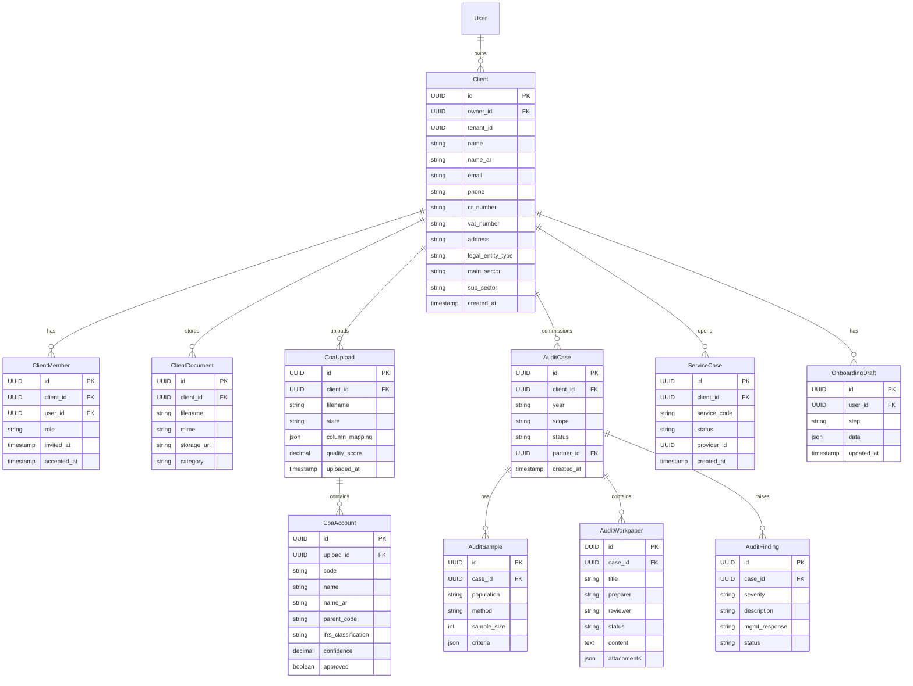

---

## 3. Sprint 1-3 — COA Pipeline / خط أنابيب دليل الحسابات

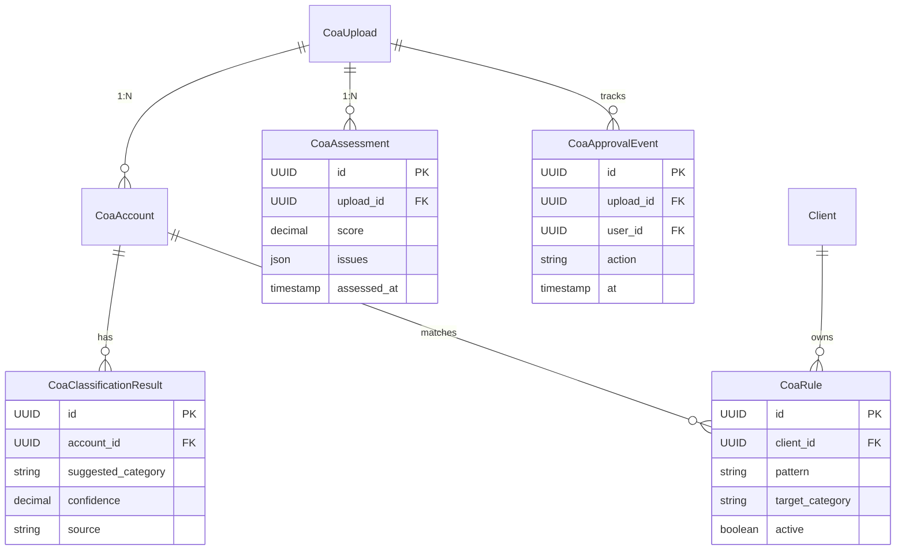

---

## 4. Sprint 4 TB / Sprint 5 Analysis — Trial Balance & Reports
## ميزان المراجعة والتحليل

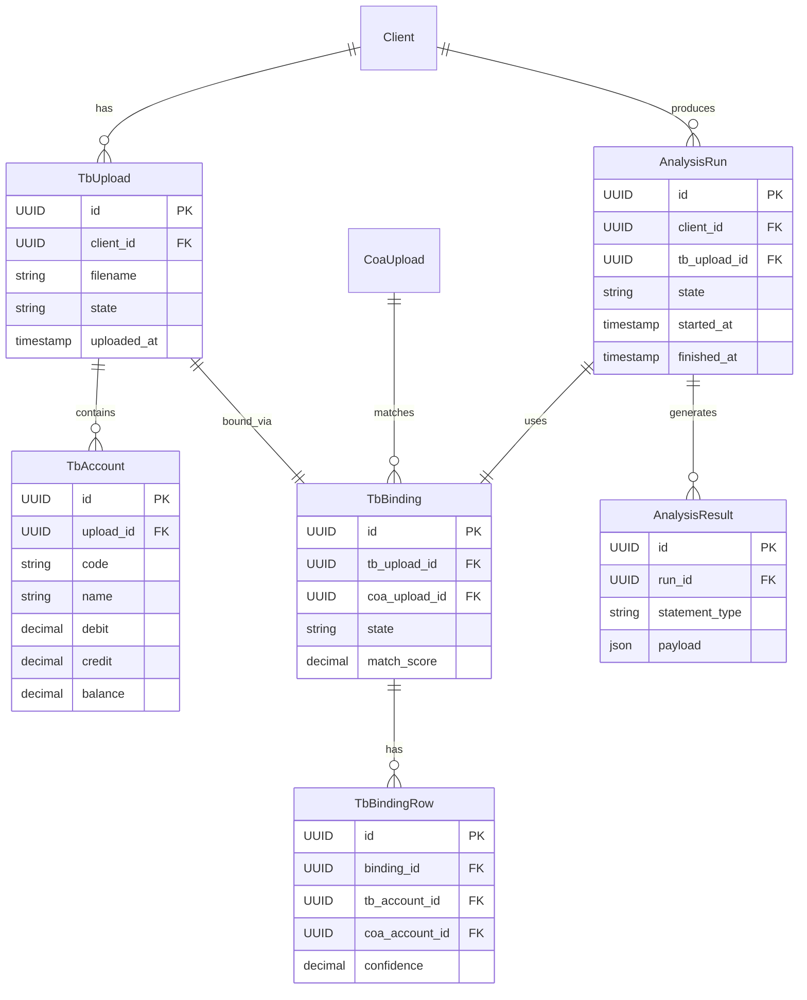

---

## 5. Sprint 4 Knowledge — Concept Graph / خريطة المفاهيم

```mermaid
erDiagram
    Concept ||--o{ ConceptAlias : has
    Concept ||--o{ Rule : referenced_by
    Concept ||--o{ ConceptRelation : from
    Concept ||--o{ ConceptRelation : to

    Concept {
        UUID id PK
        string code UK
        string name
        string name_ar
        string category
        json metadata
    }
    ConceptAlias {
        UUID id PK
        UUID concept_id FK
        string alias
        string source_system
        boolean approved
    }
    ConceptRelation {
        UUID id PK
        UUID from_id FK
        UUID to_id FK
        string relation_type
    }

    Rule ||--o{ RuleCandidate : drafted_as
    Rule {
        UUID id PK
        string name
        text condition
        text action
        boolean active
        UUID promoted_from FK
    }
    RuleCandidate {
        UUID id PK
        UUID submitter_id FK
        text condition
        text action
        string status
        timestamp submitted_at
    }

    SourceSystem {
        UUID id PK
        string name
        string version
        json config
    }
```

---

## 6. Sprint 6 — Reference Registry / سجل المراجع

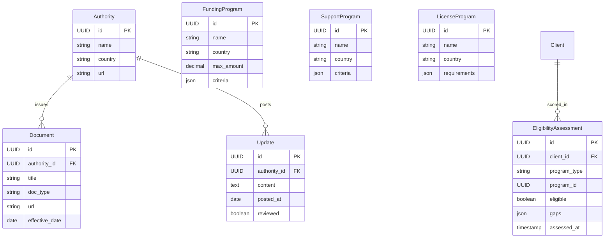

---

## 7. Phase 4-5 — Marketplace & Providers / السوق ومقدمو الخدمات

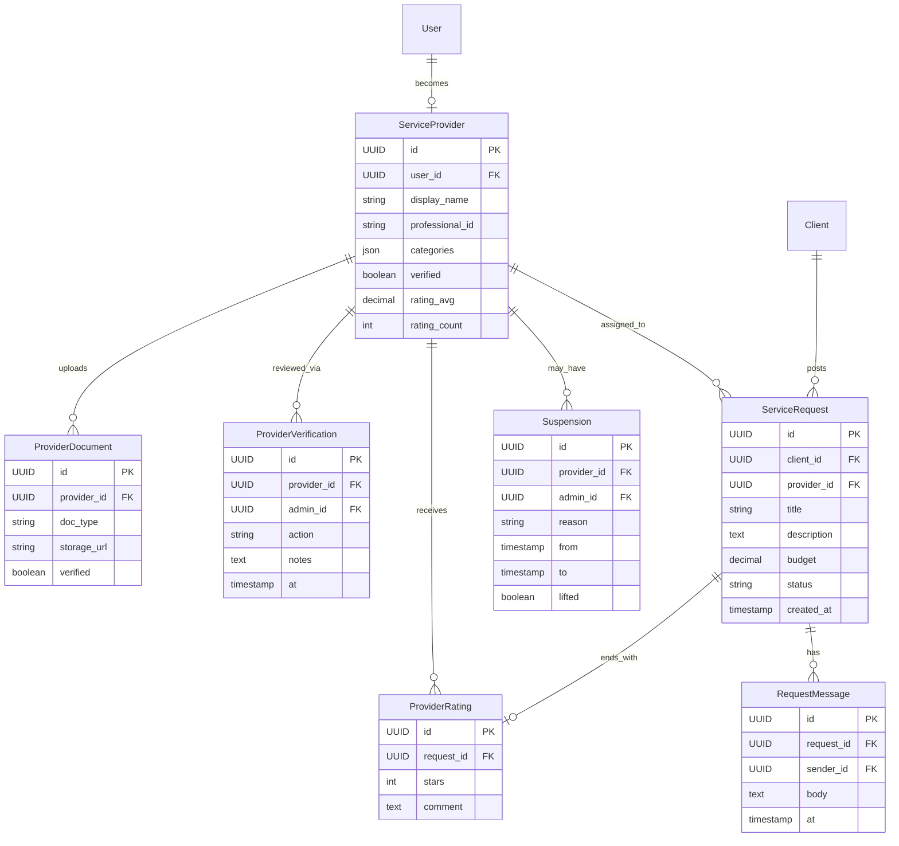

---

## 8. Phase 10 — Notifications V2 / الإشعارات

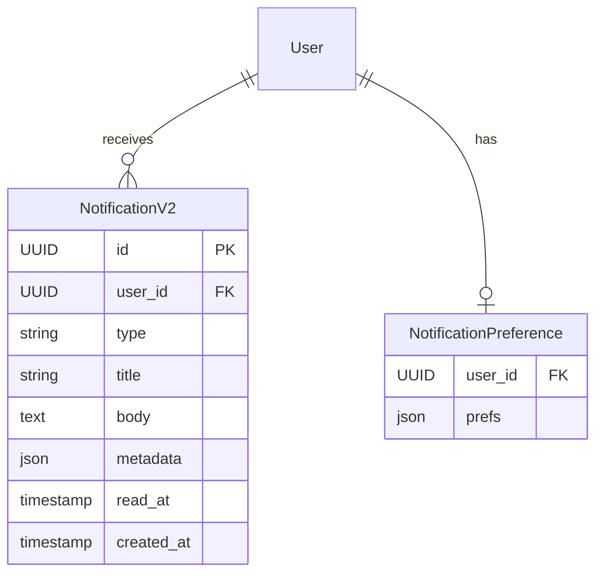

---

## 9. Cross-Cutting — Audit Log / سجل التدقيق العام

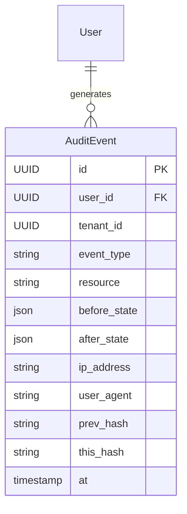

The hash chain (`prev_hash`, `this_hash`) makes the log tamper-evident.

---

## 10. ERP Pilot Schema (Sprint 5+) / مخطط ERP

The Pilot ERP module (`/api/v1/pilot/*`) implements full bookkeeping:

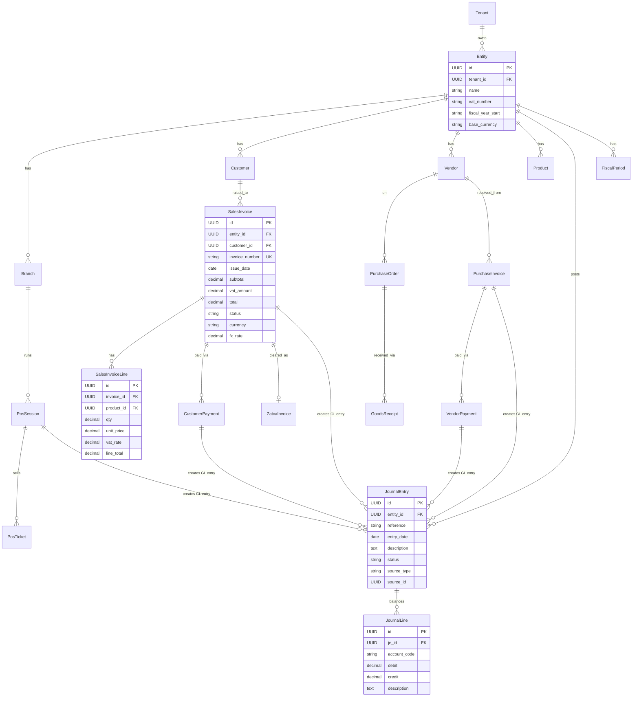

---

## 11. ZATCA / E-Invoicing Schema

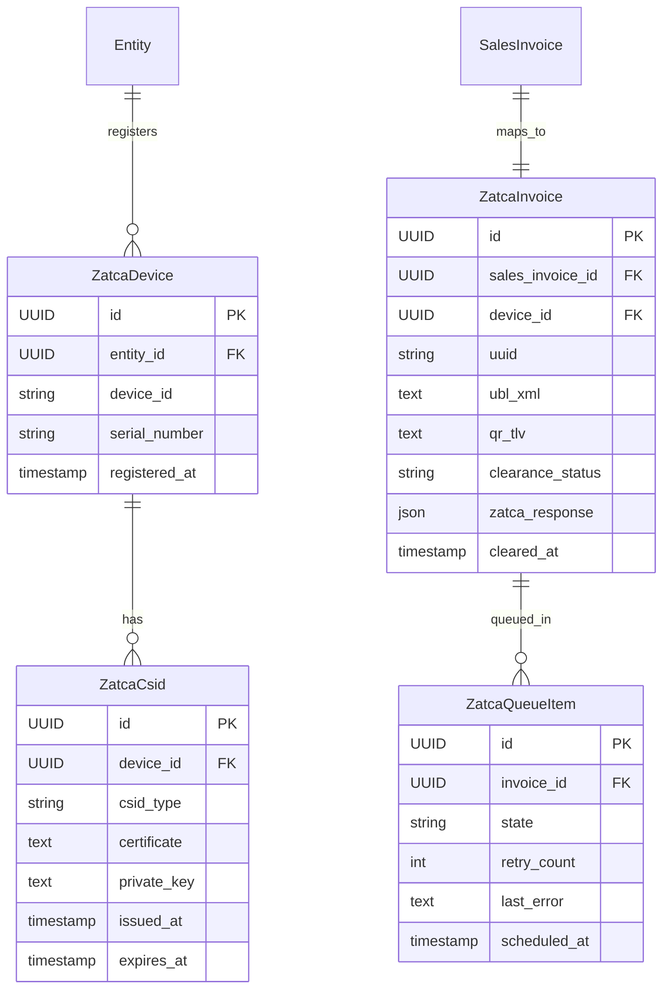

---

## 12. Knowledge Brain DB (Separate) / دماغ المعرفة (قاعدة منفصلة)

`KB_DATABASE_URL` may point to a separate database. Schema:

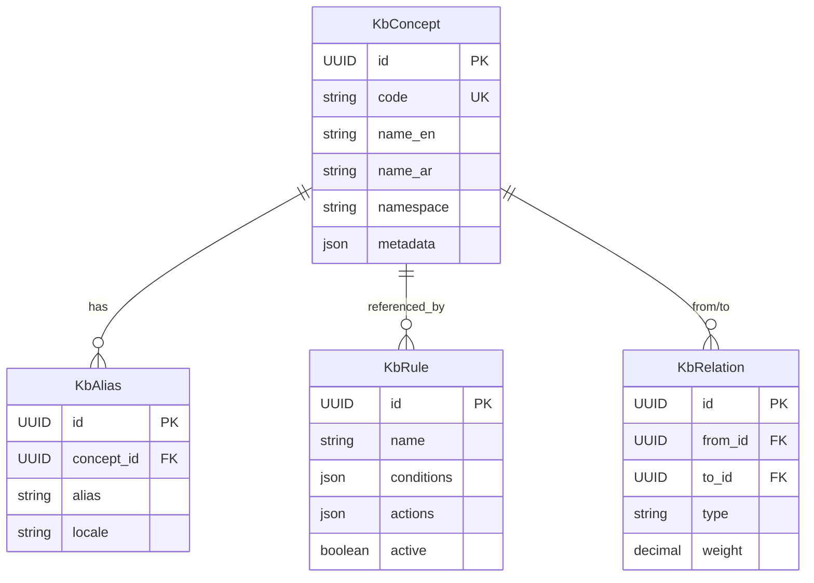

---

## 13. Total Tables Count / عدد الجداول الإجمالي

| Phase | Tables |
|-------|--------|
| Phase 1 (auth/plans/legal) | 18 |
| Phase 2 (clients/coa/audit) | 12 |
| Phase 3 (knowledge feedback) | 3 |
| Phase 4 (provider verification) | 4 |
| Phase 5 (marketplace) | 6 |
| Phase 6 (admin) | 2 |
| Phase 7 (tasks) | 3 |
| Phase 8 (subscription) | 4 |
| Phase 9 (account center) | 3 |
| Phase 10 (notifications V2) | 2 |
| Phase 11 (legal acceptance) | 3 |
| Sprint 1-3 (COA pipeline) | 5 |
| Sprint 4 (concept graph) | 8 |
| Sprint 4 TB | 4 |
| Sprint 5 (analysis) | 2 |
| Sprint 6 (reference registry) | 7 |
| Pilot ERP | 15 |
| ZATCA | 5 |
| Cross-cutting (audit log, etc.) | 3 |
| **Total** | **~109 tables** |

---

## 14. Schema Migration Strategy / استراتيجية الهجرة

**Current state:** Alembic configured (`alembic.ini` + `alembic/`) but **no migration files**. Schema is created via `Base.metadata.create_all()` at startup.

**Recommendation:**
1. Generate baseline migration: `alembic revision --autogenerate -m "baseline"`
2. Switch startup to run `alembic upgrade head` instead of `create_all`
3. Every model change → new migration
4. CI runs migrations on a fresh DB before tests

Full plan in `09_GAPS_AND_REWORK_PLAN.md` § "Database Migrations".

---

## 15. Indexing Recommendations / توصيات الفهرسة

Critical indexes (some already exist):

```sql
-- User
CREATE UNIQUE INDEX idx_user_email ON users(email);
CREATE INDEX idx_user_tenant ON users(tenant_id);

-- Sessions
CREATE INDEX idx_session_user ON user_sessions(user_id);
CREATE INDEX idx_session_token ON user_sessions(token_hash);

-- Audit
CREATE INDEX idx_audit_user_at ON audit_events(user_id, at DESC);
CREATE INDEX idx_audit_tenant_at ON audit_events(tenant_id, at DESC);

-- ERP
CREATE INDEX idx_je_entity_date ON journal_entries(entity_id, entry_date DESC);
CREATE UNIQUE INDEX idx_invoice_number ON sales_invoices(entity_id, invoice_number);

-- ZATCA
CREATE INDEX idx_zatca_queue_state ON zatca_queue_items(state, scheduled_at);
```

---

## 16. Multi-Tenancy Strategy / استراتيجية تعدد المستأجرين

**Current model:** Discriminator column `tenant_id` on shared tables. Filtered by `TenantContextMiddleware`.

**Trade-offs:**
- Pros: simple ops, single connection pool, easy backups
- Cons: noisy-neighbor risk, hard to do per-tenant retention/region

**Future considerations (Enterprise plan):**
- Per-tenant schema (PostgreSQL `SET search_path`)
- Per-tenant database (separate `DATABASE_URL` per tenant)
- Region pinning for data residency (Saudi data → Saudi region)

---

**Continue → `08_GLOBAL_BENCHMARKS.md`**
