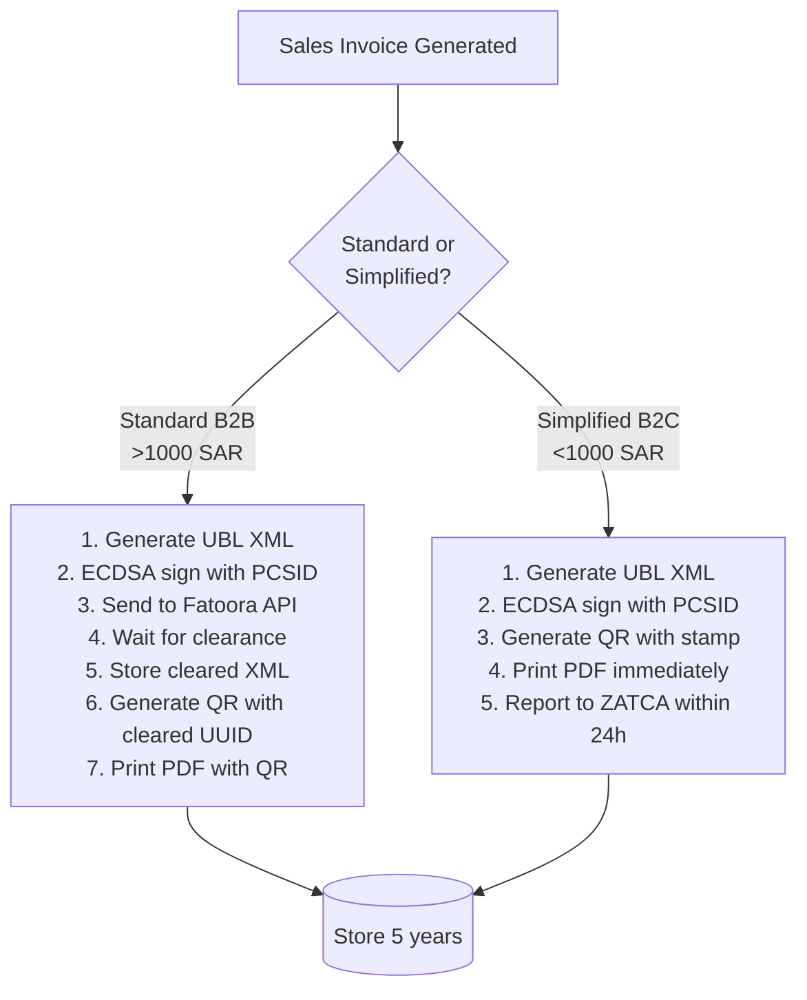
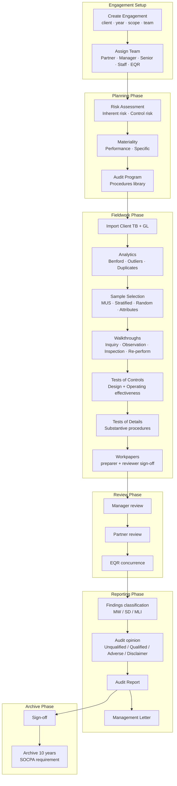
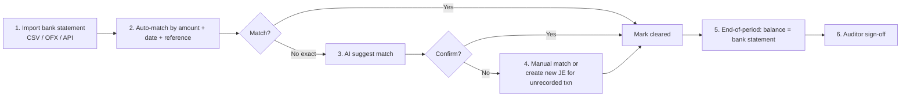

# 08 — Global Benchmarks Synthesis / تركيب المعايير العالمية

> Reference: continues from `07_DATA_MODEL_ER.md`. Next: `09_GAPS_AND_REWORK_PLAN.md`.
> **Goal:** Distill what world-class ERP, audit, and SaaS finance platforms do well, and translate it into actionable design rules for APEX.

---

## 1. Systems Researched / الأنظمة التي تم بحثها

### A. ERP Systems (4)
- **SAP S/4HANA** — Enterprise ERP, fiscal localization packages, "YCOA" global COA template
- **SAP Business One** — SMB ERP, modular pricing
- **Oracle NetSuite** — Cloud ERP, role-based dashboards
- **Odoo** — Open-source modular ERP (60+ apps)
- **Microsoft Dynamics 365 Business Central** — Cloud ERP for SMB

### B. Audit / Assurance Software (8)
- **CaseWare IDEA / CaseWare Cloud** — Adaptive workflow + analytics
- **AuditBoard / SOXHUB** — RCM + control testing
- **Wolters Kluwer TeamMate+** — End-to-end audit lifecycle
- **MindBridge AI Auditor** — 100% transaction analysis with ML
- **DataSnipper** — Excel-based audit automation
- **Workiva** — Financial reporting + SOX
- **Diligent HighBond** — Risk + audit + compliance
- **OneAudit** — (limited public docs)

### C. SaaS Accounting Platforms (7)
- **Xero** — SMB cloud accounting (NZ)
- **QuickBooks Online (Intuit)** — North America leader
- **Wave Accounting** — Free tier
- **Zoho Books** — MENA strong presence
- **FreshBooks** — Freelancer-focused
- **Sage Business Cloud** — UK/EU heritage
- **Pennylane** — EU modern

### D. MENA Compliance & Local Platforms
- **ZATCA (Saudi)** — Phase 1 + 2 e-invoicing, UBL 2.1, TLV QR, CSID/PCSID
- **UAE FTA** — 2026-2027 Peppol-based 5-corner
- **Egypt ETA** — REST API, e-receipt
- **GCC VAT** — Registration, reverse charge, intra-GCC
- **SOCPA** — Saudi audit standards (ISA-based + 10yr docs)
- **Qoyod** (Saudi) — 199 SAR/mo, ZATCA Phase 2 native
- **Mezan** (Saudi) — Locally optimized
- **Daftra** (Egypt → MENA) — Multi-country
- **Edara** (Saudi) — Cloud-native ERP
- **ERPNext** — Open-source with Saudi localization

---

## 2. Top 12 Patterns to Adopt / أهم 12 نمطًا للتبني

### Pattern 1: Country Localization Pack / حزمة التوطين القُطرية
**Source:** SAP S/4HANA Fiscal Localization Package
**EN:** When a tenant is created and country is detected, auto-install: pre-configured COA, tax codes, e-invoicing format, holiday calendar, language, currency, regulatory reports.
**AR:** عند إنشاء مستأجر جديد واكتشاف بلده، يتم تثبيت تلقائي لـ: دليل حسابات معد مسبقاً، رموز ضريبية، تنسيق فاتورة إلكترونية، تقويم العطل، اللغة، العملة، التقارير التنظيمية.

**APEX implementation:**
- New folder `app/localization/{country}/`
- Sub-files: `coa_default.py`, `tax_codes.py`, `holidays.json`, `regulatory_reports.py`
- Auto-applied during `POST /clients` based on `country` field
- Currently APEX has Saudi-specific logic; generalize for UAE, Egypt, Jordan.

### Pattern 2: Onboarding Wizard with Persistent Draft
**Source:** Xero (90-day onboarding specialist), QuickBooks (checklist), Odoo (configurator)
**EN:** Multi-step wizard with auto-save. User can leave and resume. Final step seeds demo data optionally.

**APEX status:** Already implemented in `/onboarding/wizard` with `POST /onboarding/draft`. **Improvement:** add visual progress + estimated time + skip-to-end option.

### Pattern 3: Role-Based Home Dashboard
**Source:** NetSuite dashboards, Sage Intelligent Cube
**EN:** Different homepage per role:
- Accountant → "Today's tasks", aged AR/AP, period status
- Auditor → Engagement portfolio, risk hotspots, sign-off queue
- Owner / CEO → KPIs, cash position, P&L vs budget, alerts
- Provider → Active engagements, marketplace requests, earnings

**APEX status:** Partial via `/today` and `/compliance/executive`. **Improvement:** detect role+plan and route to role-specific home (`/workspace/:id`).

### Pattern 4: Universal Journal (Single Source of Truth)
**Source:** SAP S/4HANA Universal Journal
**EN:** All financial transactions (invoices, payments, JEs, depreciation) flow through ONE journal table. Drill-down from any report to source document. No reconciliation between sub-ledgers and GL.

**APEX status:** `/operations/universal-journal` page exists; `JournalEntry` table with `source_type`, `source_id` is the foundation. **Improvement:** ensure EVERY transactional service uses the central JE service (no shortcut writes to GL).

### Pattern 5: AI-Embedded, Not AI-Bolted-On
**Source:** MindBridge (anomaly across all transactions), CaseWare (workflow-embedded), Intuit Assist, Xero JAX
**EN:** AI doesn't have a separate tab. It's a layer:
- Anomaly hint on JE list (red dot when score > threshold)
- Auto-suggested account category in invoice line
- Risk score on engagement card
- "Why this number?" tooltip with AI explanation
- Copilot side-panel always available

**APEX status:** Copilot panel exists; classification AI exists. **Improvement:** weave AI hints into list pages (currently exists only in Sprint 5 analysis & Audit AI Workflow).

### Pattern 6: Bilingual UI with Numerals Convention
**Source:** SAP Saudi localization, Daftra, Qoyod
**EN:**
- Arabic for labels and prose
- **Western numerals (0-9)** for all numeric data (matches modern ZATCA practice)
- Thousands separator: Arabic "٬" or Latin "," depending on locale
- Date: Gregorian primary, Hijri secondary toggle
- Tabular numerals for column alignment
- `<bdi>` tags around numeric tokens in Arabic prose

**APEX status:** RTL primary works; numerals already Western. **Improvement:** add Hijri toggle for tax dates; document locale-aware formatters.

### Pattern 7: Audit Engagement = State Machine
**Source:** CaseWare workflow phases, TeamMate+ engagement lifecycle
**EN:** Engagement progresses through Planning → Fieldwork → Review → Reporting → Archive. Each transition logged. Can't skip. Permissions vary by phase.

**APEX status:** Skeleton in `/audit/engagements`. **Improvement:** formalize as state machine with `pending_approval` per transition.

### Pattern 8: 100% Transaction Analytics + Sampling Coexist
**Source:** MindBridge (100% with risk score), CaseWare (sampled with stat methods)
**EN:** Run AI on 100% to flag anomalies. Then auditor confirms sample selection from anomalies + statistical/judgmental.

**APEX status:** Benford service exists. **Improvement:** combine flagged anomalies into sampling tool — "include all anomaly score > 0.7" + "stratified random over the rest".

### Pattern 9: 5-Step COA Onboarding (Most platforms)
**Source:** Xero, QBO, Sage
**EN:** Don't dump COA tree on user. Steps:
1. Pick industry → suggest COA template
2. Customize (add/remove)
3. Map opening balances (or skip if new entity)
4. Confirm fiscal year
5. Done — first transaction prompted

**APEX status:** COA flow has 5 screens but designed for upload not creation. **Improvement:** add "Start from template" path that doesn't require Excel upload.

### Pattern 10: Bank Feed = Game Changer
**Source:** Xero (defining feature), QBO, Pennylane
**EN:** Direct connection to bank → daily transaction sync → auto-categorize via rules + AI → reconcile with one click.

**APEX status:** `/settings/bank-feeds` placeholder. **Critical gap:** integrate with Saudi banks (SAMA Open Banking) and UAE (CBUAE).

### Pattern 11: Continuous Reporting / المراقبة المستمرة
**Source:** Workiva, Diligent HighBond
**EN:** Reports auto-refresh as transactions post. Materialized views. Real-time dashboards. Subscribe to a report → get alerted on threshold breach.

**APEX status:** Compute-on-demand. **Improvement:** introduce report subscriptions + WebSocket push.

### Pattern 12: Tier-Locked Features with Up-sell UX
**Source:** Xero (Starter/Standard/Premium), QBO (4 tiers)
**EN:** Users can SEE locked features (greyed/badge "Pro") to encourage upgrade. Clicking shows side-by-side comparison + upgrade button.

**APEX status:** Plan check exists but locked features are hidden. **Improvement:** show with `lock` icon + "Available in Pro" tooltip and inline upgrade CTA.

---

## 3. ZATCA Implementation Discipline / انضباط تنفيذ ZATCA

### What APEX must do (non-negotiable):

### Phase Coverage Required

| Wave | Threshold | Deadline | APEX must support by |
|------|-----------|----------|----------------------|
| 23 | Revenue > 750K SAR | March 31, 2026 | **DONE / NOW** |
| 24 | Revenue 375K-750K SAR | June 30, 2026 | **NOW** |
| Final | All VAT-registered | Future | Continue |

### TLV QR fields (9 required):
1. Seller name (UTF-8)
2. Seller VAT
3. Timestamp ISO 8601
4. Invoice total inc VAT
5. Total VAT
6. SHA256 hash of invoice XML
7. ECDSA signature
8. ECDSA public key
9. CA signature (simplified only)

Encoded base64, max 700 chars.

### CSID Lifecycle
- Compliance CSID (CCSID) issued for sandbox testing
- Submit sample invoices to Fatoora
- Production CSID (PCSID) issued upon validation
- Renew before expiry
- Each device needs its own PCSID

**APEX file locations:**
- `app/zatca/services/zatca_service.py` (main)
- `app/zatca/services/csid_manager.py` (cert lifecycle)
- `app/zatca/services/ubl_builder.py` (XML construction)
- `app/zatca/services/qr_tlv.py` (QR encoding)
- `app/zatca/services/fatoora_client.py` (HTTP to ZATCA)

---

## 4. Audit Module — Reference Architecture
## الوحدة المرجعية للمراجعة

### Required Roles (Engagement-level)
| Role | Authority | APEX field |
|------|-----------|------------|
| Engagement Partner | Final sign-off, opinion authority | `partner_id` |
| Manager | Workpaper review, fieldwork supervision | `manager_id` |
| Senior | First-line supervision, risk assessment | `senior_id` |
| Staff | Test execution, evidence | `staff_ids[]` |
| EQR | Concurrence on significant conclusions | `eqr_id` |

### Required Workpaper Sign-Offs
- Preparer (Staff/Senior) signs section
- Reviewer (Manager) reviews + signs
- Partner reviews critical sections
- EQR (if required) concurs on conclusions
- All sign-offs immutable + audit-trailed

### Findings Classification (per SAS-130 / ISA-265)
| Classification | EN | AR | Reportable to |
|----------------|----|----|---------------|
| Material Weakness | MW | ضعف جوهري | Audit committee + management |
| Significant Deficiency | SD | نقطة ضعف جوهرية | Audit committee |
| Management Letter Item | MLI | ملاحظة في خطاب الإدارة | Management |

### Standard Procedures Library
Every engagement loads procedures from a central library, indexed by:
- Cycle (Revenue, P2P, Treasury, Inventory, FA, Payroll, Close)
- Assertion (Existence, Completeness, Valuation, Rights, Presentation)
- Type (Test of control, Test of details, Substantive analytical)

**APEX implementation:** `app/audit/services/procedures_library.py` with 200+ pre-built procedures.

---

## 5. Bank Reconciliation — Best Practice Pattern
## مطابقة البنك — نمط أفضل ممارسة

**Saudi-specific:** SAMA Open Banking API for direct bank feeds (mada, AlInma, RajhI, SNB).

---

## 6. Pricing Strategy Recommendation / استراتيجية التسعير

### Comparison with Market

| Platform | Entry SAR/mo | Mid-tier SAR/mo | High-tier SAR/mo |
|----------|--------------|------------------|-------------------|
| Qoyod | 199 (single plan) | 199 | 199 |
| Daftra | 99 | 199 | 499 |
| Zoho Books | 50 | 150 | 300 |
| Xero | 80 | 250 | 600 |
| **APEX (current)** | **0** | **299 / 999** | **2,999 / Custom** |

**APEX positioning:**
- Free tier as land-and-expand (matches Wave model)
- Pro 299 SAR competes with Qoyod (199 SAR) but adds AI + audit prep
- Business 999 SAR targets growing SMB (Daftra at 499 SAR is ceiling for them)
- Expert 2,999 SAR is **uncontested** in Arabic — only SAP/Dynamics at higher tier

### Recommendation
**Adjust mid-tier:** Pro 199 SAR (match Qoyod) + Business 599 SAR + Expert 1,499 SAR.
**Upsell engine:** show locked features inline.
**Annual discount:** 20% off for annual prepayment.

---

## 7. UX Patterns Worth Stealing / أنماط UX جديرة بالنسخ

### From Xero
- **Empty states** with illustration + 3-step guide
- **Activity timeline** on every customer/vendor
- **Find & Recode** — bulk fix mistakes across periods

### From QuickBooks
- **Receipt forwarding email** — `receipts@yourcompany.apex.com` auto-creates expense
- **Mobile capture** with auto-OCR
- **Cashflow projection** widget on dashboard

### From Wave
- **Free tier with limits** — proven funnel for SMB
- **Invoicing-first** onboarding (don't force COA upfront)

### From Zoho
- **Workflow automation** designer (if X then Y)
- **Custom fields** per record type
- **Multi-language label switcher** (without page reload)

### From Pennylane
- **AI auto-categorization** of all imported transactions
- **Document hub** with smart filters
- **Real-time accountant collaboration** (built-in chat per record)

### From SAP S/4
- **Embedded Fiori-style** action cards
- **Universal search** Cmd-K
- **Document Flow** drill-down (sales order → delivery → invoice → payment)

### From AuditBoard
- **Risk-Control-Matrix** visualizer
- **Evidence request automation** (notify control owner, track response)
- **Issue tracker** with severity badges

### From DataSnipper
- **Excel-like keyboard shortcuts** in tables (TAB to next cell, F2 to edit)
- **Snipping** evidence from PDFs into workpapers

---

## 8. Anti-Patterns to Avoid / أنماط لا يجب تكرارها

### Don't:
- **Don't make user pick "module" before doing anything.** SAP B1 forces this; users get lost.
- **Don't show all reports upfront.** QBO's old reports library was overwhelming. Curate by role.
- **Don't break flow with modal confirmations.** Use inline undo (Xero pattern).
- **Don't separate "Setup" from "Use".** Mix setup tasks INTO daily flow ("oh, your invoice needs a tax code — set one up here").
- **Don't have feature parity gaps between web and mobile.** Many SAP/Dynamics mobile apps are read-only — frustrating.
- **Don't lock everything by plan.** Show locked + reason; let user explore.
- **Don't make exporting a paid feature.** Users will leave if they can't take their data.

---

## 9. Compliance Calendar Template / قالب التقويم الامتثالي

APEX should ship a built-in compliance calendar per country:

### Saudi Arabia
| Event | Frequency | Authority |
|-------|-----------|-----------|
| VAT return | Monthly (>40M revenue) or Quarterly | ZATCA |
| Zakat declaration | Annual (4 months after FY-end) | ZATCA |
| Income tax (foreign-owned) | Annual | ZATCA |
| Withholding tax | Monthly | ZATCA |
| GOSI contributions | Monthly | GOSI |
| Wage protection (WPS) | Monthly | MoL |
| ZATCA invoice clearance | Real-time | ZATCA |
| Saudization (Nitaqat) | Quarterly check | MoL |

### UAE
| Event | Frequency | Authority |
|-------|-----------|-----------|
| VAT return | Quarterly (default) | FTA |
| Corporate tax | Annual (9 months after FY-end) | FTA |
| Excise tax | Monthly | FTA |
| EOSB (gratuity) | Per termination | MoL |
| WPS payroll | Monthly | MoL |
| E-invoicing (2026-2027) | Real-time | FTA |

**APEX implementation:** `/compliance/tax-calendar` with country selector + auto-add tasks to user's calendar (iCal export).

---

## 10. Architecture Patterns from World-Class Systems

| Pattern | Source | Description |
|---------|--------|-------------|
| **Event-driven domain** | NetSuite | Every state change emits an event consumed by audit log + notifications + integrations |
| **CQRS** (read/write split) | SAP S/4 (HANA) | Read models materialized for fast dashboards |
| **Saga pattern** | Modern microservices | Long-running flows (period close, ZATCA submission) as compensating transactions |
| **Outbox pattern** | Stripe webhooks | Reliable async delivery to external systems |
| **Multi-tenant schema isolation** | Salesforce | Per-tenant `search_path` for true isolation (Enterprise option) |
| **Feature flags** | LaunchDarkly | Toggle features per tenant/plan without deploy |
| **Idempotency keys** | Stripe API | Safe retry on POST endpoints |
| **Rate limiting per tenant** | AWS | Prevent one tenant from starving others |

**APEX status:** Most patterns either absent or partial. Roadmap in `09_GAPS_AND_REWORK_PLAN.md`.

---

## 11. Differentiation Strategy / استراتيجية التمايز

### What Qoyod / Daftra / Zoho LACK that APEX should DOUBLE DOWN on:

1. **Audit module integrated** — none have a real audit engagement workflow. APEX has the foundation; finish it.
2. **AI Copilot in Arabic** — Zoho's Zia is English; Qoyod has none. APEX Copilot = differentiator.
3. **Saudi/UAE/Egypt unified compliance** — most platforms are single-country. APEX can be the only true GCC platform.
4. **Provider marketplace** — none have this. APEX can become the LinkedIn of Arabic accountants.
5. **Knowledge Brain / Domain expertise** — codified Arabic accounting + audit knowledge that improves over time.
6. **IFRS for SMEs Arabic** — proper Arabic terminology that even SAP gets wrong.
7. **Islamic finance templates** — Murabaha, Ijara, Sukuk schedules.

---

## 12. Key Metrics to Track / المقاييس المهمة

Per platform best practices:

### Activation
- % of new tenants who upload COA in first 7 days
- % who issue first invoice in first 14 days
- Time-to-first-value (TTFV)

### Engagement
- DAU/MAU per role
- Top 5 used screens per role
- Feature funnel: COA upload → TB → Analysis → FS

### Quality
- Error rate per endpoint
- ZATCA clearance success rate
- AI classification confidence distribution
- User-reported bugs

### Revenue
- MRR by plan
- Conversion rate Free → Pro
- Churn per cohort
- Expansion revenue (upgrade Pro → Business)

### Compliance
- ZATCA failures > 24h
- Period-close on-time rate
- Audit engagement on-budget rate

**APEX implementation:** `/admin/ai-console` (partial) — extend to be a PRODUCT analytics dashboard, not just AI ops.

---

## 13. Sources / المصادر

(See research files. Key URLs:)
- ZATCA — https://zatca.gov.sa/en/E-Invoicing/
- SOCPA — https://socpa.org.sa/
- SAP S/4HANA Localization — help.sap.com
- CaseWare — caseware.com
- AuditBoard — auditboard.com
- MindBridge — mindbridge.ai
- Xero — xero.com
- QuickBooks Online — quickbooks.intuit.com
- Daftra — daftra.com
- Qoyod — qoyod.com
- Mezan — mezan.sa

Full source list in research artifacts (preserved in `outputs/_research_raw/`).

---

**Continue → `09_GAPS_AND_REWORK_PLAN.md`**
