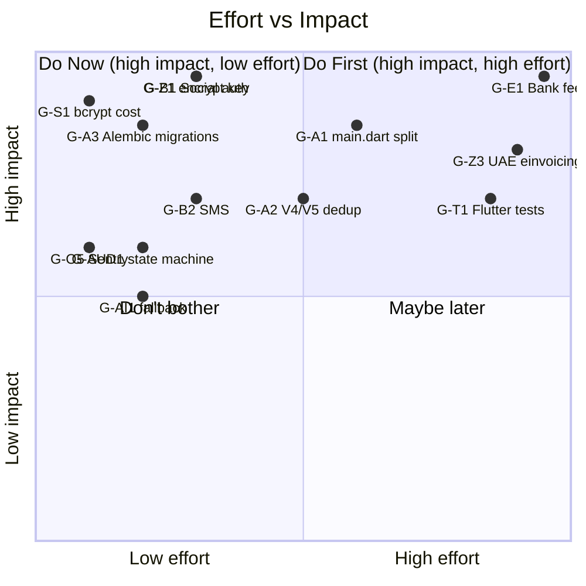

# 09 — Gaps & Rework Plan / الثغرات وخطة الإصلاح

> Reference: continues from `08_GLOBAL_BENCHMARKS.md`. Next: `10_CLAUDE_CODE_INSTRUCTIONS.md`.
> **Goal:** Concrete, prioritized list of bugs, redundancies, and missing pieces with file:line references and fix plan.

---

## 1. Severity Legend / مفتاح الخطورة

| Symbol | EN | AR |
|--------|----|----|
| 🔴 P0 | Blocker — fix this week | معطل — يصلح هذا الأسبوع |
| 🟠 P1 | Critical — fix this month | حرج — يصلح هذا الشهر |
| 🟡 P2 | Important — fix this quarter | مهم — يصلح هذا الربع |
| 🟢 P3 | Polish — when we have time | تجميل — عند توفر الوقت |

---

## 2. Architectural Gaps / ثغرات معمارية

### ✅ G-A1. ~~Monolithic `lib/main.dart` (3500 lines)~~ — DONE 2026-04-30
- **Files:** `apex_finance/lib/main.dart` (actual path; original audit said `lib/main.dart`)
- **Issue:** 60+ tightly-coupled classes including `LoginScreen`, `RegScreen`, `MainNav`, dialog forms.
- **Impact:** Hot reload slow, code review hard, hard to test individual screens.
- **Resolution (Sprint 7, branch `sprint-7/g-a1-split-main-dart`, 5 commits):**
  1. ✅ Extract auth screens → `apex_finance/lib/screens/auth/{login_screen,register_screen}.dart`
  2. ✅ Extract `MainNav` + `_AppBarPill` + `ApexSearch` → `apex_finance/lib/widgets/{main_nav,apex_search}.dart`
  3. ✅ Extract form dialogs → `apex_finance/lib/widgets/forms/{knowledge_feedback_screen,new_service_request_screen}.dart`
  4. ✅ Extract all 7 tabs → `apex_finance/lib/screens/tabs/{dash,clients,analysis,market,provider,account,admin}_tab.dart`
  5. ✅ Extract helpers → `widgets/{form_helpers,apex_widgets}.dart`
  6. ✅ Move `UpgradePlanScreen` → `apex_finance/lib/screens/upgrade_plan_screen.dart`
- **Result:** `main.dart` 2146 → **21 lines** (target was < 200). 0 errors in `flutter analyze`.
- **Notable decision:** Renamed extracted helpers to `compactCard`/`compactKv`/`compactBadge`
  to avoid collision with `theme.dart`'s `apexCard`/`apexBadge` which use different padding /
  color treatments. Future cleanup task: unify into a single design system.
- **Actual Effort:** 1 session

### ⚠️ G-A2. ~~Two router systems coexisting~~ — PARTIAL: V4 routes removed (2026-04-30)
- **Files (deleted):** `apex_finance/lib/core/v4/v4_routes.dart`
- **Files (kept w/ `@deprecated` header):** the other 11 files in `apex_finance/lib/core/v4/`
- **Resolution (Sprint 7, branch `sprint-7/g-a2-deprecate-v4-router`):**
  1. ✅ Deleted `v4_routes.dart` — was the source of `/app` route conflict with V5.
  2. ✅ Removed `import 'v4/v4_routes.dart'` and `...v4Routes()` spread from `core/router.dart`.
  3. ✅ Added `@deprecated` header to all 11 remaining V4 files.
  4. ❌ Could NOT delete `v4_groups.dart`/`v4_groups_data.dart` as originally planned —
     they are imported by `apex_launchpad.dart`, `apex_sub_module_shell.dart`,
     `apex_command_palette.dart`, `apex_tab_bar.dart`, all of which are themselves
     in `core/v4/` with 0 external users. Deleting `v4_groups` while keeping those
     widgets would break analyzer.
- **Status:** Route conflict resolved; V5 now owns `/app` exclusively. V4 widgets
  remain as a self-contained, deprecated dead zone except `apex_screen_host.dart`
  which is still imported by 6 screens (see G-A2.1).
- **Audit finding (correction to original assumption):**
  Original plan said "no V4-only features expected." Actual audit found **6
  V4-only screens with no V5 equivalents** — see G-A2.1.

### 🟠 G-A2.1. Migrate 6 V4-dependent screens to V5
- **Files:**
  - `apex_finance/lib/screens/v4_ai/ai_guardrails_screen.dart`
  - `apex_finance/lib/screens/v4_compliance/zatca_csid_screen.dart`
  - `apex_finance/lib/screens/v4_compliance/zatca_queue_screen.dart`
  - `apex_finance/lib/screens/v4_erp/bank_feeds_screen.dart`
  - `apex_finance/lib/screens/v4_erp/bank_reconciliation_screen.dart`
  - `apex_finance/lib/screens/v4_erp/sales_customers_screen.dart`
- **Issue:** All 6 import `apex_screen_host.dart` from the deprecated `core/v4/`
  directory. They have no V5 equivalent and are not registered in the router after
  G-A2 removed `v4_routes.dart`, so they are currently unreachable from any URL.
- **Fix plan:**
  1. Replace `ApexScreenHost(...)` with `Scaffold` or V5 ServiceShell wrapper
  2. Add proper V5 routes (e.g., `/app/erp/finance/bank-rec`)
  3. Once all 6 migrated, delete `apex_finance/lib/core/v4/` entirely
- **Estimate:** 4-6 hours
- **Sprint:** 8

### ⚠️ G-A3. ~~Alembic configured but no migration files~~ — PARTIAL: drift detected (2026-04-30)
- **Files:** `alembic/`, `app/main.py`, `app/phase1/models/platform_models.py`
- **Discovery (Sprint 7):** Blueprint was wrong on two counts:
  1. **7 migrations exist** (chain: `2b92f970a8f9` → `1a8f7d2b4e5c` → `c7f1a9b02e10` →
     `d3a1e9b4f201` → `e4c7d9f8a123` → `f8a3c61b9d72` → `g1e2b4c9f3d8`).
  2. **They cover only 25 of 108 tables** (15 `knowledge_*` from a separate Base
     + 10 phase1 tables: `activity_log`, `ap_invoices`, `ap_line_items`, `hr_*`,
     `sync_operations`, `tenant_branding`, `zatca_submissions`).
- **Drift detection (2026-04-30):** 2097-line unified diff between alembic-result
  schema and ORM-result schema. Saved to `APEX_BLUEPRINT/_archive/2026-04-30_alembic_drift.txt`.
- **Why production still works:** `_run_startup()` in `app/main.py` calls
  `Base.metadata.create_all()` (multiple call sites incl. lines 1611, 1744, 2261)
  which creates all 108 tables. Replacing this with `alembic upgrade head` would
  deploy production with **83 missing tables** (`clients`, `analysis_*`, `audit_*`,
  `archive_*`, `bank_feed_*`, etc.).
- **Status:** Lifespan integration **POSTPONED**. `create_all` remains canonical.
  G-A3.1 created to address full alembic catch-up.
- **Sprint:** 7 (current — partial); continued in 8 (G-A3.1)

### 🟠 G-A3.1. Alembic catch-up migration — production-safe
- **Issue:** Alembic covers only 25/108 tables. Cannot replace `create_all` until
  alembic schema matches ORM schema.
- **Risk:** HIGH — touches production schema management.
- **Plan (multi-step, requires DBA review):**
  1. **Audit** existing 7 migrations to understand original intent (KB-only baseline?
     incremental HR/AP/infra additions?).
  2. **Decision A — squash + restamp:** consolidate the 7 into a single comprehensive
     baseline + `alembic stamp head` on production.
     OR
     **Decision B — incremental catch-up:** generate migration #8 covering all 83
     missing tables, run on populated production DB only after careful review of
     `op.create_table(... if_not_exists=True)` semantics.
  3. **Test exhaustively** on production-clone DB before cutover.
  4. **Cutover:** maintenance window → stamp head → switch lifespan to `alembic upgrade head`.
- **Pre-requisite:** DBA review + production DB snapshot + rollback plan
- **Estimate:** 1-2 weeks (NOT a Sprint 7 task)
- **Sprint:** 8 (with allocated DBA review time)

### 🟠 G-A4. Endpoint naming inconsistency
- **Files:** All `app/phaseN/routes/*.py`
- **Issue:** Mix of `/api/v1/...`, `/...`, no version prefix on most.
- **Fix plan:** Adopt `/api/v1/{module}/{resource}` for all NEW endpoints. Migrate old paths via aliases (see `05_API_ENDPOINTS_MASTER.md` § 4).
- **Estimate:** 1 week (gradual rollout)

### 🟠 G-A5. Tenant isolation not enforced everywhere
- **Files:** `app/core/middleware/tenant_context.py`, repositories
- **Issue:** Some queries don't filter by `tenant_id`. Risk of cross-tenant leak.
- **Fix plan:**
  1. Audit every repository function → verify `tenant_id` filter
  2. Add SQLAlchemy event listener that blocks queries without tenant filter for tenant-scoped tables
  3. Add per-tenant Postgres RLS policies for defense-in-depth
- **Estimate:** 1 week

### 🟡 G-A6. Phase 9 endpoints shadow Phase 1
- **Issue:** `/forgot-password`, `/reset-password`, `/profile` exist in both.
- **Fix plan:** Make Phase 9 routes 302 redirect to Phase 1 canonical paths.
- **Estimate:** 4 hours

### 🟡 G-A7. No idempotency keys on POST endpoints
- **Issue:** Retrying a payment/invoice POST may create duplicates.
- **Fix plan:** Add `Idempotency-Key` header support (Stripe-style) for `/api/v1/pilot/sales-invoices`, `/customer-payments`, `/zatca/invoice/build`.
- **Estimate:** 2 days

### 🟡 G-A8. No rate limiting per tenant
- **Issue:** Free tier user can exhaust API by retrying.
- **Fix plan:** Add `slowapi` middleware with per-user token bucket. Higher limits for paid tiers.
- **Estimate:** 2 days

---

## 3. Frontend Gaps / ثغرات الواجهة

### 🔴 G-F1. No localization (l10n) system
- **Files:** all `.dart` files
- **Issue:** Arabic strings hardcoded. Can't switch to EN without code changes.
- **Fix plan:**
  1. Add `flutter_localizations` + `intl`
  2. Create `lib/l10n/app_ar.arb` and `lib/l10n/app_en.arb`
  3. Generate `AppLocalizations` class
  4. Replace hardcoded strings with `AppLocalizations.of(context).keyName`
- **Estimate:** 2 weeks (gradual)

### 🟠 G-F2. Missing TODO implementations
| File | Line | TODO |
|------|------|------|
| `lib/screens/coa_v2/coa_journey_screen.dart` | 66 | Connect to backend via CoaApiService |
| `lib/screens/operations/receipt_capture_screen.dart` | 60 | Real OCR call to `/api/v1/ocr/extract` |
| `lib/screens/operations/receipt_capture_screen.dart` | 83 | POST `/api/v1/pilot/expenses` or vendor bill creation |
| `lib/core/v5/apex_v5_service_shell.dart` | 212 | Wire unread count to real provider |

- **Fix plan:** Implement each in turn. Each is ~half-day work.
- **Estimate:** 2 days total

### 🟠 G-F3. No feature flag system
- **Issue:** Beta features hardcoded behind plan checks; can't disable per tenant.
- **Fix plan:** Add `FeatureFlagProvider` reading from `/api/v1/feature-flags?tenant_id=...`. Backend returns flags per tenant. Wrap beta widgets in `<FeatureFlag flag="ai-period-close">`.
- **Estimate:** 1 week

### 🟠 G-F4. Bottom nav not role-aware
- **Files:** `lib/apex_bottom_nav.dart`
- **Issue:** Same 5 tabs for all roles. Provider sees "Sales" tab even though irrelevant.
- **Fix plan:** Read `S.roles`, render different tabs per role.
- **Estimate:** 1 day

### 🟡 G-F5. No skeleton loaders
- **Issue:** Tables show empty until data loads → looks broken.
- **Fix plan:** Add `shimmer` package; create `LoadingTable`, `LoadingCard` widgets.
- **Estimate:** 2 days

### 🟡 G-F6. No empty states
- **Issue:** Empty lists just show "no data". Should have illustration + CTA.
- **Fix plan:** Create `EmptyState` widget with illustration + action button. Apply to all lists.
- **Estimate:** 3 days

### 🟡 G-F7. Demo routes exposed in production
- **Files:** `lib/core/router.dart` (sprint35-44 routes, demos)
- **Issue:** `/sprint37-experience` etc. accessible in prod.
- **Fix plan:** Wrap demo routes in `if (kDebugMode)` block or move to `/demo/*` namespace with role gate.
- **Estimate:** 4 hours

### 🟡 G-F8. ApiService has 150+ methods (long file)
- **Files:** `lib/api_service.dart`
- **Issue:** 1000+ lines, hard to find methods.
- **Fix plan:** Split into `lib/api/auth_api.dart`, `lib/api/coa_api.dart`, `lib/api/pilot_api.dart`, etc.
- **Estimate:** 2 days

---

## 4. Backend Gaps / ثغرات الخلفية

### ✅ G-B1. ~~Social auth tokens NOT validated~~ — RESOLVED (Wave 1) + docs (2026-04-30)
- **Discovery (Sprint 7):** Validation was already implemented in Wave 1 PR#2/PR#3.
  Blueprint was wrong (6th time in this sprint). Original "Files:" pointer was
  also wrong — `app/phase1/services/social_auth_service.py` does not exist; the
  real code lives in `app/core/social_auth_verify.py` and the routes in
  `app/phase1/routes/social_auth_routes.py`.
- **Existing implementation:**
  - `app/core/social_auth_verify.py` — `verify_google_id_token()` and
    `verify_apple_identity_token()`, returning a `VerifiedIdentity` dataclass.
  - `app/phase1/routes/social_auth_routes.py:72,120` — `_verify_google_id_token`
    + `_verify_apple_identity_token`, called from the login/register routes
    (lines 260, 381).
  - **Google:** `google-auth.verify_oauth2_token()` → checks signature against
    Google's JWKs + audience match against `GOOGLE_OAUTH_CLIENT_ID` + issuer.
  - **Apple:** `PyJWT` + `PyJWKClient("https://appleid.apple.com/auth/keys")`
    → fetches Apple's public JWKS, verifies signature, checks audience against
    `APPLE_CLIENT_ID` + issuer `https://appleid.apple.com`.
  - **Libraries (in `requirements.txt`):** `google-auth>=2.25.0`,
    `pyjwt[crypto]>=2.8.0`, `cryptography>=46.0.7`.
  - `app/core/env_validator.py:134-141` — emits a *warning* (not an error) on
    missing keys — social sign-in is opt-in.
  - **26 tests** in `tests/test_social_auth.py` + `tests/test_social_auth_verify.py`
    (currently passing).
- **Sprint 7 contribution (docs-only fix):**
  - Added `GOOGLE_OAUTH_CLIENT_ID` + `APPLE_CLIENT_ID` to `.env.example` with
    provider links + the dev-bypass-vs-production behaviour explained.
  - **Fixed `CLAUDE.md` line 74** which still claimed the tokens were stubbed.
    This was the highest-risk item — any developer or AI agent reading that
    file would have planned an "implementation" of code that already exists
    and would likely have broken the working integration in the process.
- **Status:** DONE
- **Sprint:** 7 (closure + docs); original work in Wave 1

### 🔴 G-B2. SMS verification is stub
- **Files:** `app/phase1/services/mobile_auth_service.py`
- **Issue:** Always returns success. No actual SMS sent.
- **Fix plan:** Integrate Twilio (international) + Unifonic (Saudi). Real OTP store with TTL.
- **Estimate:** 2 days

### 🔴 G-B3. No real OCR service
- **Files:** Receipt capture flow
- **Issue:** OCR endpoint missing.
- **Fix plan:** Integrate AWS Textract OR Google Vision OR open-source TrOCR. Endpoint `POST /api/v1/ocr/extract`.
- **Estimate:** 1 week

### 🟠 G-B4. Stripe webhook signature not verified everywhere
- **Files:** `app/phase8/routes/subscription_routes.py`
- **Issue:** Some webhook handlers accept payload without verifying `Stripe-Signature`.
- **Fix plan:** Use `stripe.Webhook.construct_event()` to verify signature.
- **Estimate:** 4 hours

### 🟠 G-B5. ZATCA queue retry without backoff
- **Files:** `app/zatca/services/queue_processor.py`
- **Issue:** Failed items retry every cycle, no exponential backoff.
- **Fix plan:** Track `retry_count`, schedule next attempt at `now + 2^retry_count` minutes, max 1 day.
- **Estimate:** 1 day

### 🟠 G-B6. Audit log not append-only
- **Files:** `app/core/audit_log.py`
- **Issue:** No DB constraint preventing UPDATE/DELETE on `audit_events`.
- **Fix plan:** PostgreSQL trigger raising exception on UPDATE/DELETE. Move to a separate "audit" schema with restricted permissions.
- **Estimate:** 1 day

### 🟠 G-B7. No request ID propagation
- **Issue:** Hard to trace a request through logs.
- **Fix plan:** Generate `X-Request-Id` per request, propagate in logs and downstream calls.
- **Estimate:** 4 hours

### 🟡 G-B8. Pilot endpoints inconsistent (`/api/v1/pilot/*` vs `/pilot/*`)
- **Files:** `app/pilot/routes/*.py`
- **Issue:** Some legacy without `/api/v1` prefix.
- **Fix plan:** Standardize to `/api/v1/pilot/*`. Add legacy aliases.
- **Estimate:** 1 day

### 🟡 G-B9. Knowledge Brain DB sometimes uses main DB fallback
- **Files:** `app/sprint4/db.py`
- **Issue:** If `KB_DATABASE_URL` missing, falls back to main DB silently.
- **Fix plan:** Fail-fast in production if missing.
- **Estimate:** 2 hours

### 🟡 G-B10. CORS too permissive in dev
- **Files:** `app/main.py`
- **Issue:** `CORS_ORIGINS=*` default in dev. Production env override exists but easy to misconfigure.
- **Fix plan:** Validate `CORS_ORIGINS != "*"` in production startup.
- **Estimate:** 30 minutes

---

## 5. Compliance & Security Gaps

### ✅ G-S1. ~~Password hash uses default cost~~ — DONE 2026-04-30
- **Files:** `app/phase1/services/auth_service.py` (the actual location;
  blueprint originally pointed to a `password_service.py` that doesn't exist),
  `app/core/totp_service.py`, `tests/test_password_rotation.py`.
- **Audit finding:** bcrypt 5.0.0 already defaults to 12 rounds since lib v4.0,
  so `bcrypt.gensalt()` (no args) was producing 12-round hashes — but only
  *implicitly*, leaving us exposed to any future library default drift, and
  doing nothing about pre-existing hashes from older bcrypt versions (≤3.x
  defaulted to 10).
- **Resolution (Sprint 7, branch `sprint-7/g-s1-bcrypt-12`):**
  1. ✅ Added explicit `BCRYPT_ROUNDS = 12` constant in `auth_service.py`.
  2. ✅ `hash_password()` now calls `bcrypt.gensalt(rounds=BCRYPT_ROUNDS)` explicitly.
  3. ✅ Added `password_needs_rehash(password_hash)` helper — returns True for
     SHA-256 fallback hashes and for bcrypt hashes with cost < 12.
  4. ✅ Wired opportunistic rehash into `AuthService.login()` — successful
     verify → if `password_needs_rehash()` then `user.password_hash = hash_password(password)`.
  5. ✅ TOTP recovery codes (`app/core/totp_service.py:_hash_recovery_codes`)
     also use `BCRYPT_ROUNDS` for consistency.
  6. ✅ 7 new tests in `tests/test_password_rotation.py` (constant value,
     new-hash cost, verify against legacy 10/11/12-round hashes,
     `password_needs_rehash` for each scenario incl. SHA-256 + garbage input).
  7. ✅ All 21 existing auth tests still pass (no regression).
- **Estimate (actual):** 1 session

### 🟠 G-S2. JWT secret not rotated
- **Issue:** Single `JWT_SECRET` env var. No rotation.
- **Fix plan:** Add `JWT_SECRETS` (list). Sign with first, accept all for verify.
- **Estimate:** 2 days

### 🟠 G-S3. No 2FA enforcement option
- **Issue:** 2FA optional everywhere.
- **Fix plan:** Add tenant setting `require_2fa_for_admin`. Block login if not enabled.
- **Estimate:** 1 day

### 🟠 G-S4. PII not encrypted at rest
- **Issue:** Names, emails, phones stored plaintext.
- **Fix plan:** Add `EncryptedString` SQLAlchemy type using AES-256 with key from `PII_ENCRYPTION_KEY` env. Apply to `email`, `phone`, `national_id`, etc.
- **Estimate:** 1 week

### 🟠 G-S5. No data retention policy
- **Issue:** Closed accounts not purged.
- **Fix plan:** Background job after 30-day grace: anonymize PII, keep audit log entries for 10 years (SOCPA).
- **Estimate:** 3 days

### 🟡 G-S6. SSL/TLS not enforced at API
- **Issue:** Render handles TLS termination but app doesn't redirect HTTP→HTTPS.
- **Fix plan:** Add `HTTPSRedirectMiddleware` with `if production`.
- **Estimate:** 2 hours

### 🟡 G-S7. No DDoS protection
- **Issue:** Free Render tier has no WAF.
- **Fix plan:** Cloudflare in front + rate limiting middleware.
- **Estimate:** 1 day

---

## 6. ERP Functional Gaps / ثغرات وظيفية في ERP

### 🟠 G-E1. No Bank Feed Integration
- **Issue:** `/settings/bank-feeds` is placeholder.
- **Fix plan:** Integrate SAMA Open Banking (Saudi) and CBUAE Open Finance (UAE). Daily sync. Auto-categorize via rules + AI.
- **Estimate:** 1 month

### 🟠 G-E2. No FX revaluation at period end
- **Issue:** Multi-currency balances don't auto-revalue.
- **Fix plan:** Period-close task: get spot rate from API, revalue all FC accounts, post FX gain/loss JE.
- **Estimate:** 1 week

### 🟠 G-E3. Recurring invoices not auto-issued
- **Issue:** `/sales/recurring` shows schedule but no scheduler runs them.
- **Fix plan:** APScheduler job daily 8AM: find due, create + issue invoice, optionally email.
- **Estimate:** 3 days

### 🟠 G-E4. No 3-way match for purchases
- **Issue:** PO ↔ Goods Receipt ↔ Bill not matched.
- **Fix plan:** On bill posting, verify PO + receipt match (qty, price); flag variances.
- **Estimate:** 1 week

### 🟡 G-E5. Inventory valuation methods limited
- **Issue:** Only weighted average.
- **Fix plan:** Add FIFO + LIFO (where allowed) + specific identification.
- **Estimate:** 1 week

### 🟡 G-E6. No multi-warehouse transfers
- **Issue:** Single warehouse assumed.
- **Fix plan:** Add `Warehouse` model, `StockTransfer` document, in-transit account.
- **Estimate:** 1 week

### 🟡 G-E7. Fixed Assets — no disposal posting
- **Issue:** Disposal doesn't auto-create JE for gain/loss.
- **Fix plan:** On disposal: dr cash/AR, cr asset cost, dr accumulated dep, dr/cr gain/loss.
- **Estimate:** 2 days

### 🟡 G-E8. No multi-entity consolidation
- **Issue:** UI screen exists but no real consolidation algo.
- **Fix plan:** Inter-company elimination, currency translation, NCI calculation.
- **Estimate:** 2 weeks

---

## 7. Audit Module Gaps / ثغرات وحدة المراجعة

### 🟠 G-AUD1. Engagement state machine not enforced
- **Issue:** Status transitions unrestricted.
- **Fix plan:** Define enum + transitions; enforce in service layer.
- **Estimate:** 2 days

### 🟠 G-AUD2. No procedures library
- **Issue:** Each engagement starts blank.
- **Fix plan:** Seed 200+ standard procedures (revenue, P2P, treasury cycles × assertions × test types). User picks → adds to engagement.
- **Estimate:** 2 weeks (mostly content)

### 🟠 G-AUD3. Sampling tool only judgmental
- **Issue:** No statistical sampling (MUS, stratified, attribute).
- **Fix plan:** Implement MUS algorithm + stratification + attribute sampling per AICPA AAG.
- **Estimate:** 1 week

### 🟠 G-AUD4. No EQR workflow
- **Issue:** Partner sign-off only; no engagement quality reviewer.
- **Fix plan:** Add `eqr_id` field + EQR sign-off step before final report.
- **Estimate:** 2 days

### 🟡 G-AUD5. Workpaper templates missing
- **Issue:** Free-form text only.
- **Fix plan:** Build template library (e.g., "Cash count workpaper", "Inventory observation"). User picks template → auto-fills sections.
- **Estimate:** 1 week

### 🟡 G-AUD6. No IPE (Information Produced by Entity) management
- **Issue:** No mechanism to test client-produced reports.
- **Fix plan:** Add `IpeReport` model with completeness/accuracy testing.
- **Estimate:** 1 week

### 🟡 G-AUD7. Findings classification not standardized
- **Issue:** Severity is free text.
- **Fix plan:** Enum: `material_weakness`, `significant_deficiency`, `mgmt_letter_item`. Auto-route to Audit Committee vs Management.
- **Estimate:** 1 day

### 🟡 G-AUD8. No engagement archive workflow
- **Issue:** SOCPA requires 10-year retention.
- **Fix plan:** Lock engagement on archive, freeze all docs, schedule auto-purge after 10 years (with override).
- **Estimate:** 3 days

---

## 8. ZATCA Gaps / ثغرات ZATCA

### ✅ G-Z1. ~~Signing key stored plaintext~~ — RESOLVED (Wave 11) + docs (2026-04-30)
- **Discovery (Sprint 7):** Encryption was already implemented in Wave 11.
  Blueprint was wrong (5th time in this sprint).
- **Existing implementation:**
  - `app/core/compliance_models.py:225` — `ZatcaCsid` model with
    `cert_pem_encrypted` and `private_key_pem_encrypted` (both `Column(Text)`,
    Fernet-encrypted at rest).
  - `app/core/zatca_csid.py:81-89` — `_encrypt()` / `_decrypt()` helpers using
    `cryptography.fernet.Fernet`; `register_csid()` encrypts on write,
    `get_active_csid()` decrypts on read, list/detail routes never expose plaintext.
  - `ZATCA_CERT_ENCRYPTION_KEY` env var; production-required (dev derives a
    deterministic key from `JWT_SECRET` with a logged warning).
  - `app/core/env_validator.py:154` — refuses production startup without the key.
  - `tests/test_zatca_csid.py` — 31 cases covering encryption round-trip,
    `test_list_never_exposes_plaintext`, lifecycle transitions, audit chain.
- **Sprint 7 contribution (docs-only fix):**
  - Added the 3 missing Fernet keys to `.env.example` with generation instructions:
    `ZATCA_CERT_ENCRYPTION_KEY`, `TOTP_ENCRYPTION_KEY`, `BANK_FEEDS_ENCRYPTION_KEY`.
  - Without these in `.env.example`, operators deploying fresh production environments
    hit `env_validator` startup failure with no upstream guidance on what to generate.
- **Status:** DONE
- **Sprint:** 7 (closure + docs); original encryption work in Wave 11

> 🔍 **Pattern Note (Sprint 7):** This is the **5th** gap in Sprint 7 where the
> blueprint disagreed with reality:
>   1. G-A1 — line count (3500 claimed vs 2146 actual)
>   2. G-A2 — `v4_groups` deletion plan ignored real internal-import dependencies
>   3. G-A3 — alembic claimed empty; 7 migrations exist (covering 25/108 tables)
>   4. G-S1 — bcrypt rounds claimed 10; library default is already 12 since v4.0
>   5. G-Z1 — ZATCA encryption claimed missing; fully implemented in Wave 11
>
> A blueprint accuracy audit is recommended for Sprint 8 before further P0/P1
> work — see new gap **G-DOCS-1**.

### 🟠 G-Z2. No CSID auto-renewal
- **Issue:** PCSID expires; no auto-renewal job.
- **Fix plan:** Daily job: list expiring CSIDs (30 days), trigger renewal flow, notify admin.
- **Estimate:** 2 days

### 🟠 G-Z3. UAE FTA e-invoicing not implemented
- **Issue:** UAE 2026-2027 mandate; APEX Saudi-only currently.
- **Fix plan:** Add `app/uae_einvoicing/` module. PINT-AE schema, ASP integration. Phased rollout per UAE timeline.
- **Estimate:** 1 month

### 🟠 G-Z4. Egypt ETA not implemented
- **Issue:** Egypt customers can't issue compliant invoices.
- **Fix plan:** Add `app/egypt_einvoicing/` module. JSON/XML, GPC coding, 47 mandatory fields.
- **Estimate:** 3 weeks

### 🟡 G-Z5. QR rendering library
- **Issue:** Currently uses qrcode library; not all PDF templates render correctly.
- **Fix plan:** Test across templates, add font-aware rendering.
- **Estimate:** 1 day

---

## 9. AI / Copilot Gaps

### 🟠 G-AI1. No fallback when Anthropic API down
- **Issue:** Hardcoded fallback exists but is generic.
- **Fix plan:** Cache common queries; degrade gracefully with helpful "AI unavailable" + suggestions.
- **Estimate:** 2 days

### 🟠 G-AI2. No AI cost tracking per tenant
- **Issue:** Token usage not attributed.
- **Fix plan:** Log tokens per request with `tenant_id`. Aggregate to dashboard.
- **Estimate:** 1 day

### 🟡 G-AI3. Copilot has no memory across sessions
- **Issue:** Each session is fresh.
- **Fix plan:** Persist relevant facts ("user prefers Arabic", "active client X") in `CopilotMemory` table; inject into system prompt.
- **Estimate:** 1 week

### 🟡 G-AI4. AI suggestions queue not auto-prioritized
- **Issue:** Reviewer sees random order.
- **Fix plan:** Score suggestions by impact + confidence + frequency; sort.
- **Estimate:** 2 days

---

## 10. Testing Gaps / ثغرات الاختبارات

### ⚠️ G-T1. ~~No frontend tests~~ — START done; full screen coverage blocked (2026-04-30)
- **Files:** `apex_finance/test/`, `apex_finance/test/widget/`, `apex_finance/pubspec.lock`
- **Discovery (Sprint 7):** Frontend test count **was not zero** — 2 test files existed
  (`validators_ui_test.dart` 30 cases passing, `ask_panel_test.dart` failing to load).
- **Resolution (Sprint 7, branch `sprint-7/g-t1-flutter-tests`):**
  - ✅ Created `apex_finance/test/widget/` directory.
  - ✅ Added `apex_output_chips_test.dart` (5 cases passing): default title,
    custom title, chip-per-link, empty-items collapse, tap-wiring sanity.
  - ❌ Could **not** ship widget tests for the user-journey screens
    (login / register / onboarding) because all of them transitively import
    `api_service.dart` → `package:http/browser_client.dart` → `package:web` 1.1.1,
    which fails to compile against Flutter 3.27.4 (`extensions.dart:39: 'toJS' isn't
    defined for 'num'`). `--platform chrome` fallback also times out (12-min limit).
  - ✅ Pre-existing `validators_ui_test.dart` still passes (30/30); confirmed it as
    the canonical example of what can be tested today.
- **Status:** Foundation in place. Pure-widget tests work. Screen-level tests
  blocked by infra. Follow-up tracked as G-T1.1.
- **Sprint:** 7 (current — partial); G-T1.1 in 8.

### 🟠 G-T1.1. Fix Flutter test infra to unblock screen-level widget tests
- **Issue:** Any widget test that imports a screen pulling `api_service.dart`
  (i.e. essentially every screen in the app) fails to compile because the
  transitive `package:web` 1.1.1 is incompatible with Flutter 3.27.4. Running
  with `--platform chrome` does not help (test timeout / dart-to-JS chain hangs).
- **Plan:**
  1. Pin `package:web` to a Flutter 3.27.4-compatible version in `pubspec.yaml`
     OR upgrade Flutter SDK to a release that ships with a matching `web` version.
  2. Remove `dart:html` direct usage from `api_service.dart` and `pilot_client.dart`
     in favour of `package:web` interop, OR isolate web-only code behind a
     conditional import (`if (dart.library.html)`) so tests on the VM don't pull it.
  3. Then add the 3 widget tests originally planned:
     `slide_auth_screen_test.dart`, `forgot_password_flow_test.dart`,
     `pilot_onboarding_wizard_test.dart`.
  4. (Optional) Add `integration_test` for J1, J2, J3 end-to-end journeys —
     this should land alongside G-A2.1 (V4 screen migration) since some of the
     6 V4 screens are part of those journeys.
- **Estimate:** 2-3 days (1 day for the package version fix, 1-2 days for tests).
- **Sprint:** 8

### 🟠 G-T2. No load tests
- **Issue:** Cold-start tolerated but no performance baseline.
- **Fix plan:** Locust scripts for auth, COA upload, ZATCA. Baseline + CI threshold.
- **Estimate:** 1 week

### 🟡 G-T3. Coverage gaps in backend
- **Issue:** Some phases have minimal tests.
- **Fix plan:** Add integration tests for sprint5_analysis, ZATCA flow, marketplace.
- **Estimate:** 2 weeks

---

## 11. Documentation Gaps / ثغرات التوثيق

### 🟠 G-DOCS-1. Blueprint accuracy audit
- **Files:** `APEX_BLUEPRINT/09_GAPS_AND_REWORK_PLAN.md`,
  `APEX_BLUEPRINT/10_CLAUDE_CODE_INSTRUCTIONS.md`, `CLAUDE.md`
- **Issue:** Sprint 7 found **6 gaps where blueprint claims contradicted code reality**:
  1. **G-A1** — line count (3500 claimed vs 2146 actual)
  2. **G-A2** — `v4_groups` deletion plan ignored real internal-import dependencies
  3. **G-A3** — alembic claimed empty; 7 migrations exist covering 25/108 tables
  4. **G-S1** — bcrypt rounds claimed 10; library default has been 12 since v4.0
  5. **G-Z1** — ZATCA encryption claimed missing; fully implemented in Wave 11
  6. **G-B1** — OAuth claimed stubbed; Wave 1 PR#2/#3 implemented full
     google-auth + PyJWT verification with 26 passing tests. `CLAUDE.md` line 74
     was actively misleading (highest-risk item — would have led readers to
     re-implement working code).
- **Risk:** Future tasks may follow stale plans, causing rework, missed scope, or
  (worst case) production-breaking changes from operators acting on the blueprint
  without first reading the code (e.g. a naive G-A3 lifespan replacement would have
  deployed production with 83 missing tables; a naive G-B1 "implementation" would
  have collided with the working Wave 1 code).
- **Fix plan:**
  1. Cross-reference every P0/P1 gap in this file against current code; mark each
     as `accurate` / `stale` / `done-but-undocumented`.
  2. Update inaccurate entries before they're picked up.
  3. Add to `10_CLAUDE_CODE_INSTRUCTIONS.md`: explicit **verify-first protocol** —
     "Code is truth; blueprint may lag. Always grep-and-read the cited files before
     drafting a fix plan."
  4. Cross-link Wave 1 / Wave 11 / Wave 13 deliverables back into 09 so OAuth /
     encryption / ZATCA CSID / bank-feed work is visible in the gap tracker.
  5. Audit `CLAUDE.md` "Common Pitfalls" section — multiple bullets there are stale
     (G-B1 was line 74; G-A3 was line 76; G-B2 line 75 likely also stale — verify
     before fixing).
- **Estimate:** 4-6 hours
- **Sprint:** 8 (before any further P0/P1 task)

### 🟢 G-D1. No public API docs
- **Issue:** FastAPI auto-generates `/docs` (Swagger) but not customer-facing.
- **Fix plan:** Generate ReDoc, host at docs.apex-platform.com. Add code examples per language.
- **Estimate:** 1 week

### 🟢 G-D2. No SDK
- **Issue:** Customers integrating must hand-write HTTP calls.
- **Fix plan:** Generate OpenAPI → Python SDK + JS SDK via openapi-generator.
- **Estimate:** 1 week

### 🟢 G-D3. No video tutorials
- **Fix plan:** Record 5-min screencasts per major journey. Host in `/whats-new`.
- **Estimate:** 2 weeks

---

## 12. Deployment & DevOps Gaps

### 🟠 G-O1. Render free-tier cold start
- **Issue:** First request after 15 min idle takes 30s.
- **Fix plan:** Upgrade to paid tier OR cron job pings `/health` every 5 min (already configured but verify).
- **Estimate:** 0 (config) or $7/mo (paid)

### 🟠 G-O2. No staging environment
- **Issue:** Changes go straight to prod after CI.
- **Fix plan:** Add `staging` branch + Render service. PR previews via Vercel-style.
- **Estimate:** 2 days

### 🟡 G-O3. No backups verified
- **Issue:** Render auto-backups but never restore-tested.
- **Fix plan:** Monthly disaster recovery drill: restore to staging, verify integrity.
- **Estimate:** 1 day per drill

### 🟡 G-O4. Logs not centralized
- **Issue:** Render logs UI is OK but no aggregation.
- **Fix plan:** Ship to Logtail / BetterStack / Loki.
- **Estimate:** 1 day

### 🟡 G-O5. No alerting
- **Issue:** Errors silent until user reports.
- **Fix plan:** Sentry integration + uptime monitoring (UptimeRobot).
- **Estimate:** 1 day

---

## 13. Quick-Win Cleanups / إصلاحات سريعة

### 🟢 G-Q1. Remove obsolete files
- `APEX_AUDIT_2026-04-17.md` — older than V3 blueprint
- `AUDIT_20_WAVES.md` — superseded
- `FINAL_REVIEW_50_WAVES.md` — superseded
- `OPS_RESEARCH_P1.md` — superseded
- `REVIEW_P2.md` — superseded
- **Action:** Move to `/archive/` folder.

### 🟢 G-Q2. Consolidate research docs
- `APEX_GLOBAL_RESEARCH_210.md` — keep as historical
- New canonical research = `08_GLOBAL_BENCHMARKS.md`
- **Action:** Add cross-link in old file.

### 🟢 G-Q3. Update README
- Reflect 2026-04 state
- Link to `APEX_BLUEPRINT/00_MASTER_INDEX.md`
- **Estimate:** 1 hour

---

## 14. Priority Matrix / مصفوفة الأولوية

---

## 15. Suggested Sprint Plan / خطة سبرنت مقترحة

### Sprint 7 — Foundations (2 weeks)
- 🔴 G-A1, G-A2 — code structure
- 🔴 G-A3 — Alembic migrations
- 🔴 G-B1, G-B2 — Real social auth + SMS
- 🔴 G-S1 — bcrypt rounds
- 🔴 G-Z1 — Encrypt ZATCA keys

### Sprint 8 — Quality & Compliance (2 weeks)
- 🟠 G-A4 — Endpoint naming
- 🟠 G-A5 — Tenant isolation audit
- 🟠 G-A7 — Idempotency
- 🟠 G-S4 — PII encryption
- 🟠 G-Z2 — CSID auto-renewal
- 🟠 G-AUD1, G-AUD3 — Audit state machine + sampling

### Sprint 9 — Multi-Country (4 weeks)
- 🟠 G-Z3 — UAE FTA e-invoicing
- 🟠 G-Z4 — Egypt ETA
- 🟠 G-E1 — Bank feeds (Saudi Open Banking)

### Sprint 10 — UX Polish (2 weeks)
- 🔴 G-F1 — l10n
- 🟠 G-F4 — Role-aware nav
- 🟡 G-F5, G-F6 — Skeletons + empty states
- 🟡 G-F7 — Hide demo routes

### Sprint 11 — DevOps & Testing (2 weeks)
- 🟠 G-T1 — Flutter tests for J1-J3
- 🟠 G-O2 — Staging
- 🟡 G-O4, G-O5 — Logs + Sentry
- 🟢 G-Q1, G-Q2, G-Q3 — Cleanup

### Sprint 12 — Audit Excellence (3 weeks)
- 🟠 G-AUD2 — Procedures library (200+)
- 🟠 G-AUD4 — EQR workflow
- 🟡 G-AUD5, G-AUD6, G-AUD8 — Templates, IPE, archive

---

## 16. KPI Targets Post-Rework / أهداف الأداء بعد الإصلاح

| KPI | Today | Target post-rework |
|-----|-------|--------------------|
| Time to first invoice (TTFI) | 30 min | 5 min |
| ZATCA clearance success rate | ~85% (estimated) | 99.5% |
| API p95 latency | unmonitored | < 500ms |
| Test coverage (backend) | ~60% | 85% |
| Test coverage (frontend) | 0% | 50% |
| Failed deploys (rollbacks) | unknown | < 5% |
| Customer-reported bugs/month | unknown | < 10 |
| MTTR | unknown | < 4h |

---

## 17. Cross-References to Existing Docs

| Existing root doc | What's there | After this blueprint |
|-------------------|--------------|----------------------|
| `APEX_UNIFIED_BLUEPRINT_V3.md` | V3 architecture (outdated) | Archive — superseded by `01_*` |
| `INTEGRATION_PLAN_V2.md` | Migration history | Keep as historical |
| `STATE_OF_APEX.md` | Current state | Cross-link from this doc |
| `APEX_GLOBAL_RESEARCH_210.md` | Earlier research | Subsumed by `08_*` |
| `TESTING_GUIDE_AR.md` | Testing how-to | Reference from `10_*` |
| `AUDIT_20_WAVES.md` | Earlier audit notes | Archive |
| `FINAL_REVIEW_50_WAVES.md` | Earlier review | Archive |
| `CLEANUP_REPORT.md` | Cleanup history | Keep as historical |
| `PRE_LAUNCH_EVALUATION.md` | Earlier eval | Archive |
| `PROGRESS_TRACKER.md` | Progress | Update or archive |
| `PR_INSTRUCTIONS.md` | PR template | Reference |

---

**Continue → `10_CLAUDE_CODE_INSTRUCTIONS.md`**
