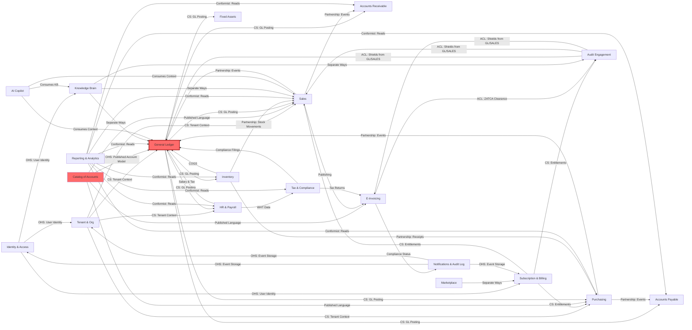

# APEX Financial Platform: Domain-Driven Design (DDD) Bounded Contexts Playbook

**Version:** 1.0  
**Date:** 2026-04-30  
**Status:** Strategic Architecture Blueprint  
**Target Length:** ~6500 words

---

## Executive Summary

The APEX Financial Platform (currently organized as 11 chronological phases + 6 sprints) must be re-architected using **Domain-Driven Design (DDD)** to achieve true modularity, team autonomy, and business alignment. This playbook translates APEX's current phase-based architecture into 18–20 independent **bounded contexts**, each with:

- A clear **ubiquitous language** (Arabic + English)
- Well-defined **aggregate roots** and invariants
- **Domain events** that flow between contexts
- Strategic **integration patterns** (Partnership, Customer/Supplier, Anti-Corruption Layer)
- A **context map** showing relationships and dependencies

This transformation enables parallel development, independent deployment, and alignment with real business domains (Accounting, Tax, Payroll, Audit, e-Invoicing, Marketplace, etc.) rather than artificial phase boundaries.

---

## Section 1: DDD Core Concepts (Theory)

### 1.1 Ubiquitous Language (لغة موحدة)

**Definition:**  
A shared vocabulary—in both **Arabic and English**—that developers, domain experts (accountants, auditors, tax experts), and business stakeholders use when discussing the system. It eliminates ambiguity and ensures everyone means the same thing by "invoice," "sample," or "materiality."

**Why it matters for APEX:**  
- A "Trial Balance" (ميزان مراجعة) in accounting is NOT the same as a "Report" (تقرير).
- A "Provider" (مزود خدمات) in the Marketplace context has different semantics from a "Vendor" (مورد) in Purchasing.
- Arabic financial terminology varies by region (GCC vs. Egypt); the ubiquitous language captures the canonical form.

**Governance:**  
- Maintain a **glossary** (Section 6) as a source of truth.
- Update it when domain experts refine definitions.
- Use it to name classes, methods, and domain events in code.

---

### 1.2 Bounded Context (سياق محدود)

**Definition:**  
A logical boundary within which a specific ubiquitous language and set of models apply. A context contains:
- One or more **aggregates** (logical clusters of entities)
- **Domain services** and **application services**
- A **repository** (interface to persistence)
- **Domain events** it publishes
- Integration points with other contexts

**Example for APEX:**  
The **Catalog of Accounts** context owns the COA, chart structure, and classification rules. Outside this context, other contexts (e.g., General Ledger, Sales) only refer to accounts by ID, not manipulating their hierarchy or properties directly.

**Anti-pattern:**  
A "Big Ball of Mud" where everything talks to everything, and no clear domain boundaries exist. APEX's current 11 phases risk this.

---

### 1.3 Aggregate (تجميعة)

**Definition:**  
A cluster of domain objects (entities + value objects) treated as a **unit for data consistency** and transactions. An aggregate has:
- One **root entity** (aggregate root)
- Zero or more child entities
- Value objects
- Clear **invariants** (rules that must always be true)
- A lifecycle: creation → state transitions → archival/deletion

**Example for APEX:**  
An **Invoice** aggregate might contain:
- Root: `Invoice` (entity, mutable)
- Children: `LineItem` entities
- Value objects: `Money`, `TaxAmount`, `InvoiceNumber`
- Invariants: `sum(line_item.amount) == invoice.total`; `invoice.status` transitions follow a state machine

**Consistency boundary:**  
Within an aggregate, all changes are **ACID** (immediate consistency). Between aggregates, changes are **eventually consistent** (via domain events and process managers).

---

### 1.4 Aggregate Root (جذر التجميعة)

**Definition:**  
The only entity within an aggregate that can be accessed from **outside** the aggregate. External code has a reference to the root and asks it to perform operations; the root ensures all invariants remain satisfied.

**For APEX Invoices:**
```
Invoice (root)
  └─ LineItem[0..n] (child entities, never accessed directly from outside)
  └─ TaxLine[0..n] (child entities)
  └─ Money (value object)
```

External code does NOT do:
```python
# ❌ WRONG: Direct access to child
invoice.line_items[0].amount = 500
```

Instead:
```python
# ✅ RIGHT: Ask the root to update
invoice.update_line_item(line_item_id=1, new_amount=500)
# Root ensures invariant: total == sum of line items
```

---

### 1.5 Entity (كيان) vs. Value Object (كائن قيمة)

**Entity:**
- Has a unique **identity** (ID) that persists across state changes.
- Mutable—state changes over time.
- Example: `User`, `Invoice`, `Customer`

**Value Object:**
- No unique identity; equality is based on **all attributes**.
- Immutable—once created, never changes.
- If you need to "change" it, you create a new one.
- Example: `Money(currency="SAR", amount=100)`, `Address`, `EmailAddress`

**For APEX:**
- `Invoice` is an entity (has `invoice_id`, changes over time).
- `Money`, `Date`, `TaxRate` are value objects.

---

### 1.6 Domain Event (حدث المجال)

**Definition:**  
An immutable record of something **important that happened** in the domain at a specific point in time. Events are the **primary communication mechanism** between bounded contexts.

**Examples:**
- `UserRegistered` → User context publishes when a new user signs up
- `SubscriptionUpgraded` → Billing context publishes when a plan changes
- `InvoiceClearedByZATCA` → E-Invoicing context publishes after ZATCA approval
- `PeriodLocked` → General Ledger context publishes after month-end close

**Event structure:**
```python
class InvoiceIssued(DomainEvent):
    event_id: str  # Unique identifier for this event
    occurred_at: datetime  # When it happened (ISO 8601)
    aggregate_id: str  # Which invoice (for routing/deduplication)
    
    invoice_number: str
    customer_id: str
    total_amount: Money
    issue_date: date
    due_date: date
    # Any other data needed by subscribers
```

**Propagation:**
Events are stored in an **event store** or **outbox table** and asynchronously delivered to subscribers via message broker (Kafka, RabbitMQ) or polling.

---

### 1.7 Domain Service (خدمة المجال)

**Definition:**  
A stateless service that performs **business logic that doesn't naturally belong to a single aggregate**. It operates on aggregates and may publish domain events.

**Example for APEX:**
```python
class TaxCalculationService:
    """Domain service: VAT is a cross-aggregate concern."""
    
    def calculate_vat(self, line_items: List[LineItem], 
                     tax_rate: TaxRate) -> Money:
        # Complex tax rules (e.g., GCC VAT with exemptions)
        ...
        return vat_amount
```

**Key rule:**  
Domain services are **orchestrated by application services**, not called directly by UI or API handlers.

---

### 1.8 Application Service (خدمة التطبيق)

**Definition:**  
The **interface between the UI/API and the domain**. An application service:
1. Translates API requests → domain operations
2. Loads aggregates from repositories
3. Calls domain services and aggregate methods
4. Saves aggregates back
5. Publishes domain events
6. Returns API responses

**Example:**
```python
class CreateInvoiceApplicationService:
    def __init__(self, invoice_repo: InvoiceRepository,
                 event_bus: EventBus):
        self.invoice_repo = invoice_repo
        self.event_bus = event_bus
    
    def execute(self, command: CreateInvoiceCommand) -> InvoiceDTO:
        # 1. Validate command (basic checks)
        # 2. Load customer aggregate (from Customer context)
        # 3. Create new Invoice aggregate
        invoice = Invoice.create(customer_id=command.customer_id, ...)
        # 4. Save
        self.invoice_repo.save(invoice)
        # 5. Publish event
        for event in invoice.domain_events:
            self.event_bus.publish(event)
        # 6. Return DTO
        return InvoiceDTO.from_aggregate(invoice)
```

---

### 1.9 Repository (مستودع)

**Definition:**  
A **collection-like interface** for loading and saving aggregates. It hides persistence details (SQL, NoSQL, ORM) behind a clean domain-centric API.

**Example:**
```python
class InvoiceRepository(Generic[Invoice]):
    def save(self, invoice: Invoice) -> None:
        """Persist aggregate and its events."""
        
    def find_by_id(self, invoice_id: InvoiceId) -> Optional[Invoice]:
        """Load by aggregate root ID."""
        
    def find_all_for_customer(self, customer_id: str) -> List[Invoice]:
        """Domain query."""
```

**Not a DAO:**  
Repositories work with aggregates, not arbitrary ORM models. They don't expose raw SQL or complex query builders.

---

### 1.10 Anti-Corruption Layer (طبقة منع التلوث)

**Definition:**  
A **translation layer** between your domain and external systems (ZATCA, Stripe, banking APIs). It:
1. Accepts external data formats
2. Validates and transforms them into domain objects
3. Prevents external models from leaking into your domain

**Example:**
```python
class ZATCAAntiCorruptionLayer:
    """Shields APEX domain from ZATCA API quirks."""
    
    def translate_zatca_response(self, external_dto):
        # ZATCA returns snake_case, Arabic field names, nested structures
        # Translate to APEX domain concepts
        return InvoiceClearedByZATCA(
            invoice_id=self._map_invoice_id(external_dto),
            clearance_timestamp=external_dto.get("timestamp"),
            compliance_info=self._parse_compliance(external_dto)
        )
```

---

### 1.11 Context Map (خريطة السياقات)

**Definition:**  
A diagram showing all bounded contexts and their **relationships** (how they integrate). It answers:
- Which contexts must talk to each other?
- What type of relationship? (Partnership, Customer/Supplier, ACL, etc.)
- What data flows?

---

## Section 2: Strategic Design Patterns (Integration)

These patterns describe how contexts interact at the system level.

### Partnership (شراكة)
**Relationship:**  
Two contexts are **mutual peers**; neither is upstream or downstream. They collaborate to deliver a feature.

**Example:**  
Sales and Inventory contexts must coordinate when an order is placed:
- Sales creates an `OrderPlaced` event
- Inventory listens and allocates stock
- If allocation fails, a `StockAllocationFailed` event tells Sales to cancel

**Pattern:**  
Event-driven choreography (each context reacts to events independently).

---

### Customer/Supplier (عميل/مورد)
**Relationship:**  
One context is **upstream** (supplier); another is **downstream** (customer). The downstream depends on the upstream.

**Example:**  
General Ledger (upstream) is the supplier of account master data. Sales (downstream) is the customer—it must conform to GL's account structure.

**Communication:**  
Upstream publishes a "Published Language" (e.g., account catalog). Downstream subscribes or polls.

---

### Conformist (مطيع)
**Relationship:**  
Downstream has **no bargaining power**. It must conform to upstream's model exactly, no translation layer.

**Example:**  
A small vendor integration module might directly use the Vendor context's `Vendor` entity model without any ACL. Trade-off: tight coupling for simplicity.

---

### Anti-Corruption Layer (ACL) (طبقة منع التلوث)
**Relationship:**  
Downstream **protects** its domain by translating upstream models. Used when downstream wants autonomy or the upstream model is messy.

**Example:**  
Audit Engagement context uses an ACL to shield itself from legacy E-Invoicing context:
```python
class AuditEngagementACL:
    def translate_invoice(self, external_invoice):
        # E-Invoicing has `invoice_posted_date`
        # Audit calls it `document_date`
        # ACL does the mapping
        return DocumentSnapshot(
            document_id=external_invoice.invoice_id,
            date=external_invoice.invoice_posted_date,
            amount=self._convert_currency(external_invoice.total)
        )
```

---

### Open Host Service (OHS) (خدمة مضيف مفتوح)
**Pattern:**  
Upstream publishes a **well-documented API** (REST, gRPC, GraphQL) for downstream consumers. Each downstream integrates via the API, not a shared kernel or database.

**Example:**  
General Ledger exposes REST endpoints:
```
GET /api/v1/accounts/{account_id}
GET /api/v1/trial-balance?period=2026-04
POST /api/v1/journal-entries (create entry)
```

---

### Published Language (لغة منشورة)
**Pattern:**  
Upstream defines a **canonical data model** (in docs, XSD, OpenAPI spec, or code comments) that downstream must use when integrating.

**Example:**  
GL publishes:
```json
{
  "account": {
    "id": "string (UUID)",
    "number": "string (1000-9999)",
    "name_en": "string",
    "name_ar": "string",
    "type": "ASSET | LIABILITY | EQUITY | REVENUE | EXPENSE",
    "status": "ACTIVE | ARCHIVED"
  }
}
```

---

### Shared Kernel (نواة مشتركة)
**Pattern:**  
Two contexts share a **small, well-defined set of classes** (e.g., `Money`, `TaxRate`). Used rarely and only for truly domain-neutral types.

**Example:**  
Sales and Purchasing both use:
```python
class Money:
    currency: str  # "SAR", "AED"
    amount: Decimal
```

They don't share business logic or entity models—only value objects.

---

### Separate Ways (طرق منفصلة)
**Pattern:**  
Two contexts **don't integrate at all**. Each has its own data model, logic, and never exchange information.

**Example:**  
The Knowledge Brain (AI/ML) and Catalog of Accounts (chart structure) are completely separate. They may share common infrastructure (auth, storage) but not domain logic.

---

### Big Ball of Mud (كرة الطين الكبيرة) [Anti-Pattern]
**What it looks like:**  
No clear boundaries; everything references everything; shared database with loose foreign keys; cyclic dependencies; any change ripples across the system.

**APEX's current risk:**  
The 11 phases don't form real boundaries. Phase 1 (Users) is called from Phase 2 (Entities), which is called from Phase 8 (Billing), etc. Hard to deploy independently.

---

## Section 3: Tactical Design Patterns

### Aggregate Consistency Boundaries
Within an aggregate: **immediate consistency** (ACID).  
Between aggregates: **eventual consistency** (via events and sagas).

**Example:**
```python
# ✅ CONSISTENT: Within the same aggregate
class Invoice:
    def add_line_item(self, item: LineItem):
        self.line_items.append(item)
        self._recalculate_total()  # Invariant maintained immediately
        # If save fails, entire aggregate rolls back

# ❌ INCONSISTENT (BAD): Cross-aggregate direct reference
invoice.customer.name = "New Name"  # May save independently, breaking consistency
```

---

### Eventual Consistency Between Aggregates
Use domain events and process managers (sagas).

**Scenario:**  
When an `Invoice` is posted, the GL must be updated with a `JournalEntry`.

```python
# 1. Sales context publishes event
class InvoicePosted(DomainEvent):
    invoice_id: str
    customer_id: str
    total: Money

# 2. GL context subscribes
class JournalEntryCreationSaga:
    def on_invoice_posted(self, event: InvoicePosted):
        # GL may not be immediately consistent; it will catch up asynchronously
        entry = JournalEntry.create_from_invoice(event)
        self.entry_repo.save(entry)
        # If this fails, retry logic (exponential backoff) handles recovery
```

---

### Domain Events as Integration Protocol
Events are the **lingua franca** between contexts. Benefits:
- **Loose coupling:** Subscriber and publisher don't know each other
- **Replay-able:** Full audit trail of what happened
- **Temporal decoupling:** Async processing

**Event bus implementation:**
```python
class EventBus:
    def __init__(self, broker: MessageBroker):
        self.broker = broker
    
    def publish(self, event: DomainEvent):
        # Serialize, emit to Kafka/RabbitMQ/in-memory queue
        self.broker.send(
            topic=f"domain.{event.aggregate_type}.{event.event_type}",
            message=event.to_json()
        )
    
    def subscribe(self, event_type: Type[DomainEvent], 
                  handler: Callable):
        # Register async handler
        self.broker.subscribe(event_type.__name__, handler)
```

---

### Sagas (Process Managers) (متتالية)
A **stateful workflow** orchestrating interactions between multiple aggregates.

**Example: Order-to-Invoice Saga**
```
1. OrderPlaced event → GL reserves revenue account
2. StockAllocated event → GL records COGS
3. InvoiceIssued event → AR adds to customer balance
4. PaymentReceived event → Cash reconciliation
```

If any step fails, the saga has compensating actions (rollback).

---

### CQRS (Command Query Responsibility Segregation)
Separate **read models** from **write models**.

**Write side:**  
Domain aggregates, invariants, events.

**Read side:**  
Denormalized projections optimized for UI queries.

**Example:**
```python
# Write: Invoice context
invoice.mark_as_paid()  # Publishes InvoiceMarkedAsPaid

# Read: AR Dashboard reads from materialized view
ar_summary = {
    "total_outstanding": 1000000,
    "by_customer": [...],
    "aging": [...]
}
# This view is built asynchronously from events
```

---

### Event Sourcing
Store **every event** that ever happened to an aggregate, not just current state.

**Trade-off:**  
- **Benefit:** Complete audit trail, can replay to any point in time
- **Cost:** More storage, complex querying (need projections)

**For APEX:** Recommended for GL, Audit (high audit value). Optional for Sales, Purchasing (lower value).

---

## Section 4: APEX Bounded Contexts Proposal

### Strategic Map: 18–20 Contexts

#### **1. Identity & Access (هوية والوصول)**
**Purpose:**  User registration, authentication, session management, role-based access control.  
**Aggregates:**
- `User` (email, password hash, mfa_enabled, status)
- `Role` (permissions, scope)
- `Session` (JWT token, expiry, device_fingerprint)

**Domain Events:**
- `UserRegistered`
- `UserEmailVerified`
- `PasswordChanged`
- `MFAEnabled`
- `SessionCreated`
- `SessionInvalidated`
- `RoleAssigned`

**Integration:**
- **Publisher of:** User identity (used by all contexts)
- **Relationship:** Open Host Service (all contexts conform to `UserId`)

---

#### **2. Tenant & Organization (مؤسسة وفروع)**
**Purpose:**  Multi-tenancy, organizational structure, branch/entity hierarchies.  
**Aggregates:**
- `Tenant` (org_name, country, industry, registration_number)
- `Entity` (legal_entity, branch_code, office_address)
- `Member` (user + entity; role_in_entity)

**Domain Events:**
- `TenantOnboarded`
- `EntityCreated`
- `BranchAdded`
- `MemberInvited`
- `MemberRoleChanged`

**Integration:**
- **Consumes from:** Identity (User IDs)
- **Publishes to:** All other contexts (Tenant context)
- **Relationship:** Customer/Supplier (all contexts are downstream)

---

#### **3. Subscription & Billing (الاشتراك والفواتير)**
**Purpose:**  Plans, subscriptions, entitlements, payment processing.  
**Aggregates:**
- `Plan` (name, price, features, term)
- `Subscription` (tenant_id, plan_id, start_date, renewal_date, status)
- `Entitlement` (feature_flag; e.g., "can_invite_5_users", "export_to_excel")
- `Payment` (amount, status, stripe_token, date)
- `Invoice` (billing entity; amount due, paid_date)

**Domain Events:**
- `SubscriptionCreated`
- `SubscriptionUpgraded`
- `SubscriptionDowngraded`
- `SubscriptionCancelled`
- `PaymentProcessed`
- `PaymentFailed`
- `EntitlementGranted`
- `EntitlementRevoked`

**Integration:**
- **Consumes from:** Tenant (tenant_id), Identity (user_id)
- **Publishes to:** All contexts (entitlement guards; e.g., "invite users only if entitled")
- **Relationship:** Customer/Supplier (pays for all features)

---

#### **4. Catalog of Accounts (دليل الحسابات)**
**Purpose:**  Chart of accounts, account hierarchies, classification rules, account linking.  
**Aggregates:**
- `Account` (number, name_en, name_ar, type: ASSET/LIABILITY/EQUITY/REVENUE/EXPENSE, parent_id, status)
- `AccountClassification` (rule engine; e.g., "Sales > VAT" = 2110)
- `COASnapshot` (versioned chart for audit trail)

**Domain Events:**
- `AccountCreated`
- `AccountUpdated`
- `AccountArchived`
- `COAPublished` (snapshot of chart at a point in time)
- `ClassificationRuleAdded`

**Integration:**
- **Consumes from:** Tenant (organizational context)
- **Publishes to:** GL, Sales, Purchasing, Audit (account master data)
- **Relationship:** Open Host Service (GL API: `GET /accounts/{id}`)

---

#### **5. General Ledger (دفتر الأستاذ العام)**
**Purpose:**  Journal entries, trial balance, period management, GL posting, reconciliation.  
**Aggregates:**
- `JournalEntry` (debit_account, credit_account, amount, description, posted_date, period)
- `GLBalance` (account, period, debit_amount, credit_amount, balance)
- `Period` (fiscal_month, status: OPEN/LOCKED, close_date)
- `TrialBalance` (period, list of account balances)

**Domain Events:**
- `JournalEntryCreated`
- `JournalEntryPosted`
- `JournalEntryReversed`
- `PeriodClosed`
- `PeriodLocked`
- `GLAccountUpdated`
- `TrialBalanceGenerated`

**Integration:**
- **Consumes from:** COA (account definitions), Sales, Purchasing, Payroll, Inventory, FA (posting triggers)
- **Publishes to:** Reporting, Tax, Audit, FS (financial statements)
- **Relationship:** Partnership with Sales/Purchasing (choreographed via events)

---

#### **6. Sales (المبيعات)**
**Purpose:**  Customers, quotes, orders, invoices, credit memos, revenue recognition.  
**Aggregates:**
- `Customer` (name, tax_id, address, credit_limit, payment_terms)
- `Quote` (customer_id, line_items, valid_until, status)
- `SalesOrder` (customer_id, quoted_date, delivery_date, shipping_address)
- `Invoice` (order_id, customer_id, line_items, total, issue_date, due_date, status)
- `CreditMemo` (invoice_id, reason, amount)

**Domain Events:**
- `CustomerCreated`
- `QuoteGenerated`
- `OrderPlaced`
- `InvoiceIssued`
- `InvoicePaid`
- `InvoiceOverdue`
- `CreditMemoIssued`
- `RevenueRecognized`

**Integration:**
- **Consumes from:** Customers (contact), Inventory (stock availability), AR/GL (posting)
- **Publishes to:** GL, AR, Inventory, Reporting, E-Invoicing, Audit
- **Relationship:** Customer/Supplier (GL is supplier; Sales conforms to GL's chart)

---

#### **7. Purchasing (الشراء)**
**Purpose:**  Vendors, purchase orders, bills, goods receipt, payment.  
**Aggregates:**
- `Vendor` (name, tax_id, address, payment_terms, bank_details)
- `PurchaseOrder` (vendor_id, line_items, delivery_date, status)
- `Bill` (po_id, vendor_id, amount, due_date, status)
- `GoodsReceipt` (po_id, item_id, quantity, received_date)
- `APPayment` (bill_id, amount, payment_date)

**Domain Events:**
- `VendorCreated`
- `POCreated`
- `BillReceived`
- `GoodsReceived`
- `PaymentMade`
- `BillPaid`
- `VendorInvoiceReconciled`

**Integration:**
- **Consumes from:** Inventory (stock codes), GL (posting)
- **Publishes to:** GL, AP, Inventory, Reporting, Audit
- **Relationship:** Customer/Supplier (GL is supplier)

---

#### **8. Accounts Receivable (الذمم المدينة)**
**Purpose:**  AR aging, customer balances, collections, write-offs.  
**Aggregates:**
- `ARBalance` (customer_id, period, invoices outstanding, aging_bucket)
- `Collection` (customer_id, amount, date, method)
- `WriteOff` (customer_id, invoice_id, reason, amount, approval)

**Domain Events:**
- `ARBalanceUpdated`
- `PaymentApplied`
- `ARAgingChanged`
- `WriteOffApproved`
- `CustomerOnCredit`

**Integration:**
- **Consumes from:** Sales (invoices), GL (posting confirmation)
- **Publishes to:** GL, Reporting, Dashboard
- **Relationship:** Shared kernel with Sales (Customer ID)

---

#### **9. Accounts Payable (الذمم الدائنة)**
**Purpose:**  AP aging, vendor balances, payment scheduling, discount tracking.  
**Aggregates:**
- `APBalance` (vendor_id, period, bills outstanding, aging_bucket)
- `PaymentSchedule` (bill_id, payment_date, amount)
- `DiscountTracking` (bill_id, early_pay_discount, expiry)

**Domain Events:**
- `APBalanceUpdated`
- `PaymentScheduled`
- `DiscountExpired`
- `APAgingChanged`

**Integration:**
- **Consumes from:** Purchasing (bills), GL (posting)
- **Publishes to:** GL, Reporting, Treasurer (cash flow)
- **Relationship:** Shared kernel with Purchasing

---

#### **10. Inventory & Logistics (المخزون والخدمات)**
**Purpose:**  Item master, warehouse locations, stock movements, valuation (FIFO/COGS).  
**Aggregates:**
- `Item` (sku, description, uom, cost, selling_price, reorder_level)
- `Warehouse` (code, name, address, capacity)
- `StockMovement` (item_id, warehouse_id, quantity, movement_type: IN/OUT, reference_doc)
- `StockLevel` (item_id, warehouse_id, quantity_on_hand, quantity_reserved)

**Domain Events:**
- `ItemCreated`
- `StockMovementRecorded`
- `StockLevelLow`
- `WarehouseCreated`
- `COGSCalculated`

**Integration:**
- **Consumes from:** Sales (orders), Purchasing (receipts)
- **Publishes to:** GL (COGS), Sales, Reporting
- **Relationship:** Partnership (choreographed)

---

#### **11. Fixed Assets (الأصول الثابتة)**
**Purpose:**  Asset register, depreciation schedules, disposal, capitalization rules.  
**Aggregates:**
- `Asset` (asset_id, description, cost, useful_life, salvage_value, acquisition_date, depreciation_method)
- `DepreciationSchedule` (asset_id, period, depreciation_amount, accumulated_depreciation)
- `AssetDisposal` (asset_id, disposal_date, disposal_proceeds, gain_loss)

**Domain Events:**
- `AssetAcquired`
- `DepreciationRecorded`
- `AssetRevalued`
- `AssetDisposed`
- `AssetTransferred`

**Integration:**
- **Consumes from:** GL (posting)
- **Publishes to:** GL (depreciation entries), Reporting, Tax
- **Relationship:** Customer/Supplier (GL is supplier)

---

#### **12. HR & Payroll (الموارد البشرية والرواتب)**
**Purpose:**  Employee master, timesheets, payslips, tax withholding, benefits.  
**Aggregates:**
- `Employee` (employee_id, name, hire_date, salary, tax_id, bank_details)
- `Timesheet` (employee_id, period, hours_worked, overtime_hours)
- `Payslip` (employee_id, period, gross_salary, deductions, net_pay)
- `Deduction` (type: TAX/INSURANCE/LOAN, amount, period)

**Domain Events:**
- `EmployeeOnboarded`
- `TimesheetSubmitted`
- `PayslipGenerated`
- `PaymentProcessed`
- `BenefitEnrolled`

**Integration:**
- **Consumes from:** Tenant (employee hierarchy)
- **Publishes to:** GL (salary expense, tax payable), Reporting, Tax
- **Relationship:** Customer/Supplier (GL is supplier)

---

#### **13. Tax & Regulatory Compliance (الضرائب والامتثال)**
**Purpose:**  VAT returns, Zakat, WHT, regulatory filings, compliance calendars.  
**Aggregates:**
- `TaxReturn` (type: VAT/ZAKAT/WHT, period, filing_date, return_data)
- `TaxCalculation` (transaction_id, tax_type, amount, rate)
- `ComplianceItem` (requirement, due_date, status: NOT_DUE/IN_PROGRESS/FILED)

**Domain Events:**
- `VATReturnGenerated`
- `TaxReturnFiled`
- `ZakatCalculated`
- `WHTReportGenerated`
- `ComplianceDeadlineMissed`

**Integration:**
- **Consumes from:** GL (taxable transactions), Sales (invoices), Payroll (WHT)
- **Publishes to:** Reporting, Audit (compliance status)
- **Relationship:** Open Host Service (tax filing system integrations via ACL)

---

#### **14. E-Invoicing (الفواتير الإلكترونية)**
**Purpose:**  Invoice formatting, ZATCA/FTA/ETA clearance, CSIDs, compliance validation.  
**Aggregates:**
- `Invoice` (invoice_id, sales_invoice_id, clearance_status, csid, qr_code, zatca_response)
- `ClearanceRequest` (invoice_id, xml_payload, submission_timestamp, compliance_check)
- `ComplianceMetadata` (invoice_id, tax_treatment, items_classification, discount_handling)

**Domain Events:**
- `InvoiceSubmittedForClearance`
- `InvoiceClearedByZATCA`
- `InvoiceClearanceRejected`
- `CSIDAssigned`
- `QRCodeGenerated`

**Integration:**
- **Consumes from:** Sales (invoices), COA (account classification for tax treatment)
- **Publishes to:** Audit (e-invoicing compliance), GL (posting)
- **Relationship:** Anti-Corruption Layer (ZATCA API is external and messy)

---

#### **15. Audit Engagement & Workpapers (تدقيق الحسابات)**
**Purpose:**  Engagement setup, sample selection, control testing, findings, sign-off.  
**Aggregates:**
- `AuditEngagement` (engagement_id, auditor_id, fiscal_period, scope, status)
- `Workpaper` (workpaper_id, engagement_id, title, objective, procedure, finding)
- `AuditSample` (population, sample_size, items_selected, testing_results)
- `AuditFinding` (severity: TRIVIAL/MINOR/MATERIAL, description, remediation)

**Domain Events:**
- `AuditEngagementCreated`
- `AuditPlanApproved`
- `WorkpaperCompleted`
- `SampleSelected`
- `FindingRaised`
- `FindingResolved`
- `AuditSignedOff`

**Integration:**
- **Consumes from:** GL (account balances, trial balance), Sales (invoices), Purchasing (bills), E-Invoicing (compliance), Payroll (deductions)
- **Publishes to:** Reporting (audit findings dashboard)
- **Relationship:** Uses Anti-Corruption Layer to shield from GL/Sales/E-Invoicing schema changes

---

#### **16. Knowledge Brain (المحرك المعرفي)**
**Purpose:**  Domain concepts, rules, AI training data, copilot knowledge base.  
**Aggregates:**
- `Concept` (concept_id, term_en, term_ar, definition, category, aliases)
- `Rule` (rule_id, condition, action, confidence, source_context)
- `ConversationMemory` (conversation_id, messages, context_window, extracted_entities)

**Domain Events:**
- `ConceptCreated`
- `RuleAdded`
- `RuleConfidenceUpdated`
- `ConversationStarted`
- `InsightGenerated`

**Integration:**
- **Consumes from:** All contexts (concepts, rules, transactions for training)
- **Publishes to:** All contexts (knowledge responses via Copilot API)
- **Relationship:** Separate Ways (optional, for advisory use only)

---

#### **17. Marketplace & Services (السوق والخدمات)**
**Purpose:**  Service providers, service requests, ratings, procurement.  
**Aggregates:**
- `ServiceProvider` (provider_id, name, expertise, rating, availability)
- `ServiceRequest` (requester_id, provider_id, description, status, budget)
- `ServiceReview` (request_id, rating, feedback)
- `Subscription` (provider_id, service_plan, start_date, auto_renew)

**Domain Events:**
- `ProviderOnboarded`
- `ServiceRequestCreated`
- `ServiceRequestAccepted`
- `ServiceCompleted`
- `ReviewSubmitted`
- `SubscriptionCreated`

**Integration:**
- **Consumes from:** Identity (users), Subscription (entitlements)
- **Publishes to:** Reporting, Audit (service spend)
- **Relationship:** Separate Ways (isolated domain)

---

#### **18. Reporting & Analytics & Dashboard (التقارير والتحليلات)**
**Purpose:**  Financial statements, KPIs, dashboards, subscribed reports, custom reports.  
**Aggregates:**
- `FinancialStatement` (statement_type: IS/BS/CF, period, account_balances, notes)
- `KPI` (kpi_id, formula, period, value, trend)
- `DashboardWidget` (widget_id, metric, chart_type, refresh_interval)
- `ReportSubscription` (recipient_email, report_type, frequency, format)

**Domain Events:**
- `FinancialStatementGenerated`
- `KPIUpdated`
- `DashboardConfigured`
- `ReportScheduled`
- `ReportDelivered`

**Integration:**
- **Consumes from:** GL, Sales, Purchasing, Inventory, AR, AP, Payroll, Tax (all data sources)
- **Publishes to:** (read-only; outputs reports)
- **Relationship:** Conformist (reads from all contexts; no push-back)

---

#### **19. Notifications & Audit Logging (الإخطارات والسجلات)**
**Purpose:**  Cross-cutting; event delivery, audit trail, compliance logging.  
**Aggregates:**
- `Notification` (recipient_user_id, event_type, subject, body, delivery_status)
- `AuditLog` (user_id, action, resource, timestamp, ip_address, result)
- `AuditTrail` (entity_id, entity_type, changes: before/after, actor, timestamp)

**Domain Events:**
- All domain events flow through this context for storage/delivery.

**Integration:**
- **Consumes from:** All contexts (all domain events)
- **Publishes to:** (audit-only; no outbound events)
- **Relationship:** Open Host Service (publishes audit query API)

---

#### **20. AI Copilot & Chat (مساعد ذكي)**
**Purpose:**  Conversational UI, prompt engineering, tool invocation, fallback responses.  
**Aggregates:**
- `Conversation` (conversation_id, user_id, messages[], context, status)
- `Prompt` (prompt_id, template, parameters, model_config)
- `ToolInvocation` (tool_id, input_params, output, latency, fallback_used)

**Domain Events:**
- `ConversationStarted`
- `MessageProcessed`
- `ToolInvoked`
- `FallbackTriggered`

**Integration:**
- **Consumes from:** Knowledge Brain (concepts, rules), all contexts (data for context)
- **Publishes to:** (advice only; no state changes)
- **Relationship:** Separate Ways (advisory layer)

---

## Section 5: Context Map (Mermaid Diagram)



---

## Section 6: Ubiquitous Language Glossary (English & Arabic)

A comprehensive glossary of 130+ domain terms used in APEX. This is the **single source of truth** for naming throughout the system.

### Core Concepts

| English | العربية | Definition | Bounded Context |
|---------|----------|-----------|-----------------|
| Aggregate | تجميعة | A cluster of domain objects with a root entity | All |
| Aggregate Root | جذر التجميعة | The only entity accessible from outside an aggregate | All |
| Bounded Context | سياق محدود | A logical boundary with a specific ubiquitous language | All |
| Domain Event | حدث المجال | An immutable record of something important | All |
| Domain Service | خدمة المجال | Stateless service for cross-aggregate logic | All |
| Application Service | خدمة التطبيق | Interface between UI and domain | All |
| Repository | مستودع | Collection-like interface for aggregates | All |
| Ubiquitous Language | لغة موحدة | Shared vocabulary between developers and domain experts | All |

### Identity & Access

| English | العربية | Definition |
|---------|----------|-----------|
| User | مستخدم | Person with login credentials |
| Email Address | عنوان البريد الإلكتروني | Unique identifier; email |
| Password Hash | تجزئة كلمة المرور | Bcrypt-hashed password |
| Role | دور | Set of permissions (Admin, Accountant, Auditor, etc.) |
| Permission | صلاحية | Granular access control (create_invoice, approve_journal_entry) |
| Multi-Factor Authentication (MFA) | المصادقة متعددة العوامل | TOTP/SMS second factor |
| Session | جلسة | JWT token; valid_until, device_fingerprint |
| Account Locked | حساب مقفول | User disabled after failed login attempts |

### Tenant & Organization

| English | العربية | Definition |
|---------|----------|-----------|
| Tenant | المؤسسة | Top-level organizational boundary (multi-tenancy) |
| Entity | كيان | Legal entity within a tenant (main company, branch) |
| Branch | فرع | Physical or logical office location |
| Member | عضو | User assigned to an entity with a role |
| Organization Hierarchy | هرم المنظمة | Structure of entities and branches |
| Registration Number | رقم التسجيل | Unique ID (VAT ID, tax ID, CR) |

### Billing & Subscription

| English | العربية | Definition |
|---------|----------|-----------|
| Plan | خطة | Subscription tier (Basic, Pro, Enterprise) |
| Subscription | اشتراك | Tenant's active plan; start_date, renewal_date |
| Entitlement | استحقاق | Feature access grant (e.g., "can_invite_10_users") |
| Feature Flag | علم الميزة | Boolean toggle for feature availability |
| Payment | دفع | Transaction to process subscription fee |
| Stripe Token | رمز Stripe | Payment method identifier from Stripe |
| Invoice (Billing) | فاتورة الاشتراك | Billing invoice (different from Sales invoice) |

### Accounts & Chart Structure

| English | العربية | Definition |
|---------|----------|-----------|
| Account | حساب | GL account (number, type, balance) |
| Account Number | رقم الحساب | Numeric identifier (1000–9999) |
| Account Type | نوع الحساب | ASSET, LIABILITY, EQUITY, REVENUE, EXPENSE |
| Debit | مدين | Left side of journal entry |
| Credit | دائن | Right side of journal entry |
| Trial Balance | ميزان المراجعة | List of account balances for a period |
| Chart of Accounts (COA) | دليل الحسابات | Complete list of accounts for a tenant |
| Account Hierarchy | هرم الحسابات | Parent-child account relationships |
| Control Account | حساب السيطرة | Summary account (e.g., A/R, A/P) |
| Sub-Account | حساب فرعي | Child account in hierarchy |
| Account Classification Rule | قاعدة تصنيف الحسابات | Business rule mapping transaction to account |

### General Ledger

| English | العربية | Definition |
|---------|----------|-----------|
| Journal Entry | قيد يومية | Double-entry bookkeeping transaction |
| Journal | دفتر اليومية | Collection of entries |
| Debit Side | الجانب المدين | Accounts being debited |
| Credit Side | الجانب الدائن | Accounts being credited |
| Entry Amount | مبلغ القيد | Debit/credit amount in currency |
| Entry Description | وصف القيد | Narrative; why entry was made |
| Posted Date | تاريخ الترحيل | Date entry was posted to GL |
| Period | فترة | Fiscal month/quarter/year |
| Posting | الترحيل | Recording entry in GL |
| Reversing Entry | قيد معكوس | Entry to undo a previous entry |
| GL Balance | رصيد الحساب | Account balance for a period |
| Fiscal Year | السنة المالية | Reporting period (e.g., Jan–Dec) |
| Fiscal Month | الشهر المالي | Month within fiscal year |
| Period Close | إغلاق الفترة | Month-end close process |
| Period Lock | قفل الفترة | Prevent further entries in closed period |

### Sales

| English | العربية | Definition |
|---------|----------|-----------|
| Customer | عميل | Party purchasing goods/services |
| Customer ID | معرّف العميل | Unique customer identifier |
| Quote | عرض سعر | Non-binding price offer |
| Sales Order (SO) | أمر البيع | Binding customer order |
| Invoice | فاتورة | Request for payment (sales context) |
| Invoice Number | رقم الفاتورة | Unique invoice identifier |
| Issue Date | تاريخ الإصدار | Date invoice was created |
| Due Date | تاريخ الاستحقاق | Payment deadline |
| Line Item | بند | Single product/service on invoice |
| Quantity | الكمية | Number of units |
| Unit Price | سعر الوحدة | Price per unit |
| Line Amount | مبلغ البند | Quantity × Unit Price |
| Discount | خصم | Reduction from list price |
| Tax Amount | مبلغ الضريبة | VAT or other tax |
| Invoice Total | إجمالي الفاتورة | Sum of line amounts + tax |
| Credit Memo | إشعار دائن | Reduction to customer liability |
| Revenue Recognition | الاعتراف بالإيراد | Timing of revenue in GL |
| Payment Term | شروط الدفع | E.g., Net 30, 2/10 Net 30 |
| Delivery Address | عنوان التسليم | Shipping location |

### Purchasing

| English | العربية | Definition |
|---------|----------|-----------|
| Vendor | مورد | Party supplying goods/services |
| Vendor ID | معرّف المورد | Unique vendor identifier |
| Purchase Order (PO) | أمر الشراء | Request for goods/services |
| Bill | فاتورة الشراء | Vendor invoice (payable) |
| Goods Receipt (GR) | إشعار الاستقبال | Confirmation of delivery |
| Receipt Date | تاريخ الاستقبال | When goods arrived |
| Payment Schedule | جدول الدفع | Planned payment dates |
| Early Pay Discount | خصم الدفع المبكر | Incentive for early payment |
| Vendor Invoice | فاتورة المورد | Bill from vendor |

### Inventory

| English | العربية | Definition |
|---------|----------|-----------|
| Item (SKU) | صنف (كود المخزون) | Unique product/service code |
| Item Description | وصف الصنف | Name and details |
| Unit of Measure (UOM) | وحدة القياس | E.g., kg, liter, piece |
| Reorder Level | مستوى إعادة الطلب | Trigger for replenishment |
| Cost | التكلفة | Acquisition cost per unit |
| Selling Price | سعر البيع | Revenue per unit |
| Warehouse | مستودع | Physical storage location |
| Stock Level | مستوى المخزون | Quantity on hand |
| Stock Movement | حركة المخزون | IN/OUT transaction |
| COGS (Cost of Goods Sold) | تكلفة البضاعة المباعة | Expense when goods sold |
| Valuation Method | طريقة التقييم | FIFO, LIFO, Weighted Average |
| Quantity on Hand (QoH) | الكمية في المخزن | Available for sale |
| Quantity Reserved | الكمية المحجوزة | Allocated to orders |
| Quantity Available | الكمية المتاحة | QoH - Reserved |

### Fixed Assets

| English | العربية | Definition |
|---------|----------|-----------|
| Asset | أصل ثابت | Long-term tangible/intangible property |
| Asset ID | معرّف الأصل | Unique asset identifier |
| Asset Description | وصف الأصل | Name and details |
| Acquisition Cost | تكلفة الاستحواذ | Original purchase price |
| Acquisition Date | تاريخ الاستحواذ | Date of purchase |
| Useful Life | العمر الإنتاجي | Years/months of expected use |
| Salvage Value | القيمة المتبقية | Residual value at end of life |
| Depreciation Method | طريقة الاستهلاك | Straight-line, declining balance, units |
| Depreciation Expense | مصروف الاستهلاك | Periodic write-down |
| Accumulated Depreciation | الاستهلاك المتراكم | Total depreciation to date |
| Book Value | القيمة الدفترية | Acquisition cost - Accumulated depreciation |
| Asset Disposal | التخلص من الأصل | Sale or write-off |
| Gain on Disposal | ربح التخلص | Proceeds - Book value (positive) |
| Loss on Disposal | خسارة التخلص | Book value - Proceeds (negative) |
| Asset Transfer | تحويل الأصل | Move to different entity/location |
| Impairment | انخفاض القيمة | Write-down below book value |

### Accounts Receivable (AR)

| English | العربية | Definition |
|---------|----------|-----------|
| AR Balance | رصيد الذمم المدينة | Outstanding from a customer |
| Aging | التصنيف العمري | Days outstanding (Current, 30, 60, 90+) |
| Aging Report | تقرير التصنيف العمري | AR by aging bucket |
| Collection | التحصيل | Payment received from customer |
| Write-off | الشطب | Remove uncollectible amount |
| Credit Limit | حد الائتمان | Maximum AR per customer |
| Credit Rating | تصنيف الائتمان | Customer creditworthiness |
| Allowance for Doubtful Accounts | مخصص ديون مشكوك فيها | Reserve for write-offs |

### Accounts Payable (AP)

| English | العربية | Definition |
|---------|----------|-----------|
| AP Balance | رصيد الذمم الدائنة | Obligation to a vendor |
| Payment Term | شروط الدفع | E.g., Net 30 |
| Early Payment Discount | خصم الدفع المبكر | Incentive for timely payment |
| Accrued Expense | مصروف مستحق | Liability for goods/services not yet paid |
| Vendor Statement | كشف الحساب | Reconciliation from vendor |

### Payroll & HR

| English | العربية | Definition |
|---------|----------|-----------|
| Employee | موظف | Person on payroll |
| Employee ID | معرّف الموظف | Unique employee identifier |
| Hire Date | تاريخ التوظيف | First day of employment |
| Salary | الراتب | Base compensation |
| Overtime Hours | ساعات العمل الإضافي | Hours beyond standard week |
| Timesheet | ورقة الحضور | Record of hours worked |
| Payslip | كشف الراتب | Payment statement for employee |
| Gross Salary | الراتب الإجمالي | Before deductions |
| Tax Withholding (WHT) | الضريبة المستقطعة | Income tax deducted by employer |
| Deduction | الخصم | Reduction from gross (tax, insurance) |
| Net Pay | صافي الراتب | Gross - Deductions |
| Benefit | مزايا | Non-cash compensation (insurance, pension) |
| Pension Contribution | مساهمة التقاعد | Employer/employee pension |
| GOSI / Social Insurance | التأمينات الاجتماعية | Mandatory insurance contributions |

### Tax & Compliance

| English | العربية | Definition |
|---------|----------|-----------|
| VAT (Value-Added Tax) | ضريبة القيمة المضافة | Consumption tax |
| VAT Rate | معدل الضريبة | Percentage (usually 15% in GCC) |
| VAT Return | إقرار ضريبة القيمة المضافة | Periodic tax filing |
| Taxable Amount | المبلغ الخاضع للضريبة | Amount subject to VAT |
| Tax-Exempt | معفى من الضريبة | Not subject to VAT |
| Zero-Rated | معدل صفر | VAT at 0% (exports, etc.) |
| Zakat | الزكاة | Islamic alms tax (obligatory for certain entities) |
| Zakat Base | أساس الزكاة | Assets subject to zakat |
| Zakat Rate | معدل الزكاة | Usually 2.5% of assets |
| Withholding Tax (WHT) | ضريبة الاستقطاع | Tax withheld at source |
| Tax Period | فترة الضريبة | Reporting period (monthly, quarterly) |
| Tax Filing | إقرار ضريبي | Submission to authority |
| Compliance Calendar | تقويم الامتثال | Due dates for filings |
| Tax Authority | السلطة الضريبية | ZATCA (KSA), FTA (UAE), ETA (Egypt) |

### E-Invoicing & ZATCA/FTA/ETA

| English | العربية | Definition |
|---------|----------|-----------|
| ZATCA | الهيئة العامة للزكاة والدخل | KSA tax authority |
| FTA | الهيئة الاتحادية للضرائب | UAE tax authority |
| ETA | هيئة الضريبة على القيمة المضافة | Egypt tax authority |
| E-Invoice | الفاتورة الإلكترونية | Digitally signed invoice |
| Clearance | الموافقة | ZATCA/FTA approval of invoice |
| Compliance Check | فحص الامتثال | Validation against regulations |
| CSID | معرّف النقطة الحدية | Cryptographic Stamp Identifier (ZATCA) |
| QR Code | رمز الاستجابة السريعة | 2D barcode with invoice data |
| XML Payload | حمولة XML | Machine-readable invoice format |
| Signature | التوقيع | Digital cryptographic signature |
| Clearance Status | حالة الموافقة | PENDING, CLEARED, REJECTED, FLAGGED |
| Rejection Reason | سبب الرفض | Why ZATCA rejected invoice |

### Audit

| English | العربية | Definition |
|---------|----------|-----------|
| Audit Engagement | عقد التدقيق | Auditor contract for specific period |
| Auditor | المدقق | Professional performing audit |
| Audit Scope | نطاق التدقيق | Period and entities covered |
| Audit Plan | خطة التدقيق | Procedures and timing |
| Workpaper | ورقة عمل | Documentation of audit procedure |
| Audit Objective | الهدف | What the procedure tests |
| Audit Procedure | الإجراء | Step-by-step test description |
| Test Result | نتيجة الاختبار | PASS, EXCEPTION, FINDING |
| Audit Sample | العينة | Subset of population tested |
| Sample Size | حجم العينة | Number of items selected |
| Sample Selection Method | طريقة اختيار العينة | Random, judgmental, systematic |
| Finding | النتيجة | Deviation from control or expectation |
| Severity | درجة الخطورة | TRIVIAL, MINOR, MATERIAL, CRITICAL |
| Materiality | الأهمية النسبية | Threshold for significance |
| Tolerable Misstatement | التحريف المقبول | Maximum allowed variance |
| Population | المجتمع | All items in a category |
| Control Testing | اختبار الرقابة | Verify operating effectiveness |
| Remediation | المعالجة | Action to fix finding |
| Sign-off | التوقيع النهائي | Auditor approval |
| Management Response | رد الإدارة | Entity's response to findings |

### Knowledge Brain

| English | العربية | Definition |
|---------|----------|-----------|
| Concept | مفهوم | Domain term (e.g., "Invoice", "Trial Balance") |
| Alias | اسم بديل | Alternative name for concept |
| Rule | قاعدة | Business logic (e.g., "VAT = Amount × 15%") |
| Rule Confidence | درجة ثقة القاعدة | Accuracy rating (0–100%) |
| Training Data | بيانات التدريب | Domain examples for ML |
| Conversation | محادثة | Chat session with copilot |
| Context Window | نافذة السياق | Conversation history |
| Extracted Entity | الكيان المستخرج | Parsed information (e.g., invoice_id) |
| Insight | الرؤية | AI-generated recommendation |
| Fallback Response | الرد البديل | Answer when API unavailable |

### Marketplace

| English | العربية | Definition |
|---------|----------|-----------|
| Service Provider | مزود الخدمة | Vendor offering professional services |
| Service Request | طلب الخدمة | Customer request for service |
| Service Plan | خطة الخدمة | Provider offering (subscription) |
| Rating | التقييم | Customer satisfaction score |
| Review | التقييم النصي | Customer feedback |
| Service Completion | إكمال الخدمة | Service delivered |
| Procurement | الشراء | Service request process |

### Reporting & Analytics

| English | العربية | Definition |
|---------|----------|-----------|
| Financial Statement | القوائم المالية | P&L, Balance Sheet, Cash Flow |
| Income Statement (P&L) | قائمة الدخل | Revenue - Expenses = Net Income |
| Balance Sheet | الميزانية العمومية | Assets = Liabilities + Equity |
| Cash Flow Statement | قائمة التدفقات النقدية | Operating, Investing, Financing |
| KPI (Key Performance Indicator) | مؤشر الأداء الرئيسي | Metric tracking business performance |
| Dashboard | لوحة التحكم | Visual summary of metrics |
| Report | التقرير | Formatted analysis |
| Period-over-Period (PoP) | فترة على فترة | Comparison across periods |
| Variance | التباين | Actual - Expected |
| Trend | الاتجاه | Change over time |
| Forecast | التنبؤ | Projected future values |
| Budget | الميزانية | Planned expenditure |
| Actual | الفعلي | Realized expenditure |
| Budget Variance | تباين الميزانية | Actual - Budget |

### Cross-Cutting

| English | العربية | Definition |
|---------|----------|-----------|
| Event | الحدث | Domain event (same as domain event) |
| Notification | الإخطار | User alert |
| Audit Log | سجل التدقيق | Record of system actions |
| Audit Trail | سجل الأثر | Before/after changes |
| Timestamp | الطابع الزمني | ISO 8601 datetime |
| Idempotency Key | مفتاح التكرار | Prevent duplicate processing |
| Correlation ID | معرّف الارتباط | Track request across services |
| API Version | إصدار API | v1, v2, etc. |

---

## Section 7: Migration Plan (Strangler Fig Pattern)

### Phase 1: Foundation (Weeks 1–4)
**Goal:** Set up DDD infrastructure without disrupting Phase 1–11.

1. **Create new folder structure:**
   ```
   app/
   ├── phaseN/          # Existing (keep for now)
   └── contexts/        # New DDD structure
       ├── identity/
       │   ├── models.py
       │   ├── repositories.py
       │   ├── services.py
       │   ├── routes.py
       │   └── domain_events.py
       ├── tenant/
       ├── subscription/
       ... (other contexts)
   ```

2. **Create event bus infrastructure:**
   - In-memory queue (development)
   - Kafka/RabbitMQ adapter (production)
   - Event serialization, retry logic

3. **Create repository interfaces:**
   - Base `Repository[T]` generic
   - SQLAlchemy implementations

4. **Create domain event classes:**
   - Base `DomainEvent` class
   - Event registry

### Phase 2: Extract Highest-Value Contexts (Weeks 5–12)
**Priority order (based on team size and change frequency):**

1. **Identity & Access** (currently Phase 1)
   - Extract `User`, `Role`, `Session` to new context
   - Create repositories, application services
   - Keep existing Phase 1 routes pointing to new context
   - Publish `UserRegistered`, `SessionCreated` events

2. **Catalog of Accounts** (currently Phase 2/Sprints)
   - Extract COA aggregates
   - Create `AccountRepository`, `COAService`
   - Publish `AccountCreated`, `COAPublished` events
   - Other contexts subscribe for account definitions

3. **General Ledger** (Pilot core)
   - Extract `JournalEntry`, `GLBalance`, `Period`
   - Create application services: `PostJournalEntryService`, `ClosePeriodService`
   - Publish `JournalEntryPosted`, `PeriodLocked` events

### Phase 3: Bridge Existing Phases to New Contexts (Weeks 13–20)
**Goal:** Routes from Phase 1–11 gradually delegate to new contexts.

```python
# BEFORE (monolithic):
@app.post("/invoices")
def create_invoice(req: InvoiceCreateRequest):
    invoice = db.query(InvoiceModel).create(...)
    db.commit()
    return invoice

# AFTER (with context):
@app.post("/invoices")
def create_invoice(req: InvoiceCreateRequest):
    app_service = CreateInvoiceApplicationService(
        invoice_repo=invoice_repository,
        event_bus=event_bus
    )
    invoice_dto = app_service.execute(CreateInvoiceCommand(**req.dict()))
    return invoice_dto
```

### Phase 4: Event-Driven Integration (Weeks 21–28)
**Goal:** Contexts communicate via domain events, not direct DB calls.

1. **Sales publishes `InvoiceIssued`:**
   ```python
   invoice.publish_event(InvoiceIssued(
       invoice_id=invoice.id,
       customer_id=invoice.customer_id,
       total=invoice.total,
       issue_date=invoice.issue_date
   ))
   ```

2. **GL subscribes to `InvoiceIssued`:**
   ```python
   class JournalEntryCreationService:
       def on_invoice_issued(self, event: InvoiceIssued):
           entry = JournalEntry.create(
               debit_account=Account.AR,
               credit_account=Account.SALES_REVENUE,
               amount=event.total
           )
           self.entry_repo.save(entry)
   ```

### Phase 5: Retire Monolithic Phases (Weeks 29+)
**Goal:** Phase 1–11 code is dead; remove it.

1. Delete `app/phaseN/` folders
2. Update imports across codebase
3. Update deployment configuration
4. Decommission old tables (if applicable)

### Strangler Fig Specifics

**Benefit:**  
No big bang rewrite. The system continues running while we replace components.

**Pattern:**
```
Phase 1 routes → (existing logic) → DB
    ↓
    └→ (NEW) Context services → DB
        ↑
        └─ Events feed into old Phase logic for now
```

Gradually, the flow reverses:
```
Phase 1 routes → Context services → (NEW) Event bus
    ↓
    └→ Old Phase logic listens to events (eventual consistency)
```

Eventually:
```
Context routes → Context services → Events → Reporting
Old Phase routes [DELETED]
```

---

## Section 8: Top 5 Aggregate Boundaries

### Aggregate 1: Invoice (Sales Context)

**Aggregate Root:**  `Invoice` (entity)

**Child Entities:**
- `LineItem` (product/service line)
- `TaxLine` (tax breakdown)

**Value Objects:**
- `Money` (currency, amount)
- `InvoiceNumber` (immutable)
- `InvoiceDate` (date range)
- `CustomerReference` (reference only, not traversal)

**Invariants:**
1. `sum(line_item.amount) + tax_amount == invoice.total`
2. `issue_date <= due_date`
3. `status` transitions follow state machine: DRAFT → ISSUED → PAID/CANCELLED
4. `line_items.count >= 1` (at least one line)

**Methods:**
```python
class Invoice:
    def add_line_item(self, product_id, quantity, unit_price):
        # Validate invariant
        new_item = LineItem(product_id, quantity, unit_price)
        self.line_items.append(new_item)
        self._recalculate_totals()
    
    def apply_tax(self, tax_rate):
        # Calculate and store tax
        self.tax_lines.append(TaxLine(tax_rate, self._subtotal()))
        self._recalculate_totals()
    
    def mark_as_issued(self):
        if self.status != InvoiceStatus.DRAFT:
            raise ValueError("Can only issue draft invoices")
        self.status = InvoiceStatus.ISSUED
        self.publish_event(InvoiceIssued(...))
    
    def mark_as_paid(self):
        if self.status != InvoiceStatus.ISSUED:
            raise ValueError("Can only mark issued invoices as paid")
        self.status = InvoiceStatus.PAID
        self.publish_event(InvoicePaid(...))
```

**Events Emitted:**
- `InvoiceCreated`
- `LineItemAdded`
- `TaxApplied`
- `InvoiceIssued`
- `InvoicePaid`
- `InvoiceCancelled`

---

### Aggregate 2: JournalEntry (General Ledger Context)

**Aggregate Root:**  `JournalEntry` (entity)

**Child Entities:**
- `DebitLine` (debit account + amount)
- `CreditLine` (credit account + amount)

**Value Objects:**
- `Money`
- `EntryDate`
- `Description`

**Invariants:**
1. `sum(debit_lines.amount) == sum(credit_lines.amount)` (double-entry rule)
2. `debit_lines.count >= 1` and `credit_lines.count >= 1`
3. Entry can only be posted to an open period
4. Once posted, entry is immutable (reversal required to undo)

**Methods:**
```python
class JournalEntry:
    def add_debit(self, account_id, amount):
        self.debit_lines.append(DebitLine(account_id, amount))
    
    def add_credit(self, account_id, amount):
        self.credit_lines.append(CreditLine(account_id, amount))
    
    def post(self, period_service: PeriodDomainService):
        # Verify period is open
        if not period_service.is_period_open(self.period):
            raise ValueError("Period is closed")
        # Check double-entry rule
        if sum(d.amount for d in self.debit_lines) != \
           sum(c.amount for c in self.credit_lines):
            raise ValueError("Debits must equal credits")
        
        self.status = EntryStatus.POSTED
        self.publish_event(JournalEntryPosted(self.id, self.period, ...))
    
    def reverse(self):
        # Create new entry with opposite debit/credit
        reversal = JournalEntry.create_reversal(self)
        self.publish_event(JournalEntryReversed(self.id, reversal.id))
        return reversal
```

**Events Emitted:**
- `JournalEntryCreated`
- `DebitLineAdded`
- `CreditLineAdded`
- `JournalEntryPosted`
- `JournalEntryReversed`

---

### Aggregate 3: Subscription (Billing Context)

**Aggregate Root:**  `Subscription` (entity)

**Child Entities:**
- `BillingCycle` (period + amount)

**Value Objects:**
- `Plan` (name, features, price)
- `SubscriptionPeriod` (start_date, end_date)
- `EntitlementSet` (list of feature flags)

**Invariants:**
1. `start_date < end_date`
2. `renewal_date >= end_date`
3. `status` transitions: ACTIVE → PAUSED → CANCELLED
4. Features in `EntitlementSet` match `Plan.features`

**Methods:**
```python
class Subscription:
    def upgrade_plan(self, new_plan: Plan):
        if new_plan.price <= self.current_plan.price:
            raise ValueError("Can only upgrade to higher tier")
        self.current_plan = new_plan
        self.entitlements = new_plan.entitlements
        self.publish_event(SubscriptionUpgraded(self.tenant_id, new_plan.id))
    
    def renew(self):
        if self.status != SubscriptionStatus.ACTIVE:
            raise ValueError("Can only renew active subscriptions")
        self.renewal_date += timedelta(days=30)  # or 365
        self.publish_event(SubscriptionRenewed(self.tenant_id, self.renewal_date))
    
    def cancel(self, reason: str):
        self.status = SubscriptionStatus.CANCELLED
        self.cancellation_date = today()
        self.publish_event(SubscriptionCancelled(self.tenant_id, reason))
```

**Events Emitted:**
- `SubscriptionCreated`
- `SubscriptionUpgraded`
- `SubscriptionDowngraded`
- `SubscriptionRenewed`
- `SubscriptionCancelled`
- `EntitlementGranted`
- `EntitlementRevoked`

---

### Aggregate 4: AuditEngagement (Audit Context)

**Aggregate Root:**  `AuditEngagement` (entity)

**Child Entities:**
- `Workpaper` (procedure documentation)
- `AuditFinding` (deviation from control)

**Value Objects:**
- `EngagementScope` (period, entities, objectives)
- `AuditTeam` (list of auditor IDs)
- `SeverityLevel` (TRIVIAL, MINOR, MATERIAL, CRITICAL)

**Invariants:**
1. Workpapers can only be added after plan is approved
2. Findings can only be raised during testing phase
3. Engagement can only be signed off when all workpapers are complete
4. Materiality threshold must be set before sampling

**Methods:**
```python
class AuditEngagement:
    def approve_plan(self):
        if self.status != EngagementStatus.PLANNING:
            raise ValueError("Can only approve during planning")
        self.status = EngagementStatus.FIELDWORK
        self.publish_event(AuditPlanApproved(self.id, self.scope))
    
    def add_workpaper(self, workpaper: Workpaper):
        if self.status not in [EngagementStatus.FIELDWORK]:
            raise ValueError("Can only add workpapers during fieldwork")
        self.workpapers.append(workpaper)
        self.publish_event(WorkpaperAdded(self.id, workpaper.id))
    
    def raise_finding(self, severity: SeverityLevel, description: str):
        finding = AuditFinding(severity, description)
        self.findings.append(finding)
        self.publish_event(FindingRaised(self.id, finding.id, severity))
    
    def sign_off(self):
        if not all(wp.is_complete() for wp in self.workpapers):
            raise ValueError("All workpapers must be complete")
        self.status = EngagementStatus.SIGNED_OFF
        self.publish_event(EngagementSignedOff(self.id, today()))
```

**Events Emitted:**
- `AuditEngagementCreated`
- `AuditPlanApproved`
- `WorkpaperAdded`
- `WorkpaperCompleted`
- `FindingRaised`
- `FindingResolved`
- `EngagementSignedOff`

---

### Aggregate 5: Account (Catalog of Accounts Context)

**Aggregate Root:**  `Account` (entity)

**Value Objects:**
- `AccountNumber` (e.g., "1000", immutable)
- `AccountName` (name_en, name_ar)
- `AccountType` (ASSET, LIABILITY, EQUITY, REVENUE, EXPENSE)

**Invariants:**
1. Account number is unique within COA
2. Account type determines valid parent types (e.g., revenue sub-account under revenue parent)
3. Once archived, account cannot be un-archived
4. Sub-account cannot be deleted if balance exists

**Methods:**
```python
class Account:
    def create(number: str, name_en: str, name_ar: str, 
               account_type: AccountType, parent_id: str = None):
        # Validate number uniqueness
        # Validate type hierarchy
        return Account(number, name_en, name_ar, account_type, parent_id)
    
    def update_name(self, name_en: str, name_ar: str):
        self.name_en = name_en
        self.name_ar = name_ar
        self.publish_event(AccountUpdated(self.id, self.name_en, self.name_ar))
    
    def archive(self):
        if self.balance != 0:
            raise ValueError("Cannot archive account with balance")
        self.status = AccountStatus.ARCHIVED
        self.publish_event(AccountArchived(self.id))
```

**Events Emitted:**
- `AccountCreated`
- `AccountUpdated`
- `AccountArchived`
- `AccountHierarchyChanged`

---

## Section 9: Domain Events Catalog (30+ Events)

A comprehensive list of all domain events APEX should emit:

### Identity & Access
1. **UserRegistered** — New user created; email, password set
2. **UserEmailVerified** — Email confirmation completed
3. **PasswordChanged** — User changed password
4. **PasswordResetRequested** — Reset email sent
5. **MFAEnabled** — Two-factor authentication activated
6. **MFADisabled** — Two-factor authentication deactivated
7. **SessionCreated** — User logged in; JWT issued
8. **SessionInvalidated** — User logged out; JWT revoked
9. **RoleAssigned** — User granted role
10. **PermissionAdded** — Permission added to role

### Tenant & Organization
11. **TenantOnboarded** — New organization registered
12. **EntityCreated** — Legal entity created within tenant
13. **BranchAdded** — Physical branch added to entity
14. **MemberInvited** — User invited to entity
15. **MemberRoleChanged** — User role updated for entity

### Subscription & Billing
16. **SubscriptionCreated** — Tenant subscribed to plan
17. **SubscriptionUpgraded** — Tenant moved to higher tier
18. **SubscriptionDowngraded** — Tenant moved to lower tier
19. **SubscriptionRenewed** — Subscription renewed for next period
20. **SubscriptionCancelled** — Subscription terminated
21. **PaymentProcessed** — Payment received and cleared
22. **PaymentFailed** — Payment declined/failed
23. **EntitlementGranted** — Feature access enabled for tenant
24. **EntitlementRevoked** — Feature access disabled for tenant

### General Ledger
25. **JournalEntryCreated** — New journal entry created (unposted)
26. **JournalEntryPosted** — Journal entry recorded to GL
27. **JournalEntryReversed** — Previous entry reversed
28. **PeriodOpened** — Fiscal period opened for posting
29. **PeriodLocked** — Fiscal period closed; no further posting
30. **TrialBalanceGenerated** — Trial balance report created
31. **GLAccountUpdated** — Account balance changed
32. **MaterialityThresholdSet** — Materiality amount set for period

### Sales
33. **QuoteGenerated** — Quote created for customer
34. **QuoteAccepted** — Customer accepted quote
35. **SalesOrderCreated** — Order placed by customer
36. **InvoiceIssued** — Invoice created and issued
37. **InvoicePaid** — Full payment received
38. **InvoicePartiallyPaid** — Partial payment received
39. **InvoiceOverdue** — Payment due date passed
40. **CreditMemoIssued** — Credit memo for invoice
41. **RevenueRecognized** — Revenue recognized per policy

### Purchasing
42. **VendorCreated** — New vendor added
43. **PurchaseOrderCreated** — PO issued to vendor
44. **BillReceived** — Vendor invoice received
45. **GoodsReceived** — Goods delivered and inspected
46. **PaymentMade** — Payment sent to vendor
47. **BillPaid** — Bill fully paid
48. **VendorInvoiceReconciled** — Bill matched to PO/GR

### Inventory
49. **ItemCreated** — New stock item added
50. **StockMovementRecorded** — Stock in/out recorded
51. **StockLevelUpdated** — Quantity on hand changed
52. **StockLevelLow** — Stock below reorder level
53. **WarehouseCreated** — New warehouse location
54. **COGSCalculated** — Cost of goods sold computed

### Fixed Assets
55. **AssetAcquired** — Asset purchased/capitalized
56. **DepreciationRecorded** — Depreciation expense recorded
57. **AssetRevalued** — Asset value adjusted
58. **AssetDisposed** — Asset sold/scrapped
59. **AssetTransferred** — Asset moved to different location

### Payroll
60. **EmployeeOnboarded** — New employee hired
61. **TimesheetSubmitted** — Hours logged
62. **PayslipGenerated** — Salary calculated
63. **PaymentProcessed** — Salary paid to employee
64. **BenefitEnrolled** — Employee enrolled in benefit plan

### Tax & Compliance
65. **VATReturnGenerated** — VAT return prepared
66. **TaxReturnFiled** — Return submitted to authority
67. **ZakatCalculated** — Zakat computed
68. **WHTReportGenerated** — Withholding tax report created
69. **ComplianceDeadlineMissed** — Regulatory deadline passed

### E-Invoicing
70. **InvoiceSubmittedForClearance** — Invoice sent to ZATCA/FTA
71. **InvoiceClearedByZATCA** — ZATCA approved invoice
72. **InvoiceClearanceRejected** — ZATCA rejected invoice
73. **CSIDAssigned** — Cryptographic stamp issued
74. **QRCodeGenerated** — QR code created for invoice

### Audit
75. **AuditEngagementCreated** — Audit engagement set up
76. **AuditPlanApproved** — Audit program approved
77. **WorkpaperAdded** — Workpaper filed
78. **WorkpaperCompleted** — Workpaper sign-off
79. **SampleSelected** — Sample items chosen for testing
80. **FindingRaised** — Control deviation identified
81. **FindingResolved** — Management remediation confirmed
82. **EngagementSignedOff** — Auditor final sign-off

### Cross-Cutting
83. **UserActionLogged** — Any system action recorded for audit
84. **DataExportRequested** — User requested data extract
85. **DataBackupCompleted** — Backup finished
86. **APIErrorOccurred** — External API error (fallback triggered)

---

## Section 10: Anti-Corruption Layer (ACL) Examples

### 1. ZATCA Integration ACL

```python
# Untrusted: ZATCA response (XML)
{
    "uuid": "550e8400-e29b-41d4-a716-446655440000",
    "submissionDateTime": "2024-01-15T10:30:00Z",
    "invoiceHash": "ABC123...",
    "complianceInvoiceNumber": "SAR-0001-2024-000001",
    "complianceStatus": "APPROVED"
}

# ACL translates to APEX domain
class ZATCAAntiCorruptionLayer:
    def translate_clearance_response(self, zatca_response: dict) -> InvoiceClearedByZATCA:
        return InvoiceClearedByZATCA(
            invoice_id=self._extract_invoice_id(zatca_response),
            csid=zatca_response.get("uuid"),
            clearance_timestamp=self._parse_datetime(zatca_response.get("submissionDateTime")),
            status=ClearanceStatus.from_zatca_status(zatca_response.get("complianceStatus")),
            zatca_invoice_number=zatca_response.get("complianceInvoiceNumber"),
            # ACL shields APEX domain from ZATCA internals
        )
```

### 2. Stripe Payment ACL

```python
# Untrusted: Stripe webhook (JSON)
{
    "id": "evt_1234567890",
    "type": "charge.succeeded",
    "data": {
        "object": {
            "id": "ch_abcdef",
            "amount": 100000,  # cents
            "currency": "sar",
            "customer": "cus_xyz",
            "metadata": {"subscription_id": "sub-123"}
        }
    }
}

# ACL translates to APEX domain
class StripeAntiCorruptionLayer:
    def translate_payment_webhook(self, stripe_event: dict) -> PaymentProcessed:
        charge = stripe_event["data"]["object"]
        return PaymentProcessed(
            subscription_id=charge["metadata"].get("subscription_id"),
            amount=Money(
                currency=charge["currency"].upper(),
                amount=Decimal(charge["amount"]) / 100  # Stripe uses cents
            ),
            stripe_charge_id=charge["id"],
            timestamp=datetime.utcnow(),
            # ACL shields from Stripe's metadata mess
        )
```

### 3. Banking API ACL

```python
# Untrusted: Bank statement feed (SWIFT, custom XML, or CSV)
# Bank A: /statement?format=csv&account=1234567890&period=2024-04
# Bank B: /api/v2/statement with XML envelope
# Bank C: SFTP with proprietary format

# ACL normalizes all to APEX domain
class BankingAntiCorruptionLayer:
    def translate_statement_feed(self, bank_response: BankStatementFeed) -> List[BankTransactionRecorded]:
        transactions = []
        for raw_txn in bank_response.transactions:
            transactions.append(BankTransactionRecorded(
                bank_transaction_id=self._extract_id(raw_txn),
                amount=Money(
                    currency=bank_response.currency,
                    amount=self._parse_amount(raw_txn)
                ),
                transaction_date=self._parse_date(raw_txn),
                description=raw_txn.get("description", ""),
                # ACL normalizes across all bank formats
            ))
        return transactions
```

### 4. GL Context ACL (from external GL if integrating legacy system)

```python
# Untrusted: Legacy system GL export (mismatched codes, wrong structure)
# Legacy: account_id=10001, class="A" (asset)
# APEX: account_id="1000", type="ASSET"

class LegacyGLAntiCorruptionLayer:
    def translate_account_import(self, legacy_account: dict) -> Account:
        return Account(
            number=legacy_account["account_id"][-4:],  # Extract rightmost 4 digits
            name_en=legacy_account.get("name_en", ""),
            name_ar=legacy_account.get("name_ar", ""),
            type=self._map_account_type(legacy_account["class"]),
            # ACL shields APEX from legacy quirks
        )
    
    def _map_account_type(self, legacy_class: str) -> AccountType:
        mapping = {"A": AccountType.ASSET, "L": AccountType.LIABILITY, ...}
        return mapping.get(legacy_class, AccountType.ASSET)
```

---

## Section 11: Integration Relationships Summary

| Context A | Context B | Relationship | Protocol | Notes |
|-----------|-----------|--------------|----------|-------|
| Identity | Tenant | OHS | User ID reference | All contexts conform to User ID |
| Tenant | All | CS | Tenant ID in aggregate | Downstream conforms |
| Subscription | All | CS | Entitlement checks | Feature gates |
| COA | GL, Sales, Purchasing | OHS | Published account catalog | REST API + events |
| GL | Sales, Purchasing, HR, FA | CS | Account posting triggers | Events + choreography |
| Sales | AR, Inventory | Partnership | Events | Orchestrated |
| Purchasing | AP, Inventory | Partnership | Events | Orchestrated |
| E-Invoicing | ZATCA/FTA/ETA | ACL | Custom XML marshaling | Shields domain |
| Audit | GL, Sales, Purchasing, E-Invoicing | ACL | Snapshot aggregates | Readonly queries |
| Reporting | All | Conformist | Read-only projections | Denormalized views |
| Notifications | All | OHS | Event subscription | Pub/sub |

---

## Section 12: Conclusion

This playbook provides APEX with a **strategic blueprint for transforming from a phase-based monolith into a true DDD system**. Key outcomes:

1. **Clear domain boundaries:** 18–20 bounded contexts, each with a team, codebase, and deployment
2. **Ubiquitous language:** Shared vocabulary (Arabic + English) across all stakeholders
3. **Loose coupling:** Contexts communicate via events and well-defined APIs
4. **Team autonomy:** Each context can be developed, tested, and deployed independently
5. **Audit trail:** Domain events provide immutable records of all business actions
6. **Scalability:** CQRS and event sourcing enable handling high-volume transactions

### Next Steps

1. **Socialize with stakeholders:** Present context map and glossary to domain experts
2. **Pilot one context:** Start with Identity (low risk) or General Ledger (high value)
3. **Build infrastructure:** Event bus, repository patterns, testing utilities
4. **Execute strangler fig:** Gradually migrate from Phase 1–11 to DDD contexts
5. **Measure success:** Team velocity, deployment frequency, incident rate, test coverage

---

## Sources & References

- **Domain-Driven Design** by Eric Evans (Addison-Wesley, 2003) — seminal work on DDD principles
- **Implementing Domain-Driven Design** by Vaughn Vernon (Addison-Wesley, 2013) — tactical patterns and coding examples
- **Domain-Driven Design Distilled** by Vaughn Vernon (Addison-Wesley, 2016) — concise reference
- **Building Microservices** by Sam Newman (O'Reilly, 2015) — integration patterns for distributed systems
- **Enterprise Integration Patterns** by Gregor Hohpe & Bobby Woolf (Addison-Wesley, 2003) — event-driven architecture
- **DDD Community** (https://github.com/ddd-crew) — patterns, tools, and examples
- **Martin Fowler's bliki** — Bounded Context, Aggregate, CQRS articles
- **Vaughn Vernon's "Effective Aggregate Design"** — tactical guidance on aggregates
- **Event Sourcing** — Chris Richardson's microservices articles and Akka documentation
- **ZATCA E-Invoicing Specification** — KSA regulatory requirements for e-invoice clearance
- **FTA VAT E-Invoicing Rules** — UAE tax authority directives
- **APEX CLAUDE.md** — Project conventions and architecture guidelines

---

**Document prepared:** 2026-04-30  
**Status:** Strategic Blueprint (ready for stakeholder review)  
**Estimated implementation time:** 6–12 months (12–18 engineer-months)
