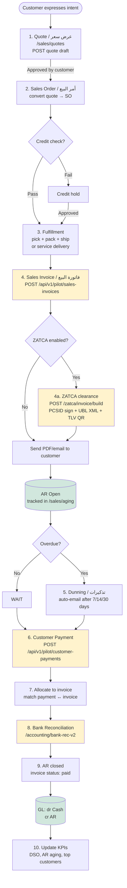
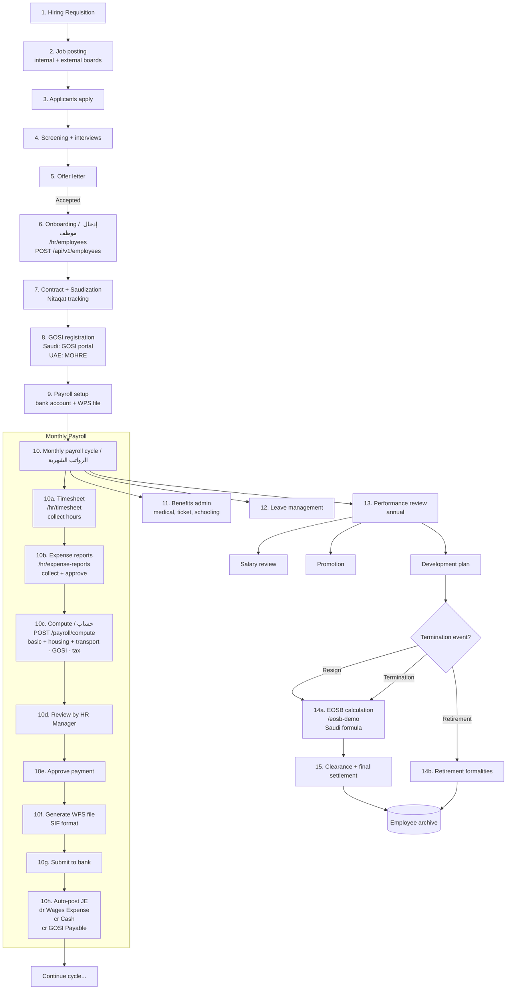
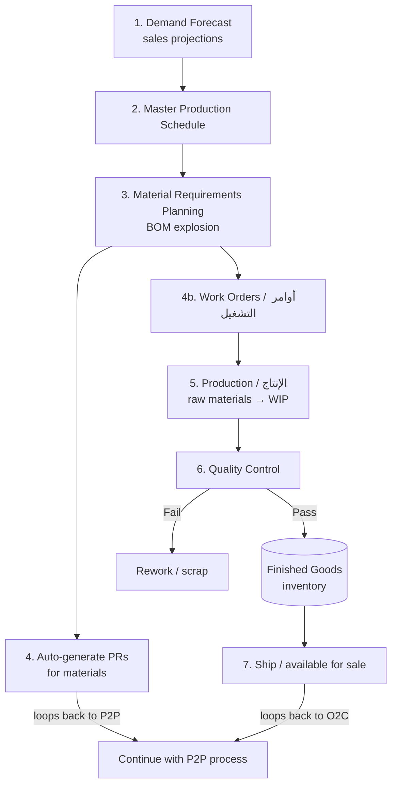
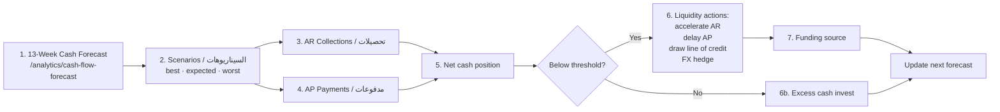
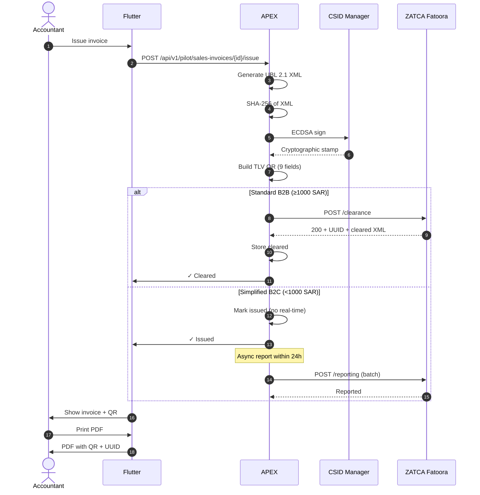
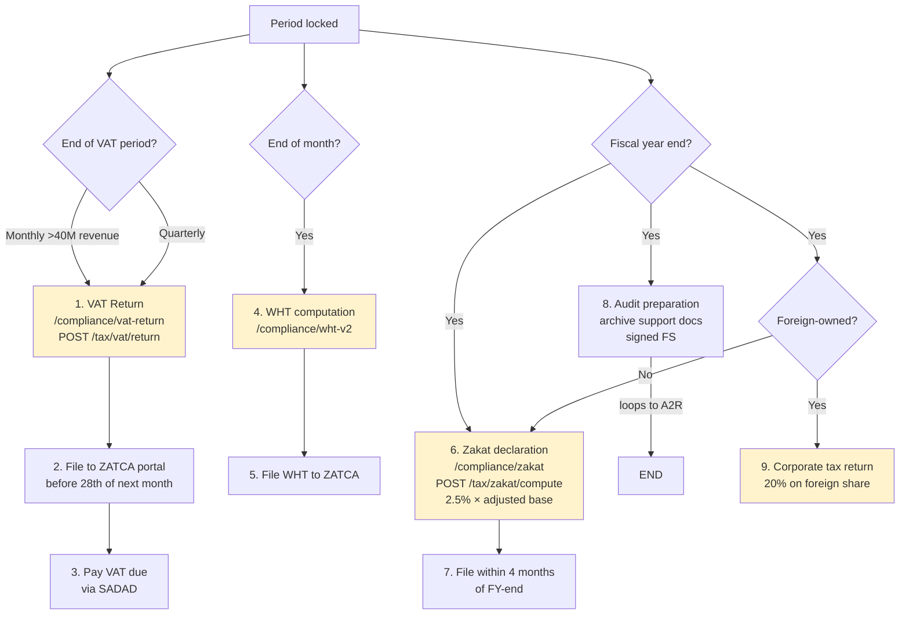
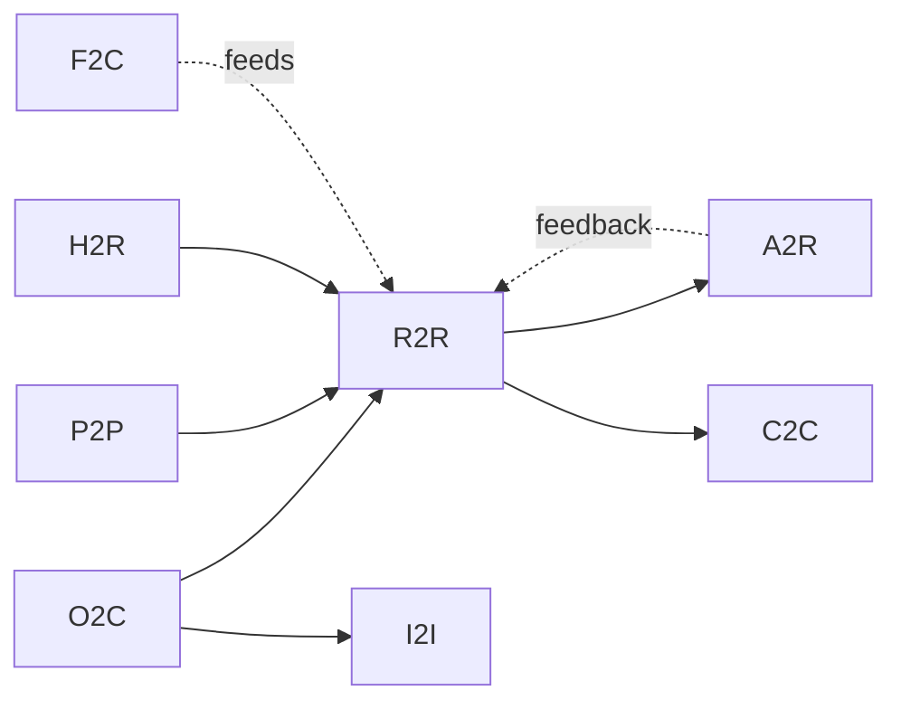

# 16 — Business Processes / العمليات التجارية الكاملة

> Reference: continues from `15_DDD_BOUNDED_CONTEXTS.md`. Next: `17_STATE_MACHINES.md`.
> **Goal:** End-to-end business process diagrams for every major financial cycle, mapped to APEX implementation.

---

## Process Catalog / فهرس العمليات

| Code | Process EN | Process AR | APEX Module |
|------|-----------|-----------|-------------|
| **O2C** | Order-to-Cash | من الطلب إلى التحصيل | Sales + Pilot |
| **P2P** | Procure-to-Pay | من الشراء إلى الدفع | Purchase + Pilot |
| **R2R** | Record-to-Report | من التسجيل إلى التقرير | Accounting + Compliance |
| **H2R** | Hire-to-Retire | من التوظيف إلى التقاعد | HR + Payroll |
| **A2R** | Audit-to-Report | من المراجعة إلى التقرير | Audit |
| **P2P_M** | Plan-to-Produce (Manufacturing) | التخطيط للإنتاج | Operations + Inventory |
| **F2C** | Forecast-to-Cash | من التوقع إلى النقد | FP&A + Treasury |
| **I2I** | Invoice-to-Inquire (Tax) | الفاتورة الإلكترونية | ZATCA Compliance |
| **L2C** | Lead-to-Close (Sales CRM) | من العميل المحتمل للإغلاق | CRM (future) |
| **C2C** | Close-to-Compliance | من الإقفال إلى الامتثال | Period Close + Tax |

---

## 1. Order-to-Cash (O2C) / من الطلب إلى التحصيل



### Key APEX touchpoints
| Step | Screen | API |
|------|--------|-----|
| 1 | `/sales/quotes` | `POST /api/v1/pilot/quotes` |
| 4 | `/sales/invoices` | `POST /api/v1/pilot/sales-invoices` + `/issue` |
| 4a | (background) | `POST /zatca/invoice/build` |
| 6 | `/sales/payment/{invoiceId}` | `POST /api/v1/pilot/customer-payments` |
| 8 | `/accounting/bank-rec-v2` | `POST /bank-rec/compute` |

### Ratios computed
- DSO (Days Sales Outstanding) = AR ÷ daily revenue
- Cash conversion cycle
- AR turnover

---

## 2. Procure-to-Pay (P2P) / من الشراء إلى الدفع

```mermaid
flowchart TB
    START([Need identified]) --> PR[1. Purchase Requisition / طلب شراء<br/>/operations/purchase-cycle]
    PR -->|Manager approval| RFQ[2. RFQ / طلب عرض أسعار<br/>send to 3+ vendors]
    RFQ --> COMP[3. Compare bids<br/>price/quality/lead-time]
    COMP --> PO[4. Purchase Order / أمر شراء<br/>POST /api/v1/pilot/purchase-orders]
    PO --> APP{Approval?}
    APP -->|Manager| APP2{Director if >50K?}
    APP -->|≤5K| AUTO[Auto-approved]
    APP2 -->|Yes| BOARD{CFO if >500K?}
    APP2 -->|No| ISS[Issue PO to vendor]
    BOARD -->|Yes| CEO[CEO/Board approval]
    BOARD -->|No| ISS
    AUTO --> ISS
    CEO --> ISS

    ISS --> RECV[5. Goods Receipt / استلام البضاعة<br/>POST /api/v1/pilot/goods-receipts]
    RECV --> INSP[6. Inspection<br/>quality check]
    INSP -->|Accepted| GRNI[(GRNI Accrual<br/>dr Inventory<br/>cr GRNI)]
    INSP -->|Rejected| RTV[Return to vendor]

    GRNI --> BILL[7. Vendor Bill / فاتورة المورد<br/>POST /api/v1/pilot/purchase-invoices]
    BILL --> MATCH[8. 3-Way Match<br/>PO ↔ Receipt ↔ Bill]
    MATCH -->|Match| POST[9. Post bill<br/>POST /...purchase-invoices/{id}/post]
    MATCH -->|Mismatch| EXC[Exception queue]
    EXC -->|Resolved| POST

    POST --> AP[(AP Open<br/>tracked in /purchase/aging)]
    AP --> SCHED[10. Payment scheduling<br/>by due date + early discount]
    SCHED --> PAY[11. Vendor Payment<br/>POST /api/v1/pilot/vendor-payments<br/>via SAMA / wire / check]
    PAY --> RECON[12. Bank reconciliation]
    RECON --> CLOSE[13. AP closed<br/>bill status: paid]
    CLOSE --> GL[(GL: dr AP<br/>cr Cash)]

    classDef api fill:#fff3cd
    class PO,RECV,BILL,POST,PAY api
```

### 3-Way Match Algorithm
```
For each Bill line:
  Find matching PO line by item + price + qty
  Find matching Receipt by PO line
  Tolerance:
    Price variance ≤ 2% OR ≤ 100 SAR
    Qty variance: 0 (exact)
  If all match → auto-post
  Else → exception queue
```

---

## 3. Record-to-Report (R2R) / من التسجيل إلى التقرير

```mermaid
flowchart TB
    DAILY[Daily transactions<br/>via O2C / P2P / Payroll<br/>auto-generate JEs]
    DAILY --> GL[(General Ledger<br/>app/pilot/journal_entries)]

    MID[Mid-month] --> BANKREC[1. Bank Reconciliation<br/>weekly cadence]
    BANKREC --> GL

    MEND[Month-end / إقفال الشهر] --> ACCRUAL[2. Accruals<br/>unbilled revenue<br/>unbilled expenses<br/>GRNI]
    ACCRUAL --> DEP[3. Depreciation<br/>POST /depreciation/compute<br/>auto-post JE per asset class]
    DEP --> AMORT[4. Amortization<br/>prepaid expenses<br/>intangibles<br/>POST /amortization/compute]
    AMORT --> FX[5. FX Revaluation<br/>foreign currency balances<br/>spot rate from API]
    FX --> ALLOC[6. Allocations<br/>shared services<br/>cost center distribution]
    ALLOC --> ELIM[7. Inter-company elim<br/>multi-entity only]
    ELIM --> ADJ[8. Manual adjustments<br/>by accountant]

    ADJ --> TB[9. Trial Balance<br/>GET /api/v1/pilot/entities/{id}/trial-balance]
    TB --> CHECK{TB balanced?<br/>Σ debit = Σ credit}
    CHECK -->|No| ADJ
    CHECK -->|Yes| FS[10. Financial Statements]

    FS --> IS[Income Statement<br/>/compliance/financial-statements]
    FS --> BS[Balance Sheet]
    FS --> CF[Cash Flow Statement]
    FS --> EQ[Equity Changes]
    FS --> NOTES[Notes & disclosures]

    IS --> RATIO[11. Ratios<br/>POST /ratios/compute]
    BS --> RATIO
    CF --> RATIO

    RATIO --> VAR[12. Variance Analysis<br/>actual vs budget vs PY]
    VAR --> EXEC[13. Executive Dashboard<br/>/compliance/executive]
    EXEC --> SIGN[14. Sign-off]
    SIGN --> LOCK[15. Lock period<br/>POST /period-close/lock]
    LOCK --> ARCH[(Archived for 10 years<br/>SOCPA requirement)]

    classDef state fill:#d1e7dd
    class GL,TB,FS,ARCH state
    classDef compute fill:#fff3cd
    class DEP,AMORT,FX,RATIO compute
```

### Period Close Calendar Template (5-day close)

| Day | Activity | Owner |
|-----|----------|-------|
| -3 | Cutoff communication | Controller |
| -1 | Last day for invoices | All |
| 0 | Period ends | — |
| +1 | Bank rec, AR/AP confirms, accruals draft | Staff |
| +2 | Depreciation, amortization, FX reval | Staff |
| +3 | TB review, intercompany match, adjustments | Senior |
| +4 | FS draft, variance analysis, KAM identified | Manager |
| +5 | Partner review, sign-off, period lock | Partner |

---

## 4. Hire-to-Retire (H2R) / من التوظيف إلى التقاعد



### EOSB Formula (Saudi Labor Law)
```
First 5 years: 0.5 month salary per year
After 5 years: 1 full month per year
If resignation: 
  < 2 years → 0
  2-5 years → 1/3 of EOSB
  5-10 years → 2/3 of EOSB
  > 10 years → full EOSB
```

---

## 5. Audit-to-Report (A2R) / من المراجعة إلى التقرير

```mermaid
flowchart TB
    ENG[1. Engagement Letter / خطاب الارتباط<br/>/audit/engagements<br/>POST /audit/cases]
    ENG --> ACCEPT[2. Acceptance / قبول الارتباط<br/>independence check<br/>conflict check<br/>capacity check]
    ACCEPT --> TEAM[3. Team Assignment<br/>Partner · Manager · Senior · Staff · EQR]
    TEAM --> PLAN[4. Planning / التخطيط<br/>ISA 300]

    PLAN --> RA[5. Risk Assessment / تقييم المخاطر<br/>ISA 315<br/>/compliance/risk-register]
    RA --> MAT[6. Materiality / الأهمية النسبية<br/>ISA 320<br/>5% PBT or 1% revenue]
    MAT --> PROG[7. Audit Program<br/>procedures library 200+]

    PROG --> TB_IMP[8. Import client TB+GL<br/>POST /tb/uploads<br/>bind to CoA]
    TB_IMP --> ANALYTICS[9. Analytics / تحليلات<br/>Benford, outliers, duplicates<br/>POST /ai/benford/analyze]
    ANALYTICS --> SAMP[10. Sampling / العينات<br/>ISA 530<br/>MUS / stratified / random]

    SAMP --> WALK[11. Walkthroughs<br/>inquiry + observation +<br/>inspection + re-perform]
    WALK --> TOC[12. Tests of Controls / اختبار الضوابط<br/>design + operating effectiveness]
    TOC -->|Effective| SUBSTANTIVE_REDUCED[Substantive: reduced]
    TOC -->|Ineffective| SUBSTANTIVE_FULL[Substantive: full]

    SUBSTANTIVE_REDUCED --> TOD[13. Tests of Details<br/>per cycle + assertion]
    SUBSTANTIVE_FULL --> TOD

    TOD --> WP[14. Workpapers<br/>preparer + reviewer sign-off<br/>POST /audit/workpapers/{id}/review]
    WP --> FIND[15. Findings / الملاحظات<br/>MW / SD / MLI<br/>POST /audit/findings]

    FIND --> REVIEW[16. Review hierarchy / مراجعات]
    REVIEW --> MGRREV[Manager review]
    MGRREV --> PARTREV[Partner review]
    PARTREV --> EQR{EQR required?}
    EQR -->|Listed/PIE| EQRREV[EQR concurrence]
    EQR -->|Otherwise| OPINION
    EQRREV --> OPINION[17. Form Opinion / إبداء الرأي<br/>ISA 700<br/>Unmodified / Qualified / Adverse / Disclaimer]

    OPINION --> REP[18. Audit Report<br/>SOCPA template<br/>+ KAM + Other Info]
    REP --> ML[19. Management Letter / خطاب الإدارة<br/>findings + recommendations]
    ML --> ARCH[20. Archive 10 years<br/>SOCPA Article 16]

    classDef plan fill:#cfe2ff
    class PLAN,RA,MAT,PROG plan
    classDef field fill:#fff3cd
    class TB_IMP,ANALYTICS,SAMP,WALK,TOC,TOD,WP field
    classDef report fill:#d1e7dd
    class OPINION,REP,ML,ARCH report
```

---

## 6. Plan-to-Produce (P2P_M) / التخطيط للإنتاج



(For APEX: Manufacturing not in current scope but architecture should accommodate Phase 2 industries.)

---

## 7. Forecast-to-Cash (F2C) / من التوقع إلى النقد



---

## 8. Invoice-to-Inquire (ZATCA Phase 2) / دورة الفاتورة الإلكترونية



---

## 9. Close-to-Compliance (C2C) / من الإقفال إلى الامتثال



---

## 10. Cross-Process Touchpoints / نقاط الاتصال



---

## Process Maturity Targets / أهداف نضج العمليات

| Process | Today (estimated) | 6mo target | 12mo target |
|---------|-------------------|------------|-------------|
| O2C | Manual + partial automation | Full O2C automation | Predictive AR |
| P2P | Manual | 3-way match | AP automation + AI |
| R2R | 10-day close | 5-day close | 3-day close |
| H2R | Basic payroll | Full HR | HR+performance+L&D |
| A2R | Skeleton | Full audit module | AI-assisted audit |
| C2C | ZATCA Phase 2 KSA | + UAE FTA + Egypt ETA | + multi-jurisdiction |

---

**Continue → `17_STATE_MACHINES.md`**
