# 17 — State Machines / آلات الحالة

> Reference: continues from `16_BUSINESS_PROCESSES.md`. Next: `18_SECURITY_AND_THREAT_MODEL.md`.
> **Goal:** Every business entity in APEX as a formal state machine with allowed transitions, guards, and side-effects.

---

## Why state machines? / لماذا آلات الحالة؟

**EN:** A state machine makes invalid transitions impossible at compile time. Every entity in APEX (User, Subscription, Invoice, JE, Audit Engagement, etc.) has a lifecycle. Documenting and enforcing the lifecycle prevents bugs (e.g., "you can't issue a paid invoice").

**AR:** آلة الحالة تجعل الانتقالات غير الصالحة مستحيلة وقت الترجمة. كل كيان في APEX له دورة حياة. توثيق وتطبيق دورة الحياة يمنع الأخطاء.

---

## 1. User Account / حساب المستخدم

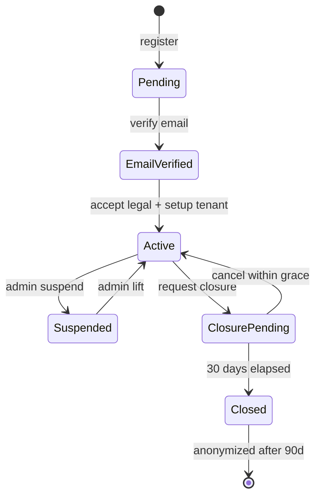
```mermaid
stateDiagram-v2
    [*] --> Pending: register
    Pending --> EmailVerified: verify email
    EmailVerified --> Active: accept legal + setup tenant
    Active --> Suspended: admin suspend
    Suspended --> Active: admin lift
    Active --> ClosurePending: request closure
    ClosurePending --> Active: cancel within grace
    ClosurePending --> Closed: 30 days elapsed
    Closed --> [*]: anonymized after 90d
```

**Guards:**
- `Pending → EmailVerified`: token in email link must match
- `EmailVerified → Active`: must accept latest legal + complete onboarding
- `Active → Suspended`: requires admin role + reason
- `ClosurePending → Closed`: scheduler runs daily

**Side effects:**
- On `EmailVerified`: send welcome email
- On `Active`: emit `UserRegistered` domain event, seed default plan (free)
- On `Suspended`: revoke all sessions
- On `Closed`: anonymize PII, retain audit log

---

## 2. Subscription / الاشتراك

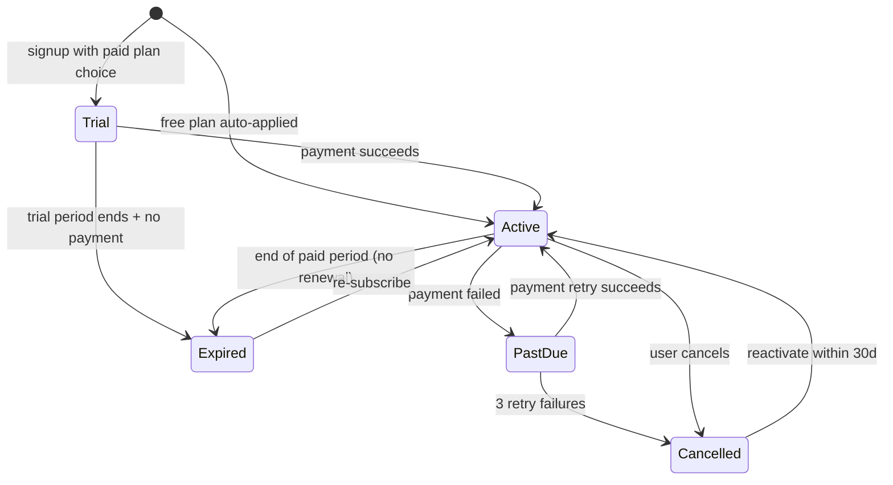
```mermaid
stateDiagram-v2
    [*] --> Trial: signup with paid plan choice
    [*] --> Active: free plan auto-applied
    Trial --> Active: payment succeeds
    Trial --> Expired: trial period ends + no payment
    Active --> PastDue: payment failed
    PastDue --> Active: payment retry succeeds
    PastDue --> Cancelled: 3 retry failures
    Active --> Cancelled: user cancels
    Cancelled --> Active: reactivate within 30d
    Active --> Expired: end of paid period (no renewal)
    Expired --> Active: re-subscribe
```

**Guards:**
- `Trial → Active`: Stripe webhook `payment_succeeded`
- `Active → PastDue`: Stripe webhook `payment_failed` + invoice.dueDate passed
- `PastDue → Cancelled`: 3 failures or 14 days elapsed

**Side effects:**
- On `Active`: refresh entitlements
- On `Cancelled`: downgrade to free plan after current period
- On `Expired`: read-only access for 30d, then features disabled

---

## 3. Sales Invoice / فاتورة البيع

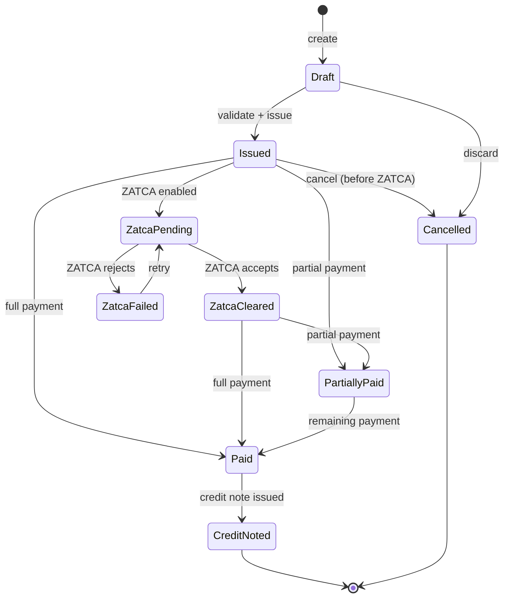
```mermaid
stateDiagram-v2
    [*] --> Draft: create
    Draft --> Issued: validate + issue
    Issued --> ZatcaPending: ZATCA enabled
    Issued --> PartiallyPaid: partial payment
    Issued --> Paid: full payment
    ZatcaPending --> ZatcaCleared: ZATCA accepts
    ZatcaPending --> ZatcaFailed: ZATCA rejects
    ZatcaFailed --> ZatcaPending: retry
    ZatcaCleared --> PartiallyPaid: partial payment
    ZatcaCleared --> Paid: full payment
    PartiallyPaid --> Paid: remaining payment
    Issued --> Cancelled: cancel (before ZATCA)
    Draft --> Cancelled: discard
    Paid --> CreditNoted: credit note issued
    CreditNoted --> [*]
    Cancelled --> [*]
```

**Guards:**
- `Draft → Issued`: must have customer, ≥1 line, totals balanced (sum of lines = subtotal, VAT = subtotal × rate, total = subtotal + VAT)
- `Issued → ZatcaPending`: tenant has ZATCA Phase 2 enabled + has PCSID
- `Issued → Cancelled`: only if no payment recorded
- `Paid → CreditNoted`: requires manager approval + reason

**Side effects:**
- On `Issued`: GL post (dr AR, cr Revenue, cr VAT Payable)
- On `ZatcaCleared`: store UUID + cleared XML; print PDF includes QR + UUID
- On `Paid`: GL post (dr Cash, cr AR); update DSO
- On `CreditNoted`: create reverse JE; refund or vendor balance adjust

---

## 4. Purchase Invoice / فاتورة الشراء

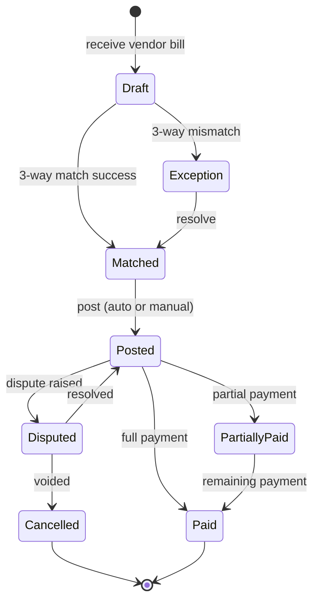
```mermaid
stateDiagram-v2
    [*] --> Draft: receive vendor bill
    Draft --> Matched: 3-way match success
    Draft --> Exception: 3-way mismatch
    Exception --> Matched: resolve
    Matched --> Posted: post (auto or manual)
    Posted --> PartiallyPaid: partial payment
    Posted --> Paid: full payment
    PartiallyPaid --> Paid: remaining payment
    Posted --> Disputed: dispute raised
    Disputed --> Posted: resolved
    Disputed --> Cancelled: voided
    Cancelled --> [*]
    Paid --> [*]
```

**Guards:**
- `Draft → Matched`: PO + Receipt + Bill match within tolerance
- `Matched → Posted`: requires Senior approval if >50K SAR
- `Posted → Paid`: bank transaction reconciled

**Side effects:**
- On `Posted`: GL (dr Inventory/Expense + dr VAT Receivable, cr AP)
- On `Paid`: GL (dr AP, cr Cash)
- On `Disputed`: hold from payment run

---

## 5. Journal Entry / قيد اليومية

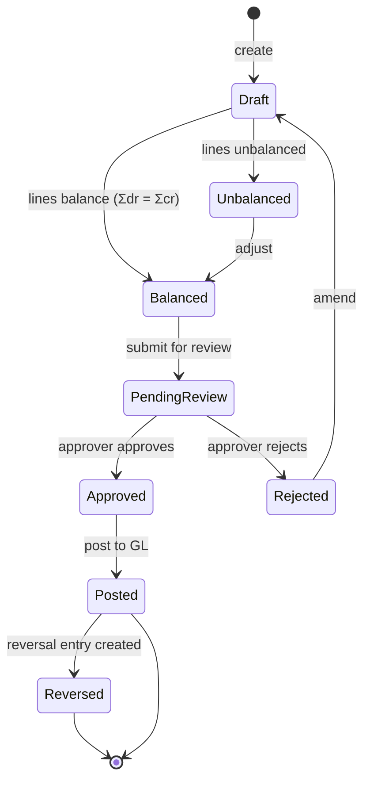
```mermaid
stateDiagram-v2
    [*] --> Draft: create
    Draft --> Balanced: lines balance (Σdr = Σcr)
    Draft --> Unbalanced: lines unbalanced
    Unbalanced --> Balanced: adjust
    Balanced --> PendingReview: submit for review
    PendingReview --> Approved: approver approves
    PendingReview --> Rejected: approver rejects
    Rejected --> Draft: amend
    Approved --> Posted: post to GL
    Posted --> Reversed: reversal entry created
    Reversed --> [*]
    Posted --> [*]
```

**Guards:**
- `Draft → Balanced`: `sum(debits) == sum(credits)` to 2 decimal precision
- `PendingReview → Approved`: cannot self-approve; requires different user
- `Approved → Posted`: period must be open

**Side effects:**
- On `Posted`: write to ledger; immutable thereafter
- On `Reversed`: original cannot be modified; new entry posted with opposite signs

---

## 6. ZATCA Invoice / فاتورة ZATCA

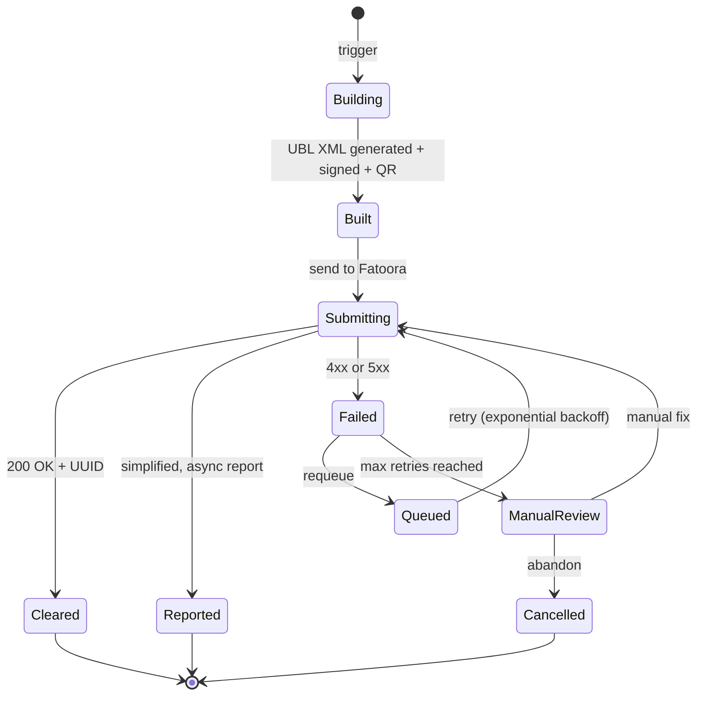
```mermaid
stateDiagram-v2
    [*] --> Building: trigger
    Building --> Built: UBL XML generated + signed + QR
    Built --> Submitting: send to Fatoora
    Submitting --> Cleared: 200 OK + UUID
    Submitting --> Reported: simplified, async report
    Submitting --> Failed: 4xx or 5xx
    Failed --> Queued: requeue
    Queued --> Submitting: retry (exponential backoff)
    Failed --> ManualReview: max retries reached
    ManualReview --> Submitting: manual fix
    ManualReview --> Cancelled: abandon
    Cleared --> [*]
    Reported --> [*]
    Cancelled --> [*]
```

**Guards:**
- `Building → Built`: PCSID active, all mandatory fields present
- `Submitting → Cleared`: HTTP 200 from Fatoora + valid UUID returned
- `Failed → Queued`: retry_count < 5
- `Queued → Submitting`: scheduled time reached (backoff: 2^retry minutes)

**Side effects:**
- On `Built`: store XML + QR + hash
- On `Cleared`: store ZATCA UUID + cleared XML
- On `Failed` (max): notify admin

---

## 7. Audit Engagement / مهمة المراجعة

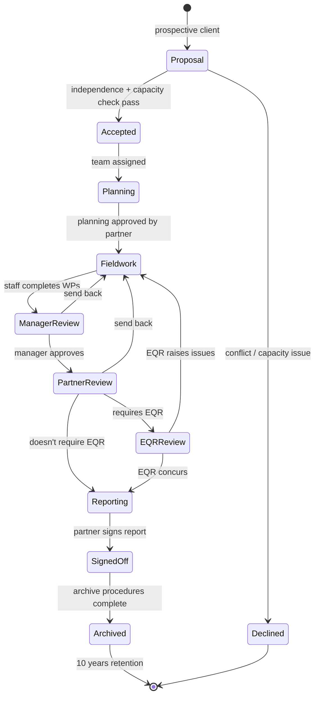
```mermaid
stateDiagram-v2
    [*] --> Proposal: prospective client
    Proposal --> Accepted: independence + capacity check pass
    Proposal --> Declined: conflict / capacity issue
    Accepted --> Planning: team assigned
    Planning --> Fieldwork: planning approved by partner
    Fieldwork --> ManagerReview: staff completes WPs
    ManagerReview --> Fieldwork: send back
    ManagerReview --> PartnerReview: manager approves
    PartnerReview --> Fieldwork: send back
    PartnerReview --> EQRReview: requires EQR
    PartnerReview --> Reporting: doesn't require EQR
    EQRReview --> Reporting: EQR concurs
    EQRReview --> Fieldwork: EQR raises issues
    Reporting --> SignedOff: partner signs report
    SignedOff --> Archived: archive procedures complete
    Archived --> [*]: 10 years retention
    Declined --> [*]
```

**Guards:**
- `Proposal → Accepted`: independence test pass + no conflict + sufficient capacity
- `Planning → Fieldwork`: risk assessment complete + audit program approved
- `PartnerReview → EQRReview`: client is listed entity OR PIE OR public interest
- `Reporting → SignedOff`: opinion paragraph drafted + dated

**Side effects:**
- On `Accepted`: emit `EngagementAccepted` event; create folder structure
- On `SignedOff`: lock all workpapers; assign archival ID
- On `Archived`: encrypt; immutable; auto-purge after 10 years (with override)

---

## 8. Audit Workpaper / ورقة عمل المراجعة

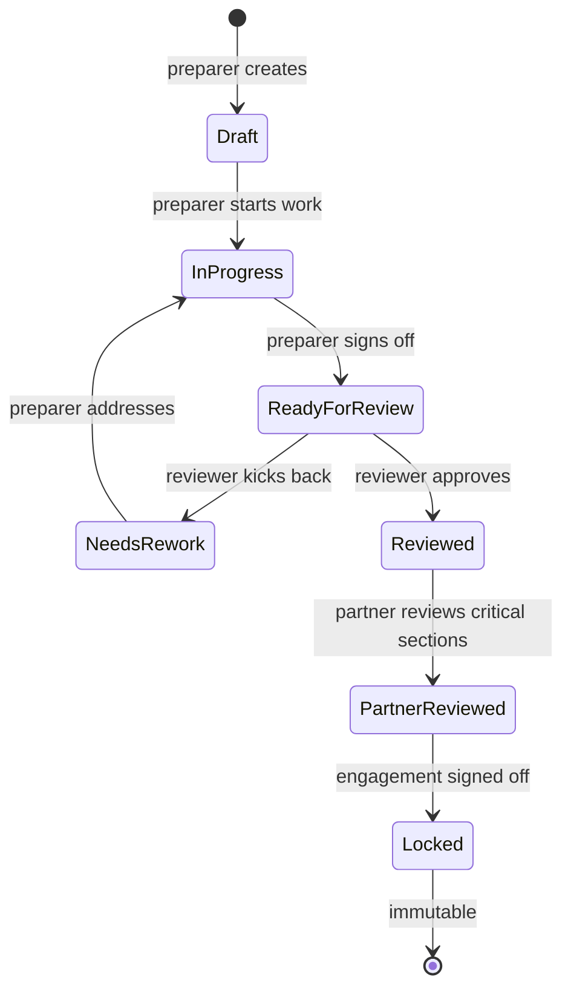
```mermaid
stateDiagram-v2
    [*] --> Draft: preparer creates
    Draft --> InProgress: preparer starts work
    InProgress --> ReadyForReview: preparer signs off
    ReadyForReview --> NeedsRework: reviewer kicks back
    NeedsRework --> InProgress: preparer addresses
    ReadyForReview --> Reviewed: reviewer approves
    Reviewed --> PartnerReviewed: partner reviews critical sections
    PartnerReviewed --> Locked: engagement signed off
    Locked --> [*]: immutable
```

**Guards:**
- `InProgress → ReadyForReview`: all required fields filled (objective, procedure, evidence, conclusion)
- `ReadyForReview → Reviewed`: cannot self-review
- `Reviewed → PartnerReviewed`: only critical workpapers (Material areas)
- `PartnerReviewed → Locked`: engagement state == SignedOff

**Side effects:**
- On `ReadyForReview`: notify reviewer
- On `Reviewed`: timestamp + reviewer ID immutable
- On `Locked`: no edits possible, only view

---

## 9. Period Close Task / مهمة إقفال الفترة

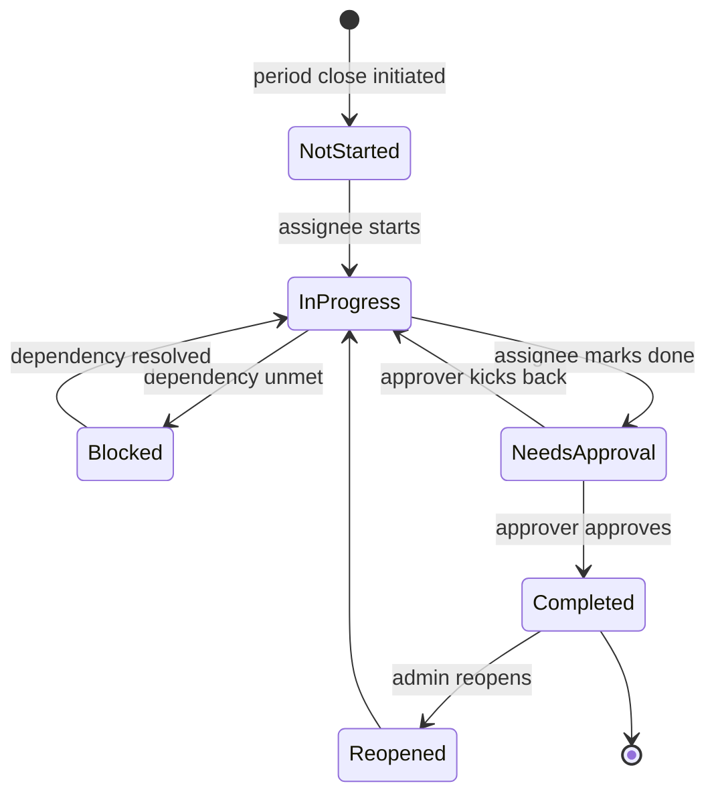
```mermaid
stateDiagram-v2
    [*] --> NotStarted: period close initiated
    NotStarted --> InProgress: assignee starts
    InProgress --> Blocked: dependency unmet
    Blocked --> InProgress: dependency resolved
    InProgress --> NeedsApproval: assignee marks done
    NeedsApproval --> Completed: approver approves
    NeedsApproval --> InProgress: approver kicks back
    Completed --> Reopened: admin reopens
    Reopened --> InProgress
    Completed --> [*]
```

**Guards:**
- `NotStarted → InProgress`: all `blockedBy` tasks completed
- `NeedsApproval → Completed`: requires designated approver

---

## 10. Service Request (Marketplace) / طلب خدمة

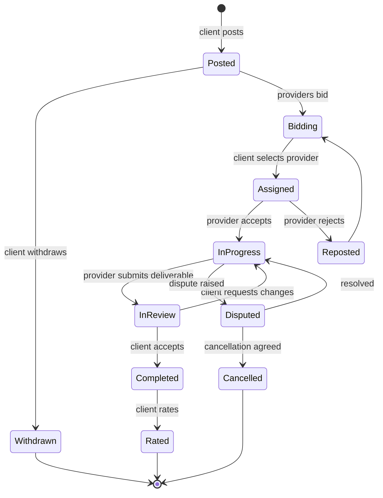
```mermaid
stateDiagram-v2
    [*] --> Posted: client posts
    Posted --> Withdrawn: client withdraws
    Posted --> Bidding: providers bid
    Bidding --> Assigned: client selects provider
    Assigned --> InProgress: provider accepts
    Assigned --> Reposted: provider rejects
    Reposted --> Bidding
    InProgress --> InReview: provider submits deliverable
    InReview --> InProgress: client requests changes
    InReview --> Completed: client accepts
    Completed --> Rated: client rates
    Rated --> [*]
    Withdrawn --> [*]
    InProgress --> Disputed: dispute raised
    Disputed --> InProgress: resolved
    Disputed --> Cancelled: cancellation agreed
    Cancelled --> [*]
```

---

## 11. COA Upload / رفع دليل الحسابات

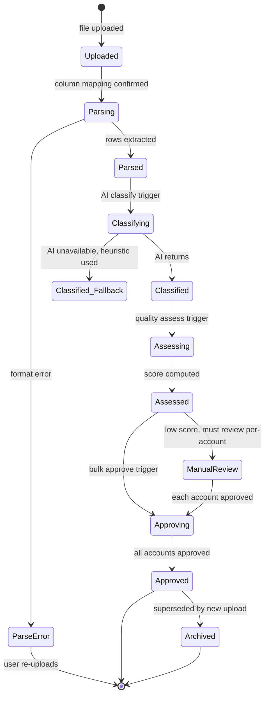
```mermaid
stateDiagram-v2
    [*] --> Uploaded: file uploaded
    Uploaded --> Parsing: column mapping confirmed
    Parsing --> Parsed: rows extracted
    Parsing --> ParseError: format error
    ParseError --> [*]: user re-uploads
    Parsed --> Classifying: AI classify trigger
    Classifying --> Classified: AI returns
    Classifying --> Classified_Fallback: AI unavailable, heuristic used
    Classified --> Assessing: quality assess trigger
    Assessing --> Assessed: score computed
    Assessed --> Approving: bulk approve trigger
    Assessed --> ManualReview: low score, must review per-account
    ManualReview --> Approving: each account approved
    Approving --> Approved: all accounts approved
    Approved --> [*]
    Approved --> Archived: superseded by new upload
    Archived --> [*]
```

---

## 12. TB Binding / ربط ميزان المراجعة

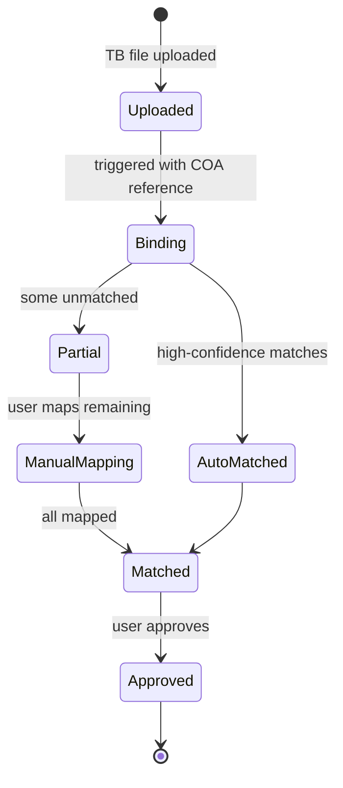
```mermaid
stateDiagram-v2
    [*] --> Uploaded: TB file uploaded
    Uploaded --> Binding: triggered with COA reference
    Binding --> AutoMatched: high-confidence matches
    Binding --> Partial: some unmatched
    Partial --> ManualMapping: user maps remaining
    ManualMapping --> Matched: all mapped
    AutoMatched --> Matched
    Matched --> Approved: user approves
    Approved --> [*]
```

---

## 13. Provider Verification / تحقق من المقدم

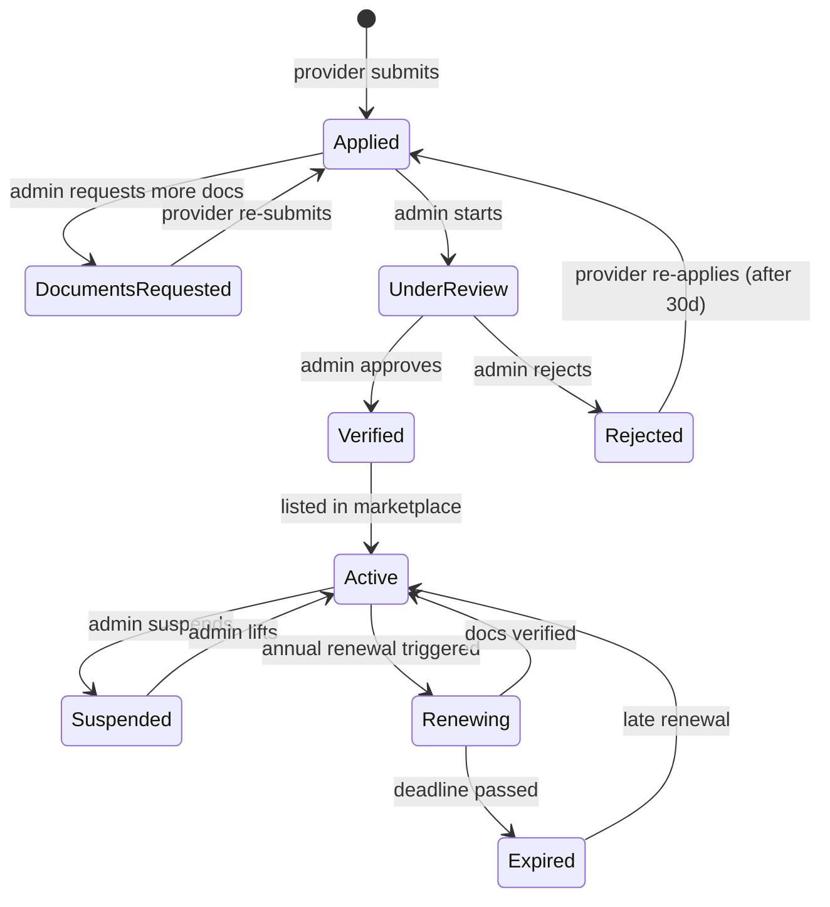
```mermaid
stateDiagram-v2
    [*] --> Applied: provider submits
    Applied --> DocumentsRequested: admin requests more docs
    DocumentsRequested --> Applied: provider re-submits
    Applied --> UnderReview: admin starts
    UnderReview --> Verified: admin approves
    UnderReview --> Rejected: admin rejects
    Rejected --> Applied: provider re-applies (after 30d)
    Verified --> Active: listed in marketplace
    Active --> Suspended: admin suspends
    Suspended --> Active: admin lifts
    Active --> Renewing: annual renewal triggered
    Renewing --> Active: docs verified
    Renewing --> Expired: deadline passed
    Expired --> Active: late renewal
```

---

## 14. Stripe Checkout Session / جلسة دفع Stripe

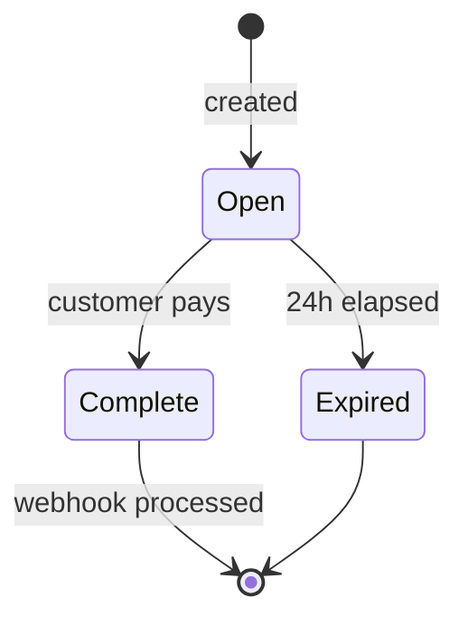
```mermaid
stateDiagram-v2
    [*] --> Open: created
    Open --> Complete: customer pays
    Open --> Expired: 24h elapsed
    Complete --> [*]: webhook processed
    Expired --> [*]
```

---

## 15. Notification Delivery / تسليم الإشعار

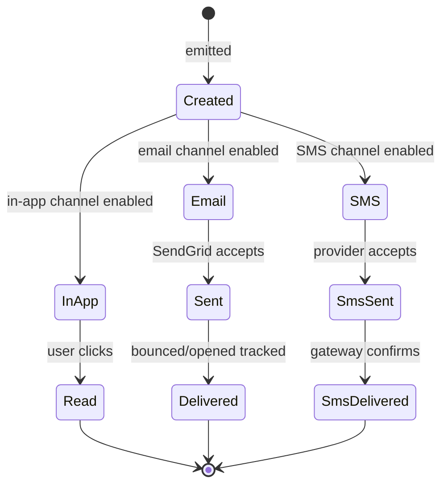
```mermaid
stateDiagram-v2
    [*] --> Created: emitted
    Created --> InApp: in-app channel enabled
    Created --> Email: email channel enabled
    Created --> SMS: SMS channel enabled
    InApp --> Read: user clicks
    Email --> Sent: SendGrid accepts
    Sent --> Delivered: bounced/opened tracked
    SMS --> SmsSent: provider accepts
    SmsSent --> SmsDelivered: gateway confirms
    Read --> [*]
    Delivered --> [*]
    SmsDelivered --> [*]
```

---

## 16. Knowledge Rule / قاعدة المعرفة

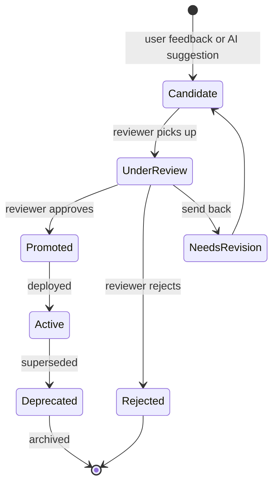
```mermaid
stateDiagram-v2
    [*] --> Candidate: user feedback or AI suggestion
    Candidate --> UnderReview: reviewer picks up
    UnderReview --> Promoted: reviewer approves
    UnderReview --> Rejected: reviewer rejects
    UnderReview --> NeedsRevision: send back
    NeedsRevision --> Candidate
    Promoted --> Active: deployed
    Active --> Deprecated: superseded
    Deprecated --> [*]: archived
    Rejected --> [*]
```

---

## 17. Bank Reconciliation Item / بند مطابقة البنك

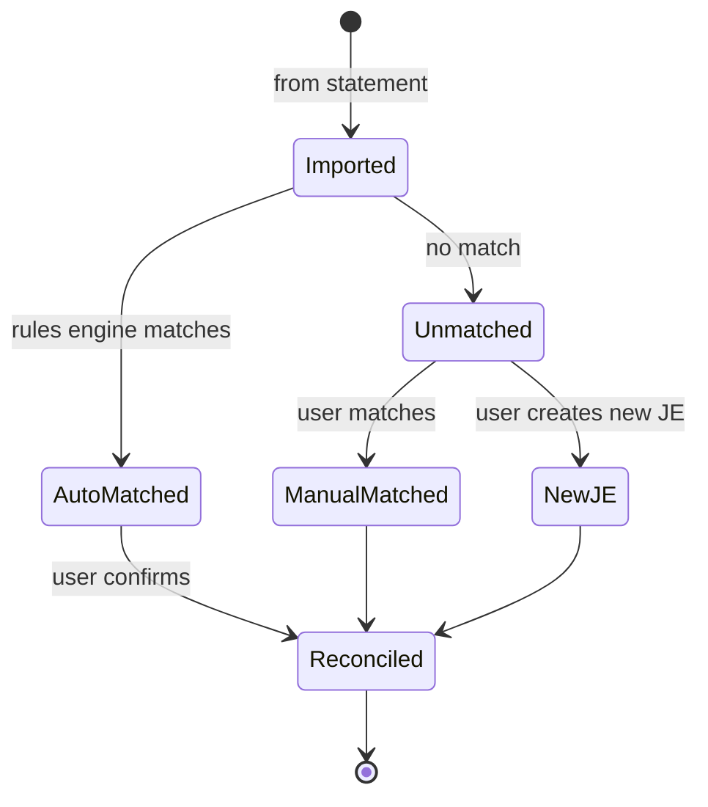
```mermaid
stateDiagram-v2
    [*] --> Imported: from statement
    Imported --> AutoMatched: rules engine matches
    Imported --> Unmatched: no match
    AutoMatched --> Reconciled: user confirms
    Unmatched --> ManualMatched: user matches
    Unmatched --> NewJE: user creates new JE
    ManualMatched --> Reconciled
    NewJE --> Reconciled
    Reconciled --> [*]
```

---

## 18. Tax Filing / إقرار ضريبي

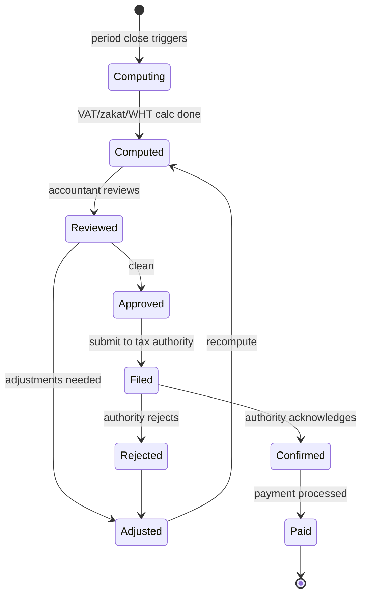
```mermaid
stateDiagram-v2
    [*] --> Computing: period close triggers
    Computing --> Computed: VAT/zakat/WHT calc done
    Computed --> Reviewed: accountant reviews
    Reviewed --> Adjusted: adjustments needed
    Adjusted --> Computed: recompute
    Reviewed --> Approved: clean
    Approved --> Filed: submit to tax authority
    Filed --> Confirmed: authority acknowledges
    Filed --> Rejected: authority rejects
    Rejected --> Adjusted
    Confirmed --> Paid: payment processed
    Paid --> [*]
```

---

## 19. Stripe Subscription / اشتراك Stripe

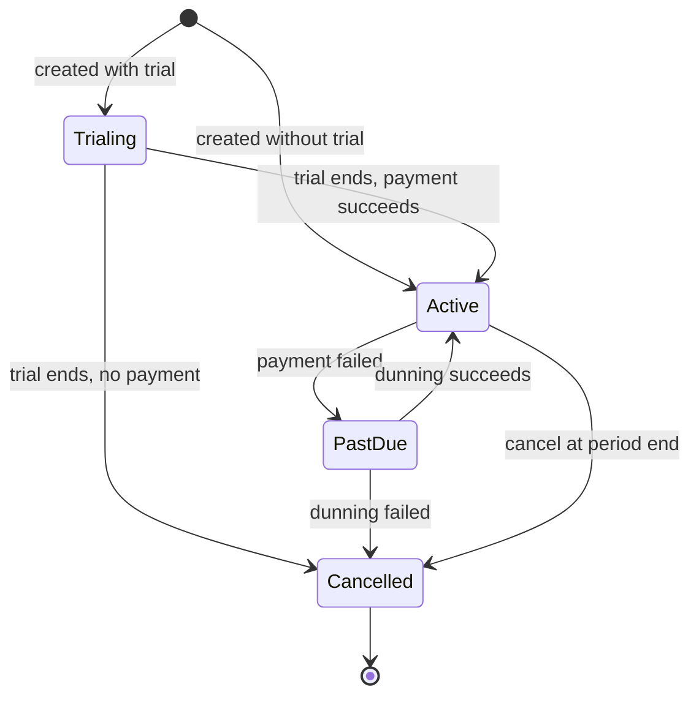
```mermaid
stateDiagram-v2
    [*] --> Trialing: created with trial
    [*] --> Active: created without trial
    Trialing --> Active: trial ends, payment succeeds
    Trialing --> Cancelled: trial ends, no payment
    Active --> PastDue: payment failed
    PastDue --> Active: dunning succeeds
    PastDue --> Cancelled: dunning failed
    Active --> Cancelled: cancel at period end
    Cancelled --> [*]
```

---

## 20. Document Upload (Generic) / رفع مستند

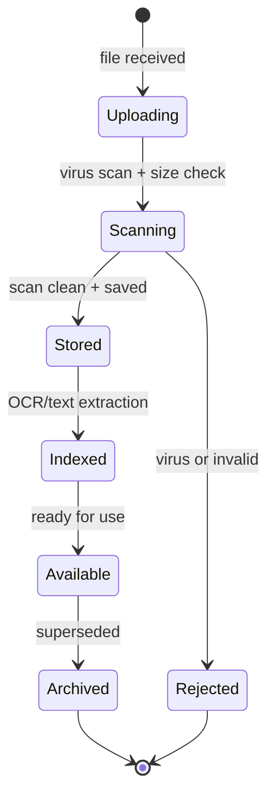
```mermaid
stateDiagram-v2
    [*] --> Uploading: file received
    Uploading --> Scanning: virus scan + size check
    Scanning --> Stored: scan clean + saved
    Scanning --> Rejected: virus or invalid
    Stored --> Indexed: OCR/text extraction
    Indexed --> Available: ready for use
    Available --> Archived: superseded
    Archived --> [*]
    Rejected --> [*]
```

---

## State Machine Implementation Pattern / نمط التنفيذ

### Backend (Python)
```python
from enum import Enum
from typing import Set, Tuple

class InvoiceState(str, Enum):
    DRAFT = "draft"
    ISSUED = "issued"
    ZATCA_PENDING = "zatca_pending"
    ZATCA_CLEARED = "zatca_cleared"
    PARTIALLY_PAID = "partially_paid"
    PAID = "paid"
    CANCELLED = "cancelled"
    CREDIT_NOTED = "credit_noted"

VALID_TRANSITIONS: Set[Tuple[InvoiceState, InvoiceState]] = {
    (InvoiceState.DRAFT, InvoiceState.ISSUED),
    (InvoiceState.DRAFT, InvoiceState.CANCELLED),
    (InvoiceState.ISSUED, InvoiceState.ZATCA_PENDING),
    (InvoiceState.ISSUED, InvoiceState.PARTIALLY_PAID),
    (InvoiceState.ISSUED, InvoiceState.PAID),
    (InvoiceState.ISSUED, InvoiceState.CANCELLED),
    (InvoiceState.ZATCA_PENDING, InvoiceState.ZATCA_CLEARED),
    # ... etc
}

def transition(invoice: SalesInvoice, new_state: InvoiceState, db: Session) -> SalesInvoice:
    if (invoice.status, new_state) not in VALID_TRANSITIONS:
        raise InvalidTransitionError(
            f"Cannot transition from {invoice.status} to {new_state}"
        )
    # Run guard
    _check_guard(invoice, new_state)
    # Apply
    invoice.status = new_state
    db.commit()
    # Side effect
    _apply_side_effect(invoice, new_state, db)
    return invoice
```

### Frontend (Dart)
```dart
class InvoiceStateMachine {
  static const transitions = {
    InvoiceState.draft: [InvoiceState.issued, InvoiceState.cancelled],
    InvoiceState.issued: [
      InvoiceState.zatcaPending,
      InvoiceState.partiallyPaid,
      InvoiceState.paid,
      InvoiceState.cancelled,
    ],
    // ...
  };

  static bool canTransition(InvoiceState from, InvoiceState to) {
    return transitions[from]?.contains(to) ?? false;
  }

  static List<InvoiceState> availableActions(InvoiceState current) {
    return transitions[current] ?? [];
  }
}

// Usage in UI: only show buttons for valid transitions
final actions = InvoiceStateMachine.availableActions(invoice.state);
return Wrap(children: actions.map((a) => ActionButton(state: a)).toList());
```

---

## State Machine Test Pattern / نمط اختبار آلة الحالة

```python
import pytest

@pytest.mark.parametrize("from_state,to_state,should_allow", [
    (InvoiceState.DRAFT, InvoiceState.ISSUED, True),
    (InvoiceState.DRAFT, InvoiceState.PAID, False),  # cannot skip Issued
    (InvoiceState.PAID, InvoiceState.DRAFT, False),  # no going back
    (InvoiceState.CANCELLED, InvoiceState.ISSUED, False),  # terminal
])
def test_invoice_state_transitions(from_state, to_state, should_allow):
    assert ((from_state, to_state) in VALID_TRANSITIONS) == should_allow
```

---

## Audit Trail / سجل تدقيق آلة الحالة

Every state transition emits a domain event:

```python
audit_log(
    db,
    user=current_user,
    event_type="invoice.state_transition",
    resource=f"sales_invoice/{invoice.id}",
    before_state={"status": old_state.value},
    after_state={"status": new_state.value},
)
```

This gives full lineage: who changed what, when, and why.

---

**Continue → `18_SECURITY_AND_THREAT_MODEL.md`**
