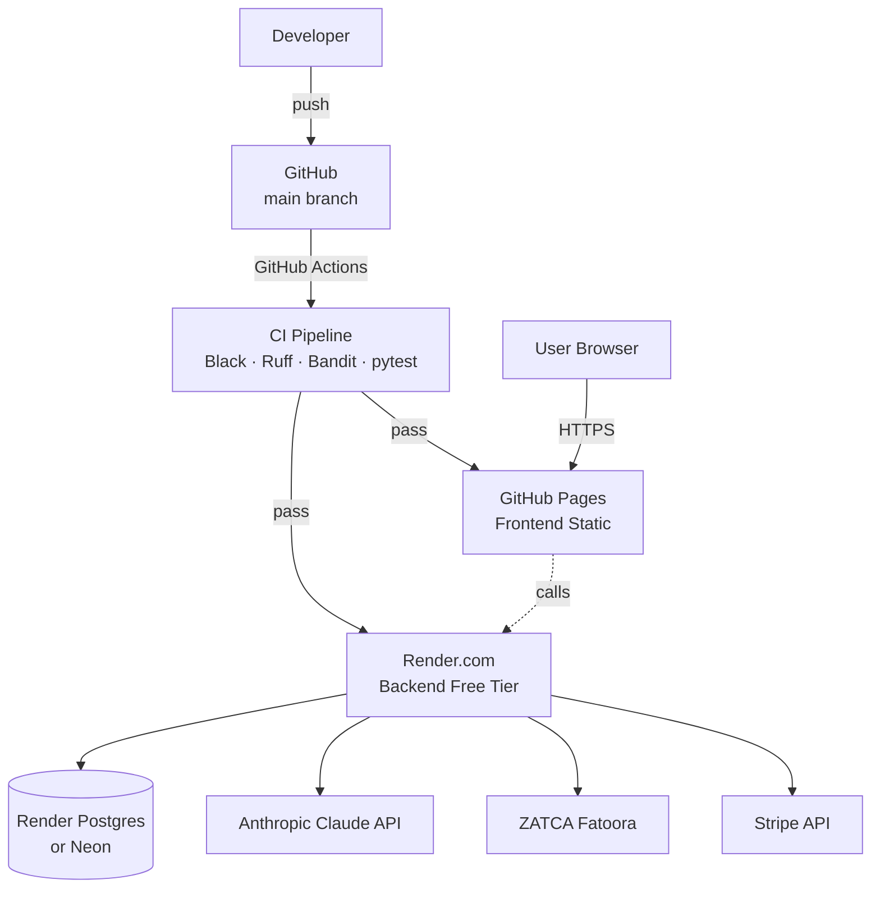
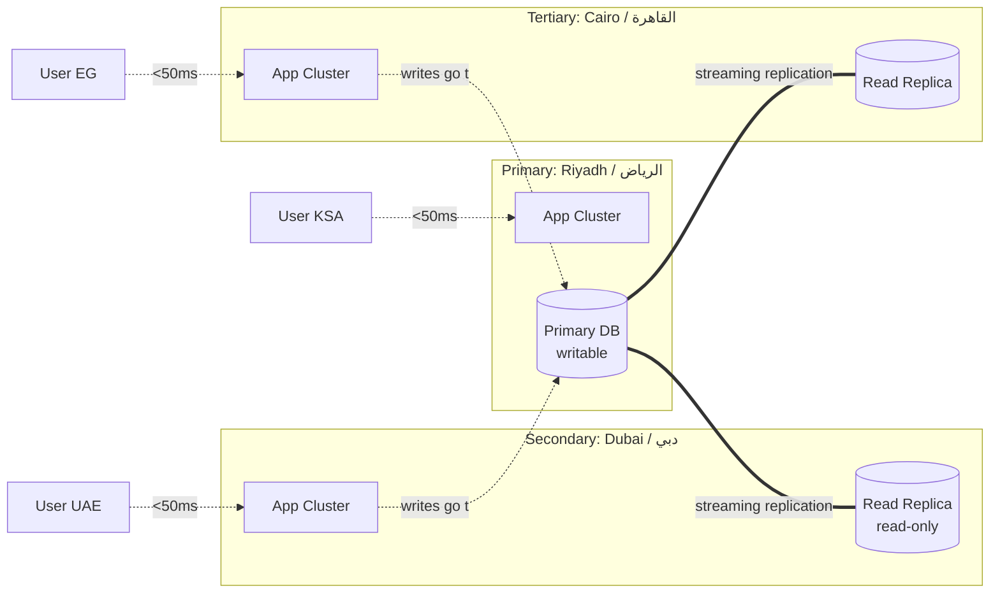
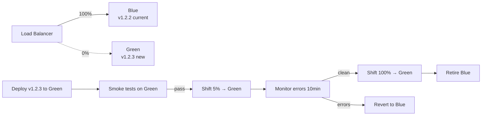
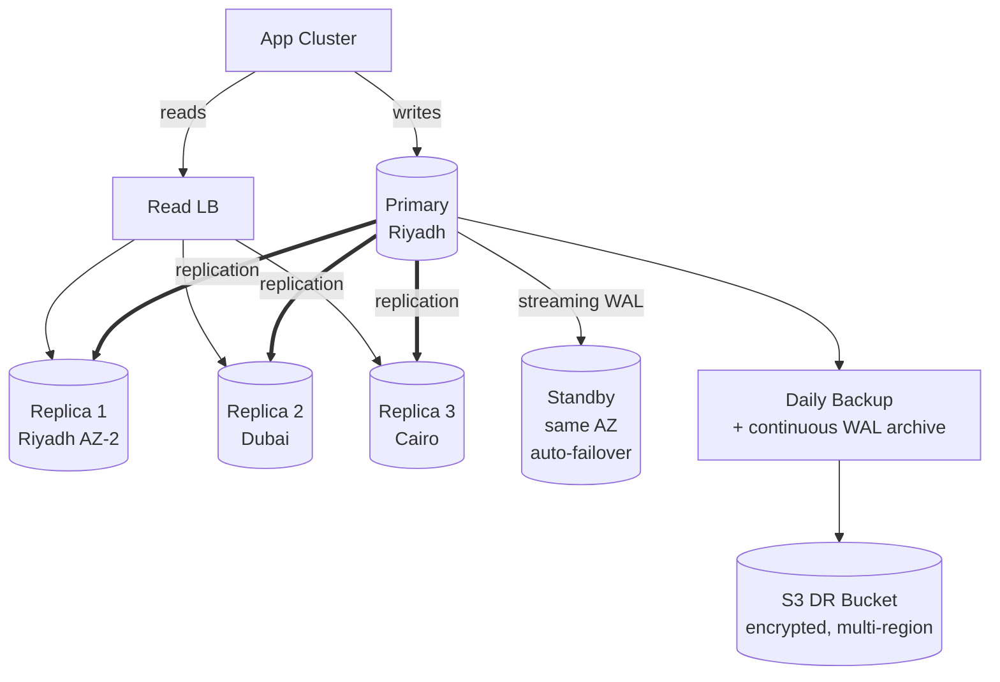
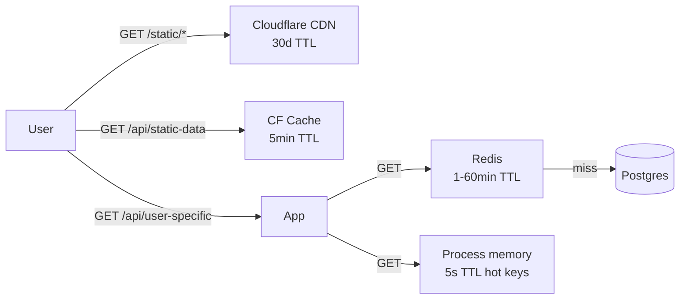
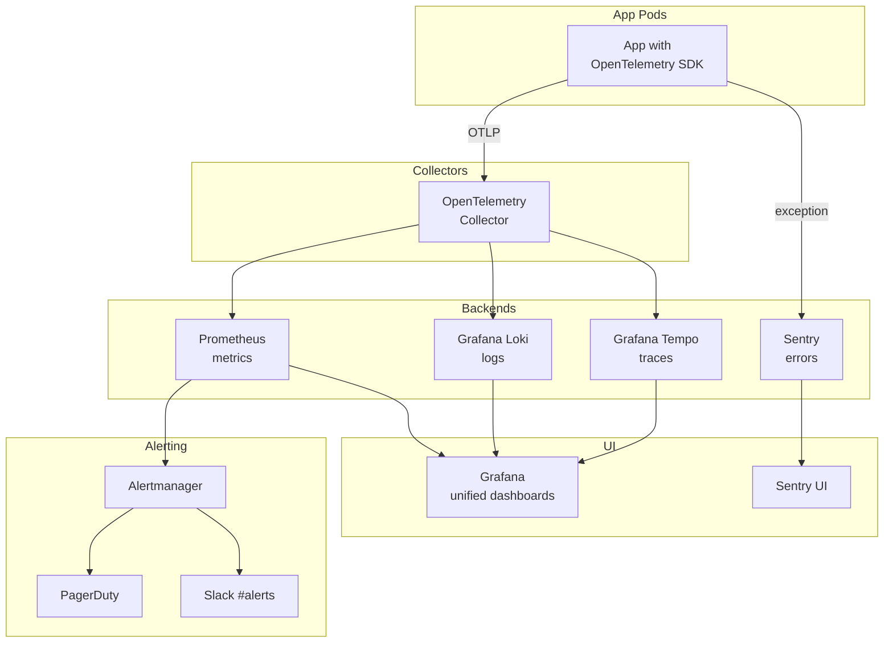
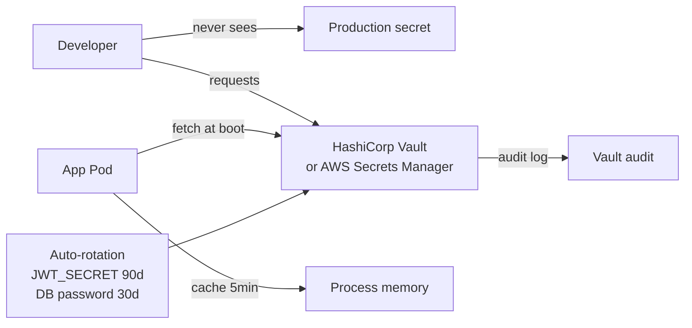

# 19 — Deployment Topology / طوبولوجيا النشر

> Reference: continues from `18_SECURITY_AND_THREAT_MODEL.md`. Next: `20_INTEGRATION_ECOSYSTEM.md`.

---

## 1. Current State / الوضع الحالي



**Issues with current:**
- Cold-start (~30s) on Render free tier after 15min idle
- Single region (US-Oregon)
- No DR / no replica
- Logs only in Render UI (no aggregation)
- No structured monitoring / alerting

---

## 2. Target Architecture (Production-Ready) / البنية المستهدفة

```mermaid
graph TB
    subgraph "Edge / حافة الشبكة"
        CF[Cloudflare<br/>WAF + DDoS + CDN]
        CF_CACHE[CF Cache<br/>static assets]
    end

    subgraph "Region: Saudi Arabia / منطقة السعودية"
        ALB1[Load Balancer]
        APP1A[App Pod 1<br/>FastAPI + uvicorn]
        APP1B[App Pod 2]
        APP1C[App Pod 3<br/>auto-scale]
        WORKER1A[Worker Pod 1<br/>Celery / RQ<br/>ZATCA queue · Email]
        WORKER1B[Worker Pod 2]
        SCHED1[Scheduler<br/>APScheduler / Beat]
    end

    subgraph "Region: UAE / منطقة الإمارات"
        ALB2[Load Balancer]
        APP2A[App Pod 1]
        APP2B[App Pod 2]
        WORKER2A[Worker]
    end

    subgraph "Data Layer / طبقة البيانات"
        PRIMARY[(PostgreSQL Primary<br/>Saudi region<br/>multi-AZ)]
        REPLICA[(Read Replicas<br/>UAE + Saudi)]
        REDIS[(Redis<br/>cache + sessions + queue)]
        S3[(S3-compatible<br/>uploads, files)]
        KMS[KMS / HSM<br/>ZATCA keys]
        VAULT[HashiCorp Vault<br/>secrets]
    end

    subgraph "Observability / المراقبة"
        SENTRY[Sentry<br/>error tracking]
        LOGTAIL[Logtail / Loki<br/>log aggregation]
        PROM[Prometheus<br/>metrics]
        GRAF[Grafana<br/>dashboards]
        UPTIME[UptimeRobot<br/>health checks]
        PAGER[PagerDuty<br/>on-call alerts]
    end

    subgraph "External Services"
        ANTHROPIC[Anthropic Claude]
        ZATCA[ZATCA Fatoora KSA]
        FTA[FTA UAE]
        ETA[ETA Egypt]
        STRIPE[Stripe API]
        SAMA[SAMA Open Banking]
        SENDGRID[SendGrid]
        TWILIO[Twilio / Unifonic]
    end

    USER[User] --> CF
    CF -->|geographic routing| ALB1
    CF -->|geographic routing| ALB2
    CF_CACHE --> CF

    ALB1 --> APP1A & APP1B & APP1C
    ALB2 --> APP2A & APP2B

    APP1A & APP1B & APP1C --> PRIMARY
    APP2A & APP2B --> REPLICA
    APP1A --> REDIS
    APP2A --> REDIS

    WORKER1A & WORKER1B --> PRIMARY
    WORKER1A --> ZATCA
    WORKER1A --> SENDGRID
    WORKER1A --> TWILIO

    SCHED1 --> WORKER1A

    APP1A --> S3
    APP1A --> KMS
    APP1A --> VAULT

    APP1A --> ANTHROPIC
    APP1A --> STRIPE
    APP1A --> SAMA
    APP2A --> FTA

    APP1A & APP2A -.metrics.-> PROM
    APP1A & APP2A -.errors.-> SENTRY
    APP1A & APP2A -.logs.-> LOGTAIL
    PROM --> GRAF
    UPTIME --> PAGER

    classDef edge fill:#cfe2ff
    class CF,CF_CACHE edge
    classDef compute fill:#d1e7dd
    class APP1A,APP1B,APP1C,APP2A,APP2B,WORKER1A,WORKER1B,WORKER2A,SCHED1 compute
    classDef data fill:#fff3cd
    class PRIMARY,REPLICA,REDIS,S3,KMS,VAULT data
    classDef obs fill:#f8d7da
    class SENTRY,LOGTAIL,PROM,GRAF,UPTIME,PAGER obs
```



---

## 3. Multi-Region Strategy / استراتيجية متعددة المناطق



**Routing logic (Cloudflare Workers or DNS geo):**
- Saudi user → Riyadh
- UAE user → Dubai
- Egypt user → Cairo
- Failover: if primary down, all traffic to next-closest region

**Data residency:**
- Saudi data stays in Saudi region (PDPL requirement for sensitive data)
- Per-tenant `region` column controls which DB cluster

---

## 4. Container & Orchestration / الحاويات والتنسيق

### Container layout
```dockerfile
# Backend Dockerfile
FROM python:3.11-slim
WORKDIR /app
COPY requirements.txt .
RUN pip install --no-cache-dir -r requirements.txt
COPY app/ ./app/
COPY alembic/ ./alembic/
COPY alembic.ini .
EXPOSE 8000
HEALTHCHECK --interval=30s --timeout=10s \
  CMD curl -f http://localhost:8000/health || exit 1
CMD ["uvicorn", "app.main:app", "--host", "0.0.0.0", "--port", "8000", "--workers", "4"]
```

### Kubernetes manifest (excerpt)
```yaml
apiVersion: apps/v1
kind: Deployment
metadata:
  name: apex-api
spec:
  replicas: 3
  selector:
    matchLabels:
      app: apex-api
  template:
    spec:
      containers:
      - name: api
        image: apex/api:v1.2.3
        ports:
        - containerPort: 8000
        env:
        - name: DATABASE_URL
          valueFrom:
            secretKeyRef:
              name: apex-secrets
              key: database-url
        resources:
          requests:
            cpu: 500m
            memory: 512Mi
          limits:
            cpu: 2000m
            memory: 2Gi
        livenessProbe:
          httpGet:
            path: /health
            port: 8000
          initialDelaySeconds: 30
          periodSeconds: 30
        readinessProbe:
          httpGet:
            path: /health
            port: 8000
          initialDelaySeconds: 5
          periodSeconds: 10
---
apiVersion: autoscaling/v2
kind: HorizontalPodAutoscaler
metadata:
  name: apex-api-hpa
spec:
  scaleTargetRef:
    apiVersion: apps/v1
    kind: Deployment
    name: apex-api
  minReplicas: 3
  maxReplicas: 20
  metrics:
  - type: Resource
    resource:
      name: cpu
      target:
        type: Utilization
        averageUtilization: 70
```

---

## 5. CI/CD Pipeline / خط الإنتاج المستمر

```mermaid
flowchart LR
    DEV[Developer pushes] --> PR[Pull Request]
    PR --> LINT[Lint<br/>black, ruff, bandit]
    LINT --> TEST[Test<br/>pytest + coverage]
    TEST --> SECURITY[Security<br/>pip-audit, trivy]
    SECURITY --> BUILD[Build<br/>docker build + push]
    BUILD --> DEPLOY_STAGE[Deploy to Staging]
    DEPLOY_STAGE --> SMOKE[Smoke tests<br/>+ E2E Playwright]
    SMOKE --> APPROVAL{Human approval}
    APPROVAL -->|approved| DEPLOY_PROD[Deploy Production<br/>blue-green]
    DEPLOY_PROD --> VERIFY[Post-deploy verify<br/>monitoring 30min]
    VERIFY -->|errors| ROLLBACK[Auto-rollback]
    VERIFY -->|clean| COMPLETE[Deploy complete]

    classDef gate fill:#fff3cd
    class APPROVAL,VERIFY gate
```



### Blue-Green Deployment



---

## 6. Database Strategy / استراتيجية قاعدة البيانات

### Topology


### Backup & Recovery
| Type | Frequency | Retention | RPO |
|------|-----------|-----------|-----|
| Full backup | Daily 02:00 UTC | 30 days | 24h |
| WAL archive | Continuous (5min) | 7 days | 5min |
| Snapshot | Weekly | 90 days | 1 week |
| Disaster archive | Monthly | 7 years | 1 month |

### Recovery procedures
- **Single AZ failure:** auto-failover to standby (~30s downtime)
- **Region failure:** manual promote replica → primary (~15min downtime, RPO: replication lag)
- **Data corruption:** PITR (point-in-time recovery) from WAL
- **DR drill:** quarterly, restore to staging, verify integrity

---

## 7. Caching Strategy / استراتيجية التخزين المؤقت



### What's cached
| Data | Layer | TTL |
|------|-------|-----|
| Static assets (JS/CSS/images) | CDN | 30 days |
| Plans, public services catalog | CF + Redis | 5 min |
| User entitlements | Redis | 5 min |
| Session token validation | Process memory | 5 s |
| Knowledge Brain query results | Redis | 1 hour |
| ZATCA CSID public certs | Redis | 24 hours |
| Stock prices / FX rates | Redis | 5 min |

### Cache invalidation
- Subscription change → invalidate `entitlements:{user_id}`
- Plan update → invalidate `plans:*`
- Provider verified → invalidate `marketplace:providers`

---

## 8. Observability Stack / حزمة المراقبة



### Key metrics to dashboard
**Golden signals (every service):**
- Latency p50, p95, p99
- Traffic (RPS)
- Errors (4xx, 5xx rate)
- Saturation (CPU, memory, DB connections)

**Business metrics:**
- Sign-ups per day
- Active subscriptions by plan
- ZATCA clearance success rate
- AI Copilot tokens per day per tenant
- Period-close completion rate

### Alert rules (excerpt)
```yaml
groups:
- name: apex_api
  rules:
  - alert: HighErrorRate
    expr: rate(http_requests_total{status=~"5.."}[5m]) > 0.05
    for: 5m
    labels:
      severity: critical
    annotations:
      summary: "5xx error rate > 5% for 5min"

  - alert: ZatcaClearanceDown
    expr: rate(zatca_clearance_failed[10m]) > 0.1
    for: 10m
    labels:
      severity: high
    annotations:
      summary: "ZATCA clearance >10% failure rate"

  - alert: DatabaseConnectionsExhausted
    expr: pg_stat_database_numbackends / pg_settings_max_connections > 0.8
    for: 5m
    labels:
      severity: high
```

---

## 9. Deployment Environments / بيئات النشر

| Env | Purpose | URL pattern | DB | Auto-deploy |
|-----|---------|-------------|----|-------------|
| `dev-local` | Engineer laptop | `localhost:8000` | SQLite | N/A |
| `dev` | Shared dev | `dev-api.apex.sa` | Dev PG | every commit to `dev` |
| `staging` | Pre-prod testing | `staging-api.apex.sa` | Staging PG (clone of prod) | every commit to `staging` |
| `production` | Live | `api.apex.sa` | Prod PG | manual approval after staging green |
| `dr` | Disaster recovery | `dr-api.apex.sa` | Replica → can be promoted | quarterly drill |

### Branch strategy
```
main          ←── all PRs merge here, auto-deploys to dev
  ↓
release/*     ←── cut from main, auto-deploys to staging
  ↓ (manual)
production    ←── tag-based, deploys to prod
```

---

## 10. Secret Management / إدارة الأسرار



**What's in Vault:**
- `JWT_SECRET` (rotated 90d)
- `ADMIN_SECRET`
- `DATABASE_URL`
- `ANTHROPIC_API_KEY`
- `STRIPE_SECRET_KEY`
- `STRIPE_WEBHOOK_SECRET`
- `SENDGRID_API_KEY`
- `TWILIO_*`
- `S3_*`
- `ZATCA_*` (per-device)

**Never in Git:** `.env*` files in `.gitignore`. CI pulls from Vault. K8s pulls via External Secrets Operator.

---

## 11. Cost Estimate / تقدير التكاليف (Production)

| Component | Provider | Monthly cost (USD) |
|-----------|----------|--------------------|
| Compute (3 app pods + 2 worker) | Hetzner / DO Kubernetes | $300 |
| PostgreSQL Primary + Replica + Standby | Neon / Supabase / RDS | $400 |
| Redis | Upstash / DO | $50 |
| S3 (uploads, backups) | Cloudflare R2 | $20 |
| CDN + WAF | Cloudflare | $20 |
| Sentry | Sentry team plan | $80 |
| Logtail / Loki | self-hosted or Grafana Cloud | $100 |
| Prometheus / Grafana | self-hosted | $0 |
| UptimeRobot | Pro | $10 |
| PagerDuty | starter | $25 |
| Email (SendGrid) | 100K emails | $20 |
| SMS (Twilio + Unifonic) | usage-based | $50 |
| Vault (or AWS Secrets) | HashiCorp Cloud | $40 |
| Anthropic API | usage-based | varies |
| Stripe | 2.9% + 30c per txn | varies |
| **Total fixed (excl. usage)** | | **~$1,115/mo** |
| **Per 1000 active users** | | **~$1.10/user/mo** |

---

## 12. DR / BC Plan / خطة التعافي من الكوارث

### Scenarios
| Scenario | RPO | RTO | Procedure |
|----------|-----|-----|-----------|
| Single pod crash | 0 | 30s | K8s auto-restart |
| AZ failure | 0 | 5min | Multi-AZ failover |
| Region failure | 5min | 30min | Promote replica + DNS update |
| DB corruption | 1h | 4h | PITR from WAL |
| Total provider failure | 1d | 24h | Restore from S3 DR backup to alternate provider |
| Ransomware | 1d | 12h | Restore from offline backup |

### Quarterly DR drill
1. Announce drill window (1 week notice)
2. Restore latest backup to staging environment
3. Verify data integrity (counts, hashes)
4. Run smoke tests
5. Document time-to-recovery
6. Post-mortem + improvements

---

## 13. Migration Path / خطة الترقية

### Phase 1 — Stabilize Render (Week 1-2)
- Move from free tier to Standard ($7/mo) → no cold-start
- Add staging environment
- Add Sentry + UptimeRobot

### Phase 2 — Add observability (Week 3-4)
- Wire OpenTelemetry SDK
- Self-host Grafana stack (or Grafana Cloud)
- Set up alerting

### Phase 3 — Migrate to Kubernetes (Month 2-3)
- Choose provider (DO Kubernetes / Hetzner / Linode)
- Containerize backend
- Deploy with single replica → scale up
- Run in parallel with Render
- Cutover after 30 days clean

### Phase 4 — Multi-region (Month 4-6)
- Add UAE region (read replica + app cluster)
- Implement geo-routing via Cloudflare
- Migrate UAE customers to UAE region
- Test failover

### Phase 5 — DR & compliance (Month 7-9)
- HSM/KMS for ZATCA keys
- Multi-region backups
- SOC 2 audit preparation
- Penetration test

---

## 14. Runbooks / كتيبات التشغيل

### Runbook: Database connection pool exhausted
1. Check current connections: `SELECT * FROM pg_stat_activity;`
2. Identify long-running: `SELECT query, state, query_start FROM pg_stat_activity WHERE state != 'idle' ORDER BY query_start;`
3. Kill stuck queries: `SELECT pg_terminate_backend(pid);`
4. If load → scale up app pods (HPA should do this)
5. Long-term: add `statement_timeout` + connection pool tuning

### Runbook: ZATCA submission failures
1. Check `/zatca/queue/stats` — total failures
2. Check Fatoora portal status (manual)
3. Check CSID expiry: `SELECT * FROM zatca_csid WHERE expires_at < NOW() + INTERVAL '30 days';`
4. If certificate issue → trigger renewal workflow
5. If 5xx from Fatoora → wait 1h + retry queue

### Runbook: Stripe webhook delivery failures
1. Check Sentry for errors in `/stripe/webhook`
2. Stripe Dashboard → Webhooks → check delivery log
3. Common causes:
   - Signature mismatch → check `STRIPE_WEBHOOK_SECRET`
   - Payload too large → log + skip
   - DB connection issue → fix DB
4. Replay failed webhooks via Stripe Dashboard

---

## 15. Compliance Posture / موقف الامتثال

| Standard | Status | Target |
|----------|--------|--------|
| ISO 27001 | Not yet | Year 2 |
| SOC 2 Type I | Not yet | Year 1 Q4 |
| SOC 2 Type II | Not yet | Year 2 |
| PCI DSS SAQ A | Yes (Stripe handles cards) | maintain |
| Saudi PDPL | Working towards | Year 1 Q2 |
| UAE PDPL | Working towards | Year 1 Q3 |
| GDPR (if EU users) | Partial | Year 1 Q3 |

---

**Continue → `20_INTEGRATION_ECOSYSTEM.md`**
