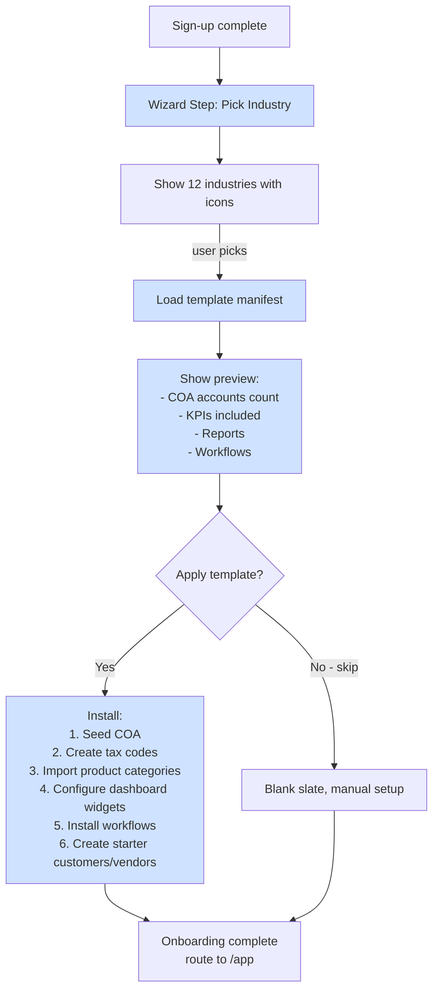

# 21 — Industry Templates / قوالب الصناعات

> Reference: continues from `20_INTEGRATION_ECOSYSTEM.md`. Next: `22_MARKETING_AND_GTM.md`.
> **Goal:** Per-industry feature packs that auto-configure APEX for vertical use cases. Patterns from SAP industry solutions, Odoo apps, NetSuite SuiteSuccess.

---

## 1. Why Industry Templates? / لماذا قوالب الصناعات

**EN:** A new tenant should not start with a blank slate. Picking "Restaurant" should auto-install: industry-specific COA, common products (food categories), tax rates (10% in some KSA cases), POS hardware support, daily Z-report settings, food cost dashboard.

**AR:** المستأجر الجديد لا يبدأ من الصفر. اختيار "مطعم" يثبّت تلقائياً: دليل حسابات للمطاعم، فئات منتجات شائعة (طعام/مشروبات)، أنماط ضريبة، دعم نقاط البيع، Z-Report يومي، لوحة تكلفة الطعام.

---

## 2. Industry Catalog / فهرس الصناعات

| Code | Industry EN | الصناعة | Saudi market % | Priority |
|------|-------------|---------|----------------|----------|
| `retail_general` | Retail / General Trading | تجارة عامة وتجزئة | ~30% SMBs | P0 |
| `restaurant_cafe` | Restaurant & Café | مطاعم ومقاهي | ~15% | P0 |
| `professional_services` | Professional Services | خدمات مهنية | ~12% | P0 |
| `construction` | Construction | مقاولات | ~10% | P1 |
| `wholesale_distribution` | Wholesale / Distribution | جملة وتوزيع | ~8% | P1 |
| `manufacturing_light` | Light Manufacturing | تصنيع خفيف | ~5% | P1 |
| `real_estate` | Real Estate | عقارات | ~5% | P1 |
| `healthcare_clinic` | Healthcare / Clinic | عيادات صحية | ~4% | P2 |
| `education` | Education | تعليم وتدريب | ~3% | P2 |
| `transportation_logistics` | Transportation & Logistics | نقل ولوجستيات | ~3% | P2 |
| `tech_saas_startup` | Technology / SaaS | تقنية وستارت أب | ~2% | P2 |
| `nonprofit` | Non-profit / NGO | جمعيات خيرية | ~1% | P3 |

---

## 3. Industry Template Structure / هيكل القالب

Every industry template provides:

```
industry_template/{industry_code}/
├── manifest.json               # name, description, version, requirements
├── chart_of_accounts.json      # pre-built COA (Arabic + English)
├── tax_codes.json              # default tax rates for industry
├── product_categories.json     # common SKU categories
├── customer_segments.json      # default customer types
├── reports.json                # industry-specific reports
├── kpis.json                   # KPIs for executive dashboard
├── workflows.json              # approval workflows
├── document_templates.json     # invoice / quote layouts
├── compliance_checklist.json   # regulatory tasks
└── seed_data.json              # demo data optional
```

---

## 4. Template 1: Retail / General Trading / تجارة عامة

### COA Highlights (≈80 accounts)
```
1110 — Cash on Hand / النقدية بالصندوق
1120 — Bank — Mada / البنك - مدى
1130 — Bank — Bank Transfer Suspense
1210 — Accounts Receivable / ذمم العملاء
1310 — Inventory — Goods for Resale / مخزون
1320 — Inventory in Transit
1410 — Prepaid Rent / إيجار مدفوع مقدماً
1420 — Prepaid Insurance
2110 — Accounts Payable / ذمم الموردين
2120 — VAT Payable (Output) / ضريبة القيمة المضافة المستحقة
2130 — VAT Receivable (Input)
2140 — Wages Payable
2210 — Lease Liability (IFRS-16)
3110 — Owner's Capital
3210 — Retained Earnings
4110 — Sales Revenue / إيرادات المبيعات
4120 — Sales Returns
4130 — Sales Discounts
5110 — Cost of Goods Sold / تكلفة البضاعة المباعة
5120 — Inventory Adjustments
6110 — Rent Expense / إيجار المتجر
6120 — Salaries & Wages
6130 — Utilities (Electricity, Water, Internet)
6140 — Bank Charges
6150 — Marketing & Advertising
6160 — POS Maintenance
```

### Industry-specific features
- Multi-branch (head office + outlets)
- POS sessions with Z-Report
- Inventory turnover dashboard
- Stock take / cycle count
- Vendor margin analysis
- Daily sales summary email to owner

### KPIs
- GMROI (Gross Margin Return on Investment)
- Inventory turnover
- Sell-through rate
- Average basket size
- Sales per square meter (if branch SQM tracked)
- Top SKUs by revenue / units / margin

### Compliance
- ZATCA Phase 2 invoicing (mandatory)
- Daily VAT-included receipts
- Annual zakat
- Saudization (Nitaqat for >5 employees)

### Reports auto-installed
- Daily sales summary (per branch)
- Inventory aging
- Slow-moving items (>90d no sale)
- ABC analysis (Pareto SKU)
- Vendor performance
- Branch P&L comparison

---

## 5. Template 2: Restaurant & Café / مطاعم ومقاهي

### COA Highlights (≈90 accounts)
```
4110 — Food Sales / مبيعات الطعام
4120 — Beverage Sales (cold) / المشروبات الباردة
4130 — Beverage Sales (hot) / المشروبات الساخنة
4140 — Delivery Revenue / إيرادات التوصيل (Talabat, HungerStation, Jahez)
4150 — Service Charge
5110 — Food Cost / تكلفة الطعام
5120 — Beverage Cost
5130 — Spoilage / Waste / الهالك
5140 — Delivery Commission (10-30% to platforms)
6110 — Kitchen Salaries (Chef, Cook)
6120 — Service Salaries (Waiter, Hostess)
6130 — Cleaning Supplies
6140 — Gas (Cooking) / غاز الطبخ
6150 — Restaurant Rent
6160 — POS Maintenance / صيانة نقاط البيع
6170 — Marketing (Instagram, Snap)
```

### Industry-specific features
- Recipe (BOM): each menu item → ingredients
- Food cost percentage tracking
- Recipe-level profit margin
- Daily wastage logging
- Delivery platform reconciliation
- Per-branch P&L
- Inventory by ingredient (kg, L, units)
- Modifier groups (size, extras)
- Section/table mapping
- Tip pool distribution

### KPIs
- Food cost % (target 28-32%)
- Beverage cost % (target 18-22%)
- Labor % (target 25-30%)
- Prime cost (food + labor, target ≤60%)
- Average check
- Table turnover (covers/hour)
- Customer count
- Delivery vs dine-in mix

### Hardware integration
- POS tablets (Foodics-compatible)
- Kitchen display system (KDS)
- Receipt printer
- Cash drawer
- Card reader (Mada)
- Electronic scale (for buffet)

### Compliance
- ZATCA Phase 2 (B2C simplified)
- Health authority reporting
- Saudization for service staff
- WPS for staff

---

## 6. Template 3: Professional Services / خدمات مهنية

(Lawyers, Accountants, Consultants, Architects, Designers, IT services)

### COA Highlights
```
4110 — Service Revenue — Hourly Billing / فوترة بالساعة
4120 — Service Revenue — Project / فوترة بالمشروع
4130 — Service Revenue — Retainer / احتفاظية شهرية
4140 — Reimbursable Expenses / مصروفات قابلة للاسترداد
5110 — Direct Labor (consultant time)
5120 — Subcontractor Costs
6110 — Office Rent
6120 — Software Subscriptions / اشتراكات البرامج
6130 — Professional Development / تدريب مستمر
6140 — Professional Liability Insurance / تأمين مسؤولية مهنية
6150 — Membership Fees (SOCPA, Bar) / رسوم العضوية
```

### Industry-specific features
- Project / Engagement tracking
- Time tracking (timesheets per project)
- Billable vs non-billable hours
- Project P&L
- Realization rate (billed / incurred)
- Utilization rate (billable / total hours)
- Multi-rate billing (per consultant level)
- Retainer billing automation
- Expense reimbursement workflow
- Conflict of interest checks (for law/accounting)

### KPIs
- Utilization rate (target 75-85%)
- Realization rate (target 90-95%)
- Project margin
- AR days outstanding
- Revenue per consultant
- Top clients by revenue / margin
- Pipeline value (proposed / accepted)

### Workflows
- New engagement → conflict check → engagement letter → kickoff
- Weekly timesheet submission → manager approval → billing
- Monthly retainer auto-invoice
- Quarterly client business review

### Templates ship with
- Engagement letter Word template
- Time entry Excel template
- Project status report
- Client billing memo

---

## 7. Template 4: Construction / مقاولات

### COA Highlights
```
1310 — Materials Inventory / مواد بناء
1320 — Equipment / معدات
1410 — Project WIP (Work In Progress) / مشاريع تحت التنفيذ
1420 — Project Completed Pending Billing
2110 — Subcontractor Payable
2120 — Retention Payable / دفعة الضمان المستحقة
4110 — Project Revenue (Percentage of Completion) / إيرادات المشاريع
4120 — Variation Order Revenue / إيرادات الأوامر التغييرية
5110 — Project Direct Costs
5120 — Subcontractor Costs
5130 — Equipment Rental
6110 — Site Office Rent
6120 — Insurance (CAR — Contractor's All Risk)
6130 — Permits & Licenses
```

### Industry-specific features
- Project costing per project
- Bill of Quantities (BOQ)
- Variation orders / change orders
- Progress billing (% complete or milestone)
- Retention (5-10% withheld until handover)
- Subcontractor management
- Material requisition / site delivery
- Equipment rental / depreciation
- Joint venture accounting
- Multi-project consolidation

### KPIs
- Project margin %
- Cost overrun %
- Schedule variance
- Cash flow per project
- Top subcontractors by cost
- Equipment utilization

### Compliance
- ZATCA invoicing
- Saudization (Nitaqat heavy for construction)
- WPS strict (large workforce)
- Health & Safety reporting
- Permits (Baladiyah municipal)

---

## 8. Template 5: Wholesale / Distribution / جملة وتوزيع

### Industry-specific features
- Multi-tier pricing (per customer category)
- Volume discounts
- Customer credit limits
- Backorders
- Drop-shipping
- Route accounting (sales rep on truck)
- Vehicle tracking
- Cold chain (if pharma/food)
- Returns management
- Lot/batch tracking
- Expiry date tracking

### KPIs
- Inventory turnover by SKU
- Days inventory outstanding
- Order fill rate
- On-time delivery
- Customer concentration (top 10 customers %)
- Sales per route / per rep

---

## 9. Template 6: Light Manufacturing / تصنيع خفيف

### COA Additions
```
1311 — Raw Materials / مواد خام
1312 — Work In Progress / إنتاج تحت التشغيل
1313 — Finished Goods / تامة الصنع
4150 — Scrap Revenue / إيرادات الخردة
5111 — Direct Materials / مواد مباشرة
5112 — Direct Labor / عمالة مباشرة
5113 — Manufacturing Overhead / تكاليف صناعية غير مباشرة
```

### Industry-specific features
- Bill of Materials (BOM)
- Routing (work centers + operations)
- Work orders
- Production scheduling
- Machine downtime tracking
- Quality control / scrap rates
- Standard costing vs actual variance
- Multi-level BOM
- By-products
- Subassembly

### KPIs
- OEE (Overall Equipment Effectiveness)
- Yield %
- Scrap %
- On-time production
- Cost variance (PPV — Purchase Price Variance, MUV — Material Usage Variance)

---

## 10. Template 7: Real Estate / عقارات

### Models
- Property (commercial / residential / land)
- Unit (within building)
- Lease contract (per IFRS-16 if lessee)
- Tenant
- Owner

### Industry-specific features
- Lease lifecycle (signing → activation → renewal → termination)
- Recurring rent invoices
- Late fee automation
- Maintenance tickets
- Service charge allocation
- Vacancy tracking
- ROI per property
- Cap rate analysis
- LTV (Loan-to-Value) tracking
- Deposit / advance management

### KPIs
- Occupancy rate %
- Average rent per SQM
- Net Operating Income (NOI)
- Cap rate
- Cash-on-cash return
- Lease renewal rate

### Compliance
- Ejar (Saudi rental registration)
- Property tax (where applicable)
- Foreign ownership rules

---

## 11. Template 8: Healthcare / Clinic / صحة وعيادات

### Industry-specific features
- Patient records (encrypted)
- Insurance integration (Bupa, Tawuniya, MedGulf)
- Pre-authorization workflow
- Claim submission (CCHI)
- Pharmacy module
- Lab orders / results
- Appointment scheduling
- Telemedicine
- Doctor utilization
- Drug inventory (with expiry, controlled substances)

### Compliance
- Saudi MOH licensing
- CCHI (Council of Cooperative Health Insurance)
- HIPAA-equivalent privacy (PDPL)
- Pharmacovigilance
- Medical record retention (7+ years)

---

## 12. Template 9: Education / تعليم وتدريب

### Industry-specific features
- Student enrollment
- Course catalog / curriculum
- Tuition + fee schedule (term-based)
- Recurring tuition invoices
- Scholarship management
- Faculty payroll (per-course teaching)
- Classroom utilization
- Library (if K-12+)
- Bus / transportation fees

### Compliance
- Saudi Ministry of Education licensing
- ETEC (Education & Training Evaluation Commission)
- Scholarship program reporting

---

## 13. Template 10: Transportation & Logistics / نقل ولوجستيات

### Industry-specific features
- Fleet management (vehicles, drivers)
- Trip / shipment tracking
- Fuel consumption per vehicle
- Maintenance log
- Driver hours / DOT-equivalent
- Per-route P&L
- Fuel card integration
- GPS / telematics integration

### KPIs
- Cost per kilometer
- Vehicle utilization
- On-time delivery rate
- Fuel efficiency
- Driver productivity

---

## 14. Template 11: Tech / SaaS Startup / تقنية وستارت أب

### Industry-specific features
- ARR / MRR tracking
- Customer cohort analysis
- Churn rate
- LTV / CAC
- Usage-based billing
- Multi-currency by customer
- Stock options / ESOP tracking
- Investor reporting (cap table)
- Burn rate / runway

### KPIs
- ARR growth
- Net Revenue Retention (NRR)
- Gross margin (target 70-85%)
- CAC payback period
- LTV:CAC ratio (target 3+)
- Burn multiple

### Compliance
- Saudi tech licensing (Monsha'at)
- Foreign investment reporting (Investmint)
- VAT on digital services

---

## 15. Template 12: Non-profit / NGO / جمعيات خيرية

### COA Adaptations
- Restricted vs unrestricted funds
- Donor-restricted contributions
- Grant tracking
- Program expenses vs fundraising vs admin

### Industry-specific features
- Donor management
- Donation receipts (tax-deductible)
- Grant compliance
- Volunteer hours
- Beneficiary tracking
- Program impact reporting

### Compliance
- Saudi Ministry of Human Resources (MoHRSD) charity licensing
- Annual financial disclosure
- Zakat fund management (where collected)

---

## 16. Industry Onboarding Flow / تدفق الإعداد للصناعة



---

## 17. Marketplace for Industry Add-ons / متجر الإضافات

Future: third-party developers can publish industry templates.

**Pattern:**
- Template manifest standardized
- Validation: required fields, COA structure
- Review by APEX team (security + quality)
- Revenue share with publisher (70/30)
- Customer ratings / reviews

**Examples:**
- "Saudi Healthcare Pack v2" by HealthSoft Co. — 99 SAR/mo add-on
- "Restaurant Premium Pack" — recipe BOM + delivery integration

---

## 18. APEX Implementation / التنفيذ في APEX

### File structure
```
app/
  industry_templates/
    __init__.py
    base.py                       # IndustryTemplate base class
    retail_general/
      __init__.py
      manifest.py
      coa.json
      taxes.json
      kpis.py
      workflows.py
      seed_demo.py
    restaurant_cafe/
      ...
    professional_services/
      ...
```

### API
```python
@router.get("/industry-templates")
async def list_templates() -> list[IndustryTemplateMeta]:
    return [t.meta for t in INDUSTRY_TEMPLATES]

@router.post("/clients/{cid}/apply-industry-template")
async def apply_template(
    cid: int,
    template_code: str,
    user: User = Depends(require_role("client_admin")),
):
    template = get_template(template_code)
    template.apply(client_id=cid, user=user)
    return {"applied": template_code}
```

### Frontend
**Wizard step:** `/onboarding/wizard` step 4 = "Industry Selection".

**Preview screen:** Shows what will be installed (lock icon for tier-locked items).

---

## 19. Customization After Apply / التخصيص بعد التطبيق

After template applied, user can:
- Add/edit/delete COA accounts
- Modify tax rates
- Customize report layouts
- Disable workflows
- Add custom KPIs

**Important:** template applies once. Subsequent edits don't re-trigger template.

---

## 20. Template Versioning / إصدارات القوالب

Each template has version. APEX team publishes updates (new accounts, fixed defaults). Existing customers see notification "Update available — Restaurant Pack v2.1" → can apply diff or skip.

---

**Continue → `22_MARKETING_AND_GTM.md`**
