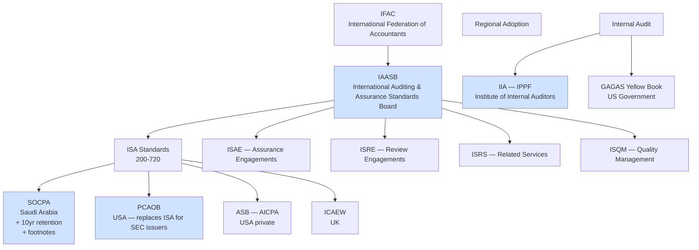
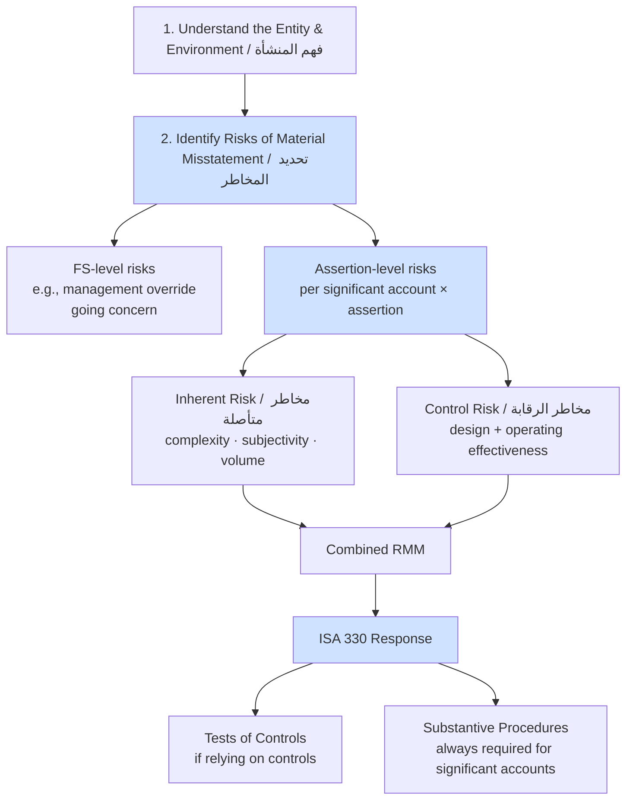
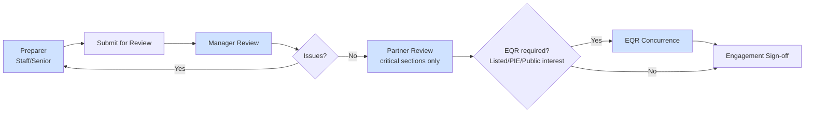
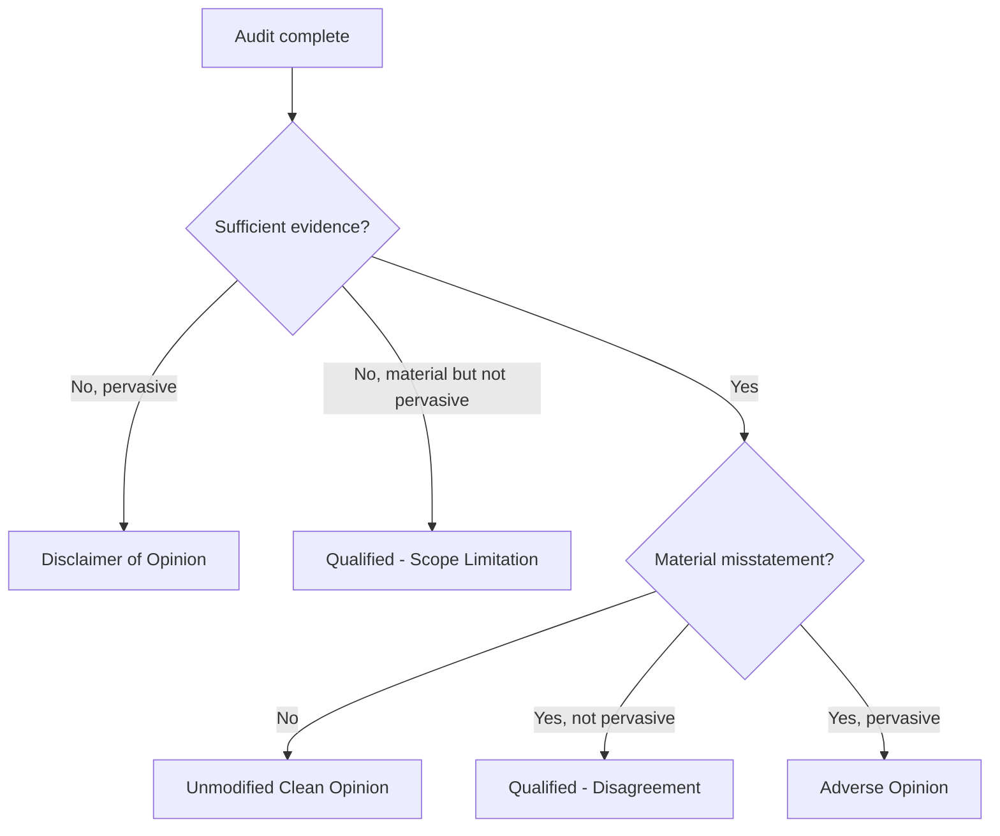
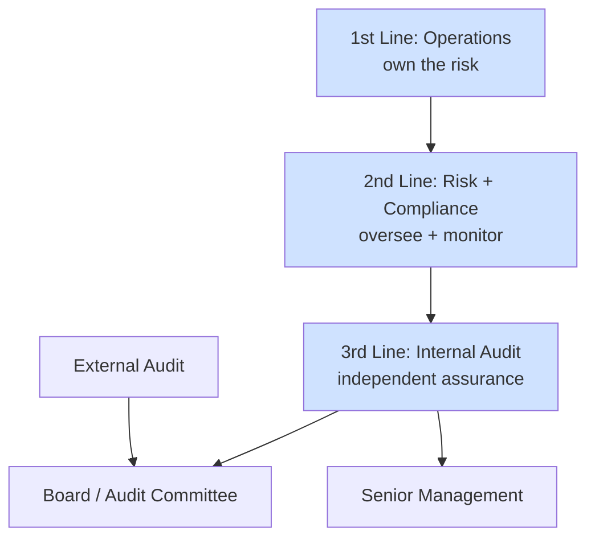
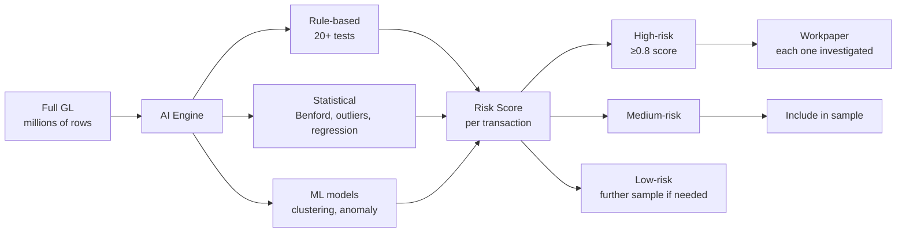

# 23 — Audit Standards Deep Dive / تعمق في معايير المراجعة

> Reference: continues from `22_MARKETING_AND_GTM.md`. Final research document.
> **Goal:** Map global audit standards (ISA, SOCPA, PCAOB, IIA) to APEX implementation requirements.

---

## 1. Audit Standards Landscape / منظومة معايير المراجعة



---

## 2. ISA Standards Map (External Audit) / معايير المراجعة الخارجية

| ISA # | Title EN | العنوان | APEX feature |
|-------|----------|---------|--------------|
| 200 | Overall Objectives of the Auditor | الأهداف العامة للمراجع | Engagement framework |
| 210 | Agreeing the Terms of Audit Engagements | الاتفاق على شروط الارتباط | Engagement letter generator |
| 220 | Quality Management for an Audit | إدارة الجودة | Reviewer workflow |
| 230 | Audit Documentation | توثيق المراجعة | Workpaper structure |
| 240 | Auditor's Responsibilities Relating to Fraud | مسؤوليات المراجع تجاه الاحتيال | Fraud risk assessment + Benford |
| 250 | Consideration of Laws and Regulations | الأنظمة واللوائح | Compliance check (KSA-specific) |
| 260 | Communication with Those Charged with Governance | التواصل مع لجنة المراجعة | Audit committee report template |
| 265 | Communicating Deficiencies in Internal Control | الإبلاغ عن نقاط الضعف | Findings classifier (MW/SD/MLI) |
| 300 | Planning an Audit | تخطيط المراجعة | Engagement workspace planning tab |
| 315 | Identifying and Assessing the Risks of Material Misstatement | تحديد المخاطر | Risk register + RMM matrix |
| 320 | Materiality | الأهمية النسبية | Materiality calculator |
| 330 | The Auditor's Responses to Assessed Risks | الاستجابة للمخاطر | Audit program builder |
| 402 | Audit Considerations Relating to an Entity Using a Service Organization | استخدام منظمات الخدمات | SOC report integration |
| 450 | Evaluation of Misstatements Identified | تقييم الأخطاء | SUM (Summary of Uncorrected Misstatements) |
| 500 | Audit Evidence | أدلة المراجعة | Evidence linker (DataSnipper-style) |
| 501 | Audit Evidence — Specific Considerations | أدلة محددة (مخزون، مدعوم) | Inventory observation, litigation, segments |
| 505 | External Confirmations | المصادقات الخارجية | Confirmation portal (debtor/creditor/bank) |
| 510 | Initial Audit Engagements — Opening Balances | الأرصدة الافتتاحية | Opening balance binding |
| 520 | Analytical Procedures | الإجراءات التحليلية | Ratios + variance analysis |
| 530 | Audit Sampling | العينات | Sampling tool (MUS, stratified, attribute) |
| 540 | Auditing Accounting Estimates | تقدير المحاسبية | Estimates testing module |
| 550 | Related Parties | الأطراف ذات العلاقة | Related party register |
| 560 | Subsequent Events | الأحداث اللاحقة | Subsequent events procedure |
| 570 | Going Concern | الاستمرارية | Going concern checklist |
| 580 | Written Representations | إفادة الإدارة | Mgmt rep letter generator |
| 600 | Group Audits | مراجعة المجموعات | Component auditor coordination |
| 610 | Using the Work of Internal Auditors | الاعتماد على المراجعة الداخلية | Internal audit reliance docs |
| 620 | Using the Work of an Auditor's Expert | الاعتماد على خبير | Expert engagement |
| 700 | Forming an Opinion and Reporting on Financial Statements | الرأي والتقرير | Audit report builder |
| 701 | Communicating Key Audit Matters (KAM) | الأمور الرئيسية للمراجعة | KAM section in report |
| 705 | Modifications to the Opinion | تعديلات الرأي | Qualified/Adverse/Disclaimer |
| 706 | Emphasis of Matter Paragraphs | فقرات لفت الانتباه | EoM/OM paragraph generator |
| 710 | Comparative Information | معلومات مقارنة | Prior period restatement |
| 720 | The Auditor's Responsibilities Relating to Other Information | المعلومات الأخرى | Annual report check |

---

## 3. ISA 315 Risk Assessment Framework / إطار تقييم المخاطر



### Significant Risks (require special audit response)
- Management override of controls
- Revenue recognition (presumed significant per ISA 240)
- Related party transactions
- Significant accounting estimates (provisions, impairment)
- Non-routine transactions (acquisitions, restructurings)

### Assertions (5 categories per ISA 315)
| Assertion | EN | AR |
|-----------|----|----|
| **Existence** | Asset/liability exists | الوجود |
| **Completeness** | All transactions recorded | الاكتمال |
| **Valuation** | Recorded at appropriate amount | التقييم |
| **Rights & Obligations** | Entity has rights to assets / obligations | الحقوق والالتزامات |
| **Presentation & Disclosure** | Properly classified, described, disclosed | العرض والإفصاح |

---

## 4. ISA 320 Materiality / الأهمية النسبية

### Three levels
```
Overall Materiality (OM) / الأهمية الإجمالية:
  Common benchmarks:
    5% of Profit Before Tax (PBT) — for profitable entity
    1-3% of Revenue — for unprofitable / volatile
    1-2% of Total Assets — for asset-heavy
    0.5-1% of Equity — for equity-focused
  
  Saudi adjustment:
    Add zakat-base materiality: 1% of zakatable equity

Performance Materiality (PM) / الأهمية الأدائية:
  50-75% of Overall Materiality
  Reduces aggregation risk

Specific Materiality / الأهمية المحددة:
  Lower threshold for sensitive items:
    Related party transactions
    Director compensation
    Going concern disclosures
```

### APEX implementation
```python
@router.post("/audit/cases/{cid}/materiality")
async def compute_materiality(cid: int, payload: MaterialityRequest):
    """
    payload.benchmark_type: "pbt" | "revenue" | "assets" | "equity"
    payload.percentage: float
    payload.specific_items: list of {item, threshold}
    """
    # Compute and persist
    om = base_value * payload.percentage / 100
    pm = om * payload.performance_factor  # default 0.75
    return {"overall": om, "performance": pm, "specific": [...]}
```

---

## 5. ISA 530 Sampling / العينات

### Sampling decision tree
```mermaid
flowchart TD
    START[Need sample?] --> POP{Population size}
    POP -->|< 50| FULL[Test 100% — easier than sampling]
    POP -->|≥ 50| TYPE{Test type}
    TYPE -->|Test of controls| ATTRIBUTE[Attribute Sampling<br/>focus: deviation rate]
    TYPE -->|Test of details| RISK{Risk-based?}
    RISK -->|High risk + monetary| MUS[Monetary Unit Sampling<br/>$-weighted, audit risk model]
    RISK -->|Variable testing| CLASSICAL[Classical Variables<br/>mean per unit]
    RISK -->|Stratified| STRAT[Stratified Sampling<br/>split by amount/risk bands]

    MUS --> SIZE_MUS[Sample size = BV × Reliability factor / Tolerable misstatement]
    ATTRIBUTE --> SIZE_ATTR[Sample size from attribute table<br/>given confidence × tolerable rate × expected error]
    CLASSICAL --> SIZE_CV[Sample size = (CV factor × σ × N / TM)²]
    STRAT --> SIZE_ST[Per stratum size]
```

### MUS Sample Size Formula (PPS)
```
Sample size = Recorded Amount × Reliability Factor
              -----------------------------------------
              Tolerable Misstatement - (Expected Misstatement × Expansion Factor)

Reliability Factor (95% confidence): 3.0
                   (90%):              2.3
                   (85%):              1.9
```

### APEX implementation
```python
def compute_mus_sample_size(
    population_value: Decimal,
    tolerable_misstatement: Decimal,
    expected_misstatement: Decimal = Decimal("0"),
    confidence: float = 0.95,
) -> int:
    rf_table = {0.95: 3.0, 0.90: 2.3, 0.85: 1.9}
    rf = rf_table[confidence]
    expansion = 1.6
    denominator = tolerable_misstatement - (expected_misstatement * expansion)
    if denominator <= 0:
        raise ValueError("Tolerable misstatement too low")
    return math.ceil(float(population_value * Decimal(str(rf)) / denominator))
```

### Sample selection methods
| Method | When to use |
|--------|-------------|
| Random | Default, statistically valid |
| Systematic | Pre-sorted population, every Nth item |
| Haphazard | Non-statistical, "without bias" |
| Block | Discouraged — only specific tests |
| MUS / PPS | Monetary tests |
| Stratified | Heterogeneous population |

---

## 6. ISA 230 Workpaper Standards / معايير ورقة العمل

### Required elements (per ISA 230)
1. **Identifier:** unique reference (e.g., `B2-2026.AR.01`)
2. **Engagement context:** client name, period, audit team
3. **Procedure objective:** which assertion + which risk
4. **Procedure performed:** detailed steps (sufficient for re-performer)
5. **Evidence obtained:** exhibits, screenshots, attached docs
6. **Tickmarks legend:** symbols used (✓ checked to source, ⊕ recalculated, etc.)
7. **Conclusion:** does evidence support assertion?
8. **Sign-offs:** preparer + reviewer (with date)
9. **Cross-references:** to lead schedule, other workpapers

### Lead schedule pattern
```
B-2026  Cash & Equivalents Lead
  B1-2026  Bank A reconciliation
    B1.1-2026  Bank confirmation received
    B1.2-2026  Outstanding deposits review
    B1.3-2026  Outstanding checks review
  B2-2026  Bank B reconciliation
  B3-2026  Petty cash count
```

### Tickmark conventions
| Tickmark | Meaning |
|----------|---------|
| ✓ | Agreed to source document |
| ⊕ | Recalculated |
| ▲ | Traced to GL |
| ⊠ | Vouched to invoice |
| ⊟ | Footed (column total) |
| ⊞ | Cross-footed (row total) |
| ◊ | Inquired and explanation accepted |
| ★ | Confirmed externally |

---

## 7. Sign-Off Hierarchy / تسلسل الاعتمادات



### EQR (Engagement Quality Review) Requirements
**Required for:**
- Listed entities (Tadawul-listed in Saudi)
- Public Interest Entities (banks, insurance)
- Other engagements per firm policy

**EQR independence:** Different partner from engagement team, sufficient experience.

**EQR scope:** Significant judgments, audit opinion, KAM.

---

## 8. ISA 700 Audit Report / تقرير المراجعة

### Structure (per ISA 700 revised)
```
1. Title: "Independent Auditor's Report"
2. Addressee: shareholders / board
3. Opinion paragraph (FIRST, not last):
   "In our opinion, the accompanying financial statements
    present fairly, in all material respects, the financial
    position of [Entity] as at [date], and ... in accordance with IFRS"
4. Basis for Opinion:
   - "We conducted our audit in accordance with ISAs"
   - Independence statement
   - "Sufficient and appropriate audit evidence"
5. Going Concern (if applicable, ISA 570)
6. Key Audit Matters (KAM) — ISA 701, listed entities
7. Other Information (ISA 720)
8. Responsibilities of Management & TCWG
9. Auditor's Responsibilities
10. Other Reporting (legal/regulatory if any)
11. Engagement Partner name (some jurisdictions)
12. Auditor's signature
13. Auditor's address
14. Date of report
```

### Opinion Types
| Type | EN | AR | When |
|------|----|----|------|
| Unmodified (Clean) | Unqualified | غير معدل | FS fairly presented |
| Qualified | Qualified ("except for") | متحفظ | Material misstatement OR scope limitation |
| Adverse | Adverse | معاكس | Pervasive material misstatement |
| Disclaimer | Disclaimer | امتناع عن الرأي | Pervasive scope limitation |

### Decision Tree for Opinion


---

## 9. ISA 701 Key Audit Matters (KAM) / الأمور الرئيسية للمراجعة

### Required for: Listed entities. Optional for others.

### KAM examples
- Revenue recognition (often)
- Goodwill impairment
- Inventory valuation
- Tax provisions / uncertain tax positions
- Going concern
- Litigation provisions
- Acquisitions
- IT general controls

### Each KAM section structure
```markdown
## Revenue Recognition

### Why this matter is significant
[Description of the area + risk]

### How our audit addressed it
[Procedures performed in that area]
```

---

## 10. SOCPA-Specific Requirements (Saudi Arabia) / متطلبات SOCPA

### Endorsements
- ISA standards adopted with Saudi adjustments
- IFRS / IFRS for SMEs endorsed (with Sharia overlays for some sectors)

### Saudi-specific additions
1. **Audit documentation retention: 10 years** (vs ISA 5 years suggestion)
2. **Footnotes in audit report** for specific disclosures (zakat, related party)
3. **Zakat audit** — assessment of zakat base
4. **Sharia adjustments** for Islamic banks/financial institutions
5. **Member quality reviews** every 3 years

### Saudi audit report template additions
```
"... in conformity with the International Financial Reporting Standards 
(IFRS) endorsed in the Kingdom of Saudi Arabia and other standards and 
pronouncements that are issued by the Saudi Organization for Chartered 
and Professional Accountants (SOCPA)."
```

---

## 11. PCAOB AS 2201 (SOX 404 ICFR) / مراجعة الرقابة الداخلية

### For SEC-listed entities
- Top-down risk-based approach
- Entity-level controls (ELC) — tone at top, enterprise risk
- IT General Controls (ITGC) — access, change mgmt, ops
- Application controls (AC) — within systems
- Process controls — manual

### Walkthrough requirement
For each significant process:
1. **Inquiry** — interview process owner
2. **Observation** — watch process in action
3. **Inspection** — review relevant docs
4. **Re-performance** — perform control yourself

### Test of Operating Effectiveness
- Sample size based on control frequency:
  - Annual: 1
  - Quarterly: 2
  - Monthly: 2-5
  - Weekly: 5-15
  - Daily: 25-40
  - Multiple per day: 25-60

### Deficiency Classification (per AS 5)
| Severity | Definition | Reportable to |
|----------|-----------|---------------|
| Material Weakness | Reasonable possibility of material misstatement undetected | Audit Committee + Mgmt + SEC |
| Significant Deficiency | Less severe than MW but important enough | Audit Committee + Mgmt |
| Control Deficiency | Properly designed but not operating | Mgmt only |

---

## 12. IIA Standards (Internal Audit) / معايير المراجعة الداخلية

### IPPF Framework Components
1. **Mission of Internal Audit**
2. **Core Principles**
3. **Definition** — Independent, objective assurance + consulting
4. **Code of Ethics**
5. **International Standards** (Attribute + Performance)

### Three Lines of Defense Model


### Internal Audit Engagement Types
- **Assurance** — provides assurance on processes, controls
- **Consulting** — advisory, advisory only, no opinion
- **Investigation** — fraud, ethics violations
- **Compliance audit** — regulatory adherence

---

## 13. Standard Procedures Library / مكتبة الإجراءات

### Revenue Cycle (سيدورة الإيرادات)
1. **Cutoff testing** — invoices around year-end, ensure proper period
2. **Bill-and-hold review** — items invoiced but not shipped
3. **Long-term contracts** — POC method validation (IFRS 15)
4. **Returns analysis** — post year-end returns vs allowance
5. **Discount/rebate accruals** — recompute
6. **Customer confirmations** — sample of AR
7. **Sales journal review** — credits, voids, journal entries near YE
8. **Pricing tests** — sample invoices to price master
9. **Channel stuffing** — examine sales spike near YE
10. **Related party sales** — separate testing

### Procurement (P2P) Cycle (دورة المشتريات)
1. **3-way match testing** — sample bills to PO + receipt
2. **GRNI accrual** — test completeness of unbilled receipts
3. **Cutoff** — receipts and invoices around YE
4. **Vendor master review** — for fictitious vendors
5. **Approval limits** — test segregation of duties
6. **Duplicate payments** — Benford / data analytics
7. **Year-end accruals** — utilities, rent, professional fees
8. **Capital vs expense** — borderline items review
9. **Foreign vendor payments** — FX rate at payment

### Treasury / Cash (دورة الخزينة)
1. **Bank confirmation** — directly from bank
2. **Bank reconciliation review** — outstanding items aging
3. **Cash count** — petty cash physical count
4. **Cutoff** — last check / first check after YE
5. **Restricted cash** — escrow, security deposits
6. **FX revaluation** — recompute foreign currency balances

### Inventory (المخزون)
1. **Physical count attendance** — observe count, test counts
2. **Cutoff** — last receipt, last shipment
3. **Pricing test** — sample to invoices
4. **Obsolescence review** — slow-moving, expired
5. **Lower of cost or NRV** (IAS 2)
6. **Consigned inventory** — track ownership
7. **In-transit** — recognize per Incoterms
8. **Indirect costs** — proper inclusion in cost

### Fixed Assets (الأصول الثابتة)
1. **Existence** — physical inspection of significant items
2. **Additions** — vouching to invoices, capital vs expense
3. **Disposals** — gain/loss recompute
4. **Depreciation recalculation** — sample
5. **Useful life review** — annual review
6. **Impairment indicators** (IAS 36)
7. **Capital commitment review** — disclosure
8. **Right-of-use assets** (IFRS 16) — separate testing

### Payroll (الرواتب)
1. **Headcount reconciliation** — HR records vs payroll
2. **Wage rate tests** — sample to contracts
3. **Recomputation** — sample salary calculations
4. **GOSI/social security** — accuracy, completeness
5. **Bonus accrual** — recompute, test reasonableness
6. **EOSB / End of service** — actuarial vs simple computation
7. **Severance / termination** — payments review
8. **Director compensation** — disclosure tested

### Period-end Close (إقفال الفترة)
1. **JE review** — all manual JEs in last 5 days of period
2. **Reserve reasonableness** — bad debt, warranty, etc.
3. **Subsequent events** review (ISA 560)
4. **Going concern assessment** (ISA 570)
5. **Mgmt rep letter** (ISA 580) — signed before report

---

## 14. AI in Auditing — Pattern from MindBridge/CaseWare

### 100% Transaction Analysis
Instead of (or in addition to) sampling, run analytics on full population:



### Built-in tests (APEX should ship)
- Benford's Law (1st and 2nd digits)
- Round-amount transactions
- Just-below-threshold transactions (e.g., 49,999 SAR when limit 50K)
- Weekend/holiday postings
- Late posting (>30 days after transaction date)
- Duplicate amounts
- Reversed entries
- User-account anomaly (clerk posting CFO-only entries)
- New vendor + large payment
- Manual JE near year-end
- Ratio outliers per cost center

---

## 15. Audit Report Generation / إصدار تقرير المراجعة

### APEX should ship templates for:
1. **Standard Unmodified Report** (ISA 700)
2. **Modified Reports**:
   - Qualified — disagreement
   - Qualified — scope limitation
   - Adverse
   - Disclaimer
3. **Group Audit Report** (ISA 600)
4. **Half-Year Review Report** (ISRE 2410)
5. **Special Purpose Frameworks** (ISA 800)
6. **Single Statements / Specific Elements** (ISA 805)

### Each template
- Bilingual (Arabic + English)
- Editable Word + PDF output
- Auto-fills entity name, period, opinion paragraph
- KAM section auto-populated from APEX findings module
- Partner signature image insertion

---

## 16. Engagement Archive / أرشفة المهمة

### SOCPA requires 10 years
### Archive package includes
- Engagement letter
- Final audit report (signed)
- Management representation letter
- All workpapers (with sign-offs)
- Materiality memo
- Risk assessment memo
- Significant findings memo
- KAM documentation
- Mgmt letter
- Going concern memo (if applicable)
- Subsequent events memo

### Archive procedure
1. Engagement marked "Signed Off"
2. Workpapers locked (no edits)
3. Archive ZIP/PDF generated
4. Hash computed (SHA-256)
5. Stored in WORM (Write Once Read Many) storage
6. Hash recorded in tamper-evident chain
7. Auto-purge after 10 years (with override for legal hold)

---

## 17. APEX Feature Coverage vs ISA / تغطية APEX للمعايير

| ISA | Feature in APEX | Status |
|-----|-----------------|--------|
| 200, 210, 220, 230 | Engagement workspace, workpaper module | Partial — missing engagement letter generator |
| 240 (Fraud) | Benford analysis, risk register | Partial — needs fraud-specific procedures |
| 250 (Laws/regs) | Compliance check (KSA) | Saudi only — needs UAE, Egypt |
| 260, 265 (Communication) | Findings classifier | Partial — needs auto-letter generator |
| 300, 315 (Planning, risk) | Risk register | Partial — needs assertion-level matrix |
| 320 (Materiality) | Materiality calculator | **Missing** — implement first |
| 330 (Responses) | Audit program builder | Partial — needs procedures library |
| 500-580 (Evidence) | Workpaper module, evidence linker | Partial — needs IPE module |
| 530 (Sampling) | MUS/stratified sampler | **Missing** — implement |
| 540 (Estimates) | — | **Missing** — high priority |
| 550 (Related parties) | — | **Missing** |
| 560 (Subsequent events) | — | **Missing** |
| 570 (Going concern) | — | **Missing** — high priority |
| 580 (Mgmt rep) | — | **Missing** |
| 700, 701, 705, 706 | Audit report builder | Partial — needs templates |
| 720 (Other info) | — | **Missing** |

**Implementation priority:**
1. Materiality calculator (ISA 320)
2. Sampling tool (ISA 530)
3. Audit report templates (ISA 700)
4. Going concern checklist (ISA 570)
5. Estimates testing (ISA 540)
6. Subsequent events (ISA 560)

---

## 18. Audit Engagement Roadmap / خارطة طريق وحدة المراجعة

### Q1 — Foundation
- Materiality calculator
- Sampling tool (MUS, stratified, random)
- Workpaper templates (top 20)
- Sign-off hierarchy enforcement

### Q2 — Procedures Library
- 200+ standard procedures (cycle × assertion × test type)
- AI-suggested procedures based on risk
- Procedures Excel/JSON catalog

### Q3 — AI-Embedded Audit
- 100% transaction analysis
- Risk scoring per JE
- Anomaly detection (Benford + ML)
- AI-suggested findings

### Q4 — Reporting Excellence
- Audit report templates (10+)
- KAM auto-generator
- Mgmt letter generator
- Engagement archive workflow

### Year 2 — Specialized
- Group audit support (ISA 600)
- IT audit module
- ICFR / SOX 404 support
- Continuous auditing
- Industry-specific audits (banking, insurance)

---

## 19. Sources / المصادر

- IAASB ISA Handbook https://www.iaasb.org/publications/2022-handbook-international-quality-management-auditing-review-other-assurance-and-related-services-pronouncements
- SOCPA https://socpa.org.sa/
- PCAOB Auditing Standards https://pcaobus.org/oversight/standards/auditing-standards
- IIA Standards https://www.theiia.org/standards/
- AICPA Audit Guides https://www.aicpa-cima.com/
- IFRS / IAS https://www.ifrs.org/

---

**End of Audit Deep Dive. Continue to update `00_MASTER_INDEX.md` and `index.html`.**
