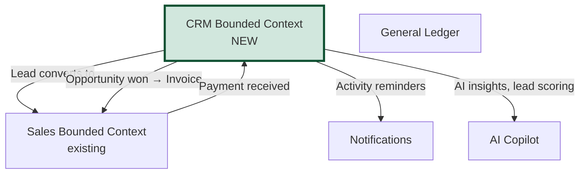
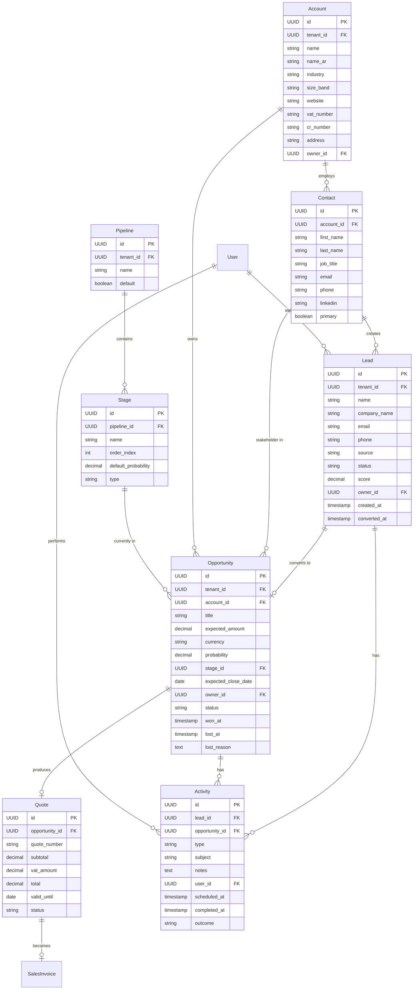
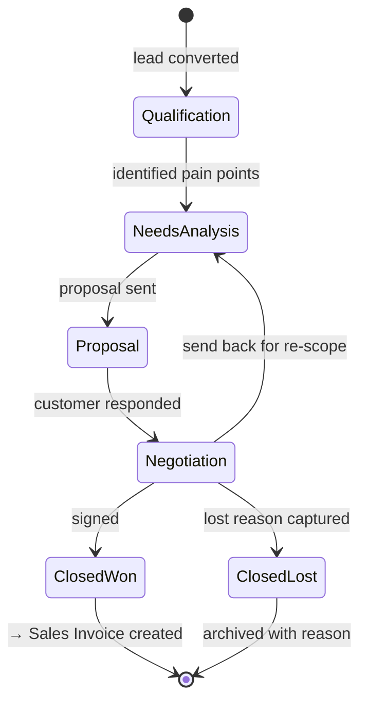
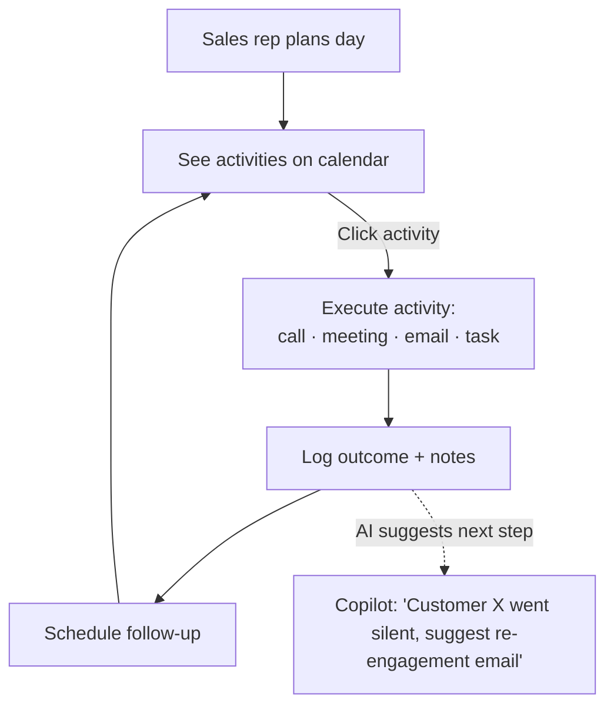
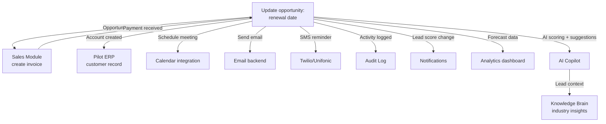

# 24 — CRM Module Design / تصميم وحدة إدارة علاقات العملاء

> Reference: extends `15_DDD_BOUNDED_CONTEXTS.md`. Integrates with `04_SCREENS_AND_BUTTONS_CATALOG.md` § Sales and `21_INDUSTRY_TEMPLATES.md`.
> **Goal:** Add a complete CRM module to APEX so accountants/SMBs don't need a separate tool (HubSpot, Salesforce). Patterns from Odoo CRM, NetSuite CRM, HubSpot, and ERPNext CRM.

---

## 1. Why CRM in APEX? / لماذا CRM داخل APEX؟

**EN:** Currently APEX starts the customer journey at "Sales Invoice" — but the real customer journey starts much earlier (lead, opportunity, quote, negotiation). Without CRM, APEX customers must use external tools and manually re-enter data. Adding CRM:
- Captures the full customer lifecycle inside one platform
- Auto-syncs lead → customer → invoice (no double entry)
- Provides sales pipeline forecasting that ties directly to revenue
- Differentiates APEX from competitors (Qoyod, Daftra) who lack CRM

**AR:** حالياً تبدأ APEX رحلة العميل من "فاتورة المبيعات" — لكن الرحلة الحقيقية تبدأ قبل ذلك بكثير (عميل محتمل، فرصة، عرض، تفاوض). بدون CRM، يضطر عملاء APEX لاستخدام أدوات خارجية وإعادة إدخال البيانات يدوياً.

---

## 2. CRM in the APEX DDD Map / موقع CRM في الخريطة



---

## 3. Core CRM Entities / الكيانات الأساسية



### Entity definitions / تعريف الكيانات

| Entity | EN purpose | الغرض |
|--------|------------|-------|
| `Lead` | Unqualified prospect (not yet a customer) | عميل محتمل |
| `Account` | Company/organization (B2B) | حساب شركة |
| `Contact` | Individual person (within an Account) | جهة اتصال |
| `Opportunity` | Qualified deal in progress | فرصة بيع |
| `Pipeline` | Sales process variant (e.g., New Business, Renewals) | خط بيع |
| `Stage` | Step in pipeline (e.g., Qualification → Proposal → Negotiation → Won) | مرحلة |
| `Activity` | Task/Call/Meeting/Email logged | نشاط |
| `Quote` | Formal price proposal | عرض سعر |

---

## 4. Sales Pipeline State Machine / آلة حالة الفرصة



### Default pipeline stages / المراحل الافتراضية
| Order | Name EN | الاسم | Default Probability |
|-------|---------|------|---------------------|
| 1 | Qualification | تأهيل | 20% |
| 2 | Needs Analysis | تحليل الحاجة | 40% |
| 3 | Proposal Sent | عرض مرسل | 60% |
| 4 | Negotiation | تفاوض | 80% |
| 5 | Closed Won | فوز ✓ | 100% |
| 6 | Closed Lost | خسارة ✗ | 0% |

---

## 5. CRM User Journeys / رحلات المستخدم

### J-CRM-1: Lead Capture → Conversion
```mermaid
flowchart TD
    SOURCE[Lead source] --> SOURCES{Source type?}
    SOURCES -->|Website form| FORM[POST /api/v1/crm/leads/web<br/>public endpoint with reCAPTCHA]
    SOURCES -->|Manual entry| MANUAL[Sales rep adds via /crm/leads/new]
    SOURCES -->|Import CSV| IMPORT[Bulk import wizard]
    SOURCES -->|Email forwarding| EMAIL[leads@tenant.apex.sa<br/>parse and create]
    SOURCES -->|API| API[POST /api/v1/crm/leads]

    FORM & MANUAL & IMPORT & EMAIL & API --> LEAD[(Lead created<br/>status: new)]
    LEAD --> AUTOSCORE[AI Lead Scoring<br/>POST /ai/crm/score]
    AUTOSCORE --> ASSIGN[Auto-assign to sales rep<br/>round-robin or by territory]
    ASSIGN --> NOTIFY[Notify owner]
    NOTIFY --> WORK[Sales rep works the lead]
    WORK --> ACTIVITY[Log calls/emails/meetings]
    ACTIVITY --> DECISION{Qualified?}
    DECISION -->|Yes| CONVERT[Convert to Opportunity<br/>POST /api/v1/crm/leads/{id}/convert]
    CONVERT --> ACCOUNT[Create or link Account]
    ACCOUNT --> OPP[Create Opportunity]
    OPP --> PIPELINE[Place in pipeline stage 1]
    DECISION -->|No| DISQUALIFY[Mark disqualified + reason]
    DISQUALIFY --> ARCH[(Archived)]

    classDef api fill:#fff3cd
    class FORM,API,AUTOSCORE,CONVERT api
```

### J-CRM-2: Opportunity → Won → Invoice
```mermaid
flowchart LR
    OPP[Opportunity in Negotiation] -->|Customer accepts| QUOTE[Generate Quote<br/>POST /api/v1/crm/quotes]
    QUOTE -->|Customer signs| WIN[Mark Won<br/>POST /opportunities/{id}/win]
    WIN --> AUTO_INV[Auto-create Sales Invoice<br/>POST /api/v1/pilot/sales-invoices<br/>links via opportunity_id]
    AUTO_INV --> ZATCA[Trigger ZATCA flow]
    ZATCA --> NOTIFY[Notify customer + finance team]
    WIN -.update CRM stats.-> METRICS[Pipeline metrics<br/>win rate, avg deal size]
```

### J-CRM-3: Activity Management


---

## 6. Frontend Routes / المسارات الجديدة

| Path | Screen | Purpose |
|------|--------|---------|
| `/crm` | `CrmHubScreen` | CRM service hub |
| `/crm/leads` | `LeadsListScreen` | List + Kanban view |
| `/crm/leads/:id` | `LeadDetailScreen` | Lead detail |
| `/crm/leads/new` | `NewLeadScreen` | Create lead |
| `/crm/opportunities` | `OpportunitiesListScreen` | Pipeline kanban |
| `/crm/opportunities/:id` | `OpportunityDetailScreen` | Opportunity detail |
| `/crm/accounts` | `AccountsListScreen` | List of companies |
| `/crm/accounts/:id` | `AccountDetailScreen` | 360° account view |
| `/crm/contacts` | `ContactsListScreen` | All contacts |
| `/crm/contacts/:id` | `ContactDetailScreen` | Contact detail |
| `/crm/activities` | `ActivitiesScreen` | Calendar view |
| `/crm/quotes` | `QuotesListScreen` | All quotes |
| `/crm/quotes/:id` | `QuoteDetailScreen` | Quote builder/viewer |
| `/crm/pipeline-config` | `PipelineConfigScreen` | Configure pipelines/stages |
| `/crm/reports` | `CrmReportsScreen` | Pipeline + win-rate reports |
| `/crm/forecast` | `CrmForecastScreen` | Revenue forecast |

---

## 7. API Endpoints / النقاط الجديدة

### Lead Management
```
GET    /api/v1/crm/leads
POST   /api/v1/crm/leads
GET    /api/v1/crm/leads/{id}
PUT    /api/v1/crm/leads/{id}
DELETE /api/v1/crm/leads/{id}
POST   /api/v1/crm/leads/{id}/convert      # → Account + Opportunity
POST   /api/v1/crm/leads/{id}/disqualify
POST   /api/v1/crm/leads/web                # public endpoint (web form)
POST   /api/v1/crm/leads/import-csv         # bulk
POST   /api/v1/crm/leads/{id}/score         # AI scoring
```

### Account & Contact
```
GET    /api/v1/crm/accounts
POST   /api/v1/crm/accounts
GET    /api/v1/crm/accounts/{id}
PUT    /api/v1/crm/accounts/{id}
GET    /api/v1/crm/accounts/{id}/360         # full 360° view (opps + invoices + activities)
GET    /api/v1/crm/contacts
POST   /api/v1/crm/contacts
GET    /api/v1/crm/contacts/{id}
PUT    /api/v1/crm/contacts/{id}
```

### Opportunity & Pipeline
```
GET    /api/v1/crm/opportunities?stage_id=...&owner_id=...
POST   /api/v1/crm/opportunities
GET    /api/v1/crm/opportunities/{id}
PUT    /api/v1/crm/opportunities/{id}
POST   /api/v1/crm/opportunities/{id}/move-stage
POST   /api/v1/crm/opportunities/{id}/win
POST   /api/v1/crm/opportunities/{id}/lose
GET    /api/v1/crm/pipelines
POST   /api/v1/crm/pipelines
PUT    /api/v1/crm/pipelines/{id}
GET    /api/v1/crm/stages
```

### Activities
```
GET    /api/v1/crm/activities?user_id=...&from=...&to=...
POST   /api/v1/crm/activities
PUT    /api/v1/crm/activities/{id}
POST   /api/v1/crm/activities/{id}/complete
POST   /api/v1/crm/activities/{id}/reschedule
```

### Quotes
```
GET    /api/v1/crm/quotes
POST   /api/v1/crm/quotes
GET    /api/v1/crm/quotes/{id}
PUT    /api/v1/crm/quotes/{id}
POST   /api/v1/crm/quotes/{id}/send         # email PDF
POST   /api/v1/crm/quotes/{id}/accept       # customer signed
POST   /api/v1/crm/quotes/{id}/decline
POST   /api/v1/crm/quotes/{id}/duplicate
GET    /api/v1/crm/quotes/{id}/pdf
```

### Reports & Forecast
```
GET    /api/v1/crm/reports/pipeline-snapshot
GET    /api/v1/crm/reports/win-rate?period=...
GET    /api/v1/crm/reports/sales-rep-performance
GET    /api/v1/crm/reports/source-effectiveness
GET    /api/v1/crm/forecast?period=Q1-2026
```

**Total:** ~40 new endpoints under `/api/v1/crm/*`

---

## 8. AI / Copilot Integration / تكامل المساعد

### A. Lead Scoring (Critical AI feature)
```python
# app/crm/services/lead_scoring_service.py
class LeadScoringService:
    def score(self, lead: Lead) -> dict:
        """
        Score 0-100 based on:
        - Company size (industry data)
        - Industry match to ICP (Ideal Customer Profile)
        - Engagement signals (form fields filled, page visits)
        - Recency
        - Geographic fit
        """
        # Use Anthropic Claude with structured output
        result = self.copilot.classify(
            system="You are a B2B SaaS lead scorer. Score 0-100.",
            user=lead.to_summary(),
        )
        return {"score": result["score"], "reasoning": result["why"]}
```

### B. Activity Recommendations
- "Customer hasn't been contacted in 14 days. Send re-engagement email?"
- "This opportunity has been in Negotiation for 30 days. Suggest discount?"
- "Similar deals to X usually close 60% faster when you involve a manager."

### C. Email Draft Assistant
```
POST /api/v1/crm/ai/draft-email
{
  "opportunity_id": "...",
  "purpose": "follow-up after demo",
  "tone": "professional"
}
→ Returns draft email in Arabic + English
```

### D. Pipeline Forecast (predictive)
ML-based forecast: "Based on your current pipeline + historical win rates, expected closed revenue this quarter = SAR 1.2M ± 200K."

---

## 9. Integration with Existing APEX Modules / التكامل



### Key Integration Rules
1. **One source of truth for customer:** When opportunity wins → APEX creates `Customer` (Pilot module) automatically. The `Lead.email` matches `Customer.email`. No double entry.
2. **Single contact view:** `/crm/accounts/{id}/360` shows opportunities + invoices + payments + activities — pulled from across modules.
3. **Forecast feeds analytics:** CRM forecast feeds `/analytics/cash-flow-forecast` (already existing).

---

## 10. Permissions & Plan Tier Mapping / الصلاحيات والخطط

| Feature | client_user | client_admin | Plan: Free | Pro | Business | Expert | Enterprise |
|---------|-------------|--------------|-----------|-----|----------|--------|------------|
| View leads/opportunities | ✓ (own) | ✓ (all) | ✗ | ✓ (50 leads) | ✓ (500) | ✓ (∞) | ✓ |
| Create leads | ✓ | ✓ | ✗ | ✓ | ✓ | ✓ | ✓ |
| Pipeline kanban | ✓ | ✓ | ✗ | ✓ | ✓ | ✓ | ✓ |
| AI lead scoring | ✗ | ✓ | ✗ | ✗ | ✓ | ✓ | ✓ |
| Multi-pipeline | ✗ | ✓ | ✗ | ✗ | ✓ | ✓ | ✓ |
| Forecast | ✗ | ✓ | ✗ | ✗ | ✓ | ✓ | ✓ |
| Custom fields | ✗ | ✓ | ✗ | ✗ | ✗ | ✓ | ✓ |
| Email tracking | ✓ | ✓ | ✗ | ✗ | ✓ | ✓ | ✓ |
| Calendar sync (Google/Outlook) | ✓ | ✓ | ✗ | ✗ | ✗ | ✓ | ✓ |

---

## 11. Database Schema / مخطط قاعدة البيانات

```sql
-- Leads
CREATE TABLE crm_leads (
    id UUID PRIMARY KEY DEFAULT gen_random_uuid(),
    tenant_id UUID NOT NULL,
    name VARCHAR(200) NOT NULL,
    company_name VARCHAR(200),
    email VARCHAR(254),
    phone VARCHAR(30),
    source VARCHAR(50),
    status VARCHAR(30) DEFAULT 'new',
    score DECIMAL(5,2),
    score_reasoning TEXT,
    owner_id UUID REFERENCES users(id),
    converted_at TIMESTAMP,
    converted_to_opportunity_id UUID,
    metadata JSONB,
    created_at TIMESTAMP DEFAULT NOW(),
    updated_at TIMESTAMP DEFAULT NOW(),
    INDEX idx_leads_tenant_status (tenant_id, status),
    INDEX idx_leads_owner (owner_id)
);

-- Accounts (companies)
CREATE TABLE crm_accounts (
    id UUID PRIMARY KEY DEFAULT gen_random_uuid(),
    tenant_id UUID NOT NULL,
    name VARCHAR(200) NOT NULL,
    name_ar VARCHAR(200),
    industry VARCHAR(50),
    size_band VARCHAR(20),
    website VARCHAR(254),
    vat_number VARCHAR(20),
    cr_number VARCHAR(20),
    address TEXT,
    owner_id UUID REFERENCES users(id),
    customer_id UUID REFERENCES customers(id),  -- linked to Pilot Customer when won
    metadata JSONB,
    created_at TIMESTAMP DEFAULT NOW(),
    INDEX idx_accounts_tenant (tenant_id)
);

-- Contacts
CREATE TABLE crm_contacts (
    id UUID PRIMARY KEY DEFAULT gen_random_uuid(),
    account_id UUID NOT NULL REFERENCES crm_accounts(id),
    first_name VARCHAR(100),
    last_name VARCHAR(100),
    job_title VARCHAR(100),
    email VARCHAR(254),
    phone VARCHAR(30),
    linkedin VARCHAR(254),
    is_primary BOOLEAN DEFAULT FALSE,
    INDEX idx_contacts_account (account_id)
);

-- Pipelines & Stages
CREATE TABLE crm_pipelines (
    id UUID PRIMARY KEY DEFAULT gen_random_uuid(),
    tenant_id UUID NOT NULL,
    name VARCHAR(100) NOT NULL,
    is_default BOOLEAN DEFAULT FALSE
);

CREATE TABLE crm_stages (
    id UUID PRIMARY KEY DEFAULT gen_random_uuid(),
    pipeline_id UUID NOT NULL REFERENCES crm_pipelines(id),
    name VARCHAR(100) NOT NULL,
    order_index INT NOT NULL,
    default_probability DECIMAL(5,2),
    type VARCHAR(20)  -- 'open', 'won', 'lost'
);

-- Opportunities
CREATE TABLE crm_opportunities (
    id UUID PRIMARY KEY DEFAULT gen_random_uuid(),
    tenant_id UUID NOT NULL,
    account_id UUID REFERENCES crm_accounts(id),
    primary_contact_id UUID REFERENCES crm_contacts(id),
    title VARCHAR(200) NOT NULL,
    expected_amount DECIMAL(18,2),
    currency VARCHAR(3) DEFAULT 'SAR',
    probability DECIMAL(5,2),
    stage_id UUID NOT NULL REFERENCES crm_stages(id),
    expected_close_date DATE,
    owner_id UUID REFERENCES users(id),
    status VARCHAR(20) DEFAULT 'open',
    won_at TIMESTAMP,
    lost_at TIMESTAMP,
    lost_reason TEXT,
    sales_invoice_id UUID,  -- linked when won → invoice created
    source_lead_id UUID REFERENCES crm_leads(id),
    metadata JSONB,
    created_at TIMESTAMP DEFAULT NOW(),
    updated_at TIMESTAMP DEFAULT NOW(),
    INDEX idx_opportunities_tenant_stage (tenant_id, stage_id),
    INDEX idx_opportunities_owner (owner_id),
    INDEX idx_opportunities_close_date (expected_close_date)
);

-- Activities
CREATE TABLE crm_activities (
    id UUID PRIMARY KEY DEFAULT gen_random_uuid(),
    tenant_id UUID NOT NULL,
    lead_id UUID REFERENCES crm_leads(id),
    opportunity_id UUID REFERENCES crm_opportunities(id),
    type VARCHAR(20) NOT NULL,  -- 'call', 'meeting', 'email', 'task'
    subject VARCHAR(200) NOT NULL,
    notes TEXT,
    user_id UUID REFERENCES users(id),
    scheduled_at TIMESTAMP,
    completed_at TIMESTAMP,
    outcome VARCHAR(50),
    INDEX idx_activities_user_scheduled (user_id, scheduled_at),
    INDEX idx_activities_opportunity (opportunity_id)
);

-- Quotes
CREATE TABLE crm_quotes (
    id UUID PRIMARY KEY DEFAULT gen_random_uuid(),
    opportunity_id UUID NOT NULL REFERENCES crm_opportunities(id),
    quote_number VARCHAR(50) UNIQUE,
    subtotal DECIMAL(18,2),
    vat_amount DECIMAL(18,2),
    total DECIMAL(18,2),
    valid_until DATE,
    status VARCHAR(20) DEFAULT 'draft',
    pdf_url VARCHAR(500),
    sent_at TIMESTAMP,
    accepted_at TIMESTAMP,
    declined_at TIMESTAMP
);

CREATE TABLE crm_quote_lines (
    id UUID PRIMARY KEY DEFAULT gen_random_uuid(),
    quote_id UUID NOT NULL REFERENCES crm_quotes(id),
    product_id UUID,
    description TEXT,
    quantity DECIMAL(12,4),
    unit_price DECIMAL(18,2),
    discount_percentage DECIMAL(5,2),
    vat_rate DECIMAL(5,2),
    line_total DECIMAL(18,2)
);
```

---

## 12. Implementation Plan for Claude Code / خطة التنفيذ

### Phase 1: Foundation (Week 1)
**Backend:**
- [ ] Create `app/crm/` folder
- [ ] Create models: `Lead`, `Account`, `Contact`, `Pipeline`, `Stage`
- [ ] Alembic migration `add_crm_module`
- [ ] Seed default pipeline (Qualification → Won/Lost)
- [ ] CRUD endpoints for leads + accounts + contacts
- [ ] Tests: 25+ test cases in `tests/test_crm_basic.py`

**Frontend:**
- [ ] Add `/crm/*` routes to `lib/core/router.dart`
- [ ] `CrmHubScreen` with tiles (Leads, Pipeline, Accounts, Contacts)
- [ ] `LeadsListScreen` (table view)
- [ ] `LeadDetailScreen`
- [ ] `NewLeadScreen` (form)
- [ ] Add CRM tile to launchpad

### Phase 2: Pipeline (Week 2)
- [ ] Opportunity model + Stage transitions
- [ ] Pipeline kanban UI (drag-drop between stages)
- [ ] Convert lead → opportunity flow
- [ ] Pipeline configuration screen
- [ ] Tests for state machine

### Phase 3: Activities (Week 3)
- [ ] Activity model + endpoints
- [ ] Calendar view (week / month)
- [ ] Activity reminders via Notification module
- [ ] Email/SMS templates for follow-ups

### Phase 4: Quotes & Conversion (Week 4)
- [ ] Quote model + builder UI
- [ ] PDF generation
- [ ] Send via email
- [ ] Customer-facing accept link
- [ ] On accept → auto-create Sales Invoice
- [ ] Link CRM Opportunity → Pilot Customer when won

### Phase 5: AI & Reports (Week 5)
- [ ] Lead scoring service
- [ ] Activity recommendations
- [ ] Pipeline snapshot report
- [ ] Win rate report
- [ ] Forecast endpoint
- [ ] Email draft assistant

### Phase 6: Integrations (Week 6)
- [ ] Google Calendar sync
- [ ] Outlook Calendar sync
- [ ] Email tracking (open/click)
- [ ] LinkedIn enrichment (optional, paid API)

**Total: 6 weeks for full CRM v1.**

---

## 13. Update References / تحديث المراجع

After implementing, **must update**:
- `04_SCREENS_AND_BUTTONS_CATALOG.md` — add CRM screens (16 new entries)
- `05_API_ENDPOINTS_MASTER.md` — add ~40 new endpoints under `Phase 12: CRM`
- `06_PERMISSIONS_AND_PLANS_MATRIX.md` — add CRM section
- `07_DATA_MODEL_ER.md` — add CRM ER diagram
- `09_GAPS_AND_REWORK_PLAN.md` — close "G-CRM-1: No CRM module" gap
- `15_DDD_BOUNDED_CONTEXTS.md` — add CRM bounded context (now 21 contexts)

---

## 14. Comparable Products / منتجات مشابهة

| Feature | HubSpot CRM | Salesforce | Odoo CRM | Zoho CRM | APEX CRM (planned) |
|---------|-------------|------------|----------|----------|---------------------|
| Free tier | ✓ | ✗ | ✓ | ✓ | ✓ |
| Pipeline kanban | ✓ | ✓ | ✓ | ✓ | ✓ |
| AI lead scoring | Pro+ | Einstein | ✓ | ✓ | ✓ Business+ |
| Email tracking | ✓ | ✓ | ✓ | ✓ | ✓ Business+ |
| Quote builder | Pro+ | CPQ add-on | ✓ | ✓ | ✓ |
| Native ERP integration | ✗ (separate) | ✗ (separate) | ✓ | ✗ | ✓ (key advantage) |
| Arabic-native | ✗ | ⚠️ partial | ⚠️ partial | ⚠️ partial | ✓ |
| ZATCA-aware quotes | ✗ | ✗ | ⚠️ | ✗ | ✓ (key advantage) |
| Price (Arab market) | $0-1500/mo | $25-300/user | open-source | $14-52/user | included Business+ |

**APEX advantage:** native ERP integration + Arabic-first + ZATCA-aware + included in plan.

---

## 15. Out of Scope (v1) / خارج النطاق في الإصدار الأول

To keep v1 shippable in 6 weeks, defer:
- Marketing automation (drip campaigns, workflows)
- A/B testing for emails
- Custom objects beyond Lead/Account/Contact/Opportunity
- Territory management
- Multi-currency forecast (single currency v1)
- Mobile native app (Flutter Web only)
- Voice notes
- Sales Cadences
- AI conversation summaries from call recordings

These come in v2 (months 4-6) based on customer feedback.

---

**Continue → `25_PROJECT_MANAGEMENT.md`**
