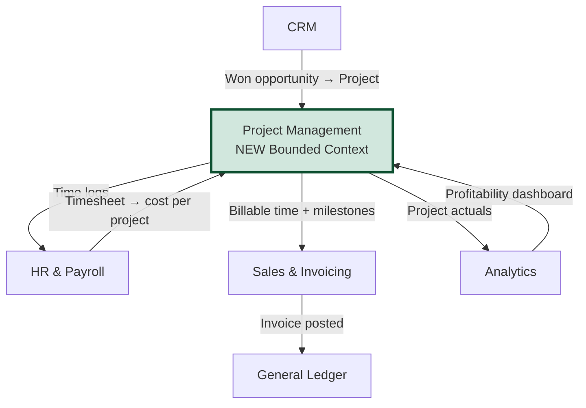
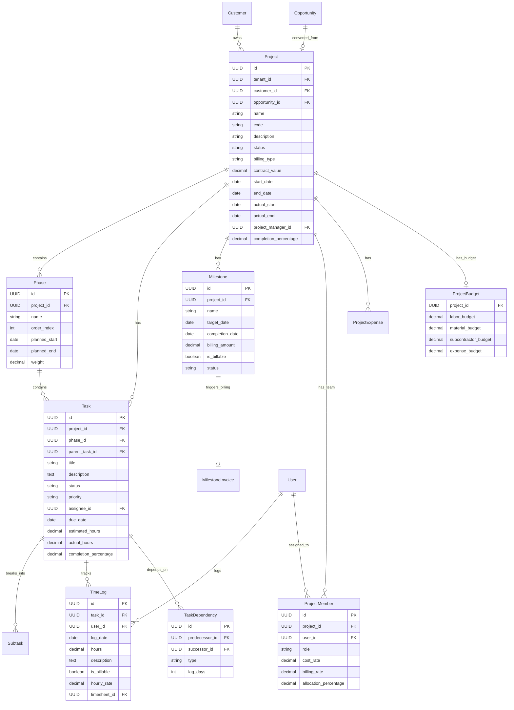
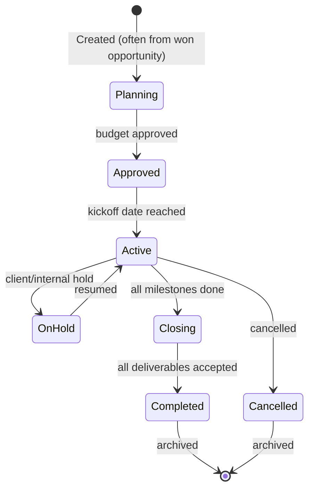
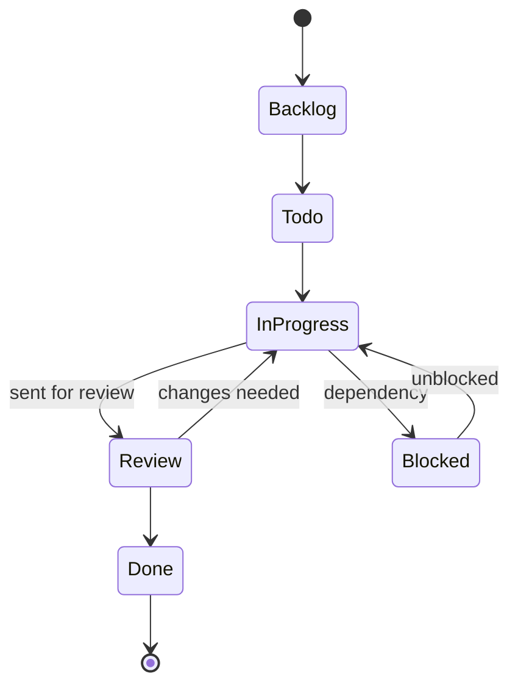
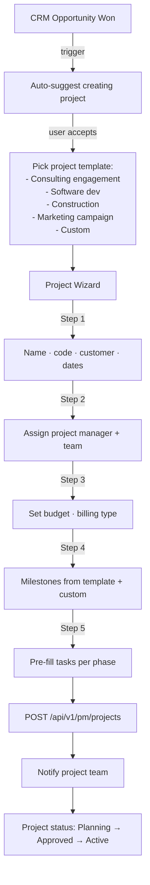
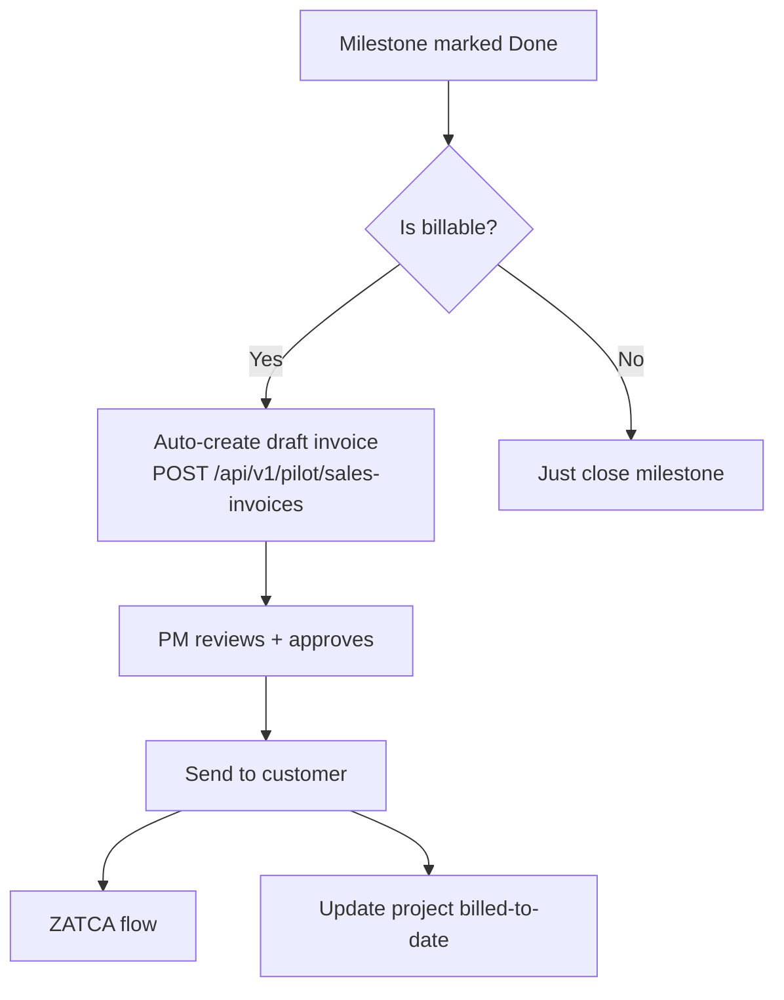
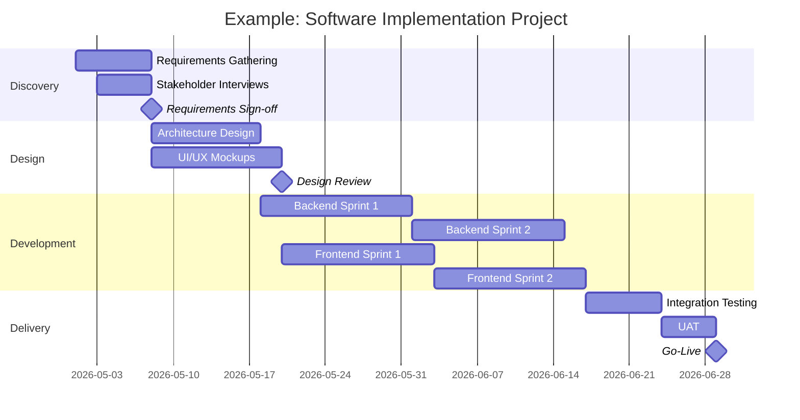
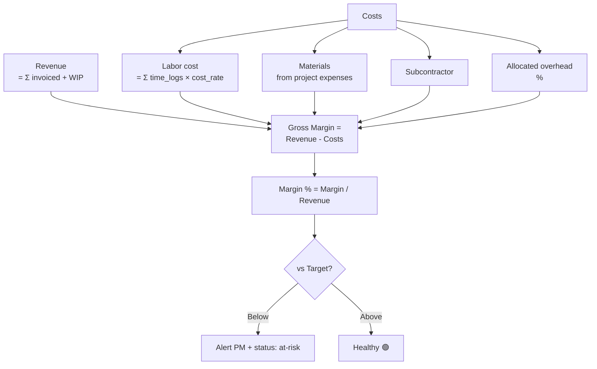

# 25 — Project Management Module / وحدة إدارة المشاريع

> Reference: extends `15_DDD_BOUNDED_CONTEXTS.md`. Integrates with `21_INDUSTRY_TEMPLATES.md` § Professional Services and Construction.
> **Goal:** Add full project/task management to APEX so service-based businesses (consulting, construction, IT) don't need Asana/Jira/MS Project. Patterns from Odoo Project, NetSuite OpenAir, Monday.com, ClickUp, Asana, Jira.

---

## 1. Why Project Management in APEX? / لماذا إدارة المشاريع في APEX؟

**EN:** APEX serves Professional Services, Construction, IT, Architecture, Marketing agencies — all of whom need to:
- Track projects, tasks, dependencies (Gantt)
- Log time per project (timesheets)
- Bill clients per hour or per milestone
- Calculate project profitability (revenue - cost)
- Allocate resources across projects

Today APEX has `/analytics/project-profitability` (a single screen) and basic timesheet (`/hr/timesheet`). This is **not** a real PM module. Customers must use external tools and copy data over.

**AR:** APEX تخدم الخدمات المهنية والمقاولات و IT والتسويق — وكلهم يحتاجون إدارة مشاريع كاملة مدمجة مع المحاسبة والفوترة. الحل الحالي ناقص.

---

## 2. PM in the APEX DDD Map / موقع PM في الخريطة



---

## 3. Core Project Entities / الكيانات الأساسية



---

## 4. Project Lifecycle State Machine / آلة حالة المشروع



### Task Status (separate state machine)


---

## 5. PM User Journeys / رحلات المستخدم

### J-PM-1: Create Project from Won Opportunity


### J-PM-2: Daily Task Management (Project Member)
```mermaid
flowchart TD
    LOGIN[Sales/PM logs in] --> MYTASKS[/pm/my-tasks<br/>shows tasks across projects]
    MYTASKS --> SORT{Sort by?}
    SORT -->|Priority| PRIORITY[High/Medium/Low]
    SORT -->|Due date| DUE
    SORT -->|Project| PROJECT
    PRIORITY & DUE & PROJECT --> ACTION{Action}
    ACTION -->|Start task| START[Status → In Progress<br/>start timer]
    ACTION -->|Log time| TIME[/pm/timer or quick-log]
    TIME --> SUBMIT[Submit timesheet]
    ACTION -->|Mark done| DONE[Status → Done<br/>auto-update project %]
    ACTION -->|Comment| COMMENT[Add comment + @mention]
    COMMENT -.notification.-> MENTIONED[@mentioned user notified]
```

### J-PM-3: Project Manager Daily View
```mermaid
flowchart LR
    PM_LOGIN[PM logs in] --> DASHBOARD[/pm/dashboard]
    DASHBOARD --> WIDGETS{Widgets}
    WIDGETS --> ATRISK[Projects at risk<br/>overdue / over budget]
    WIDGETS --> THIS_WEEK[This week's milestones]
    WIDGETS --> TEAM_LOAD[Team utilization]
    WIDGETS --> BURN[Budget burn vs progress]

    ATRISK -->|Click project| GANTT[/pm/projects/{id}/gantt]
    GANTT -->|Drag task| RESCHEDULE[Reschedule task]
    GANTT -->|Critical path| CP[Highlight critical path]

    PM_LOGIN --> APPROVE[Approve timesheets]
    APPROVE --> TS_QUEUE[Pending timesheets]
    TS_QUEUE --> APPROVE_BATCH[Approve all valid]
```

### J-PM-4: Milestone Billing


---

## 6. Frontend Routes / المسارات الجديدة

| Path | Screen | Purpose |
|------|--------|---------|
| `/pm` | `PmHubScreen` | PM service hub |
| `/pm/projects` | `ProjectsListScreen` | List + filter |
| `/pm/projects/new` | `NewProjectWizard` | 5-step wizard |
| `/pm/projects/:id` | `ProjectOverviewScreen` | Overview |
| `/pm/projects/:id/gantt` | `GanttChartScreen` | Gantt view |
| `/pm/projects/:id/kanban` | `KanbanScreen` | Kanban board |
| `/pm/projects/:id/team` | `ProjectTeamScreen` | Team management |
| `/pm/projects/:id/budget` | `ProjectBudgetScreen` | Budget vs actual |
| `/pm/projects/:id/timeline` | `ProjectTimelineScreen` | Activity timeline |
| `/pm/projects/:id/files` | `ProjectFilesScreen` | Project documents |
| `/pm/projects/:id/billing` | `ProjectBillingScreen` | Milestone billing |
| `/pm/tasks/:id` | `TaskDetailScreen` | Task detail |
| `/pm/my-tasks` | `MyTasksScreen` | Cross-project task list |
| `/pm/timesheet` | `MyTimesheetScreen` | Personal timesheet |
| `/pm/timesheets/approval` | `TimesheetApprovalScreen` | PM/Manager approval |
| `/pm/dashboard` | `PmDashboardScreen` | PM-level dashboard |
| `/pm/templates` | `ProjectTemplatesScreen` | Project templates |
| `/pm/utilization` | `UtilizationReportScreen` | Team utilization |

---

## 7. API Endpoints / النقاط الجديدة (~50 endpoints)

### Projects
```
GET    /api/v1/pm/projects?status=active&customer_id=...
POST   /api/v1/pm/projects
GET    /api/v1/pm/projects/{id}
PUT    /api/v1/pm/projects/{id}
DELETE /api/v1/pm/projects/{id}
POST   /api/v1/pm/projects/{id}/activate
POST   /api/v1/pm/projects/{id}/hold
POST   /api/v1/pm/projects/{id}/resume
POST   /api/v1/pm/projects/{id}/close
GET    /api/v1/pm/projects/{id}/gantt
GET    /api/v1/pm/projects/{id}/critical-path
GET    /api/v1/pm/projects/{id}/budget-status
GET    /api/v1/pm/projects/{id}/team-utilization
POST   /api/v1/pm/projects/{id}/from-template
GET    /api/v1/pm/templates
POST   /api/v1/pm/templates
```

### Phases & Tasks
```
GET    /api/v1/pm/projects/{pid}/phases
POST   /api/v1/pm/projects/{pid}/phases
GET    /api/v1/pm/tasks?project_id=...&assignee_id=...&status=...
POST   /api/v1/pm/tasks
GET    /api/v1/pm/tasks/{id}
PUT    /api/v1/pm/tasks/{id}
DELETE /api/v1/pm/tasks/{id}
POST   /api/v1/pm/tasks/{id}/move-status
POST   /api/v1/pm/tasks/{id}/assign
POST   /api/v1/pm/tasks/{id}/comments
GET    /api/v1/pm/tasks/{id}/comments
POST   /api/v1/pm/tasks/{id}/attachments
GET    /api/v1/pm/my-tasks
```

### Dependencies
```
GET    /api/v1/pm/tasks/{id}/dependencies
POST   /api/v1/pm/tasks/{id}/dependencies
DELETE /api/v1/pm/dependencies/{id}
```

### Milestones
```
GET    /api/v1/pm/projects/{pid}/milestones
POST   /api/v1/pm/projects/{pid}/milestones
PUT    /api/v1/pm/milestones/{id}
POST   /api/v1/pm/milestones/{id}/complete
POST   /api/v1/pm/milestones/{id}/bill         # → triggers invoice
```

### Time Tracking
```
POST   /api/v1/pm/time-logs
GET    /api/v1/pm/time-logs?user_id=...&from=...&to=...
PUT    /api/v1/pm/time-logs/{id}
DELETE /api/v1/pm/time-logs/{id}
POST   /api/v1/pm/timer/start
POST   /api/v1/pm/timer/stop
GET    /api/v1/pm/timer/active

GET    /api/v1/pm/timesheets/me?period=...
POST   /api/v1/pm/timesheets/submit
GET    /api/v1/pm/timesheets/pending-approval
POST   /api/v1/pm/timesheets/{id}/approve
POST   /api/v1/pm/timesheets/{id}/reject
```

### Reports
```
GET    /api/v1/pm/reports/utilization?period=...
GET    /api/v1/pm/reports/profitability?project_id=...
GET    /api/v1/pm/reports/billable-vs-non-billable
GET    /api/v1/pm/reports/at-risk-projects
GET    /api/v1/pm/reports/team-load
GET    /api/v1/pm/reports/burn-down/{project_id}
```

**Total: ~50 new endpoints under `/api/v1/pm/*`**

---

## 8. Gantt Chart Implementation / تنفيذ مخطط Gantt



**Frontend implementation:** Use `syncfusion_flutter_gantt` package (APEX already has Syncfusion grid demo at `/syncfusion-grid` — leverage license).

**Features:**
- Drag tasks to reschedule
- Highlight critical path
- Auto-calc dates from dependencies
- Show progress bars per task
- Resource allocation view (who's working on what)
- Baseline vs actual comparison

---

## 9. Billing Types / أنواع الفوترة

| Type | EN | AR | Use case | APEX implementation |
|------|----|----|----------|----|
| `fixed_price` | Fixed price | سعر ثابت | Whole project for X SAR | One invoice on completion (or per milestone) |
| `time_and_materials` | T&M | ساعة + مواد | Hourly billing | Monthly invoice = hours × rate |
| `milestone_based` | Milestone | معالم | Milestones each billable | Auto-invoice on milestone done |
| `retainer` | Retainer | احتفاظية | Monthly fee for ongoing service | Recurring invoice from `/sales/recurring` |
| `cost_plus` | Cost-plus | تكلفة + ربح | Construction | Pass-through cost + margin |
| `not_billable` | Internal | داخلي | Internal projects (R&D, infrastructure) | No invoice |

### Implementation
```python
class BillingService:
    def generate_invoice(self, project: Project, period: Period) -> Optional[SalesInvoice]:
        if project.billing_type == "time_and_materials":
            time_logs = self._get_billable_time_logs(project.id, period)
            return self._invoice_from_time(project, time_logs)
        elif project.billing_type == "milestone_based":
            done_milestones = self._get_completed_unbilled_milestones(project.id)
            return self._invoice_from_milestones(project, done_milestones)
        # ... etc
```

---

## 10. Project Profitability Calculation / حساب ربحية المشروع



### KPIs ship out of the box
- Margin % (vs target 35%)
- Realization rate = Billed hours / Logged hours (target 95%)
- Utilization rate = Billable hours / Total available hours (target 75%)
- Project health score (composite)
- AR days outstanding per project
- Forecast accuracy

---

## 11. Permissions × Plan Tier / الصلاحيات والخطط

| Feature | Project Member | PM | Admin | Free | Pro | Business | Expert | Enterprise |
|---------|----------------|----|----|------|-----|----------|--------|------------|
| View own tasks | ✓ | ✓ | ✓ | ✗ | 5 projects | ✓ | ✓ | ✓ |
| Create projects | ✗ | ✓ | ✓ | ✗ | ✗ | ✓ | ✓ | ✓ |
| Gantt view | ✓ | ✓ | ✓ | ✗ | ✗ | ✓ | ✓ | ✓ |
| Kanban | ✓ | ✓ | ✓ | ✗ | ✓ | ✓ | ✓ | ✓ |
| Time tracking | ✓ | ✓ | ✓ | ✗ | ✓ | ✓ | ✓ | ✓ |
| Approve timesheets | ✗ | ✓ | ✓ | ✗ | ✓ | ✓ | ✓ | ✓ |
| Project budget | ✗ | ✓ | ✓ | ✗ | ✗ | ✓ | ✓ | ✓ |
| Profitability | ✗ | ✓ | ✓ | ✗ | ✗ | ✓ | ✓ | ✓ |
| Critical path | ✓ | ✓ | ✓ | ✗ | ✗ | ✗ | ✓ | ✓ |
| Resource allocation | ✗ | ✓ | ✓ | ✗ | ✗ | ✗ | ✓ | ✓ |
| Multi-project portfolio | ✗ | ✗ | ✓ | ✗ | ✗ | ✗ | ✗ | ✓ |
| Templates | ✓ | ✓ | ✓ | ✗ | ✓ | ✓ | ✓ | ✓ |

---

## 12. Database Schema (key tables) / مخطط قاعدة البيانات

```sql
CREATE TABLE pm_projects (
    id UUID PRIMARY KEY DEFAULT gen_random_uuid(),
    tenant_id UUID NOT NULL,
    customer_id UUID,
    opportunity_id UUID,
    name VARCHAR(200) NOT NULL,
    code VARCHAR(50) UNIQUE,
    description TEXT,
    status VARCHAR(20) DEFAULT 'planning',
    billing_type VARCHAR(30) NOT NULL,
    contract_value DECIMAL(18,2),
    currency VARCHAR(3) DEFAULT 'SAR',
    start_date DATE,
    end_date DATE,
    actual_start TIMESTAMP,
    actual_end TIMESTAMP,
    project_manager_id UUID REFERENCES users(id),
    completion_percentage DECIMAL(5,2) DEFAULT 0,
    metadata JSONB,
    created_at TIMESTAMP DEFAULT NOW(),
    INDEX idx_projects_tenant_status (tenant_id, status),
    INDEX idx_projects_customer (customer_id),
    INDEX idx_projects_pm (project_manager_id)
);

CREATE TABLE pm_phases (
    id UUID PRIMARY KEY DEFAULT gen_random_uuid(),
    project_id UUID NOT NULL REFERENCES pm_projects(id) ON DELETE CASCADE,
    name VARCHAR(200) NOT NULL,
    order_index INT NOT NULL,
    planned_start DATE,
    planned_end DATE,
    weight DECIMAL(5,2)
);

CREATE TABLE pm_tasks (
    id UUID PRIMARY KEY DEFAULT gen_random_uuid(),
    project_id UUID NOT NULL REFERENCES pm_projects(id) ON DELETE CASCADE,
    phase_id UUID REFERENCES pm_phases(id),
    parent_task_id UUID REFERENCES pm_tasks(id),  -- for subtasks
    title VARCHAR(300) NOT NULL,
    description TEXT,
    status VARCHAR(20) DEFAULT 'backlog',
    priority VARCHAR(10) DEFAULT 'medium',
    assignee_id UUID REFERENCES users(id),
    reporter_id UUID REFERENCES users(id),
    due_date DATE,
    start_date DATE,
    estimated_hours DECIMAL(8,2),
    actual_hours DECIMAL(8,2) DEFAULT 0,
    completion_percentage DECIMAL(5,2) DEFAULT 0,
    metadata JSONB,
    INDEX idx_tasks_project_status (project_id, status),
    INDEX idx_tasks_assignee (assignee_id),
    INDEX idx_tasks_due_date (due_date)
);

CREATE TABLE pm_task_dependencies (
    id UUID PRIMARY KEY DEFAULT gen_random_uuid(),
    predecessor_id UUID NOT NULL REFERENCES pm_tasks(id) ON DELETE CASCADE,
    successor_id UUID NOT NULL REFERENCES pm_tasks(id) ON DELETE CASCADE,
    type VARCHAR(20) DEFAULT 'finish-to-start',  -- FS, SS, FF, SF
    lag_days INT DEFAULT 0,
    UNIQUE (predecessor_id, successor_id)
);

CREATE TABLE pm_milestones (
    id UUID PRIMARY KEY DEFAULT gen_random_uuid(),
    project_id UUID NOT NULL REFERENCES pm_projects(id) ON DELETE CASCADE,
    name VARCHAR(200) NOT NULL,
    target_date DATE,
    completion_date TIMESTAMP,
    billing_amount DECIMAL(18,2),
    is_billable BOOLEAN DEFAULT FALSE,
    sales_invoice_id UUID,  -- linked when invoiced
    status VARCHAR(20) DEFAULT 'pending'
);

CREATE TABLE pm_time_logs (
    id UUID PRIMARY KEY DEFAULT gen_random_uuid(),
    task_id UUID NOT NULL REFERENCES pm_tasks(id),
    user_id UUID NOT NULL REFERENCES users(id),
    log_date DATE NOT NULL,
    hours DECIMAL(5,2) NOT NULL,
    description TEXT,
    is_billable BOOLEAN DEFAULT TRUE,
    hourly_rate DECIMAL(10,2),
    cost_rate DECIMAL(10,2),
    timesheet_id UUID,
    invoiced_at TIMESTAMP,
    sales_invoice_line_id UUID,
    INDEX idx_timelogs_user_date (user_id, log_date DESC),
    INDEX idx_timelogs_task (task_id),
    INDEX idx_timelogs_billable_uninvoiced (is_billable, invoiced_at) WHERE invoiced_at IS NULL
);

CREATE TABLE pm_project_members (
    id UUID PRIMARY KEY DEFAULT gen_random_uuid(),
    project_id UUID NOT NULL REFERENCES pm_projects(id) ON DELETE CASCADE,
    user_id UUID NOT NULL REFERENCES users(id),
    role VARCHAR(50),
    cost_rate DECIMAL(10,2),
    billing_rate DECIMAL(10,2),
    allocation_percentage DECIMAL(5,2),
    UNIQUE (project_id, user_id)
);

CREATE TABLE pm_project_budgets (
    project_id UUID PRIMARY KEY REFERENCES pm_projects(id),
    labor_budget DECIMAL(18,2),
    material_budget DECIMAL(18,2),
    subcontractor_budget DECIMAL(18,2),
    expense_budget DECIMAL(18,2),
    total_budget DECIMAL(18,2)
);
```

---

## 13. Critical Path Algorithm / خوارزمية المسار الحرج

```python
# app/pm/services/critical_path_service.py
from typing import List
from datetime import date, timedelta

class CriticalPathService:
    def compute(self, project_id: UUID, db: Session) -> dict:
        tasks = self._get_tasks_with_dependencies(project_id, db)
        # Forward pass: earliest start/finish
        for task in self._topological_sort(tasks):
            predecessors = self._get_predecessors(task, tasks)
            if not predecessors:
                task.es = task.start_date or date.today()
            else:
                task.es = max(p.ef + timedelta(days=p.lag_days) for p in predecessors)
            task.ef = task.es + timedelta(days=task.duration_days)
        # Backward pass: latest start/finish
        project_end = max(t.ef for t in tasks)
        for task in reversed(self._topological_sort(tasks)):
            successors = self._get_successors(task, tasks)
            if not successors:
                task.lf = project_end
            else:
                task.lf = min(s.ls - timedelta(days=s.lag_days) for s in successors)
            task.ls = task.lf - timedelta(days=task.duration_days)
            task.float_days = (task.ls - task.es).days
            task.is_critical = task.float_days == 0
        return {
            "project_end_date": project_end,
            "critical_path": [t for t in tasks if t.is_critical],
            "total_float": sum(t.float_days for t in tasks),
        }
```

---

## 14. Integration with HR Timesheet / التكامل مع الموارد البشرية

APEX already has `/hr/timesheet` (basic). The **PM module** uses the same underlying `TimeLog` table but adds:
- `task_id` link (HR timesheet currently has no task)
- `is_billable` flag
- `hourly_rate` snapshot at log time
- Billable/non-billable separation

**Migration:** existing `/hr/timesheet` becomes a simpler view of the same data. PM users see project-aware view. HR users see employee-aware view.

---

## 15. Implementation Plan for Claude Code / خطة التنفيذ

### Phase 1: Foundation (Week 1-2)
**Backend:**
- [ ] `app/pm/` folder
- [ ] Models: Project, Phase, Task, TaskDependency, Milestone
- [ ] Alembic migration `add_pm_module`
- [ ] CRUD endpoints
- [ ] Project state machine
- [ ] Tests

**Frontend:**
- [ ] `/pm` routes
- [ ] `PmHubScreen`
- [ ] `ProjectsListScreen`
- [ ] `NewProjectWizard` (5 steps)
- [ ] `ProjectOverviewScreen`
- [ ] Add PM tile to launchpad

### Phase 2: Tasks & Kanban (Week 3)
- [ ] `KanbanScreen` (drag-drop between status columns)
- [ ] `TaskDetailScreen`
- [ ] Subtasks, checklist, comments
- [ ] @mentions trigger notifications
- [ ] Assignment + reassignment
- [ ] Tests for state machine

### Phase 3: Gantt (Week 4-5)
- [ ] Critical path service
- [ ] Dependencies CRUD
- [ ] `GanttChartScreen` (Syncfusion package)
- [ ] Drag-to-reschedule
- [ ] Baseline vs actual

### Phase 4: Time Tracking (Week 6)
- [ ] TimeLog model
- [ ] `MyTimesheetScreen` with timer
- [ ] `TimesheetApprovalScreen`
- [ ] Cost / billing rate per project member

### Phase 5: Billing (Week 7)
- [ ] Milestone billing flow
- [ ] T&M monthly invoice generation
- [ ] Link to Pilot Sales Invoice
- [ ] Project profitability service

### Phase 6: Reports & Templates (Week 8)
- [ ] Templates (consulting, software, construction, marketing)
- [ ] Utilization report
- [ ] At-risk projects
- [ ] Burn-down charts
- [ ] Export to PDF/Excel

**Total: 8 weeks for full PM v1.**

---

## 16. Comparable Products / منتجات مشابهة

| Feature | Asana | Jira | Monday | Odoo Project | NetSuite OpenAir | APEX PM (planned) |
|---------|-------|------|--------|--------------|------------------|---------------------|
| Tasks + Subtasks | ✓ | ✓ | ✓ | ✓ | ✓ | ✓ |
| Kanban | ✓ | ✓ | ✓ | ✓ | ⚠️ | ✓ |
| Gantt | Pro+ | ✓ | ✓ | ✓ | ✓ | ✓ |
| Time tracking | Pro+ | Tempo plugin | Pro | ✓ | ✓ | ✓ |
| Native invoicing | ✗ | ✗ | ✗ | ✓ | ✓ | ✓ (key advantage) |
| Project profitability | ✗ | ✗ | ✗ | ✓ | ✓ | ✓ (key advantage) |
| Arabic native | ✗ | ⚠️ | ⚠️ | ⚠️ | ✗ | ✓ (key advantage) |
| Mobile | ✓ | ✓ | ✓ | ✓ | ✓ | Flutter Web (mobile responsive) |
| Pricing (mid-tier) | $25/user | $14/user | $24/user | open-source | call | Included Business+ |

**APEX advantage:** Project tracking + cost + invoicing + profitability in ONE platform with Arabic-native UX.

---

## 17. Out of Scope (v1) / خارج النطاق في الإصدار الأول

Defer for v2:
- Resource leveling algorithms
- Earned Value Management (EVM) — PV, EV, AC, CPI, SPI
- Risk register per project (already in `/compliance/risk-register`, just link)
- Issue tracking (use task status `Blocked` with notes for v1)
- Time-off integration with Gantt (will conflict with phase scheduling)
- Multi-project portfolio dashboard (v2)
- Custom workflow rules (v2)
- AI-powered project plan generation from description (v2)

---

## 18. Update References After Implementation

- `04_SCREENS_AND_BUTTONS_CATALOG.md` — add PM screens (~18 entries)
- `05_API_ENDPOINTS_MASTER.md` — add ~50 endpoints under "Phase 13: Project Management"
- `06_PERMISSIONS_AND_PLANS_MATRIX.md` — add PM section
- `07_DATA_MODEL_ER.md` — add PM ER diagram
- `09_GAPS_AND_REWORK_PLAN.md` — close "G-PM-1: No real Project Management" gap
- `15_DDD_BOUNDED_CONTEXTS.md` — add PM bounded context (now 22 contexts)
- `21_INDUSTRY_TEMPLATES.md` § Construction & Professional Services — reference PM features

---

**Continue → `26_DOCUMENT_MANAGEMENT_SYSTEM.md`**
