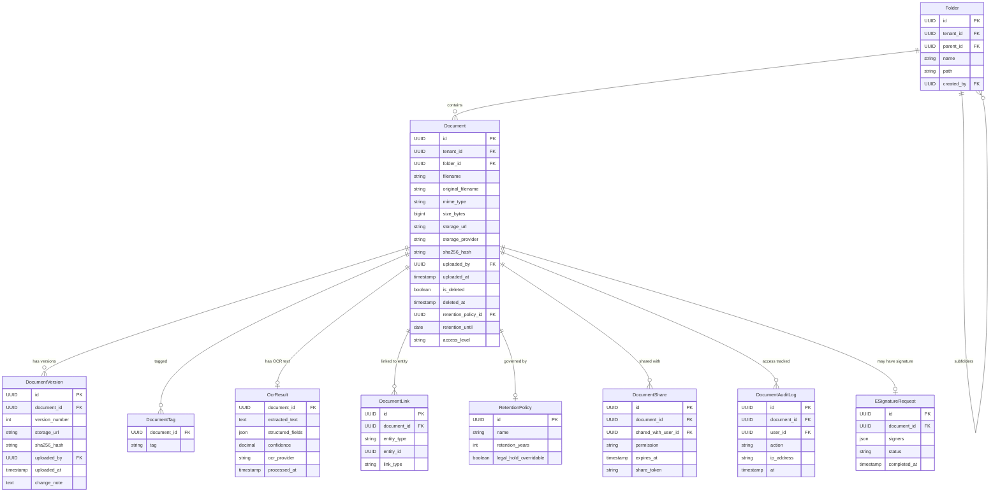
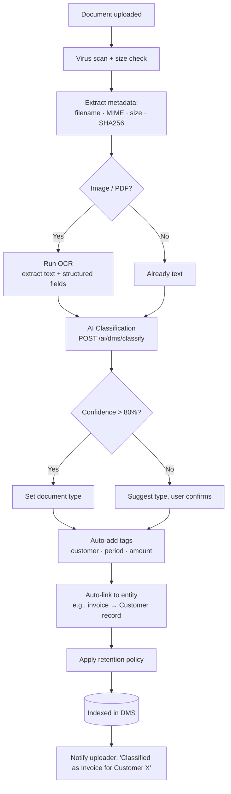
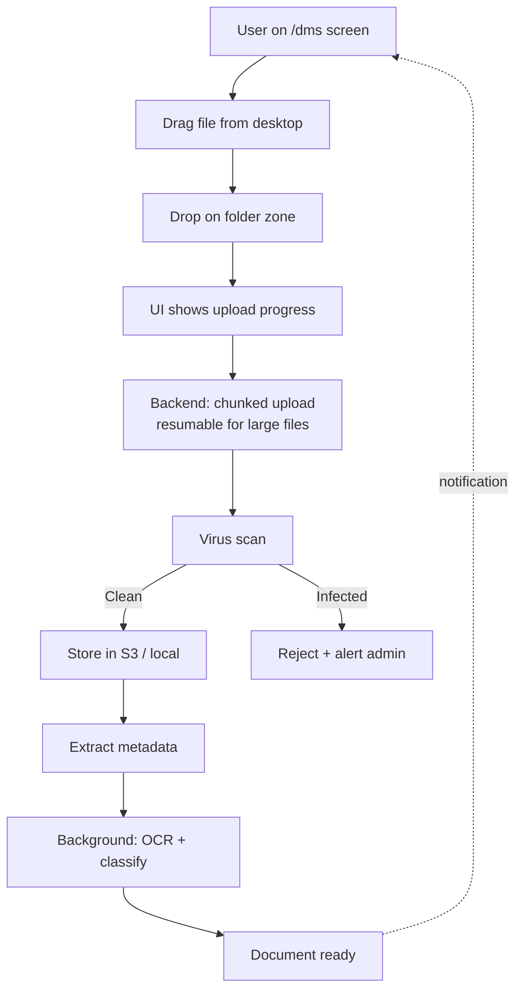
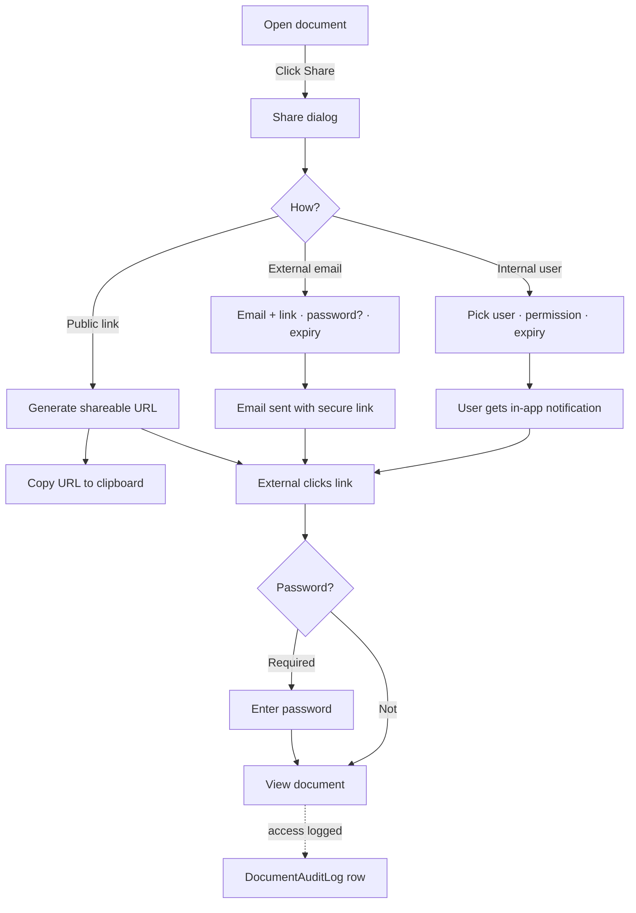
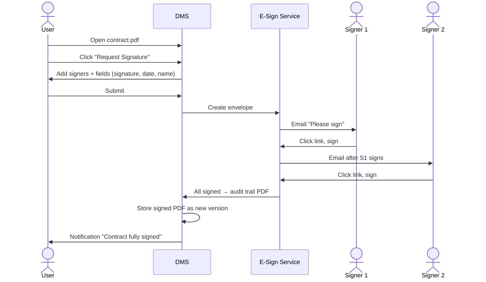
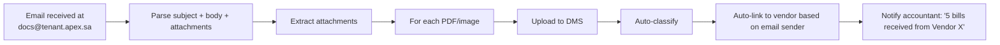
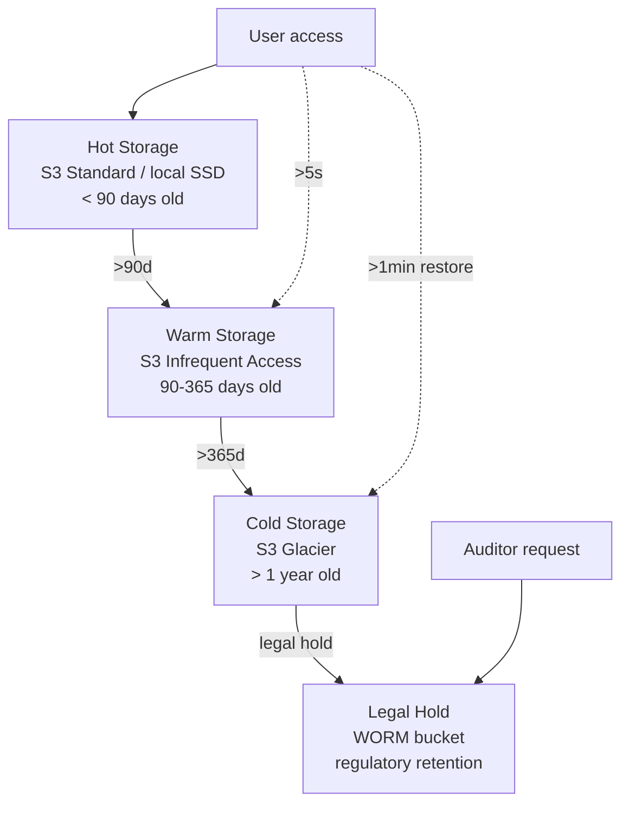

# 26 — Document Management System (DMS) / نظام إدارة المستندات

> Reference: extends `01_ARCHITECTURE_OVERVIEW.md` § Storage Backend, `15_DDD_BOUNDED_CONTEXTS.md`, and integrates with EVERY APEX module.
> **Goal:** A central, searchable, secure document store. Patterns from SharePoint, Google Drive, Dropbox Business, Odoo Documents, NetSuite File Cabinet, M-Files, Box, eFileCabinet.

---

## 1. Why DMS in APEX? / لماذا نظام إدارة المستندات داخل APEX؟

**EN:** Financial work IS document work. Invoices, receipts, contracts, bank statements, tax filings, audit workpapers, ID copies, CR registrations, VAT certificates — APEX customers handle hundreds of documents per month.

Today APEX has scattered file uploads:
- Client documents (Phase 2)
- Provider documents (Phase 4)
- Receipts (Operations OCR)
- Audit workpaper attachments
- Archive (Phase 9)

These are NOT integrated. Same document re-uploaded 3 times. No search. No version control. No retention policy. No e-signature. **Customers will leave APEX for tools that solve this.**

**AR:** العمل المالي هو عمل مستندات بالأساس. حالياً APEX بها رفع ملفات في عدة أماكن غير مترابطة. هذا غير كافٍ.

---

## 2. DMS in the APEX DDD Map / موقع DMS في الخريطة

```mermaid
graph TB
    DMS[DMS Bounded Context<br/>NEW · cross-cutting]

    DMS -->|stores files for| MOD1[Sales / Invoices PDFs]
    DMS -->|stores files for| MOD2[Purchase / Bills + Receipts]
    DMS -->|stores files for| MOD3[Audit / Workpapers]
    DMS -->|stores files for| MOD4[CRM / Contracts]
    DMS -->|stores files for| MOD5[PM / Project deliverables]
    DMS -->|stores files for| MOD6[HR / Employee documents]
    DMS -->|stores files for| MOD7[Compliance / Regulatory]
    DMS -->|stores files for| MOD8[Tenant / KYC docs]

    DMS -->|OCR + classify| AI[AI Copilot]
    DMS -->|metadata search| KB[Knowledge Brain]
    DMS -->|access logs| AUDIT[Audit Log]
    DMS -->|sign requests| SIGN[E-signature]
    DMS -->|encryption| KMS[KMS / HSM]
    DMS -->|storage| S3[S3 / Local]

    classDef new fill:#d1e7dd,stroke:#0f5132,stroke-width:3px
    class DMS new
```



**Key insight:** DMS is **cross-cutting infrastructure**, like the audit log. Every module talks to it.

---

## 3. Core DMS Entities / الكيانات الأساسية



---

## 4. Document Types & Auto-Classification / أنواع المستندات والتصنيف التلقائي

APEX should ship 30+ pre-defined document types with auto-classification rules:

| Category | Types EN | Arabic | Auto-detect heuristic |
|----------|---------|--------|----------------------|
| **Sales** | Invoice, Quote, Credit Note, Delivery Note | فاتورة، عرض سعر، إشعار دائن، مذكرة تسليم | Filename keywords + ZATCA UUID |
| **Purchase** | Bill, PO, Receipt, Goods Receipt | فاتورة شراء، أمر شراء، إيصال، استلام بضاعة | Filename + format |
| **Banking** | Bank statement, Wire confirmation, Cheque | كشف حساب، تأكيد حوالة، شيك | Bank logo OCR |
| **Tax** | VAT certificate, Tax filing, Zakat certificate | شهادة ضريبة، إقرار ضريبي، شهادة زكاة | Authority logo + form ID |
| **Legal** | Contract, NDA, MoU, Agreement | عقد، اتفاقية عدم إفصاح، مذكرة تفاهم، اتفاقية | Heading text |
| **Compliance** | CR (Commercial Registration), VAT registration, GOSI cert | السجل التجاري، شهادة الضريبة، شهادة GOSI | Format + issuer |
| **HR** | Employee contract, Resignation, Pay slip, Visa | عقد عمل، استقالة، قسيمة راتب، تأشيرة | Document fields |
| **Audit** | Workpaper, Confirmation, Sample evidence, Mgmt rep | ورقة عمل، مصادقة، عينة، إفادة إدارة | Engagement reference |
| **ID** | National ID, Passport, Driver's license | بطاقة هوية، جواز، رخصة | Image template |
| **Property** | Lease contract, Title deed, Maintenance log | عقد إيجار، صك ملكية، سجل صيانة | Heading + format |
| **Project** | SoW, Deliverable, Specification, Drawing | بيان عمل، مخرج، مواصفات، رسم | Project ref |
| **Other** | Generic | عام | n/a |

### Auto-classification flow


---

## 5. Folder Structure / هيكل المجلدات

```mermaid
graph TD
    ROOT[/Tenant Root]
    ROOT --> SHARED[Shared]
    ROOT --> ENTITY1[Entity: ABC Trading Co.]
    ROOT --> ENTITY2[Entity: XYZ Services]
    ROOT --> ARCHIVE[Archive]

    ENTITY1 --> SALES[Sales]
    ENTITY1 --> PURCHASE[Purchase]
    ENTITY1 --> BANKING[Banking]
    ENTITY1 --> TAX[Tax]
    ENTITY1 --> AUDITS[Audits]
    ENTITY1 --> CONTRACTS[Contracts]
    ENTITY1 --> EMPLOYEES[Employees]
    ENTITY1 --> PROJECTS[Projects]

    SALES --> Y2026[2026]
    Y2026 --> Q1[Q1]
    Y2026 --> Q2[Q2]
    Q1 --> JAN[Jan]
    Q1 --> FEB[Feb]
    Q1 --> MAR[Mar]

    AUDITS --> AUD2026[Audit 2026]
    AUD2026 --> WP[Workpapers]
    AUD2026 --> EVID[Evidence]
    AUD2026 --> REP[Reports]
```

**APEX should auto-create this folder skeleton** when an entity is created. Customers can customize but the default works for 90%.

---

## 6. DMS User Journeys / رحلات المستخدم

### J-DMS-1: Upload via Drag-Drop


### J-DMS-2: Search & Find
```mermaid
flowchart LR
    SEARCH[/dms/search] --> QUERY[Type query]
    QUERY --> AUTOCOMP[Autocomplete<br/>customer · vendor · invoice #]
    AUTOCOMP --> FILTERS{Filters}
    FILTERS --> TYPE[Document type]
    FILTERS --> DATE[Date range]
    FILTERS --> CUSTOMER[Customer/Vendor]
    FILTERS --> AMOUNT[Amount range]
    FILTERS --> TAG[Tags]
    TYPE & DATE & CUSTOMER & AMOUNT & TAG --> RESULTS[Search results<br/>full-text + metadata + OCR text]
    RESULTS -->|Click| PREVIEW[In-page preview<br/>PDF viewer / image]
    PREVIEW --> ACTIONS{Actions}
    ACTIONS --> DOWN[Download]
    ACTIONS --> SHARE[Share with user/external]
    ACTIONS --> COMMENT[Comment]
    ACTIONS --> SIGN[Request signature]
    ACTIONS --> LINK[Link to entity]
    ACTIONS --> NEW_VER[Upload new version]
```

### J-DMS-3: Sharing with External User


### J-DMS-4: E-Signature Workflow


### J-DMS-5: Auto-extract from Email (Future)


---

## 7. Frontend Routes / المسارات الجديدة

| Path | Screen | Purpose |
|------|--------|---------|
| `/dms` | `DmsHubScreen` | Main DMS view |
| `/dms/folder/:id` | `FolderScreen` | Folder contents |
| `/dms/search` | `DmsSearchScreen` | Full-text + metadata search |
| `/dms/recent` | `RecentDocumentsScreen` | Recent uploads |
| `/dms/shared-with-me` | `SharedWithMeScreen` | Documents shared with current user |
| `/dms/signed-by-me` | `SignedByMeScreen` | E-signature history |
| `/dms/document/:id` | `DocumentViewerScreen` | View / preview |
| `/dms/document/:id/versions` | `VersionHistoryScreen` | Version history |
| `/dms/document/:id/audit` | `DocumentAuditTrailScreen` | Access log |
| `/dms/upload` | `UploadScreen` | Upload (drag-drop) |
| `/dms/scan` | `MobileScanScreen` | Mobile camera scan |
| `/dms/trash` | `TrashScreen` | Deleted (recoverable 30d) |
| `/dms/templates` | `DocumentTemplatesScreen` | Standard templates (NDA, contract, etc.) |
| `/dms/policies` | `RetentionPoliciesScreen` | Admin: retention policies |
| `/admin/dms-stats` | `DmsAdminStatsScreen` | Storage usage, top types |

---

## 8. API Endpoints / النقاط الجديدة (~40 endpoints)

### Document CRUD
```
POST   /api/v1/dms/documents                # multipart upload
POST   /api/v1/dms/documents/chunked-init   # init chunked upload (large files)
POST   /api/v1/dms/documents/chunked-upload # send chunk
POST   /api/v1/dms/documents/chunked-complete # finalize
GET    /api/v1/dms/documents/{id}
GET    /api/v1/dms/documents/{id}/preview   # HTML preview
GET    /api/v1/dms/documents/{id}/download
GET    /api/v1/dms/documents/{id}/thumbnail
PUT    /api/v1/dms/documents/{id}           # update metadata
DELETE /api/v1/dms/documents/{id}           # soft delete (trash)
POST   /api/v1/dms/documents/{id}/restore   # un-trash
DELETE /api/v1/dms/documents/{id}/permanent # admin only
POST   /api/v1/dms/documents/{id}/versions  # upload new version
GET    /api/v1/dms/documents/{id}/versions
GET    /api/v1/dms/documents/{id}/versions/{vid}/download
```

### Folders
```
GET    /api/v1/dms/folders?parent_id=...
POST   /api/v1/dms/folders
PUT    /api/v1/dms/folders/{id}
DELETE /api/v1/dms/folders/{id}
POST   /api/v1/dms/folders/{id}/move
GET    /api/v1/dms/folders/{id}/breadcrumb
```

### Search
```
POST   /api/v1/dms/search                   # advanced search
GET    /api/v1/dms/search/autocomplete?q=...
GET    /api/v1/dms/recent
GET    /api/v1/dms/popular-tags
```

### Tags
```
POST   /api/v1/dms/documents/{id}/tags
DELETE /api/v1/dms/documents/{id}/tags/{tag}
GET    /api/v1/dms/tags
```

### Sharing
```
POST   /api/v1/dms/documents/{id}/shares    # internal user
POST   /api/v1/dms/documents/{id}/share-link # external link
DELETE /api/v1/dms/documents/{id}/shares/{share_id}
GET    /api/v1/dms/shared/{token}           # public access (no auth, token in URL)
```

### Linking (to entities)
```
POST   /api/v1/dms/documents/{id}/links     # link to invoice/customer/etc
DELETE /api/v1/dms/documents/{id}/links/{link_id}
GET    /api/v1/dms/documents/by-entity/{type}/{id}
```

### OCR & AI
```
POST   /api/v1/dms/documents/{id}/ocr       # trigger / re-run
GET    /api/v1/dms/documents/{id}/ocr       # get OCR result
POST   /api/v1/ai/dms/classify              # AI classify
POST   /api/v1/ai/dms/extract-fields        # AI structured extraction
```

### E-signature
```
POST   /api/v1/dms/documents/{id}/sign-request
GET    /api/v1/dms/sign-requests/{id}
POST   /api/v1/dms/sign-requests/{id}/sign  # signer endpoint
GET    /api/v1/dms/sign-requests/{id}/audit-trail
```

### Retention & Admin
```
GET    /api/v1/dms/retention-policies
POST   /api/v1/dms/retention-policies
PUT    /api/v1/dms/documents/{id}/legal-hold
GET    /api/v1/admin/dms/stats              # storage, top types, etc.
GET    /api/v1/admin/dms/audit-log          # all access events
```

**Total: ~40 new endpoints under `/api/v1/dms/*`**

---

## 9. Storage Strategy / استراتيجية التخزين

### Tiered Storage


**Cost optimization:**
- Hot: $0.023/GB/month
- Warm: $0.0125/GB/month
- Cold: $0.004/GB/month
- For tenant with 100GB: $2.30 → $0.40 over time

---

## 10. Permissions × Plan Tier / الصلاحيات والخطط

| Feature | Plan: Free | Pro | Business | Expert | Enterprise |
|---------|-----------|-----|----------|--------|------------|
| Storage quota | 100 MB | 5 GB | 50 GB | 500 GB | Unlimited |
| Max file size | 5 MB | 50 MB | 200 MB | 1 GB | 5 GB |
| OCR | ✗ | 50/month | 500/month | unlimited | unlimited |
| AI classification | ✗ | ✗ | ✓ | ✓ | ✓ |
| Folder hierarchy | 2 levels | unlimited | unlimited | unlimited | unlimited |
| Versioning | ✗ | 5 versions | unlimited | unlimited | unlimited |
| Internal sharing | ✓ | ✓ | ✓ | ✓ | ✓ |
| External link sharing | ✗ | ✗ | ✓ | ✓ | ✓ |
| E-signature | ✗ | ✗ | 10/month | 100/month | unlimited |
| Retention policies | basic | basic | custom | custom | custom + legal hold |
| Mobile scan | ✗ | ✓ | ✓ | ✓ | ✓ |
| Email forwarding | ✗ | ✗ | ✓ | ✓ | ✓ |
| API access | ✗ | ✗ | basic | full | full + webhooks |

---

## 11. Database Schema / مخطط قاعدة البيانات

```sql
CREATE TABLE dms_folders (
    id UUID PRIMARY KEY DEFAULT gen_random_uuid(),
    tenant_id UUID NOT NULL,
    parent_id UUID REFERENCES dms_folders(id),
    name VARCHAR(200) NOT NULL,
    path TEXT,  -- denormalized for fast prefix queries
    created_by UUID REFERENCES users(id),
    created_at TIMESTAMP DEFAULT NOW(),
    is_system BOOLEAN DEFAULT FALSE,  -- auto-created folders cannot be deleted
    INDEX idx_folders_tenant_parent (tenant_id, parent_id),
    INDEX idx_folders_path (path)
);

CREATE TABLE dms_documents (
    id UUID PRIMARY KEY DEFAULT gen_random_uuid(),
    tenant_id UUID NOT NULL,
    folder_id UUID REFERENCES dms_folders(id),
    filename VARCHAR(500) NOT NULL,
    original_filename VARCHAR(500),
    mime_type VARCHAR(100),
    size_bytes BIGINT NOT NULL,
    storage_url VARCHAR(1000) NOT NULL,
    storage_provider VARCHAR(20) DEFAULT 'local',  -- 'local'|'s3'|'glacier'
    storage_tier VARCHAR(20) DEFAULT 'hot',  -- 'hot'|'warm'|'cold'
    sha256_hash CHAR(64) NOT NULL,
    document_type VARCHAR(50),  -- auto-classified
    classification_confidence DECIMAL(3,2),
    description TEXT,
    uploaded_by UUID REFERENCES users(id),
    uploaded_at TIMESTAMP DEFAULT NOW(),
    is_deleted BOOLEAN DEFAULT FALSE,
    deleted_at TIMESTAMP,
    deleted_by UUID,
    retention_policy_id UUID REFERENCES dms_retention_policies(id),
    retention_until DATE,
    legal_hold BOOLEAN DEFAULT FALSE,
    access_level VARCHAR(20) DEFAULT 'tenant',  -- 'tenant'|'private'|'public-link'
    metadata JSONB,
    INDEX idx_docs_tenant (tenant_id),
    INDEX idx_docs_folder (folder_id),
    INDEX idx_docs_uploader (uploaded_by),
    INDEX idx_docs_type (document_type),
    INDEX idx_docs_hash (sha256_hash),  -- dedup detection
    INDEX idx_docs_retention (retention_until) WHERE NOT legal_hold,
    UNIQUE (tenant_id, sha256_hash) WHERE NOT is_deleted  -- dedup
);

CREATE TABLE dms_document_versions (
    id UUID PRIMARY KEY DEFAULT gen_random_uuid(),
    document_id UUID NOT NULL REFERENCES dms_documents(id) ON DELETE CASCADE,
    version_number INT NOT NULL,
    storage_url VARCHAR(1000) NOT NULL,
    sha256_hash CHAR(64) NOT NULL,
    size_bytes BIGINT,
    uploaded_by UUID REFERENCES users(id),
    uploaded_at TIMESTAMP DEFAULT NOW(),
    change_note TEXT,
    UNIQUE (document_id, version_number)
);

CREATE TABLE dms_document_links (
    id UUID PRIMARY KEY DEFAULT gen_random_uuid(),
    document_id UUID NOT NULL REFERENCES dms_documents(id) ON DELETE CASCADE,
    entity_type VARCHAR(50) NOT NULL,  -- 'invoice'|'customer'|'project'|'audit_engagement'|...
    entity_id UUID NOT NULL,
    link_type VARCHAR(30),  -- 'attachment'|'evidence'|'contract'|'reference'
    created_at TIMESTAMP DEFAULT NOW(),
    INDEX idx_links_entity (entity_type, entity_id),
    INDEX idx_links_doc (document_id)
);

CREATE TABLE dms_document_tags (
    document_id UUID REFERENCES dms_documents(id) ON DELETE CASCADE,
    tag VARCHAR(100),
    PRIMARY KEY (document_id, tag),
    INDEX idx_tags_tag (tag)
);

CREATE TABLE dms_ocr_results (
    document_id UUID PRIMARY KEY REFERENCES dms_documents(id) ON DELETE CASCADE,
    extracted_text TEXT,
    extracted_text_search TSVECTOR,  -- full-text search
    structured_fields JSONB,
    confidence DECIMAL(3,2),
    ocr_provider VARCHAR(50),
    processed_at TIMESTAMP DEFAULT NOW(),
    INDEX idx_ocr_text USING GIN(extracted_text_search)
);

CREATE TABLE dms_shares (
    id UUID PRIMARY KEY DEFAULT gen_random_uuid(),
    document_id UUID NOT NULL REFERENCES dms_documents(id),
    shared_with_user_id UUID REFERENCES users(id),  -- internal share
    share_token VARCHAR(100) UNIQUE,  -- external link
    permission VARCHAR(20) DEFAULT 'view',  -- 'view'|'edit'|'sign'
    password_hash VARCHAR(200),
    expires_at TIMESTAMP,
    created_by UUID REFERENCES users(id),
    created_at TIMESTAMP DEFAULT NOW(),
    INDEX idx_shares_user (shared_with_user_id),
    INDEX idx_shares_token (share_token)
);

CREATE TABLE dms_audit_log (
    id UUID PRIMARY KEY DEFAULT gen_random_uuid(),
    document_id UUID NOT NULL REFERENCES dms_documents(id),
    user_id UUID REFERENCES users(id),
    action VARCHAR(30) NOT NULL,  -- 'view'|'download'|'share'|'edit'|'delete'|'restore'
    ip_address VARCHAR(45),
    user_agent TEXT,
    at TIMESTAMP DEFAULT NOW(),
    INDEX idx_dms_audit_doc_at (document_id, at DESC)
);

CREATE TABLE dms_retention_policies (
    id UUID PRIMARY KEY DEFAULT gen_random_uuid(),
    tenant_id UUID,  -- NULL for system-level
    name VARCHAR(100) NOT NULL,
    name_ar VARCHAR(100),
    retention_years INT NOT NULL,
    legal_hold_overridable BOOLEAN DEFAULT TRUE,
    is_default BOOLEAN DEFAULT FALSE
);

-- Default retention policies (seeded):
-- - "ZATCA invoices" — 5 years
-- - "Audit workpapers" — 10 years (SOCPA)
-- - "Tax filings" — 10 years
-- - "Employment records" — 7 years post-termination
-- - "Contracts" — 7 years post-termination
-- - "General business" — 5 years
-- - "Personal/HR sensitive" — until termination + 7 years

CREATE TABLE dms_signature_requests (
    id UUID PRIMARY KEY DEFAULT gen_random_uuid(),
    document_id UUID NOT NULL REFERENCES dms_documents(id),
    requester_id UUID REFERENCES users(id),
    signers JSONB NOT NULL,  -- [{email, name, role, order, status, signed_at}]
    status VARCHAR(20) DEFAULT 'pending',  -- 'pending'|'in_progress'|'completed'|'cancelled'
    completed_at TIMESTAMP,
    final_signed_url VARCHAR(1000),
    audit_trail JSONB
);
```

---

## 12. OCR Implementation / تنفيذ OCR

### Provider Strategy
| Provider | Strengths | Cost | Use case |
|----------|-----------|------|----------|
| **AWS Textract** | Tables, forms, hand-writing | $0.0015/page | Default for invoices |
| **Google Vision** | Best Arabic OCR | $0.0015/page | Arabic-heavy docs |
| **Azure Form Recognizer** | Pre-trained for invoices | $0.001/page | Structured invoices |
| **Tesseract** (open) | Free, on-prem | Free | Privacy-sensitive |
| **TrOCR** (HuggingFace) | Modern, open | Free | Future on-prem |

### Architecture
```python
# app/dms/services/ocr_service.py
class OcrService:
    def __init__(self, provider: str = None):
        self.provider = provider or settings.OCR_PROVIDER
        self.adapter = self._get_adapter(self.provider)

    def process(self, document: Document) -> OcrResult:
        # 1. Download from storage
        content = storage.get(document.storage_url)
        # 2. Determine if Arabic-heavy → switch provider
        is_arabic = self._detect_arabic(document.original_filename)
        if is_arabic and self.provider != "google_vision":
            self.adapter = self._get_adapter("google_vision")
        # 3. Run OCR
        result = self.adapter.extract(content, document.mime_type)
        # 4. Structured field extraction (AI Copilot)
        structured = self._extract_structured(result.text, document.document_type)
        # 5. Persist
        return OcrResult(
            document_id=document.id,
            extracted_text=result.text,
            structured_fields=structured,
            confidence=result.confidence,
            ocr_provider=self.provider,
        )
```

### Structured Field Extraction (per document type)
Invoice → vendor name, invoice #, date, amount, VAT, line items
Bank statement → account #, balance, transactions
Contract → parties, effective date, termination, value
ID → name, number, expiry

---

## 13. Search Implementation / تنفيذ البحث

### Postgres Full-text + Trigram
```sql
-- Add tsvector to documents
ALTER TABLE dms_documents ADD COLUMN search_vector TSVECTOR;
CREATE INDEX idx_docs_search ON dms_documents USING GIN(search_vector);

-- Trigger to update search_vector
CREATE OR REPLACE FUNCTION dms_docs_search_update() RETURNS TRIGGER AS $$
BEGIN
    NEW.search_vector :=
        setweight(to_tsvector('arabic', COALESCE(NEW.filename, '')), 'A') ||
        setweight(to_tsvector('arabic', COALESCE(NEW.description, '')), 'B') ||
        setweight(to_tsvector('arabic', COALESCE(NEW.document_type, '')), 'C');
    RETURN NEW;
END $$ LANGUAGE plpgsql;

CREATE TRIGGER dms_docs_search_trigger BEFORE INSERT OR UPDATE
ON dms_documents FOR EACH ROW EXECUTE FUNCTION dms_docs_search_update();
```

### Search query
```sql
SELECT d.*, ts_rank(d.search_vector || coalesce(o.extracted_text_search, ''),
                    plainto_tsquery('arabic', :query)) AS rank
FROM dms_documents d
LEFT JOIN dms_ocr_results o ON o.document_id = d.id
WHERE d.tenant_id = :tenant_id
  AND NOT d.is_deleted
  AND (
    d.search_vector @@ plainto_tsquery('arabic', :query)
    OR o.extracted_text_search @@ plainto_tsquery('arabic', :query)
    OR d.filename ILIKE '%' || :query || '%'
  )
ORDER BY rank DESC
LIMIT 50;
```

### For larger scale (1M+ docs)
Move to **OpenSearch** / **Meilisearch** with Arabic analyzers.

---

## 14. Implementation Plan for Claude Code / خطة التنفيذ

### Phase 1: Foundation (Week 1-2)
**Backend:**
- [ ] `app/dms/` folder
- [ ] Models: Document, DocumentVersion, Folder, DocumentLink, DocumentTag
- [ ] Alembic migration
- [ ] Storage abstraction (`StorageProvider`: Local, S3)
- [ ] Upload endpoint (multipart + chunked)
- [ ] Download / preview / thumbnail endpoints
- [ ] CRUD for folders
- [ ] Soft delete + trash
- [ ] Tests

**Frontend:**
- [ ] `/dms/*` routes
- [ ] `DmsHubScreen` (folder tree + document grid)
- [ ] Drag-drop upload UI
- [ ] PDF preview (using `flutter_pdfview`)
- [ ] Image preview
- [ ] Thumbnails

### Phase 2: Search & Tags (Week 3)
- [ ] Postgres full-text indices + Arabic
- [ ] Search endpoint with filters
- [ ] `DmsSearchScreen` UI
- [ ] Tag management
- [ ] Recent + popular

### Phase 3: OCR & AI Classification (Week 4)
- [ ] OCR service (AWS Textract integration)
- [ ] Google Vision fallback for Arabic
- [ ] AI classification service
- [ ] Background job processor (Celery / RQ)
- [ ] Re-OCR endpoint

### Phase 4: Cross-Module Linking (Week 5)
- [ ] DocumentLink model
- [ ] Link / unlink endpoints
- [ ] Show "Related documents" in every entity screen (Customer 360, Vendor 360, Invoice, etc.)
- [ ] Migrate existing scattered files (Phase 2 client docs, Phase 4 provider docs, etc.) to DMS

### Phase 5: Sharing & Access (Week 6)
- [ ] Internal share + permissions
- [ ] External link with token + password + expiry
- [ ] DMS audit log
- [ ] DocumentAuditTrailScreen

### Phase 6: Versioning & Retention (Week 7)
- [ ] Version upload + history
- [ ] Retention policies (seed defaults)
- [ ] Legal hold
- [ ] Auto-purge background job

### Phase 7: E-Signature (Week 8)
- [ ] Sign request model + endpoints
- [ ] Signature UI (place fields on PDF)
- [ ] Signer email + magic link
- [ ] Audit trail PDF generation

### Phase 8: Mobile Scan + Email Forwarding (Week 9-10)
- [ ] Mobile camera capture flow
- [ ] Auto-crop + enhance
- [ ] Inbound email parsing (`docs@tenant.apex.sa`)
- [ ] Auto-link by sender domain

**Total: 10 weeks for full DMS v1.**

---

## 15. Migration of Existing File Uploads / هجرة الملفات الموجودة

APEX has scattered uploads to migrate to DMS:

| Source | Migration approach |
|--------|---------------------|
| Phase 2 ClientDocument | Move to DMS + DocumentLink (entity_type='client') |
| Phase 4 ProviderDocument | Move + DocumentLink (entity_type='provider') |
| AuditWorkpaper attachments | Move + DocumentLink (entity_type='workpaper') |
| Operations receipts | Move + DocumentLink (entity_type='expense') |
| Phase 9 Archive | Move + folder structure preserved |

**Migration script:** `scripts/migrate_files_to_dms.py`. Run on each phase deployment.

---

## 16. Comparable Products / منتجات مشابهة

| Feature | SharePoint | Google Drive | Dropbox Business | Odoo Documents | Box | APEX DMS (planned) |
|---------|-----------|--------------|------------------|----------------|-----|---------------------|
| Storage included | varies | 30GB-5TB | 5TB+ | unlimited self-host | 100GB+ | per plan |
| OCR | ✓ | ✓ | ✓ | ✓ | ✓ | ✓ |
| Versioning | ✓ | ✓ | ✓ | ✓ | ✓ | ✓ |
| External sharing | ✓ | ✓ | ✓ | ✓ | ✓ | ✓ Business+ |
| E-signature | via add-on | ✗ | HelloSign | OAuth Sign | ✓ | ✓ Business+ |
| Linked to ERP | ✗ | ✗ | ✗ | ✓ Odoo only | ✗ | ✓ (key advantage) |
| Arabic OCR | ⚠️ | ✓ | ⚠️ | ⚠️ | ⚠️ | ✓ (key advantage) |
| ZATCA-aware classification | ✗ | ✗ | ✗ | ✗ | ✗ | ✓ (key advantage) |
| Per-tenant retention policy | ✓ | ✓ | ✓ | ✓ | ✓ | ✓ |

**APEX advantage:** ERP-integrated DMS + Arabic-first + ZATCA-aware classification.

---

## 17. Out of Scope (v1) / خارج النطاق في الإصدار الأول

Defer for v2:
- Co-editing (real-time collab on Word/Excel)
- Offline access
- Desktop sync clients (like Dropbox)
- Auto-translation (Arabic ↔ English)
- AI summarization of long contracts
- Workflow automation (auto-route documents based on type)
- Encryption at rest with customer-managed keys (CMK)
- Compliance certifications (HIPAA, etc.)

---

## 18. Update References After Implementation

- `04_SCREENS_AND_BUTTONS_CATALOG.md` — add DMS screens (~15 entries)
- `05_API_ENDPOINTS_MASTER.md` — add ~40 endpoints under "Phase 14: DMS"
- `06_PERMISSIONS_AND_PLANS_MATRIX.md` — add DMS section
- `07_DATA_MODEL_ER.md` — add DMS ER diagram
- `09_GAPS_AND_REWORK_PLAN.md` — close gaps related to scattered file uploads
- `15_DDD_BOUNDED_CONTEXTS.md` — add DMS as cross-cutting context (now 23 contexts)
- `18_SECURITY_AND_THREAT_MODEL.md` — add DMS-specific threats (insider data exfiltration, share link leakage)

---

## 19. Critical Cross-Module Touchpoints

The DMS becomes the **document spine** of APEX. Every module must use it:

```python
# Example: When ZATCA invoice is generated (existing code)
invoice = create_zatca_invoice(...)
pdf_bytes = generate_pdf(invoice)

# OLD: store in random S3 path
# NEW: register in DMS + link
doc = dms.create_document(
    filename=f"invoice-{invoice.invoice_number}.pdf",
    content=pdf_bytes,
    folder=dms.get_folder("Sales/2026/Q2"),
    document_type="invoice",
    metadata={"invoice_number": invoice.invoice_number, "amount": str(invoice.total)},
    retention_policy="zatca_5years",
)
dms.link_document(doc.id, entity_type="sales_invoice", entity_id=invoice.id)
dms.add_tags(doc.id, [f"customer:{invoice.customer_id}", "zatca", invoice.fiscal_period])
```

This pattern repeats for: bills, receipts, workpapers, contracts, employee docs, project deliverables.

---

**End of v2.5 additions. Continue to update `00_MASTER_INDEX.md` and `index.html`.**
