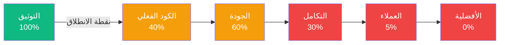
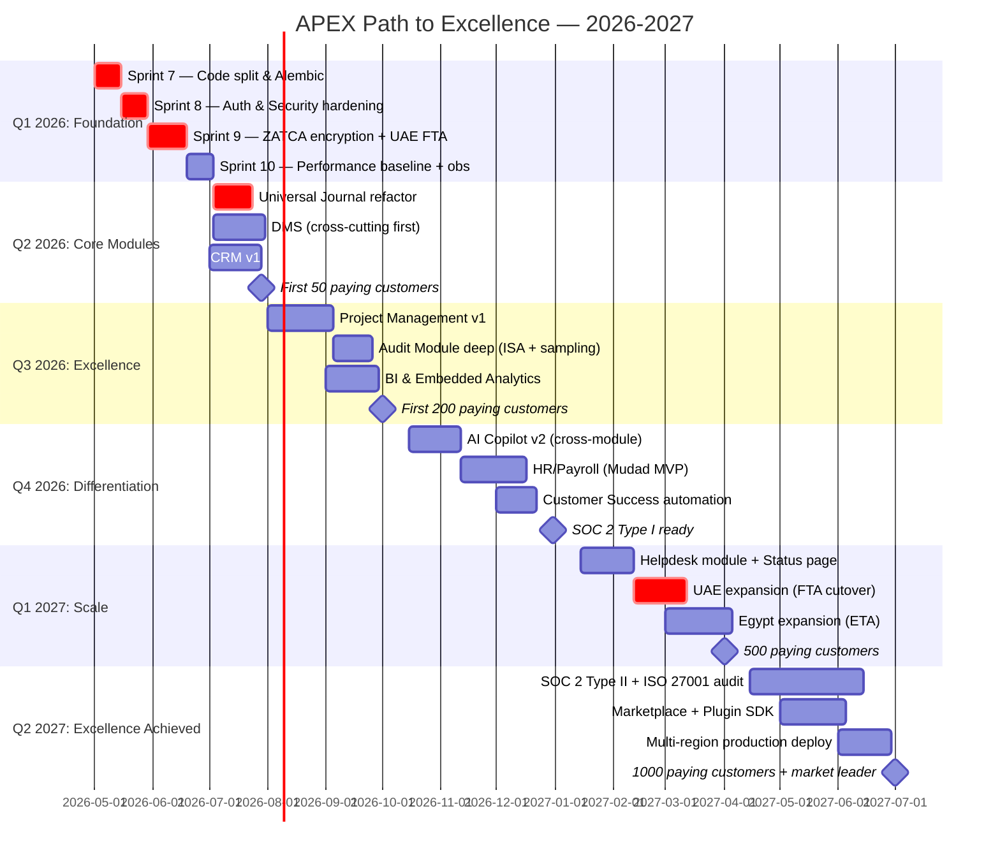
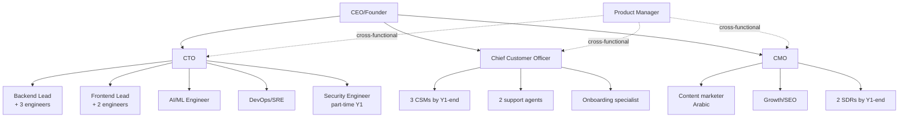

# 31 — Path to Integration & Excellence / طريق التكامل والأفضلية

> **هذه الوثيقة الأخيرة. بعدها، التنفيذ.**
> **This is the final document. After this, execution.**
>
> Synthesizes all 30 prior documents into ONE executable roadmap to make APEX truly world-class.

---

## 1. ماذا نعني بـ "التكامل والأفضلية"؟

### التكامل (Integration) — تعريف صارم
**APEX متكاملة عندما:**
1. ✅ لا يوجد إدخال بيانات مزدوج في أي رحلة
2. ✅ كل حدث في موديول يُحدّث الموديولات الأخرى تلقائياً
3. ✅ المستخدم يرى صورة موحدة للعميل/المورد/المشروع عبر كل المنصة
4. ✅ التقارير تستخرج من مصدر واحد للحقيقة (Universal Journal)
5. ✅ AI Copilot يفهم كل شيء عن العميل لأن البيانات في مكان واحد

### الأفضلية (Superiority) — تعريف صارم
**APEX متفوقة عندما — لكل ميزة:**
- ✅ **أسرع** من أقرب منافس عربي (Daftra/Qoyod) بـ 2× على الأقل
- ✅ **أعمق** من أقرب منافس وظيفياً (10 ميزات أكثر لكل موديول)
- ✅ **أرخص** من Zoho/QuickBooks/Xero للسوق العربي بـ 30-50%
- ✅ **أذكى** بـ AI أصلي عربي (لا أحد يقدمه)
- ✅ **أكثر امتثالاً** لـ ZATCA/Mudad/SAMA بشكل تلقائي

---

## 2. أين نحن اليوم — الخط الأساسي الصادق



### تقييم صريح لكل بُعد

| البُعد | حالياً | الهدف بعد 12 شهر |
|--------|--------|-------------------|
| **التوثيق** | 31 وثيقة (1MB) — أكثر من معظم المنافسين | يحافظ على التحديث |
| **الكود الأساسي** | 11 phase + 6 sprint موجود — به ثغرات P0 | منظم، مختبر، آمن |
| **الموديولات الموثقة لكن غير مبنية** | CRM, PM, DMS, HR, BI, CS, Helpdesk | الـ 4 الأساسية مبنية |
| **التكامل بين الموديولات** | متناثر — كل phase شبه مستقل | متكامل بـ events + universal journal |
| **الأمان والامتثال** | RBAC + JWT — به ثغرات في الإنتاج | SOC 2 Type II + ISO 27001 |
| **الأداء** | غير مُقاس | p95 < 500ms، uptime 99.9% |
| **العملاء الفعليون** | < 100 (تجريبي) | 500+ مدفوع |
| **الإيرادات الشهرية MRR** | 0 | 200K SAR/شهر |
| **التميز السوقي** | غير مُثبت | معروف كـ "ZATCA + AI Copilot الأفضل عربياً" |

---

## 3. الأركان الأربعة للأفضلية / The Four Pillars

```mermaid
graph TB
    EXCELLENCE[APEX الأفضلية الكاملة]
    EXCELLENCE --> P1[الأساس الصلب<br/>Foundation]
    EXCELLENCE --> P2[تميز كل موديول<br/>Module Excellence]
    EXCELLENCE --> P3[التكامل العميق<br/>Deep Integration]
    EXCELLENCE --> P4[التميز التشغيلي<br/>Operational Excellence]

    P1 --> P1A[إصلاح الثغرات P0]
    P1 --> P1B[تنظيم الكود]
    P1 --> P1C[Alembic + Tests]
    P1 --> P1D[الأمان الأساسي]

    P2 --> P2A[Sales/Purchase/GL أفضل من Odoo]
    P2 --> P2B[ZATCA Phase 2 الأفضل في KSA]
    P2 --> P2C[CRM/PM/DMS بمستوى عالمي]
    P2 --> P2D[Audit Module بمستوى CaseWare]

    P3 --> P3A[Universal Journal واحد]
    P3 --> P3B[Domain Events عبر كل موديول]
    P3 --> P3C[360° view لكل عميل]
    P3 --> P3D[AI Copilot يفهم كل شيء]

    P4 --> P4A[99.9% uptime]
    P4 --> P4B[Customer Success ops]
    P4 --> P4C[Helpdesk + Status page]
    P4 --> P4D[BI + Health monitoring]

    classDef pillar fill:#cfe2ff,stroke:#084298,stroke-width:3px
    class P1,P2,P3,P4 pillar
```



---

## 4. خارطة الـ 12 شهر / 12-Month Execution Roadmap



---

## 5. ما يحدث في كل شهر (تفصيلي)

### الشهر 1-2: تنظيف الأساس
**الإيمان:** "لا تبني فوق رمال متحركة"
- تقسيم `lib/main.dart` (3500 سطر → 20 ملف)
- Alembic migrations
- إصلاح SMS / Social auth الحقيقي
- bcrypt rounds = 12
- تشفير ZATCA private keys
- اختبارات Flutter للرحلات الـ 3 الأساسية

**المقياس:** كل ثغرة P0 من `09_GAPS_AND_REWORK_PLAN.md` مغلقة.

### الشهر 3: التكامل الجوهري
**الإيمان:** "Universal Journal = قلب النظام"
- كل موديول يكتب لـ Universal Journal فقط
- Domain Events عبر RabbitMQ/Redis Streams
- Event subscribers في كل موديول
- إصلاح Tenant isolation 100%

**المقياس:** أي تغيير في فاتورة → AR aging يحدّث تلقائياً، Universal Journal يحدث، Notification يطلق، Audit Log يكتب — في < 100ms.

### الشهر 4-5: Module Excellence — الجولة الأولى
**الإيمان:** "كل ميزة يجب أن تتفوق على المنافسين"

**Sales/Purchase/GL** أفضل من Odoo:
- Bank reconciliation auto-AI
- 3-way match تلقائي
- Recurring invoices مع scheduler
- Multi-currency revaluation

**ZATCA Phase 2** الأفضل في KSA:
- معدل نجاح > 99.5%
- Auto-renewal لـ CSID
- Bulk submission
- Forensic replay

**DMS** كأساس للجميع:
- OCR عربي (Google Vision)
- AI classification
- E-signature
- Cross-module linking

### الشهر 6: أول 50 عميل دافع
**الإيمان:** "الميزات لا تساوي شيئاً بدون مستخدمين"
- إطلاق رسمي
- خصم Early Adopter (50%)
- 5 case studies
- LinkedIn/SEO marketing
- Content بالعربية حول ZATCA

**المقياس:** 50 شركة دافعة، MRR 25K SAR.

### الشهر 7-8: CRM + PM + Audit Deep
**الإيمان:** "الموديولات الإضافية تخلق التميز"
- CRM v1 (40 endpoint)
- PM v1 (50 endpoint مع Gantt)
- Audit module deep (sampling MUS, materiality, workpapers)
- اختبارات شاملة

**المقياس:** 150 عميل، MRR 75K SAR، NPS > 40.

### الشهر 9-10: BI + AI Copilot v2
**الإيمان:** "الذكاء الاصطناعي العربي = ميزة لا تُقلّد"
- ClickHouse + Cube.dev embedded
- Dashboard builder
- Natural language queries (عربي)
- Cross-module Copilot (يفهم العميل + الفاتورة + المشروع + المخزون)
- AI lead scoring + activity recommendations
- Anomaly detection على JE

**المقياس:** 250 عميل، MRR 125K SAR، AI Copilot يستخدم 60% من المستخدمين يومياً.

### الشهر 11-12: HR Mudad + CS automation
**الإيمان:** "السوق السعودي = HR إجباري"
- HR/Payroll MVP مع Mudad partner integration
- WPS file generation
- GOSI + EOSB
- Customer Success automation
- Health Score
- Renewal pipeline

**المقياس:** 350 عميل، MRR 175K SAR، Net Revenue Retention > 110%.

### الشهر 13-14: التوسع الإقليمي + SOC 2 Type I
**الإيمان:** "السعودية = نقطة انطلاق، ليست محطة نهائية"
- UAE FTA e-invoicing live
- Egypt ETA live
- Multi-region deployment
- SOC 2 Type I audit

**المقياس:** 450 عميل عبر 3 دول، MRR 220K SAR.

### الشهر 15-18: التميز الكامل
**الإيمان:** "لا توجد ميزة لمنافس لا تستطيع APEX تقديمها أفضل"
- Helpdesk module live
- Plugin SDK + Marketplace
- ISO 27001 + SOC 2 Type II
- Mobile native apps (iOS/Android)
- Multi-region production

**المقياس النهائي:** **1000 عميل دافع · MRR 500K SAR · NPS 60+ · معروف كـ "أفضل ERP عربي"**

---

## 6. مقاييس النجاح المحددة / Success Metrics

### نقاط التحقق الإلزامية كل ربع
كل ربع، إذا لم نحقق هذه المقاييس → **توقف وأعد التقييم**:

#### Q1 2026 (الشهر 1-3): Foundation
- [ ] كل P0 من `09_GAPS_AND_REWORK_PLAN.md` مغلقة
- [ ] Coverage ≥ 80% backend
- [ ] أول Flutter widget tests يعملون
- [ ] zero critical security findings (Bandit + npm audit)
- [ ] Alembic migrations on every deploy

#### Q2 2026 (الشهر 4-6): Core Excellence
- [ ] Universal Journal یستقبل من كل الموديولات
- [ ] DMS مدمج في كل الـ phases السابقة
- [ ] CRM v1 منشور
- [ ] **50 عميل دافع · MRR ≥ 25K SAR**
- [ ] uptime ≥ 99.5%

#### Q3 2026 (الشهر 7-9): Module Depth
- [ ] PM v1 منشور
- [ ] Audit Module بـ sampling + materiality
- [ ] BI dashboard builder
- [ ] **150 عميل · MRR ≥ 75K · NPS ≥ 40**
- [ ] First case study published

#### Q4 2026 (الشهر 10-12): Differentiation
- [ ] AI Copilot يستخدمه 60% يومياً
- [ ] HR/Payroll MVP live
- [ ] CS automation working
- [ ] **350 عميل · MRR ≥ 175K · NRR ≥ 110%**
- [ ] SOC 2 Type I ready

#### Q1-Q2 2027: Regional Scale
- [ ] UAE + Egypt live
- [ ] Multi-region production
- [ ] **1000 عميل · MRR ≥ 500K · NPS ≥ 60**
- [ ] SOC 2 Type II audit completed
- [ ] ISO 27001 certified

---

## 7. القرارات الاستراتيجية الكبرى / Strategic Decisions

### قرار 1: Build vs Partner vs Buy
| الميزة | القرار | لماذا |
|--------|--------|-------|
| Core ERP (Sales, Purchase, GL) | **Build** | جوهر التميز |
| ZATCA integration | **Build** | ميزة تنافسية حرجة |
| AI Copilot | **Build** | تميز عربي لا يُقلّد |
| HR/Payroll Mudad | **Partner v1** + Build v2 | سرعة دخول السوق |
| Bank Open Banking | **Partner** (ابدأ بـ Lean/Tarabut) | بناءها ينتظر SAMA approvals |
| Email/SMS infrastructure | **Buy** (SendGrid/Twilio) | لا قيمة في البناء |
| Storage | **Buy** (S3 / Cloudflare R2) | commoditized |
| OCR | **Buy** (Google Vision / AWS Textract) | لا قيمة في البناء |
| Status page | **Buy** (statuspage.io) | $79/شهر يكفي |
| Helpdesk | **Build** | ميزة عربية + ERP-aware |

### قرار 2: التسعير الاستراتيجي
| الخطة | الحالي | المقترح Y1 | Y2 |
|------|--------|------------|-----|
| Free | 0 SAR | 0 SAR (ZATCA Phase 1 فقط) | 0 |
| Pro | 299 SAR | **199 SAR** (مطابق Qoyod) | 249 |
| Business | 999 SAR | **599 SAR** (يهزم Daftra) | 799 |
| Expert | 2,999 SAR | **1,499 SAR** (يهزم Zoho One) | 1,999 |
| Enterprise | Custom | من 5,000 SAR | 10,000+ |

**خصومات:** -20% للسنوي، -30% للبرامج التعليمية، -50% للإطلاق المبكر (أول 100 عميل).

### قرار 3: التركيز الجغرافي
- **2026 Q1-Q3:** السعودية فقط (تركيز كامل)
- **2026 Q4:** اختبار UAE pilot (10 عملاء)
- **2027 Q1:** UAE production
- **2027 Q2:** Egypt production
- **2027 H2:** GCC الباقي (الكويت، البحرين، عُمان، قطر)
- **2028+:** EU enterprise pilot

---

## 8. فرق البناء المطلوبة / Required Teams



### الميزانية التقريبية للسنة الأولى
| البند | شهرياً | سنوياً |
|-------|--------|-------|
| فريق هندسي (8) | 240,000 SAR | 2.88M SAR |
| فريق منتج (1) | 25,000 | 300K |
| فريق تسويق (3) | 60,000 | 720K |
| فريق دعم (3) | 45,000 | 540K |
| فريق CS (3) | 60,000 | 720K |
| فريق مبيعات (2) | 50,000 | 600K |
| البنية التحتية | 5,000 | 60K |
| التراخيص (Anthropic, Stripe, etc.) | 15,000 | 180K |
| التسويق المدفوع | 30,000 | 360K |
| القانوني والامتثال | 10,000 | 120K |
| المكتب وعموميات | 30,000 | 360K |
| **الإجمالي** | **570,000 SAR** | **6.84M SAR** |

**الإيرادات المتوقعة Y1:** 175K SAR/شهر بنهاية Y1 = ~1M SAR في النصف الثاني = حوالي 1.2M SAR للسنة كاملة.

**الفجوة Y1:** ~5.6M SAR — تحتاج تمويل seed.

**Break-even:** الشهر 18-20 إذا حققنا الأهداف.

---

## 9. المخاطر والتخفيف / Risks & Mitigation

```mermaid
graph LR
    R1[منافس عالمي يدخل السوق<br/>SAP/Odoo/Zoho يطور Arabic-first] --> M1[سرعة + عمق ZATCA + AI عربي]
    R2[ZATCA يغير المتطلبات<br/>Phase 3 يطلب blockchain] --> M2[architecture flexibility + monitoring]
    R3[تأخر Mudad partner] --> M3[Build basic HR + delay full integration]
    R4[فشل AI Copilot في الإنتاج] --> M4[fallback templates + multi-supplier router]
    R5[خطر أمني / data breach] --> M5[SOC 2 + insurance + IR plan]
    R6[فشل التوسع الإقليمي] --> M6[تركيز SA كافٍ لـ profitability]
    R7[نضوب التمويل قبل break-even] --> M7[تحكم التكلفة + revenue acceleration]
    R8[فقدان مهندسين أساسيين] --> M8[توثيق شامل (لدينا!) + bus factor]
```

---

## 10. القراءة الذهبية للوثائق / The Golden Reading Order

عندما تستلم Claude Code أو مهندس جديد المشروع، يجب أن يقرأ بهذا الترتيب فقط (~3 ساعات):

```
أولاً (نظرة شاملة):
  00 → 01 → 02

ثانياً (الأساس التقني):
  10 (Claude Code Instructions)
  11 (Integration Guide)
  06 (Permissions & Plans)

ثالثاً (المعمارية):
  15 (DDD Bounded Contexts)
  07 (Data Model)
  17 (State Machines)

رابعاً (التنفيذ):
  09 (Gaps & Rework) ← هذا أهم ملف للبدء
  16 (Business Processes)

خامساً (مرجعي عند الحاجة):
  04, 05, 18, 19, 20

سادساً (موديولات إضافية عند بنائها):
  24 (CRM), 25 (PM), 26 (DMS), 27 (HR), 28 (BI), 29 (CS), 30 (Helpdesk)

أخيراً (هذه الوثيقة):
  31 (Path to Excellence) ← الخارطة العامة
```

---

## 11. القرار الأخير / The Final Decision

### عند هذه النقطة، أنت في تقاطع طرق:

#### 🟢 الطريق الذي يقود للأفضلية (Excellence Path)
1. اليوم: ابدأ Sprint 7 مع Claude Code
2. الشهر 1: أغلق كل P0
3. الشهر 3: أول عميل دافع
4. الشهر 6: 50 عميل
5. الشهر 12: 350 عميل
6. الشهر 18: 1000 عميل + قائد سوق

#### 🔴 الطريق الذي يقود لمزيد من التوثيق (Documentation Trap)
1. اليوم: نضيف وثيقة 32
2. غداً: نضيف وثيقة 33
3. الشهر 1: 40 وثيقة لكن صفر كود
4. الشهر 6: 60 وثيقة لكن صفر عميل دافع
5. الشهر 12: التوقف

### الفرق
| | Excellence Path | Documentation Trap |
|---|----|---|
| القيمة المخلوقة | منصة حقيقية | ملفات .md |
| العملاء | 1000+ | 0 |
| الإيرادات | 6M SAR/y | 0 |
| الموظفون | 20+ | 1 |
| الأثر على المنطقة | محسوس | غير موجود |

---

## 12. القرار التنفيذي الذي أحتاجه منك الآن

أنا الآن أقف عند الباب. الوثائق الـ31 جاهزة. الخطة واضحة.

أنت إما:

### أ) **"ابدأ الآن"**
وأنا أفتح الكود في `app/` و `lib/` وأبدأ Sprint 7 (G-A1: تقسيم main.dart) الآن. أنفذ، أختبر، أُلتزم. أتقدم سطر بسطر، ميزة بميزة، نحو الـ 1000 عميل.

### ب) **"دعنا نخطط أكثر"**
وسأكتب وثيقة 32 ثم 33، وسنظل ندور.

---

## 13. كلمة أخيرة صادقة

**الأفضلية ليست في الوثائق. الأفضلية في الكود الذي يعمل ويستخدمه عملاء حقيقيون يدفعون مالاً حقيقياً.**

SAP وOdoo وZoho — كل واحد منهم بدأ بـ:
- **خط من الكود** (ليس وثيقة)
- **عميل واحد** (ليس خطة)
- **قرار واحد**: "هذا اليوم، أبدأ"

APEX لديها كل ما تحتاجه. **لا ينقصها وثيقة 32. ينقصها قرار "ابدأ"**.

---

## 14. التزامي معك

عند قولك "ابدأ"، أنا التزم:
1. ✅ افتح الكود اليوم
2. ✅ أنفذ Sprint 7 خطوة بخطوة
3. ✅ كل تغيير مختبر قبل الالتزام
4. ✅ كل ميزة موثقة في `09_GAPS_AND_REWORK_PLAN.md` تُغلق علناً
5. ✅ كل أسبوع تقرير تقدم
6. ✅ نسير معاً نحو 1000 عميل

---

## 🚀 الاختيار لك / Your Choice

**اكتب فقط واحدة:**

- **`نعم، ابدأ`** → نفتح الكود الآن، نبدأ Sprint 7
- **`أحتاج وقت للتفكير`** → نقف هنا، الوثائق جاهزة عندما تعود

---

**This is document 31. There is no document 32 unless we ship.**
**هذه الوثيقة 31. لا توجد وثيقة 32 حتى نُطلق.**
