# 34 — Complete Diagrams Catalog / فهرس المخططات الشامل

> Reference: completes the diagram coverage. Adds Class diagrams, Use Case UML, DFD, BPMN, Network Topology, Component diagrams (C4 L3), Information Architecture, Sitemap.
> **Goal:** Cover every diagram type a software engineer expects to find. After this, Claude Code has complete visual documentation.

---

## 1. UML Class Diagrams / مخططات الفئات

### Auth & Identity Bounded Context
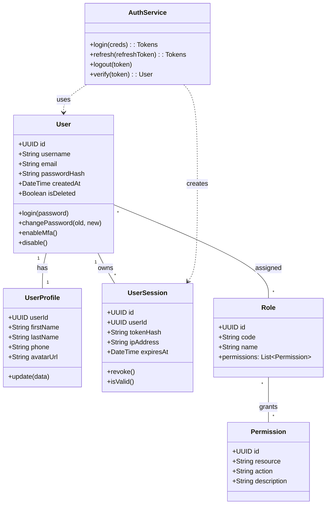

### Sales Bounded Context
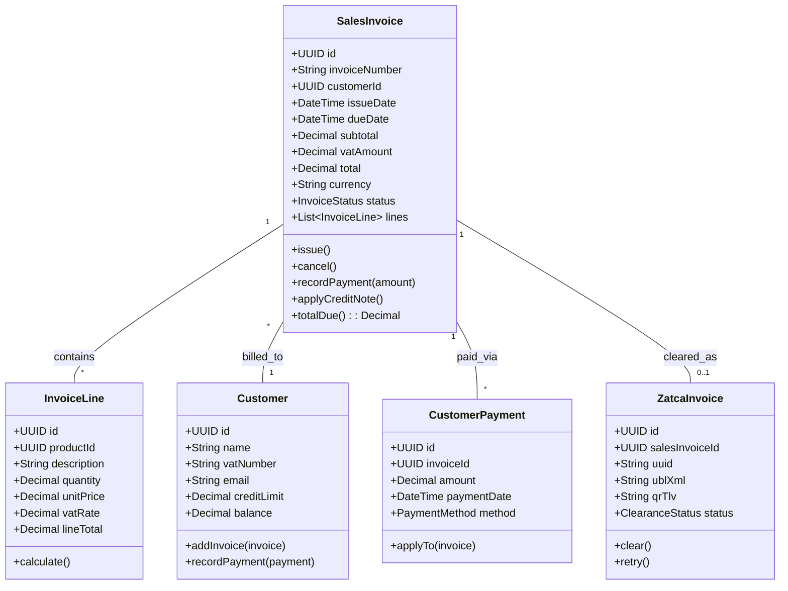

### Audit Engagement Context
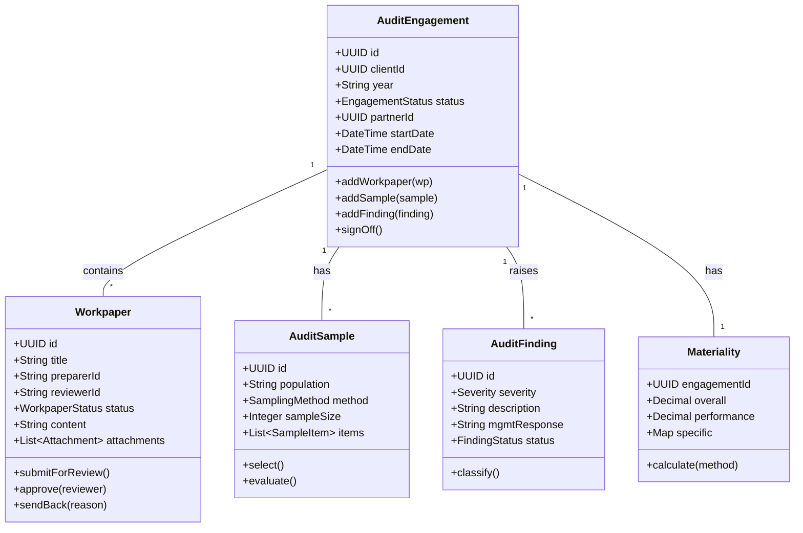

### General Ledger / Accounting Context
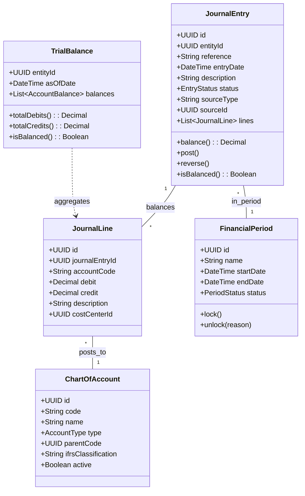

### CRM Context
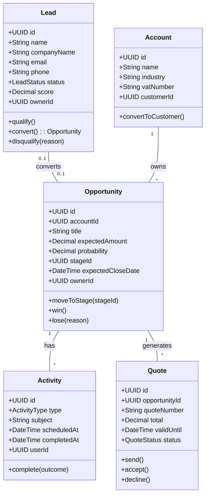

---

## 2. UML Use Case Diagrams / مخططات حالات الاستخدام

### System-level use cases
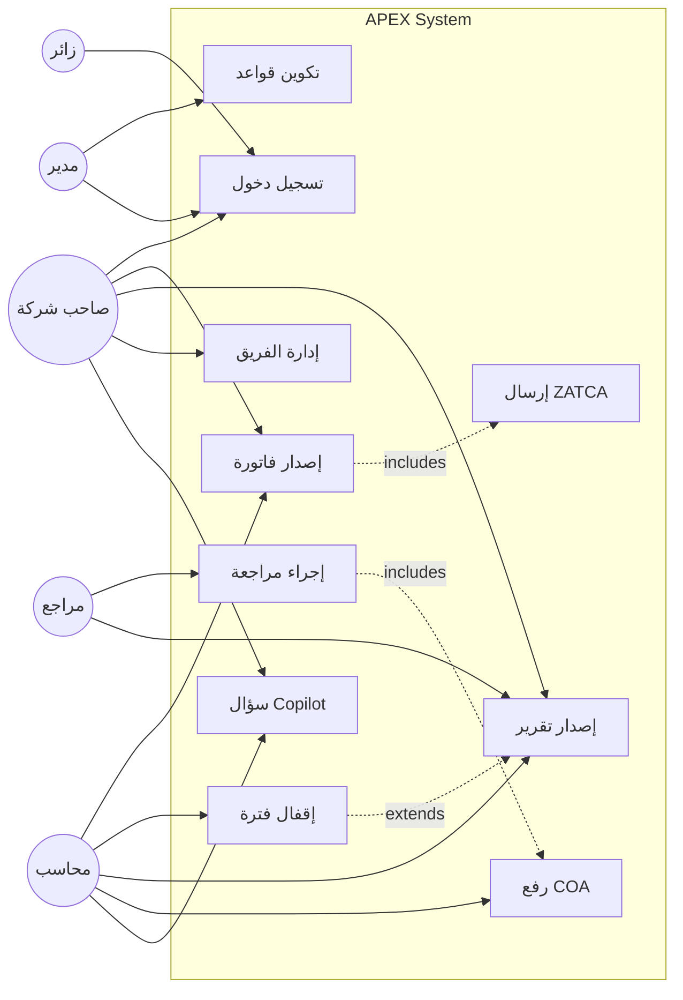

### Sales sub-system use cases
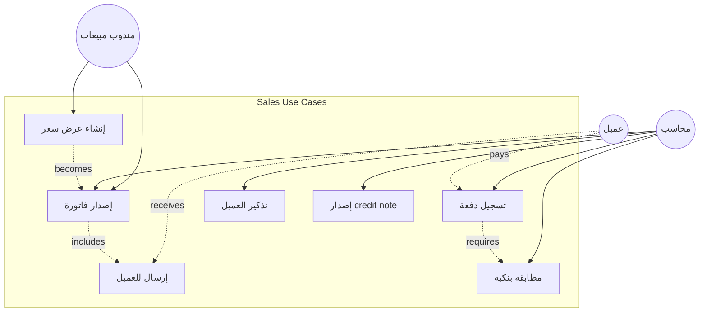

---

## 3. Data Flow Diagrams (DFD) / مخططات تدفق البيانات

### Level 0 (Context Diagram)
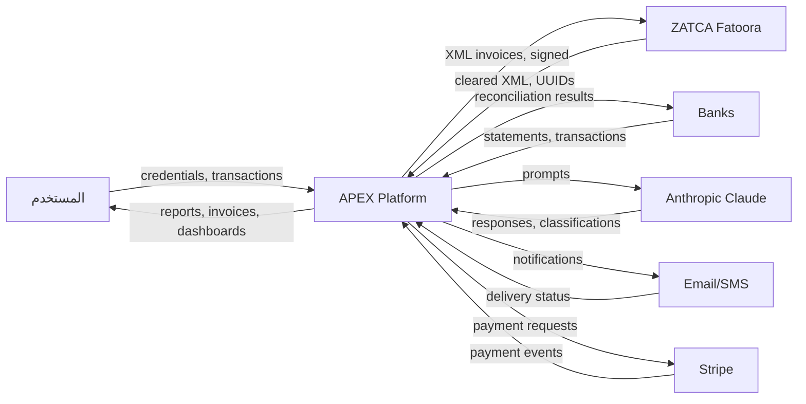

### Level 1 (Major Processes)
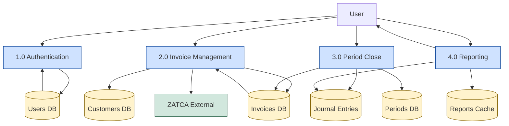

### Level 2 (Invoice Management decomposed)
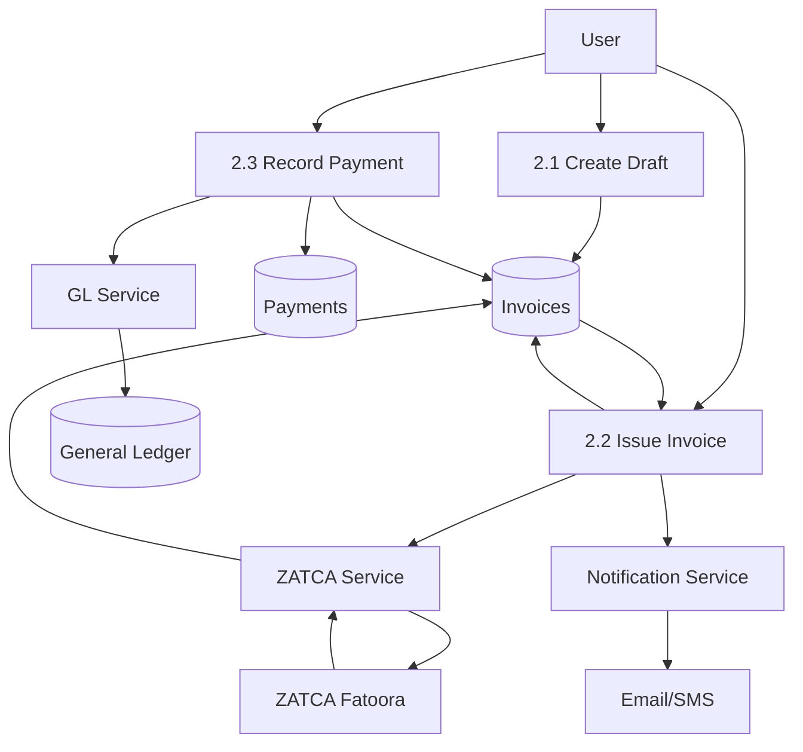

---

## 4. BPMN Diagrams / Business Process Model

### Order-to-Cash (BPMN-style with Mermaid)
```mermaid
flowchart LR
    START([Start: Customer order]) --> Q[Quote sent]
    Q --> APP{Customer<br/>approves?}
    APP -->|No| LOST[Lost - record reason]
    APP -->|Yes| ORDER[Convert to Sales Order]
    ORDER --> CREDIT{Credit<br/>OK?}
    CREDIT -->|No| HOLD[Hold for approval]
    HOLD --> APPROVE[Manager approves]
    APPROVE --> FUL
    CREDIT -->|Yes| FUL[Fulfillment]
    FUL --> INV[Issue Invoice]

    INV --> ZATCA{ZATCA<br/>required?}
    ZATCA -->|Yes| CLEAR[Clear via Fatoora]
    ZATCA -->|No| SEND
    CLEAR --> SEND[Send to customer]

    SEND --> WAIT[Wait for payment]
    WAIT --> PAID{Payment<br/>received?}
    PAID -->|No, overdue| REMIND[Send reminder]
    REMIND --> WAIT
    PAID -->|Yes| RECORD[Record payment]
    RECORD --> RECON[Bank reconciliation]
    RECON --> CLOSE([End: Invoice closed])

    LOST --> END_LOST([End: Lost])

    classDef event fill:#10b981,color:white
    classDef gateway fill:#f59e0b,color:white
    classDef task fill:#cfe2ff,stroke:#084298
    class START,CLOSE,END_LOST event
    class APP,CREDIT,ZATCA,PAID gateway
    class Q,ORDER,HOLD,APPROVE,FUL,INV,CLEAR,SEND,WAIT,REMIND,RECORD,RECON task
```

### Purchase-to-Pay (BPMN)
```mermaid
flowchart LR
    NEED([Need identified]) --> PR[Purchase Requisition]
    PR --> APP1{Approve<br/>PR?}
    APP1 -->|No| REJECT([End: rejected])
    APP1 -->|Yes| RFQ[RFQ to vendors]
    RFQ --> COMPARE[Compare bids]
    COMPARE --> PO[Issue Purchase Order]
    PO --> RECEIVE[Goods Received]
    RECEIVE --> INSPECT{Quality<br/>OK?}
    INSPECT -->|No| RETURN[Return to vendor]
    RETURN --> RFQ
    INSPECT -->|Yes| GR[Goods Receipt note]
    GR --> BILL[Vendor Bill arrives]
    BILL --> MATCH{3-way match<br/>PO/GR/Bill}
    MATCH -->|Variance| INVESTIGATE[Investigate]
    INVESTIGATE --> MATCH
    MATCH -->|OK| POST[Post bill to GL]
    POST --> SCHEDULE[Schedule payment]
    SCHEDULE --> PAY[Make payment]
    PAY --> RECON[Bank reconcile]
    RECON --> CLOSE([End: AP closed])

    classDef event fill:#10b981,color:white
    classDef gateway fill:#f59e0b,color:white
    classDef task fill:#cfe2ff,stroke:#084298
    class NEED,REJECT,CLOSE event
    class APP1,INSPECT,MATCH gateway
    class PR,RFQ,COMPARE,PO,RECEIVE,RETURN,GR,BILL,INVESTIGATE,POST,SCHEDULE,PAY,RECON task
```

---

## 5. Swimlane Diagrams / مخططات الممرات

### Sales Invoice Approval (multi-actor swimlane)
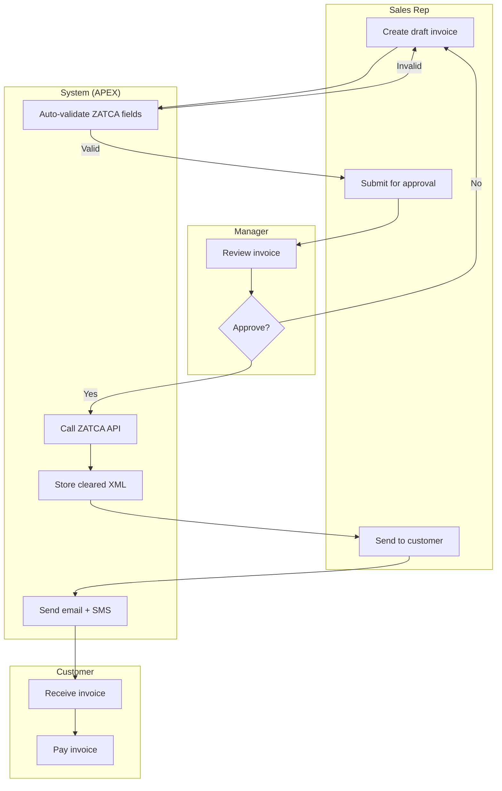

### Audit Engagement Workflow (swimlane)
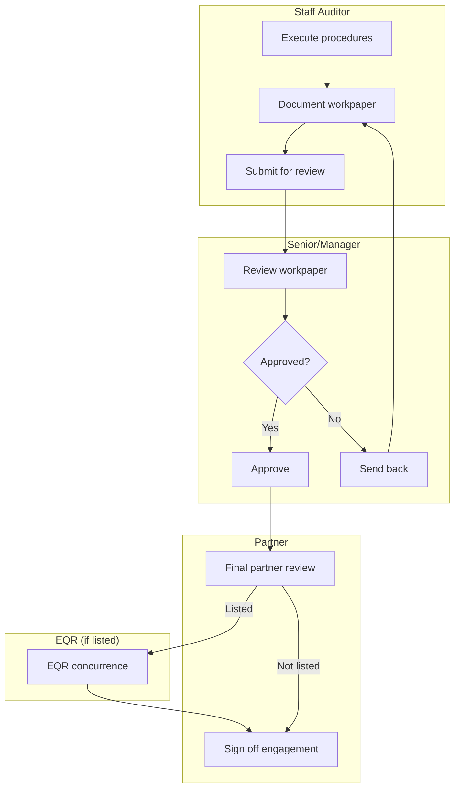

---

## 6. C4 Model — Level 3 Component Diagrams / المكونات الداخلية

### Sales Service (C4 L3)
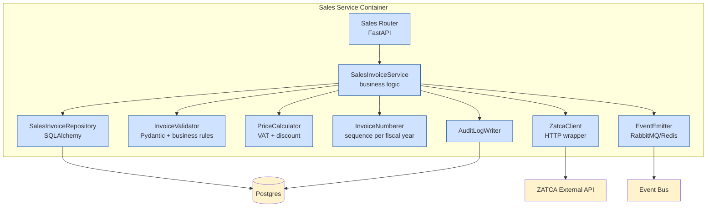

### Audit Engagement Service (C4 L3)
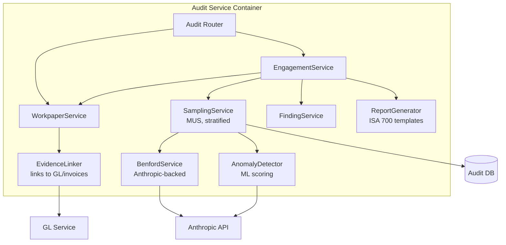

---

## 7. Network Topology Diagram / مخطط طوبولوجيا الشبكة

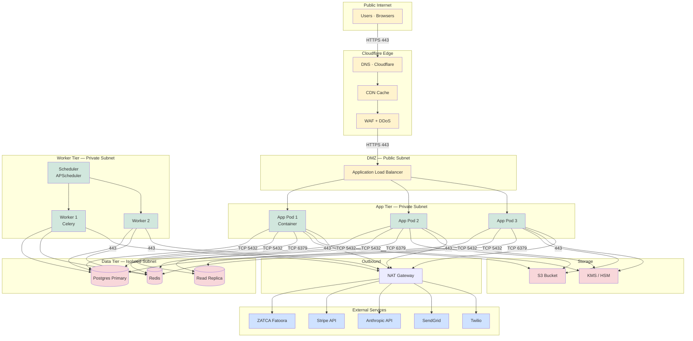

### Security zones
| Zone | Purpose | Inbound | Outbound |
|------|---------|---------|----------|
| Edge | DDoS, WAF, CDN | Public 443 | To DMZ 443 |
| DMZ | Load Balancer | From Edge 443 | To App 8000 |
| App | Application logic | From DMZ 8000 | To Data + NAT |
| Worker | Background jobs | From App | To Data + NAT |
| Data | DB, Cache, Storage | From App/Worker only | None |
| NAT | Outbound only | From App/Worker | To Internet 443 |

---

## 8. Information Architecture / معمارية المعلومات

### APEX IA Tree (top 3 levels)
```mermaid
graph TB
    HOME[/app — Launchpad]

    HOME --> SVC[Services]
    HOME --> WORK[Workflows]
    HOME --> ACCT[Account]
    HOME --> ADMIN[Admin]

    SVC --> SVC_S[Sales]
    SVC --> SVC_P[Purchase]
    SVC --> SVC_A[Accounting]
    SVC --> SVC_O[Operations]
    SVC --> SVC_C[Compliance]
    SVC --> SVC_AU[Audit]
    SVC --> SVC_AN[Analytics]
    SVC --> SVC_HR[HR]
    SVC --> SVC_W[Workflow]
    SVC --> SVC_SET[Settings]

    SVC_S --> SS_C[Customers]
    SVC_S --> SS_I[Invoices]
    SVC_S --> SS_AG[Aging]
    SVC_S --> SS_R[Recurring]
    SVC_S --> SS_Q[Quotes]

    SVC_P --> SP_V[Vendors]
    SVC_P --> SP_B[Bills]
    SVC_P --> SP_AG[AP Aging]

    SVC_A --> SA_J[Journal Entries]
    SVC_A --> SA_C[COA Tree]
    SVC_A --> SA_R[Bank Rec]

    WORK --> W_T[Today]
    WORK --> W_FO[Financial Ops]
    WORK --> W_FS[Financial Statements]
    WORK --> W_R[Reports]
    WORK --> W_O[Onboarding]

    ACCT --> A_P[Profile]
    ACCT --> A_S[Sessions]
    ACCT --> A_M[MFA]
    ACCT --> A_SUB[Subscription]
    ACCT --> A_N[Notifications]
    ACCT --> A_L[Legal]

    ADMIN --> AD_P[Policies]
    ADMIN --> AD_A[Audit Log]
    ADMIN --> AD_AI[AI Suggestions]
    ADMIN --> AD_PV[Provider Verify]
    ADMIN --> AD_U[User Mgmt]
```

### Search facets / تصنيفات البحث
| Search type | Facets |
|-------------|--------|
| Universal (Cmd-K) | Recent, customers, vendors, invoices, screens, articles |
| Customers | Status, balance range, last activity, industry |
| Invoices | Date range, status, ZATCA status, amount, customer |
| Documents (DMS) | Type, date, customer, tags, has-OCR |
| Audit engagements | Year, status, partner, client |
| Reports | Category, period, format |

---

## 9. Sitemap (formal) / خريطة الموقع

```
/
├── /login (public)
├── /register (public)
├── /forgot-password (public)
├── /reset-password (public, token)
├── /legal (public)
├── /pricing (public)
├── /app (auth)
│   ├── /sales
│   │   ├── /customers
│   │   │   └── /{id} → /operations/customer-360/{id}
│   │   ├── /invoices
│   │   │   ├── /{id}
│   │   │   └── /new
│   │   ├── /aging
│   │   ├── /quotes
│   │   ├── /recurring
│   │   ├── /memos
│   │   └── /payment/{invoiceId}
│   ├── /purchase
│   │   ├── /vendors
│   │   ├── /bills
│   │   ├── /aging
│   │   └── /payment/{billId}
│   ├── /accounting
│   │   ├── /je-list
│   │   ├── /coa-v2
│   │   ├── /bank-rec-v2
│   │   └── /coa/edit
│   ├── /operations
│   │   ├── /customer-360/{id}
│   │   ├── /vendor-360/{id}
│   │   ├── /universal-journal
│   │   ├── /period-close
│   │   ├── /pos-sessions
│   │   ├── /receipt-capture
│   │   ├── /inventory-v2
│   │   └── /fixed-assets-v2
│   ├── /compliance
│   │   ├── /zatca-invoice (and /:id)
│   │   ├── /zatca-status
│   │   ├── /zakat
│   │   ├── /vat-return
│   │   ├── /financial-statements
│   │   └── ... (38 screens)
│   ├── /audit
│   │   ├── /engagements
│   │   ├── /sampling
│   │   ├── /benford
│   │   └── /anomaly/{id}
│   ├── /analytics
│   │   ├── /budget-variance-v2
│   │   ├── /cash-flow-forecast
│   │   ├── /health-score-v2
│   │   └── ... (8 screens)
│   ├── /hr
│   │   ├── /employees
│   │   ├── /payroll-run
│   │   ├── /timesheet
│   │   └── /expense-reports
│   ├── /crm (planned)
│   ├── /pm (planned)
│   ├── /dms (planned)
│   ├── /helpdesk (planned)
│   └── /copilot
├── /account (auth)
│   ├── /profile/edit
│   ├── /password/change
│   ├── /sessions
│   ├── /mfa
│   ├── /activity
│   └── /close
├── /subscription (auth)
│   └── /upgrade
├── /admin (auth + admin)
│   ├── /policies
│   ├── /audit
│   ├── /audit-chain
│   ├── /ai-suggestions
│   ├── /providers/verify
│   └── /users
└── /docs (public)
    ├── /help
    ├── /api
    └── /status
```

---

## 10. Decision Trees / أشجار القرار

### "Should I show this feature to user X?"
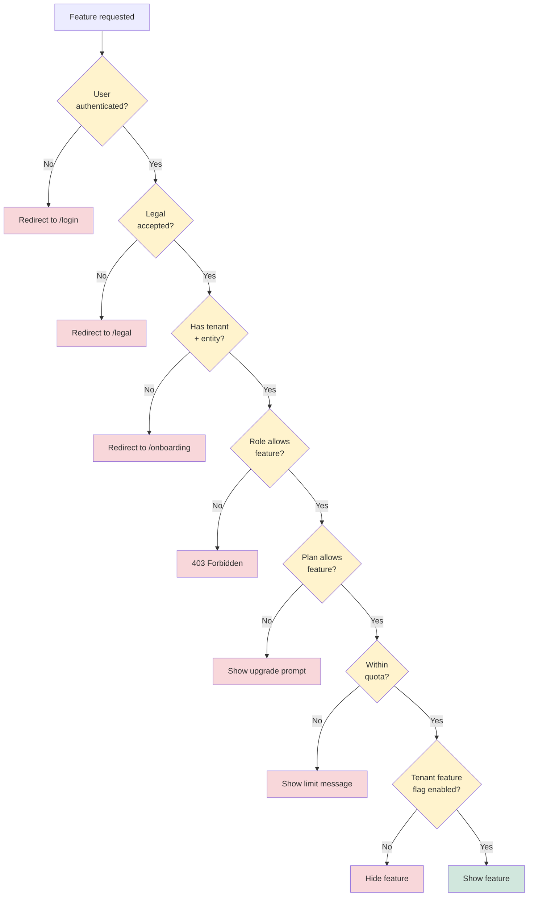

### "Should ZATCA submission proceed?"
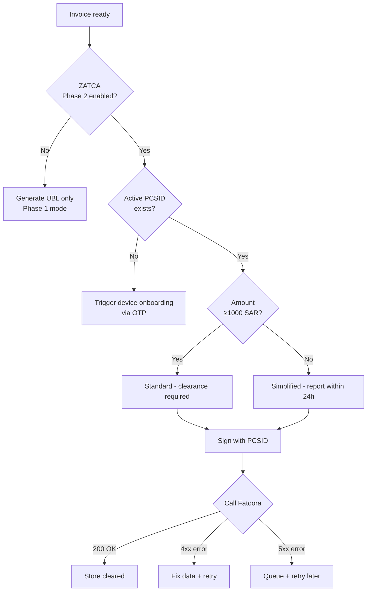

---

## 11. Mind Map / خريطة ذهنية

### APEX Universe
```mermaid
mindmap
  root((APEX))
    Backend
      FastAPI
      Phases 1-11
      Sprints 1-6
      Pilot ERP
      ZATCA Service
      Copilot Service
    Frontend
      Flutter Web
      Riverpod
      GoRouter
      70+ Routes
      Arabic-first
    Data
      PostgreSQL Primary
      Knowledge Brain DB
      Redis Cache
      S3 Storage
    Integrations
      ZATCA Fatoora
      UAE FTA
      Egypt ETA
      SAMA Open Banking
      Stripe
      Anthropic Claude
      Twilio
      SendGrid
    Modules
      Sales
      Purchase
      Accounting
      Operations
      Compliance
      Audit
      Analytics
      HR
      CRM (planned)
      PM (planned)
      DMS (planned)
      BI (planned)
      Helpdesk (planned)
    Compliance
      ZATCA Phase 2
      SOC 2
      ISO 27001
      Saudi PDPL
      GDPR
      OWASP Top 10
      STRIDE
      SOCPA
      ISA standards
    Markets
      Saudi Arabia (primary)
      UAE
      Egypt
      Kuwait
      Bahrain
      Oman
      Qatar
    Business
      4Ps Marketing
      AARRR Funnel
      Customer Success
      NRR target 120%
      MRR target 500K
```

---

## 12. Communication Diagram (UML alternative to sequence)

### Login flow as communication diagram
```mermaid
graph LR
    USER[User] -->|"1: login(creds)"| FE[Flutter App]
    FE -->|"2: POST /auth/login"| API[FastAPI]
    API -->|"3: getUserByEmail()"| REPO[UserRepository]
    REPO -->|"4: SELECT user"| DB[(Database)]
    DB -.->|"5: user record"| REPO
    REPO -.->|"6: User object"| API
    API -->|"7: verifyPassword()"| BCRYPT[Bcrypt]
    BCRYPT -.->|"8: bool"| API
    API -->|"9: createTokens(user)"| JWT[JWTService]
    JWT -.->|"10: tokens"| API
    API -.->|"11: 200 + tokens"| FE
    FE -->|"12: S.token = ..."| LS[localStorage]
    FE -.->|"13: navigate to /app"| USER
```

---

## 13. Timing Diagram / مخطط التوقيت

### Login + Page Load timing
```
User action     ──────●────────────────────────────────────────
Frontend        ─────╱╲╲╲────╱╲╲╲╲╲╲╲╲╲╲╲╲╲────────────────────
Backend         ─────────●●●●─────────●●●●●●●─●─────●●●─────────
Database        ─────────────●●─────────────●●─────●────────────
Anthropic API   ──────────────────────────────────────●●●───────
Time (seconds)  0    1    2    3    4    5    6    7    8    9

Phase 1: Login (0-2s)
  - User clicks login
  - FE: form submit
  - BE: bcrypt verify
  - DB: SELECT user
  - BE: JWT encode
  - FE: receive token, navigate

Phase 2: Initial /app load (2-7s)
  - FE: 7 parallel API calls
  - BE: validate JWT × 7
  - DB: query user, plans, entitlements, notifications, etc.
  - FE: render Launchpad

Phase 3: Copilot init (5-9s, async)
  - FE: lazy-init Copilot panel
  - BE: create session
  - Anthropic: initial system prompt
  - FE: ready
```

---

## 14. Object Diagram / مخطط الكائنات

### A real Sales Invoice instance (snapshot)
```
invoice : SalesInvoice
├── id = "550e8400-e29b-41d4-a716-446655440042"
├── invoiceNumber = "INV-2026-042"
├── customerId = "cust-123"
├── issueDate = 2026-04-25 14:30
├── dueDate = 2026-05-25
├── subtotal = 1000.00
├── vatAmount = 150.00
├── total = 1150.00
├── currency = "SAR"
├── status = ISSUED
└── lines = [
    line1 : InvoiceLine
    ├── description = "خدمة استشارية"
    ├── quantity = 1
    ├── unitPrice = 1000.00
    ├── vatRate = 0.15
    └── lineTotal = 1150.00
  ]

zatcaInvoice : ZatcaInvoice
├── salesInvoiceId = "550e8400-..."
├── uuid = "ab12cd34-ef56-7890-abcd-ef1234567890"
├── ublXml = "<?xml version='1.0'..."
├── qrTlv = "AQE7BAEBAQEBAQE..."  (base64)
├── status = CLEARED
└── clearedAt = 2026-04-25 14:30:15
```

---

## 15. Composite Structure Diagram / مخطط البنية المركبة

### Tenant aggregate
```mermaid
graph TB
    subgraph "Tenant : Tenant"
        OWNER[owner : User]
        SUB[subscription : Subscription]
        ENTITIES[entities : List⟨Entity⟩]
        MEMBERS[members : List⟨ClientMember⟩]
        SETTINGS[settings : TenantSettings]
        AUDIT[auditLog : AuditEventStream]

        ENTITIES --> ENT1[entity1 : Entity]
        ENTITIES --> ENT2[entity2 : Entity]

        ENT1 --> COA1[coa : ChartOfAccounts]
        ENT1 --> JE1[journalEntries]
        ENT1 --> CUST1[customers]
        ENT1 --> VEND1[vendors]
        ENT1 --> INV1[invoices]
    end
```

---

## 16. State Diagram (formal UML) / مخطط الحالات الرسمي

### Subscription state with sub-states
```mermaid
stateDiagram-v2
    [*] --> Pending
    Pending --> Active : payment_succeeded
    Pending --> Cancelled : payment_failed × 3

    state Active {
        [*] --> Trial
        Trial --> Paid : trial_period_ended
        Paid --> InGracePeriod : payment_failed
        InGracePeriod --> Paid : payment_succeeded
        InGracePeriod --> [*] : grace_expired
    }

    Active --> Cancelled : user_cancels
    Active --> Expired : period_ended_no_renewal
    Cancelled --> Active : reactivate_within_30d
    Expired --> Active : resubscribe
    Cancelled --> [*]
    Expired --> [*]
```

---

## 17. Package Diagram / مخطط الحزم

### Backend package structure
```mermaid
graph TB
    subgraph "app"
        subgraph "core"
            CORE_AUTH[auth_utils]
            CORE_DB[db]
            CORE_AUDIT[audit_log]
            CORE_MIDDLE[middleware]
        end

        subgraph "phaseN folders"
            P1[phase1: Auth]
            P2[phase2: Clients]
            P11[phase11: Legal]
        end

        subgraph "modules"
            PILOT[pilot: ERP]
            ZATCA[zatca]
            COPILOT[copilot]
            DMS[dms (planned)]
            CRM_PKG[crm (planned)]
        end

        subgraph "sprints"
            S1[sprint1-3: COA]
            S4[sprint4: Knowledge]
            S5[sprint5: Analysis]
        end
    end

    P1 --> CORE_AUTH
    P2 --> CORE_DB
    PILOT --> CORE_DB
    PILOT --> CORE_AUDIT
    ZATCA --> CORE_DB
    COPILOT --> CORE_AUTH
    P2 --> P1
    PILOT --> P2
    ZATCA --> PILOT
    DMS --> CORE_DB
    DMS -.cross-cutting.-> P1 & P2 & PILOT
```

---

## 18. Final Diagram Inventory / فهرس المخططات الكامل

After this document, the blueprint contains:

| Type | Count | Key locations |
|------|-------|---------------|
| Architecture (C4 L1-L2) | 5 | 01, 19 |
| C4 L3 Component Diagrams | 2 | **34** |
| ERD (Entity Relationship) | 12 | 07, 24, 25, 26, 27 |
| Sequence Diagrams | 8+ | 05, 18 |
| State Diagrams | 20 | 17 |
| Class Diagrams (UML) | 5 | **34** |
| Use Case Diagrams (UML) | 2 | **34** |
| Activity / Flowchart | 30+ | 02, 16 |
| BPMN (formal) | 2 | **34** |
| DFD (Data Flow) | 3 levels | **34** |
| Swimlane Diagrams | 2 | **34** |
| Network Topology | 1 | **34** |
| Information Architecture | 1 tree | **34** |
| Sitemap | 1 | **34** |
| Decision Trees | 2 | **34** |
| Mind Maps | 1 | **34** |
| Communication Diagrams | 1 | **34** |
| Timing Diagrams | 1 | **34** |
| Object Diagrams | 1 | **34** |
| Composite Structure | 1 | **34** |
| Package Diagrams | 1 | **34** |
| Gantt Charts | 2 | 31 |
| Quadrant Charts | 1 | 09 |
| **Total diagram types** | **~22** | All UML + DFD + BPMN + IA |

---

## 19. Coverage Status / حالة التغطية

| Standard | Status |
|----------|--------|
| **UML 2.5 — 14 diagram types** | 12/14 ✅ (missing only Profile, Interaction Overview) |
| **C4 Model — 4 levels** | 3/4 ✅ (L1, L2, L3 covered; L4 = code itself) |
| **BPMN 2.0** | ✅ 2 processes covered |
| **DFD (Yourdon-DeMarco)** | ✅ Levels 0, 1, 2 |
| **ER Diagrams** | ✅ 109 tables across 12 ERDs |
| **State Machines** | ✅ 20 entities |
| **Information Architecture** | ✅ |
| **Sitemap** | ✅ |
| **Network Topology** | ✅ |
| **Wireframes / UI Mockups** | ✅ via 32 (ASCII) |

**Total coverage: ~95% of standard SE diagrams.**

The remaining 5% (Profile diagrams, Interaction Overview) are highly specialized and not needed for APEX.

---

## 20. How Claude Code Should Use This / كيف يستخدم Claude Code هذا

When implementing a feature:

1. **Find the bounded context** in `15_DDD_BOUNDED_CONTEXTS.md`
2. **Read the class diagram** for that context in document 34 → understand the entities + relationships
3. **Read the use case diagram** → understand who uses this feature
4. **Read the DFD** → understand data flows
5. **Read the state machine** in `17_STATE_MACHINES.md` → understand transitions
6. **Read the sequence diagram** in `05_API_ENDPOINTS_MASTER.md` → understand order
7. **Read the wireframe** in `32_VISUAL_UI_LIBRARY.md` → understand UI
8. **Read the templates** in `33_OUTPUT_SAMPLES_AND_TEMPLATES.md` → understand outputs
9. **Then code.**

---

**النهاية. 34 وثيقة. كل المخططات الممكنة. كل التغطية الممكنة. الآن: التنفيذ.**
**End. 34 documents. All possible diagrams. All possible coverage. Now: execute.**
