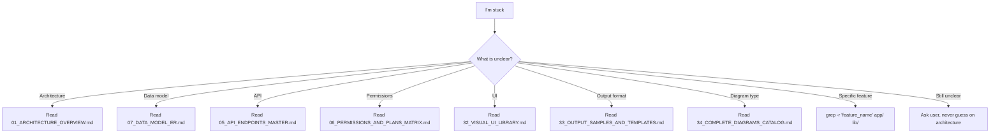

# 🚀 Bootstrap for Claude Code — حزمة الإقلاع

> **هذا أول ملف يجب أن يقرأه Claude Code.**
> **This is the FIRST file Claude Code must read.**
>
> Goal: get from "session opened" to "first code committed" in 30 minutes.

---

## 1. مهمتك / Your Mission

You are working on **APEX** — an Arabic-first financial/audit/ERP SaaS platform.
- **Backend:** FastAPI + Python 3.11 + SQLAlchemy + PostgreSQL
- **Frontend:** Flutter Web + Riverpod + GoRouter
- **Location:** `C:\apex_app\` (Windows) or `/sessions/.../mnt/apex_app/` (Linux)
- **Documentation:** `C:\apex_app\APEX_BLUEPRINT\` — 38 documents with everything
- **Status:** Production deployed but has known bugs/gaps. Your job: fix systematically.

---

## 2. ⚡ The 30-Minute Reading Plan

**Don't read all 38 documents.** Read these 5 in this exact order:

| # | Document | Why | Time |
|---|----------|-----|------|
| 1 | `_BOOTSTRAP_FOR_CLAUDE_CODE.md` (this file) | Get oriented | 10 min |
| 2 | `00_MASTER_INDEX.md` | See the map | 5 min |
| 3 | `09_GAPS_AND_REWORK_PLAN.md` | **The actual to-do list** | 10 min |
| 4 | `10_CLAUDE_CODE_INSTRUCTIONS.md` | Code conventions | 10 min |
| 5 | `11_INTEGRATION_GUIDE.md` | How to extend safely | 5 min |

**Total: ~40 min reading. Then start coding.**

---

## 3. الكود الموجود / Existing Code Layout

```
C:\apex_app\
├── app/                        # Backend FastAPI
│   ├── main.py                 # Entry: lifespan + middleware + routers
│   ├── core/                   # Auth, DB, audit_log
│   ├── phase1/...phase11/      # 11 vertical slices (auth → legal)
│   ├── sprint1/...sprint6/     # 6 newer slices (COA pipeline → registry)
│   ├── pilot/                  # ERP daily ops (Sales, Purchase, GL)
│   ├── zatca/                  # ZATCA Phase 2 e-invoicing
│   └── copilot/                # AI Copilot service
├── lib/                        # Frontend Flutter
│   ├── main.dart               # ⚠ 3500 lines monolith — must split
│   ├── api_service.dart        # All HTTP calls (150+ methods)
│   ├── core/
│   │   ├── router.dart         # 70+ GoRoutes
│   │   ├── theme.dart          # AC singleton
│   │   ├── session.dart        # S singleton
│   │   └── api_config.dart     # Base URL
│   └── screens/                # 100+ screen files
├── tests/                      # 204 backend tests (no frontend tests yet)
├── alembic/                    # Configured but NO migrations exist yet
├── APEX_BLUEPRINT/             # 38 docs (read 5 of them, see above)
├── requirements.txt
├── pyproject.toml              # Black 120ch, Ruff
└── render.yaml                 # Render.com config
```

---

## 4. أول مهمة بالضبط / Your First Task — Exact Spec

### Task ID: **G-A1 from `09_GAPS_AND_REWORK_PLAN.md`**
### Title: Split `lib/main.dart` (3500 lines) into screen files

### Why first?
Everything else depends on a clean code structure. Cannot review PRs effectively. Hot reload slow. Tests can't target screens. **This unblocks everything.**

### Acceptance criteria
- [ ] `lib/main.dart` reduced to **< 200 lines** (only `App` widget + `MaterialApp.router` setup)
- [ ] All extracted screens in `lib/screens/{service}/{name}_screen.dart`
- [ ] All form dialogs in `lib/widgets/forms/`
- [ ] `MainNav` extracted to `lib/widgets/main_nav.dart`
- [ ] App still builds: `flutter build web --dart-define=API_BASE=http://127.0.0.1:8000`
- [ ] All routes still work (visual smoke test on home + login + register + onboarding)
- [ ] No new Flutter analyzer warnings
- [ ] Git commit message: `refactor(main): split main.dart into screen files (#G-A1)`

### Step-by-step

```bash
# Step 1: Create branch
git checkout -b sprint-7/g-a1-split-main-dart

# Step 2: Inventory classes in main.dart
grep -E "^class \w+" lib/main.dart > /tmp/main_classes.txt
wc -l /tmp/main_classes.txt
# Expected: ~60 classes

# Step 3: Categorize each class
# Auth screens → lib/screens/auth/
# Forms → lib/widgets/forms/
# Navigation widgets → lib/widgets/
# Dialog widgets → lib/widgets/dialogs/

# Step 4: Move ONE class at a time, test after each
# Pattern:
#   1. Cut class from main.dart
#   2. Paste into new file
#   3. Add imports
#   4. Update main.dart imports
#   5. Run: flutter analyze lib/
#   6. Run: flutter build web (must succeed)
#   7. Commit each move separately

# Step 5: Final verification
flutter analyze lib/                  # 0 errors
flutter build web --release           # builds clean
wc -l lib/main.dart                   # < 200

# Step 6: Push + create PR
git push origin sprint-7/g-a1-split-main-dart
```

### Estimated effort
**2-3 days** if working alone. Faster if we parallelize (see `_PARALLEL_EXECUTION_GUIDE.md`).

---

## 5. القواعد الذهبية / The Golden Rules

These RULES OVERRIDE any conflict in other documents:

1. ❌ **NEVER** add new classes to `lib/main.dart`. New screens → `lib/screens/{service}/`.
2. ❌ **NEVER** hardcode the API base URL. Always import from `lib/core/api_config.dart`.
3. ❌ **NEVER** call HTTP directly from a screen. Add a method to `lib/api_service.dart`.
4. ❌ **NEVER** use `import 'module' as *;`.
5. ❌ **NEVER** hardcode `JWT_SECRET`. Use `app/core/auth_utils.py`.
6. ❌ **NEVER** skip tests. Every new endpoint gets at least one test.
7. ❌ **NEVER** leak tracebacks to clients. Use `logging.error()` + generic `HTTPException`.
8. ❌ **NEVER** bypass `TenantContextMiddleware`. Every tenant-scoped query filters by `tenant_id`.
9. ❌ **NEVER** invent a new auth pattern. Use `Depends(get_current_user)`.
10. ❌ **NEVER** skip the blueprint update. If you change behavior, update the relevant doc.

---

## 6. عند التناقض / Conflict Resolution

If two documents disagree:

| Conflict | Winner |
|----------|--------|
| Old doc vs `09_GAPS_AND_REWORK_PLAN.md` | **09 wins** (it's the to-do list) |
| Generic vs `10_CLAUDE_CODE_INSTRUCTIONS.md` | **10 wins** (specific to coding) |
| Two business processes disagree | Read `15_DDD_BOUNDED_CONTEXTS.md` |
| Diagram vs code reality | Code reality, but UPDATE the diagram |
| `21_INDUSTRY_TEMPLATES.md` vs core | Core wins; industry is layered on top |
| `31_PATH_TO_EXCELLENCE.md` is overall vision | Use for "why", not "how" |

**General rule:** Lower-numbered docs are more foundational. When unsure, read both, ask: "Which makes the system more cohesive?"

---

## 7. أوامر التحقق / Verification Commands

Run these BEFORE every commit:

### Backend
```bash
cd C:\apex_app
black app/ tests/ --line-length 120 --check
ruff check app/ tests/
bandit -r app/ -ll
pytest tests/ -v --cov=app --cov-report=term-missing
# Coverage must not decrease
```

### Frontend
```bash
cd C:\apex_app   # or apex-web/ if monorepo
flutter analyze lib/
flutter test                    # if widget tests exist
flutter build web --release    # must succeed
```

### Git hygiene
```bash
git status                      # clean before push
git log --oneline -5            # commit messages clear
git diff main...HEAD --stat     # changed files reasonable
```

---

## 8. لما تعلق / When Stuck



---

## 9. معايير القبول لكل مهمة / Definition of Done

A task is DONE when:
- [ ] Code written, tests pass
- [ ] Linters clean (Black, Ruff, Bandit, flutter analyze)
- [ ] Coverage maintained or increased
- [ ] Manual smoke test of affected feature
- [ ] Blueprint document updated if behavior changed
- [ ] Commit message: `<type>(<scope>): <description> (#<task-id>)`
- [ ] PR opened with description that:
  - Links to gap ID (e.g., `Closes #G-A1`)
  - Lists files changed
  - Lists tests added
  - Lists blueprint docs updated

---

## 10. خط الإنتاج اليومي / Daily Workflow

```
صباحاً:
  1. git pull origin main
  2. cat APEX_BLUEPRINT/09_GAPS_AND_REWORK_PLAN.md  # pick next P0 item
  3. git checkout -b sprint-N/{task-id}-{slug}
  4. Implement (TDD when possible)

ظهراً:
  1. Run all verification commands
  2. Commit small, often
  3. git push WIP

نهاية اليوم:
  1. Final tests
  2. Update blueprint if needed
  3. Push final
  4. Open/update PR
  5. Update gaps plan: cross out [x] G-A1 done

أسبوعياً:
  1. Update PROGRESS.md (create if missing)
  2. Sprint review (which gaps closed)
```

---

## 11. ما لا تفعله أبداً / Things to NEVER Do

- 🚫 Run database migrations on production without staging test
- 🚫 Push directly to main (always PR)
- 🚫 Disable failing tests "to fix later"
- 🚫 Add a TODO without creating a gap entry in `09_GAPS_AND_REWORK_PLAN.md`
- 🚫 Use `git push --force` to main
- 🚫 Commit `.env` files or secrets
- 🚫 Skip the audit log when changing tenant data
- 🚫 Leave `console.log` / `print` debug statements
- 🚫 Inflate scope of a PR (one task, one PR)
- 🚫 Document things that haven't been built yet — only document AFTER

---

## 12. اللغة في الكود / Language in Code

- **Code identifiers:** English (`user_id`, `invoice_total`)
- **User-facing strings:** Arabic primary, English fallback (use ARB files when 36 i18n is set up)
- **Comments:** English (international team)
- **Commit messages:** English
- **PR titles:** English
- **Error messages to user:** Arabic
- **Logs:** English

---

## 13. Sprint 7 المهام (مرتبة) / Sprint 7 Tasks (in order)

After G-A1, do these in order:

| Order | Task ID | Title | Effort |
|-------|---------|-------|--------|
| 1 | G-A1 | Split lib/main.dart | 2-3 days |
| 2 | G-A2 | Deprecate V4 router | 3-5 days |
| 3 | G-A3 | Alembic baseline migration | 1-2 days |
| 4 | G-S1 | bcrypt rounds 10 → 12 | 1 day |
| 5 | G-B1 | Real Google + Apple OAuth validation | 2 days |
| 6 | G-B2 | Real SMS via Twilio + Unifonic | 2 days |
| 7 | G-Z1 | Encrypt ZATCA private keys | 3 days |
| 8 | G-T1 (start) | First Flutter widget tests for J1, J2, J3 | 5 days |

**Sprint 7 done when all 8 above are merged.** Estimated: 3-4 weeks solo, 2 weeks with parallelism.

---

## 14. التحقق المستمر / Continuous Validation

Every PR must:
1. **Pass CI:** `.github/workflows/ci.yml`
2. **Have tests:** new functionality has new tests
3. **Update docs:** blueprint reflects code reality
4. **Be focused:** one concern per PR
5. **Have human readable description:** not just "fixes G-A1"

CI must check:
- `pytest --cov` (coverage threshold: don't decrease)
- `black --check`
- `ruff check`
- `bandit -ll`
- `flutter analyze`
- `flutter build web --release`

---

## 15. الإبلاغ عن التقدم / Progress Reporting

Create/update `C:\apex_app\PROGRESS.md` weekly:

```markdown
# APEX Implementation Progress

## Sprint 7 (Week of 2026-05-XX)

### Completed
- [x] G-A1: Split main.dart (PR #123)
- [x] G-A3: Alembic baseline (PR #124)

### In Progress
- [ ] G-S1: bcrypt rounds (50% — added migration plan)

### Blocked
- [ ] G-B1: Waiting for Google OAuth credentials

### Metrics
- Tests: 204 → 218 (+14)
- Coverage: 62% → 65%
- Bundle size: 1.2 MB → 1.18 MB
- Open gaps: 80 → 78
```

---

## 16. الخروج من الحلقة / Avoiding the Documentation Trap

If you find yourself wanting to write more documentation:

**STOP.** Ask:
1. Will this enable a customer action that today is impossible?
2. Will this fix a known bug?
3. Will this close a P0 gap?

If NO to all three → **don't write the doc. Write code instead.**

The blueprint is COMPLETE for execution. New docs are tax on velocity.

---

## 17. الخطوة الأولى المباشرة / Your Immediate First Action

```bash
# 1. Verify environment
cd C:\apex_app
git status                      # should be clean
ls -la APEX_BLUEPRINT/         # should see 38+ files

# 2. Confirm understanding
cat APEX_BLUEPRINT/09_GAPS_AND_REWORK_PLAN.md | head -100

# 3. Pick task
echo "Starting G-A1: Split lib/main.dart"

# 4. Branch
git checkout -b sprint-7/g-a1-split-main-dart

# 5. Inventory
grep -nE "^class \w+" lib/main.dart > /tmp/inventory.txt
echo "Found $(wc -l < /tmp/inventory.txt) classes to extract"

# 6. Plan
cat > /tmp/extraction_plan.md <<EOF
# Extraction Plan for G-A1
- LoginScreen → lib/screens/auth/login_screen.dart
- RegScreen → lib/screens/auth/register_screen.dart
- MainNav → lib/widgets/main_nav.dart
... (continue for all classes)
EOF

# 7. Begin first extraction (LoginScreen)
# ... (follow the 7-step pattern from section 4)
```

---

## 18. التواصل / Communication

When you finish a task:
- Update `09_GAPS_AND_REWORK_PLAN.md` (mark with ✅)
- Update `PROGRESS.md`
- Open PR with link to this Bootstrap document so reviewer has context

When stuck:
- Re-read relevant blueprint section
- Search code: `grep -r "pattern" app/ lib/`
- Check git log for similar past changes
- If still stuck: comment in PR or commit with `WIP:` and ask

---

## 19. التزامي معك (Claude Code) / My Commitment to You

1. The blueprint is **TRUTH**, not fiction
2. Every gap in `09_GAPS_AND_REWORK_PLAN.md` has been verified
3. Code conventions in `10_CLAUDE_CODE_INSTRUCTIONS.md` are tested patterns
4. When you discover a doc is wrong, **fix the doc** — don't suffer
5. You are not alone. The blueprint is your senior engineer.

---

## 20. كلمة أخيرة / Final Word

```
38 documents · 1.3 MB · 6 months of architectural thinking
distilled to give you 30 minutes of essential reading
and 1 clear first task.

Now: code.

— APEX Architecture Team
```

---

# 🎯 Action Now

After reading this doc:
1. Read `00_MASTER_INDEX.md` (5 min)
2. Read `09_GAPS_AND_REWORK_PLAN.md` (10 min) — your TODO
3. Read `10_CLAUDE_CODE_INSTRUCTIONS.md` (10 min) — your conventions
4. Read `11_INTEGRATION_GUIDE.md` (5 min) — how to wire features
5. Begin **G-A1**.

**40 minutes from now, the first commit lands.**

---

**End of Bootstrap. Welcome to APEX.**
