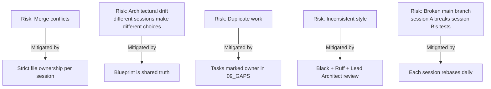
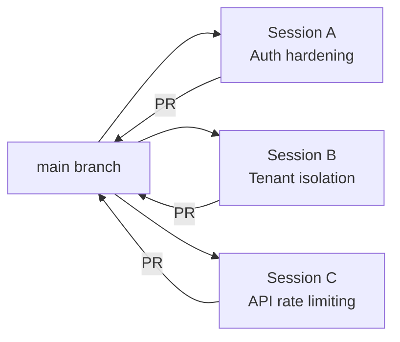
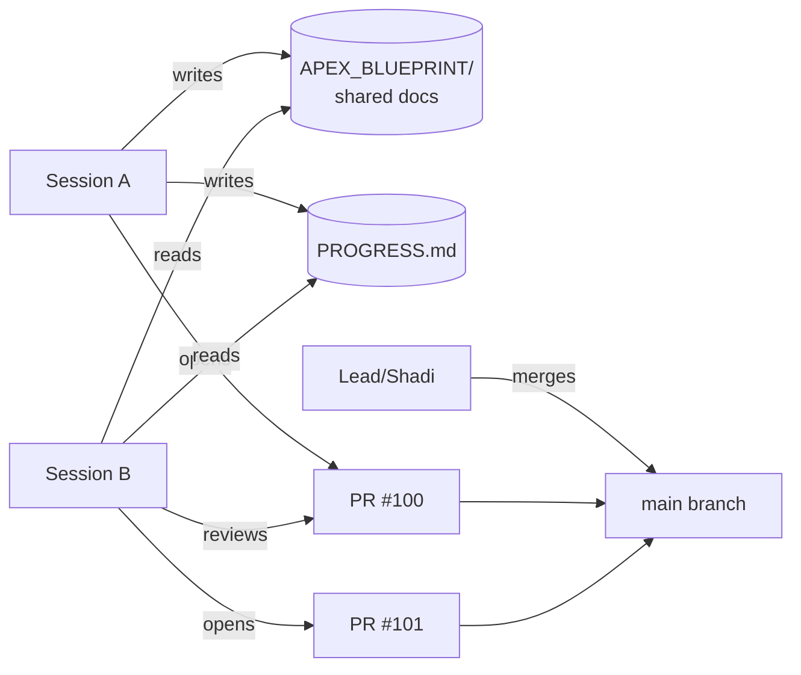

# 🔀 Parallel Execution Guide / دليل التنفيذ المتوازي

> **How to safely split execution across multiple Claude Code conversations to ship 3-5× faster.**

---

## 1. لماذا التوازي؟ / Why Parallelize?

| Scenario | Solo time | Parallel time | Speedup |
|----------|-----------|---------------|---------|
| Sprint 7 (8 tasks) | 4 weeks | 1.5 weeks | 2.7× |
| Sprint 8-10 (combined) | 3 months | 5 weeks | 2.4× |
| Module: CRM | 6 weeks | 4 weeks (with spec done) | 1.5× |
| Modules CRM+PM+DMS in parallel | 18 weeks sequential | 8 weeks parallel | 2.25× |

**Cost:** coordination overhead (~15% extra effort), risk of merge conflicts.
**Benefit:** **dramatic time-to-market improvement.**

---

## 2. المخاطر / Risks (Be Honest)

### Real risks of parallel Claude Code work



---

## 3. الأنماط الثلاثة / The Three Patterns

### Pattern 1: Branch-Based (Sprint Parallelism) — **RECOMMENDED for APEX Sprint 8+**

```
main branch ←─── PRs from all sessions
   │
   ├─ sprint-8/auth-hardening    ← Session A works here
   ├─ sprint-9/zatca-encryption  ← Session B works here
   └─ sprint-10/i18n-setup       ← Session C works here
```

**Pros:**
- True isolation
- Each session is independent
- Easy to track what each does

**Cons:**
- Merge conflicts if two sessions touch the same file

**When to use:** Tasks are **independent** and touch **different files**.

---

### Pattern 2: Module-Based (After Foundation)

```
After Sprint 7 done, parallelize on modules:

Session CRM     → owns app/crm/, lib/screens/crm/
Session PM      → owns app/pm/, lib/screens/pm/
Session DMS     → owns app/dms/, lib/screens/dms/
Session HR      → owns app/hr_payroll/, lib/screens/hr/
Session BI      → owns app/analytics/v2/, lib/screens/bi/
```

**Pros:**
- Zero conflict (each owns disjoint folders)
- Clear ownership
- Independent release cycles

**Cons:**
- Cross-cutting concerns (DMS) must coordinate

**When to use:** Major new modules to build (CRM, PM, DMS).

---

### Pattern 3: Layer-Based

```
Session DB      → schemas + migrations + repositories
Session API     → FastAPI routes + services
Session UI      → Flutter screens
Session Tests   → Test suite + CI
```

**Pros:**
- Specialization per session
- Clean separation of concerns

**Cons:**
- Tight coupling — Session UI waits for Session API to expose endpoints
- Hard to keep in sync

**When to use:** When you have specialized experts. NOT recommended for solo Claude Code.

---

## 4. التوصية لـ APEX / The APEX-Specific Plan

### Phase 0 (Week 1-2): SOLO. NO parallelism yet.

```
محادثة واحدة فقط:
- G-A1: Split main.dart        ← FOUNDATION
- G-A3: Alembic baseline        ← FOUNDATION

السبب: لا تتوازى قبل وجود أساس ثابت.
بدون main.dart مقسم، كل المحادثات الموازية ستصطدم في نفس الملف.
```

### Phase 1 (Week 3-4): 3-Way Parallel — Sprint 8 Tasks



**File ownership (zero overlap):**

| Session | Owns | Tasks |
|---------|------|-------|
| **A** | `app/phase1/services/`, `app/core/auth_utils.py` | G-S1 (bcrypt), G-B1 (OAuth), G-B2 (SMS) |
| **B** | `app/core/middleware/tenant_context.py`, repositories | G-A5 (tenant audit), G-A4 (endpoint naming) |
| **C** | `app/core/middleware/rate_limit.py` (new), `app/core/idempotency.py` (new) | G-A7 (idempotency), G-A8 (rate limit) |

### Phase 2 (Week 5-8): 3-Way Parallel — ZATCA + UAE + Egypt

| Session | Owns | Tasks |
|---------|------|-------|
| **A** | `app/zatca/` | G-Z1 (encrypt keys), G-Z2 (CSID renewal) |
| **B** | `app/uae_einvoicing/` (new module) | G-Z3 (UAE FTA) |
| **C** | `app/egypt_einvoicing/` (new module) | G-Z4 (Egypt ETA) |

### Phase 3 (Month 3-5): 4-Way Parallel — Modules

| Session | Module | Spec doc |
|---------|--------|----------|
| **CRM** | `app/crm/`, `lib/screens/crm/` | `24_CRM_MODULE_DESIGN.md` |
| **PM** | `app/pm/`, `lib/screens/pm/` | `25_PROJECT_MANAGEMENT.md` |
| **DMS** | `app/dms/`, `lib/screens/dms/` | `26_DOCUMENT_MANAGEMENT_SYSTEM.md` |
| **BI** | `app/analytics/v2/`, `lib/screens/bi/` | `28_BUSINESS_INTELLIGENCE.md` |

---

## 5. القواعد الذهبية للتوازي / Golden Rules of Parallel Work

### Rule 1: One Session = One Branch
Never two sessions on same branch. Each branch = one task.

### Rule 2: Daily Rebase
Every session rebases on `main` at start of day:
```bash
git checkout my-branch
git fetch origin
git rebase origin/main
# resolve conflicts if any
```

### Rule 3: File Ownership Documented
Before starting parallel work, write file ownership:

```markdown
# File Ownership for Sprint 8 (this week)

## Session A — owned files (do NOT modify in B or C):
- app/phase1/services/password_service.py
- app/phase1/services/social_auth_service.py
- app/phase1/services/mobile_auth_service.py
- tests/test_auth_*.py

## Session B — owned files:
- app/core/middleware/tenant_context.py
- app/*/repositories/*.py (only `tenant_id` filter changes)
- tests/test_tenant_isolation.py

## Session C — owned files:
- app/core/middleware/rate_limit.py (NEW FILE)
- app/core/idempotency.py (NEW FILE)
- app/main.py (only adds middleware registration)
- tests/test_rate_limit.py

## SHARED FILES — coordinate before touching:
- app/main.py (only middleware registration is OK in parallel)
- requirements.txt (rebase frequently)
- alembic/versions/ (use timestamp prefix to avoid collisions)
```

### Rule 4: Never Break Main
Each PR must pass CI. Never merge red.

### Rule 5: Lead Architect = Source of Truth
ONE session is the **architect**. It:
- Reviews PRs from other sessions
- Resolves architectural questions
- Updates blueprint when needed
- Makes calls when sessions disagree

For APEX, this is the human (Shadi) or one designated Claude Code instance acting as reviewer.

---

## 6. التواصل بين الجلسات / Inter-Session Communication

Sessions don't talk to each other directly. They communicate via:



**Communication artifacts:**
1. `PROGRESS.md` — what's done, in-progress, blocked
2. `09_GAPS_AND_REWORK_PLAN.md` — gap status (✅ done, ⏳ in-progress, owner)
3. PR descriptions — context per change
4. Blueprint doc updates — architectural decisions

---

## 7. قوالب البدء لكل جلسة / Starter Prompts per Session

### Starter Prompt — Session A (Auth Hardening)

```
أنت Claude Code تعمل على APEX (Arabic financial SaaS).

السياق:
- الملفات: C:\apex_app\
- الوثائق: C:\apex_app\APEX_BLUEPRINT\

اقرأ هذه الـ 4 وثائق فقط (40 دقيقة):
1. _BOOTSTRAP_FOR_CLAUDE_CODE.md
2. _PARALLEL_EXECUTION_GUIDE.md
3. 09_GAPS_AND_REWORK_PLAN.md (focus: G-S1, G-B1, G-B2)
4. 18_SECURITY_AND_THREAT_MODEL.md (sections on auth)

مهمتك في هذه الجلسة:
- الـ branch: sprint-8/auth-hardening
- File ownership: app/phase1/services/password_service.py,
  social_auth_service.py, mobile_auth_service.py
- لا تلمس: app/core/middleware/, app/main.py (إلا بإذن)

المهام بالترتيب:
1. G-S1: bcrypt rounds 10 → 12 + rotation plan
2. G-B1: Real Google OAuth + Apple Sign-in validation
3. G-B2: Real SMS via Twilio + Unifonic

عند الإنتهاء من كل مهمة:
- اختبارات pytest pass
- تحديث 09_GAPS_AND_REWORK_PLAN.md (✅)
- تحديث PROGRESS.md
- افتح PR

ابدأ الآن من G-S1.
```

### Starter Prompt — Session B (Tenant Isolation)

```
أنت Claude Code تعمل على APEX.

اقرأ:
1. _BOOTSTRAP_FOR_CLAUDE_CODE.md
2. _PARALLEL_EXECUTION_GUIDE.md
3. 09_GAPS_AND_REWORK_PLAN.md (focus: G-A4, G-A5)
4. 06_PERMISSIONS_AND_PLANS_MATRIX.md
5. 18_SECURITY_AND_THREAT_MODEL.md (Multi-tenancy section)

Branch: sprint-8/tenant-isolation
File ownership:
- app/core/middleware/tenant_context.py (modify)
- app/*/repositories/*.py (only add tenant_id filters)
- tests/test_tenant_isolation.py (new)

مهام:
1. G-A5: Audit every repository for tenant_id filter
2. Add SQLAlchemy event listener that blocks queries without tenant filter
3. Add per-tenant Postgres RLS policies (defense-in-depth)

عند الإنتهاء: PR + تحديث 09 و PROGRESS.

ابدأ بـ G-A5.
```

### Starter Prompt — Session C (Rate Limiting + Idempotency)

```
أنت Claude Code تعمل على APEX.

اقرأ:
1. _BOOTSTRAP_FOR_CLAUDE_CODE.md
2. _PARALLEL_EXECUTION_GUIDE.md
3. 09_GAPS_AND_REWORK_PLAN.md (focus: G-A7, G-A8)
4. 37_PERFORMANCE_ENGINEERING.md

Branch: sprint-8/rate-limit-idempotency
File ownership:
- app/core/middleware/rate_limit.py (NEW FILE)
- app/core/idempotency.py (NEW FILE)
- app/main.py (only add middleware registration)

مهام:
1. G-A7: Implement Idempotency-Key header support (Stripe-style)
   - Apply to POST endpoints: sales-invoices, customer-payments, zatca/invoice/build
2. G-A8: Implement per-tenant rate limiting (slowapi or custom)
   - Free: 1000 req/day
   - Pro: 50000 req/day
   - Business: 500000 req/day
   - Expert: 1M req/day
   - Enterprise: unlimited

عند الإنتهاء: PR + تحديث وثائق.

ابدأ بـ G-A7.
```

---

## 8. مثال عملي: يوم في حياة جلسات متوازية / A Day in the Life

### الصباح (9:00 AM)

**Lead (Shadi):**
- يفتح 3 جلسات Claude Code
- يلصق Starter Prompt لكل واحدة (من القسم 7 أعلاه)

**Session A:**
```
Reading docs... (40 min)
Branch created: sprint-8/auth-hardening
Starting G-S1 (bcrypt)
```

**Session B:**
```
Reading docs... (40 min)
Branch created: sprint-8/tenant-isolation
Starting G-A5 audit
```

**Session C:**
```
Reading docs... (40 min)
Branch created: sprint-8/rate-limit-idempotency
Designing idempotency module
```

### الظهر (12:00 PM)

**Session A:** Commits 3 changes for bcrypt rotation. Tests green. Pushes.
**Session B:** Found 5 repositories without tenant filter. Adding filters.
**Session C:** Built idempotency middleware. Now writing tests.

**Lead:** Reviews Session A's first PR. Approves. Merges.

### بعد الظهر (3:00 PM)

**Session B:** rebases on updated main (Session A's changes integrated).
- Resolves any conflicts (rare since file ownership is clean).
- Continues work.

**Session A:** Now starts G-B1 (Google OAuth).
**Session C:** Tests passing. PR opened. Awaiting review.

### نهاية اليوم (6:00 PM)

**All sessions:**
- Update `PROGRESS.md`
- Push final WIP commits
- Update `09_GAPS_AND_REWORK_PLAN.md` with status

**Lead:**
- Reviews any pending PRs
- Decides which to merge
- Plans tomorrow

---

## 9. حل النزاعات / Conflict Resolution

### Code merge conflicts

```bash
git rebase origin/main
# CONFLICT (content): Merge conflict in app/main.py

# Inspect conflict
git diff

# Resolution rules for APEX:
# - app/main.py middleware registration: ADD lines, never remove
# - alembic/versions: rename file with later timestamp
# - tests/: combine both (almost never conflict)
# - lib/main.dart: should not be touched in parallel sessions

# After resolving:
git add <file>
git rebase --continue
```

### Architectural conflicts

If Session A and Session B disagree on approach:

1. **Don't argue in code.** Open a discussion (in PR or issue).
2. **Cite the blueprint.** Which doc supports which approach?
3. **Lead Architect decides.** Update blueprint.
4. **All sessions adopt new direction.**

Example:
- Session A wants to use `httpx` for ZATCA calls
- Session B wants to use `requests`
- Resolution: blueprint already specifies `httpx` (in `20_INTEGRATION_ECOSYSTEM.md`)
- Both sessions converge on `httpx`

---

## 10. Anti-Patterns to Avoid

### ❌ Don't have Session A read all 38 docs every morning
Each session reads the 5 essential docs ONCE in its first 40 minutes. After that, only relevant doc updates.

### ❌ Don't have all sessions edit same file in parallel
Even with rebase, this causes pain. Plan ownership upfront.

### ❌ Don't skip the rebase
Sessions diverge if they don't rebase daily. Forced to do massive merges later.

### ❌ Don't combine unrelated work in one session
"Fix auth + add CRM module" = bad. One session, one focus.

### ❌ Don't run 5+ parallel sessions
Coordination cost exceeds parallelism gain. **3 is the sweet spot for APEX.**

### ❌ Don't trust without review
Every PR needs Lead Architect approval. Don't auto-merge.

---

## 11. أدوات الإدارة / Management Tools

### Track active sessions in this file
Create `C:\apex_app\ACTIVE_SESSIONS.md`:

```markdown
# Active Claude Code Sessions

| Session | Branch | Owner | Started | Last Update | Status |
|---------|--------|-------|---------|-------------|--------|
| A | sprint-8/auth-hardening | Claude-A | 2026-05-01 | 2026-05-03 | In Progress (G-B1) |
| B | sprint-8/tenant-isolation | Claude-B | 2026-05-01 | 2026-05-03 | PR open (#125) |
| C | sprint-8/rate-limit | Claude-C | 2026-05-01 | 2026-05-02 | Merged ✓ |

## Files Locked This Sprint
- app/phase1/services/* — Session A
- app/core/middleware/tenant_context.py — Session B
- app/core/middleware/rate_limit.py — Session C (new file)
```

Update at start/end of every day.

---

## 12. متى توقف التوازي؟ / When to Stop Parallelizing

Use parallelism when:
- ✅ Tasks are truly independent
- ✅ File ownership is clear
- ✅ You have a Lead Architect
- ✅ You can review 3 PRs/day

DON'T parallelize when:
- ❌ Tasks share complex business logic (e.g., refactoring billing logic)
- ❌ File ownership unclear
- ❌ No one to review (PRs pile up)
- ❌ Architectural foundation isn't stable yet

**Rule of thumb:** Foundation work = solo. Module work = parallel.

---

## 13. ROI Calculation / حساب العائد

### Solo path
```
Sprint 7:  4 weeks
Sprint 8:  4 weeks
Sprint 9:  4 weeks
Sprint 10: 3 weeks
Modules CRM/PM/DMS sequential: 18 weeks
─────────────────────────────────
Total:     33 weeks (~8 months)
```

### Parallel path (3 sessions)
```
Sprint 7:  2 weeks (solo, foundation)
Sprint 8:  2 weeks (3-way parallel)
Sprint 9:  2 weeks (3-way: ZATCA + UAE + Egypt parallel)
Sprint 10: 2 weeks (3-way)
Modules CRM/PM/DMS parallel: 8 weeks
─────────────────────────────────
Total:     16 weeks (~4 months)
```

**Saved: 4 months. = ~$200K opportunity cost.**

---

## 14. توصيتي النهائية / Final Recommendation

### For your specific case (Shadi, building APEX):

```
الأسبوع 1-2: 1 محادثة Claude Code
  → Sprint 7: Foundation (G-A1 + G-A3)
  
الأسبوع 3-4: 3 محادثات متوازية
  → Sprint 8: Auth + Tenant + Rate-limit
  
الأسبوع 5-8: 3 محادثات متوازية (مختلفة)
  → Sprint 9: ZATCA + UAE + Egypt e-invoicing
  
الشهر 3-5: 4 محادثات متوازية
  → Modules: CRM + PM + DMS + BI
  
الشهر 6: 1 محادثة (تثبيت)
  → Polish + Beta launch + first 50 customers
```

**أنت مستعد. ابدأ غداً.**

---

## 15. Quick-Start Commands

### Terminal 1 (Session A)
```bash
cd C:\apex_app
git checkout main && git pull
git checkout -b sprint-8/auth-hardening
# Open Claude Code with Starter Prompt A
```

### Terminal 2 (Session B)
```bash
cd C:\apex_app   # Same repo, different branch
git checkout main && git pull
git checkout -b sprint-8/tenant-isolation
# Open Claude Code with Starter Prompt B
```

### Terminal 3 (Session C)
```bash
cd C:\apex_app
git checkout main && git pull
git checkout -b sprint-8/rate-limit-idempotency
# Open Claude Code with Starter Prompt C
```

### Lead (You) — review terminal
```bash
cd C:\apex_app
gh pr list --state open
gh pr view 100 --comments
gh pr review 100 --approve
gh pr merge 100 --squash
```

---

**Now you have everything: docs (38) + bootstrap + parallel guide. Time to build.**
