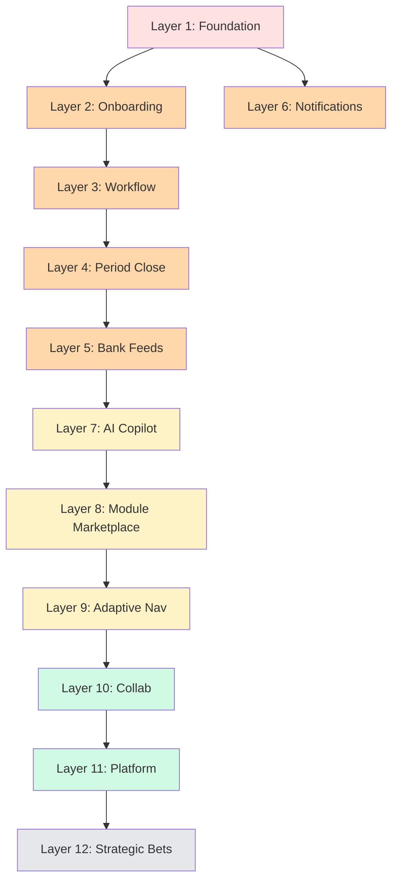

# APEX — خريطة الطريق المستقبلية الكاملة

**التاريخ**: 2026-04-29
**الإصدار**: 1.0
**المرجع**: مبني على Target-State Diagrams + 10 موجات بحث + Gap Analysis

> هذا الريبورت يفصّل **كل ميزة ناقصة** للوصول للـ Target Diagrams. منظّم في **11 طبقة** + إجمالي ~110 ميزة، مع تقدير الجهد + المتطلبات + ترتيب التنفيذ.

---

## ملخص تنفيذي

| البند | القيمة |
|------|-------|
| الميزات الكلية الناقصة | **~110 feature** |
| الجهد التقديري الإجمالي | **180-220 person-weeks** (3-4 سنوات شخص) |
| فريق مقترح | **3-4 مطورين × 12-18 شهر** |
| أولوية الإطلاق | P0 (Backend Hardening) ثم P1 (Strategic UX) |
| الـ Quick Wins (< أسبوع) | ~8 ميزة |
| الـ Strategic Bets (> 4 أسابيع) | ~15 ميزة |

### الاستراتيجية المقترحة (بترتيب)

```
Q3 2026: Foundation Hardening (P0) → Production-ready
Q4 2026: Trust + Onboarding (P1 strategic) → Wow new users
Q1 2027: Workflow Automation + Bank Feeds → Stickiness
Q2 2027: AI Layer (Voice + Vision + Tool calling)
Q3 2027: Module Marketplace + Multi-tenancy
Q4 2027: Strategic Bets (Embedded Banking, Cards)
```

---

## مفتاح القراءة

### مستوى الأولوية
- 🔴 **P0**: Production blocker — مطلوب قبل أي إطلاق فعلي
- 🟠 **P1**: عالية — تحسن جوهري في التجربة أو القيمة
- 🟡 **P2**: متوسطة — قيمة جيدة، مش حرجة
- 🟢 **P3**: منخفضة — Nice to have
- ⚫ **P4**: استراتيجية مستقبلية (12-18 شهر)

### مستوى الجهد
- 🟢 **S** (Small): 1-3 أيام
- 🟡 **M** (Medium): 1-2 أسبوع
- 🟠 **L** (Large): 3-4 أسابيع
- 🔴 **XL**: 1-3 شهور

### الـ Layer
الميزات منظّمة في 11 طبقة، كل طبقة مستقلة قدر الإمكان لتقليل dependencies.

---

# Layer 1 — Backend Foundation Hardening 🔴 P0

> **حرجة قبل أي production launch**. كلها backend work.

| # | الميزة | الجهد | الموقع الحالي | المتطلبات |
|---|------|-------|---------------|------------|
| 1.1 | **Real Google OAuth verification** | 🟡 M | `app/core/social_auth_verify.py` (stub) | google-auth library، client ID config |
| 1.2 | **Real Apple Sign-In verification** | 🟡 M | نفس الملف | apple-auth-helpers، JWT verification |
| 1.3 | **Real AML check (ComplyAdvantage/WorldCheck)** | 🟠 L | `app/phase4/routes/...` | اشتراك ComplyAdvantage API ($$$) |
| 1.4 | **JWT_SECRET fail-fast in production** | 🟢 S | `app/core/auth_utils.py` | env validation in startup |
| 1.5 | **CORS_ORIGINS strict whitelist** | 🟢 S | `app/main.py` | env-based config |
| 1.6 | **Rate limiting (per IP + per user)** | 🟡 M | غير موجود | Redis + slowapi/fastapi-limiter |
| 1.7 | **Audit log for all admin actions** | 🟡 M | partial في Phase 7 | كامل لكل `/admin/*` endpoint |
| 1.8 | **Secrets rotation policy** | 🟢 S | غير موجود | Documentation + scripts |
| 1.9 | **Database backups + PITR** | 🟡 M | manual | pg_basebackup + WAL archiving |
| 1.10 | **Sentry / error monitoring** | 🟢 S | غير موجود | sentry-sdk integration |

**Layer 1 Total**: 14 person-weeks

---

# Layer 2 — Trust + Smart Onboarding 🟠 P1

> **مرجع البحث**: QuickBooks 2026 (AI conversational + Intuit Expert) + Stripe Connect + SaaS B2B 2026 (gamification + JIT)

| # | الميزة | الجهد | الوصف |
|---|------|-------|-------|
| 2.1 | **AI Conversational Onboarding** | 🔴 XL | wizard ذكي يطرح 3-5 أسئلة (نوع نشاط، حجم فريق، احتياج أساسي) ويبني المسار. استبدال الـ static form الحالي |
| 2.2 | **Migration Tool** (من QuickBooks/Xero/Zoho) | 🔴 XL | parser + mapping wizard لاستيراد COA + GL + transactions من 3 منصات |
| 2.3 | **Live Expert Booking** (15 min consult) | 🟡 M | Calendar integration + booking page + notifications |
| 2.4 | **Accountant Firm Hub** (FreshBooks-style) | 🟠 L | شاشة موحّدة بكل عملاء المحاسب + SSO بينهم + bulk operations |
| 2.5 | **Trust Signals Hero Page** | 🟢 S | landing بـ certifications + social proof + stats |
| 2.6 | **Gamified Progress Bar** | 🟢 S | onboarding milestones + rewards |
| 2.7 | **JIT User Provisioning (SAML/OIDC)** | 🟠 L | enterprise SSO — auto-create user on first login |
| 2.8 | **Org Invite Flow** | 🟡 M | admin invites، email link، auto-join org |
| 2.9 | **Multi-step Email Verification + 2FA Choice** | 🟡 M | guided 2FA setup أثناء onboarding |
| 2.10 | **First Transaction Quick Win** | 🟡 M | Wave-style — أول فاتورة في < 5 دقايق |

**Layer 2 Total**: 24 person-weeks

---

# Layer 3 — Workflow Automation Engine 🟠 P1

> **مرجع البحث**: Zoho Books — Workflow Rules + Approval Chains + Deluge Scripting

| # | الميزة | الجهد | الوصف |
|---|------|-------|-------|
| 3.1 | **Workflow Rules Builder** (no-code UI) | 🔴 XL | UI لبناء "if X then Y" rules بدون كود |
| 3.2 | **Trigger Library** (50+ events) | 🟠 L | invoice_created, payment_received, coa_updated, إلخ |
| 3.3 | **Action Library** (notifications, updates, integrations) | 🟠 L | email, sms, webhook, set_field, create_task |
| 3.4 | **Approval Chains** (multi-level) | 🟠 L | sequential approval flows مع escalation |
| 3.5 | **Scripting Hook** (Deluge-like) | 🔴 XL | sandbox scripting للـ logic المعقّد |
| 3.6 | **Workflow Analytics Dashboard** | 🟡 M | كم مرة شغّلت rule X، نتائجها |
| 3.7 | **Workflow Version History** | 🟡 M | rollback rule changes |
| 3.8 | **Workflow Templates** (50 جاهز) | 🟠 L | best practices للـ AP automation, Sales follow-up, إلخ |

**Layer 3 Total**: 22 person-weeks

---

# Layer 4 — Period Close + COA Lifecycle 🟠 P1

> **مرجع البحث**: NetSuite Unified Architecture + Odoo Modular Period Close + IFRS/SOCPA standards

| # | الميزة | الجهد | الوصف |
|---|------|-------|-------|
| 4.1 | **Period Close Lock Enforcement** | 🟡 M | منع posting في فترات مقفلة (full enforcement) |
| 4.2 | **Auto Closing Entries** (Odoo-style) | 🟠 L | يلقّى auto: revenue/expense → retained earnings |
| 4.3 | **Period Close Checklist** (interactive) | 🟡 M | step-by-step بـ progress + sign-off |
| 4.4 | **Industry COA Templates** (Saudi/UAE/Kuwait/Egypt × Retail/Service/Pharma/Construction) | 🟠 L | 16 template + auto-classification rules per industry |
| 4.5 | **AI Confidence Threshold** (auto-approve ≥95%) | 🟢 S | تحسين Sprint 2 الموجود |
| 4.6 | **Auto-Reconciliation Tolerance** | 🟢 S | variance < threshold → auto-mark explained |
| 4.7 | **Multi-period Comparative Reports** | 🟡 M | YoY, QoQ, custom periods |
| 4.8 | **Recurring Journal Entries** | 🟡 M | template + scheduler |
| 4.9 | **Reversing Entries** | 🟢 S | one-click reversal مع audit trail |
| 4.10 | **Closing Cockpit** (CFO dashboard) | 🟠 L | KPIs + outstanding tasks + sign-offs |

**Layer 4 Total**: 16 person-weeks

---

# Layer 5 — Bank Feeds + Document Capture 🟠 P1

> **مرجع البحث**: Wave (Receipt photo) + Xero (Bank reconciliation) + Yodlee/Plaid

| # | الميزة | الجهد | الوصف |
|---|------|-------|-------|
| 5.1 | **Bank Feeds — Yodlee Integration** | 🔴 XL | live bank connection + auto-import transactions |
| 5.2 | **Bank Feeds — Plaid Integration** | 🔴 XL | بديل Yodlee للأمريكان |
| 5.3 | **AI Bank Matching ML** | 🔴 XL | تطابق تلقائي مع invoices/bills (Bank OCR L4) |
| 5.4 | **Receipt OCR Pipeline** (Wave-style) | 🟠 L | snap photo → Claude Vision → structured extraction |
| 5.5 | **Bulk Receipt Upload** (10 at once) | 🟢 S | parallel processing |
| 5.6 | **Email-to-Invoice Parser** | 🟠 L | inbox listener → extract → auto-create draft |
| 5.7 | **PDF Bank Statement Parser** | 🟡 M | enhance current Claude Vision fallback |
| 5.8 | **ISO 20022 camt.053 XML support** | 🟠 L | enterprise bank standard |
| 5.9 | **Multi-currency FX Rates** (auto-update) | 🟡 M | daily updates from central bank APIs |
| 5.10 | **FX Revaluation** (period-end) | 🟡 M | auto-revaluate non-base currency balances |
| 5.11 | **Vendor Matching ML** (L4) | 🟠 L | AI suggests vendor match for unidentified payments |

**Layer 5 Total**: 26 person-weeks

---

# Layer 6 — Notifications & Communications 🟠 P1

> **مرجع البحث**: Slack/Teams + WhatsApp Business API

| # | الميزة | الجهد | الوصف |
|---|------|-------|-------|
| 6.1 | **Real Twilio SMS** | 🟢 S | استبدال stub في `app/core/totp_service.py` |
| 6.2 | **Real WhatsApp Business API** | 🟡 M | Meta Cloud API integration |
| 6.3 | **WhatsApp Templates** (7 معتمدة) | 🟢 S | invoice sent، payment due، إلخ |
| 6.4 | **Push Notifications (FCM/APNs)** | 🟡 M | mobile push (لو Mobile Native اتعمل) |
| 6.5 | **Slack Webhook Integration** | 🟢 S | corporate channels |
| 6.6 | **Microsoft Teams Webhook** | 🟢 S | corporate channels |
| 6.7 | **Notification Templates Editor** (admin) | 🟡 M | edit templates per channel |
| 6.8 | **Notification Analytics** (delivered/opened/clicked) | 🟡 M | per-template metrics |
| 6.9 | **Notification Digest** (daily/weekly summary) | 🟢 S | بدل spam |
| 6.10 | **Snooze + Mute Rules** | 🟢 S | per category |

**Layer 6 Total**: 10 person-weeks

---

# Layer 7 — AI-First Copilot 🟡 P2

> **مرجع البحث**: Anthropic Claude API best practices + voice-first UX

| # | الميزة | الجهد | الوصف |
|---|------|-------|-------|
| 7.1 | **Voice Input** (Whisper STT) | 🟠 L | اتكلم بالعربي والـ Copilot يفهم |
| 7.2 | **Voice Output** (TTS) | 🟡 M | الرد كصوت + نص |
| 7.3 | **Vision Input** (Claude Vision) | 🟠 L | صوّر إيصال/جدول → الـ AI يفهم |
| 7.4 | **Tool Calling Agents** | 🔴 XL | الـ AI ينفّذ مهام (إنشاء فاتورة، تسوية بنكية) بعد الموافقة |
| 7.5 | **RAG على دفاتر العميل** | 🟠 L | embedded ledger + transactions في الـ context |
| 7.6 | **Cash Flow Forecast AI** (90% CI) | 🔴 XL | ML model يتوقّع التدفق النقدي |
| 7.7 | **Anomaly Detection AI** | 🟠 L | unusual transactions + fraud signals |
| 7.8 | **Auto-Categorization Suggestions** | 🟡 M | AI يقترح GL account للـ transactions |
| 7.9 | **Smart Search** (semantic + filters) | 🟠 L | ابحث "كل الفواتير اللي اتأخّرت أكتر من 30 يوم" |
| 7.10 | **Conversation Memory** (across sessions) | 🟡 M | الـ Copilot يفتكر سياق الـ session السابقة |
| 7.11 | **Proactive Suggestions** | 🟡 M | "لاحظت إن X — تحب أعمل Y؟" |
| 7.12 | **AI Audit Workflow** (Sprint 35-44 partial) | 🟠 L | كامل: review entries، flag anomalies، suggest corrections |

**Layer 7 Total**: 30 person-weeks

---

# Layer 8 — Module Marketplace + Industry Packs 🟡 P2

> **مرجع البحث**: Odoo (80+ apps) + NetSuite Modules + Industry Templates

| # | الميزة | الجهد | الوصف |
|---|------|-------|-------|
| 8.1 | **Module Manager Backend** | 🟠 L | enable/disable modules per tenant |
| 8.2 | **Module Manager UI** (admin) | 🟡 M | toggle UI |
| 8.3 | **Plan-based Module Gating** | 🟡 M | basic plan → core modules فقط، إلخ |
| 8.4 | **Industry Packs UI** (8 packs) | 🟠 L | F&B, Construction, Healthcare, Education, Retail, Manufacturing, Restaurant, Pharmacy |
| 8.5 | **Per-pack COA Templates** | 🟠 L | كل صناعة + COA + reports جاهزة |
| 8.6 | **Per-pack Default Workflows** | 🟡 M | rules + approval chains جاهزة |
| 8.7 | **Per-pack KPI Dashboards** | 🟡 M | لكل صناعة + metrics مهمة |
| 8.8 | **Module Dependencies Graph** | 🟢 S | enabling X requires Y |
| 8.9 | **Custom Module Builder** (no-code) | 🔴 XL | بناء module بـ drag-drop |
| 8.10 | **Third-party App Marketplace** | 🔴 XL | Stripe-style ecosystem للـ developers |

**Layer 8 Total**: 24 person-weeks

---

# Layer 9 — Adaptive Navigation + RBAC 🟡 P2

> **مرجع البحث**: Multi-Role UX 2026 — "Permissions by task, not feature"

| # | الميزة | الجهد | الوصف |
|---|------|-------|-------|
| 9.1 | **Role-aware Sidebar** | 🟡 M | menu يتغيّر حسب الدور (10 أدوار) |
| 9.2 | **Plan-aware Feature Locks** | 🟡 M | "Upgrade to unlock" UX |
| 9.3 | **Onboarding-state Hints** | 🟢 S | "أكمل الـ COA upload عشان تشوف Reports" |
| 9.4 | **Period-state Awareness** (locked/open) | 🟢 S | Hide post buttons في فترات مقفلة |
| 9.5 | **Custom Role Builder** | 🟠 L | admin يبني روله جديده + permissions |
| 9.6 | **Granular Permissions** (200+ atomic) | 🟠 L | per-action, per-entity, per-field |
| 9.7 | **Permission Audit Tool** | 🟡 M | "what can role X do?" + simulate |
| 9.8 | **Multi-org Access Control** | 🟠 L | per-user, per-org permissions |
| 9.9 | **Approval Hierarchy Visualizer** | 🟢 S | tree view للـ approval chains |
| 9.10 | **Quick Switch User** (impersonation) | 🟡 M | admin support tool — login as user (with audit) |

**Layer 9 Total**: 16 person-weeks

---

# Layer 10 — Real-time Collaboration 🟢 P3

> **مرجع البحث**: Y.js / CRDT + Modern collaboration UX (Notion, Figma)

| # | الميزة | الجهد | الوصف |
|---|------|-------|-------|
| 10.1 | **WebSocket Hub Enhancement** | 🟠 L | from notifications-only to full collab |
| 10.2 | **Real-time JE Editing** (multi-user) | 🔴 XL | Y.js للـ JE builder |
| 10.3 | **Presence Indicators** | 🟡 M | "Ali is viewing this invoice" |
| 10.4 | **Comments + Mentions** (@user) | 🟠 L | على الـ entities (invoice, JE, COA account) |
| 10.5 | **Activity Feed** (per entity) | 🟡 M | timeline of changes |
| 10.6 | **Slack-style Threads** | 🟠 L | discussions on items |
| 10.7 | **Document Co-editing** | 🔴 XL | shared documents مع cursor presence |
| 10.8 | **Live Cursor / Selection** | 🟡 M | see what others are looking at |
| 10.9 | **Conflict Resolution UI** | 🟡 M | merge concurrent edits |
| 10.10 | **Offline Mode + Sync** | 🔴 XL | PWA + service worker + queue |

**Layer 10 Total**: 26 person-weeks

---

# Layer 11 — Platform & Ecosystem 🟢 P3

> **مرجع البحث**: Stripe Connect + Multi-tenancy patterns

| # | الميزة | الجهد | الوصف |
|---|------|-------|-------|
| 11.1 | **White-Label Editor** (Sprint 43 reference) | 🟠 L | live theme editor + brand assets |
| 11.2 | **Multi-tenant Data Isolation** | 🔴 XL | DB-per-tenant or row-level security |
| 11.3 | **Tenant Manager** (super-admin) | 🟡 M | create, suspend, migrate tenants |
| 11.4 | **GraphQL API** (alternative to REST) | 🔴 XL | reduce over-fetching for mobile |
| 11.5 | **Public API + API Keys** | 🟠 L | developer portal + rate limits |
| 11.6 | **Webhook Subscriptions** (events) | 🟡 M | customer-defined event listeners |
| 11.7 | **Mobile Native Apps** (iOS + Android) | 🔴 XL | from same Flutter codebase |
| 11.8 | **WCAG 2.1 AA Compliance** (Sprint 43) | 🟠 L | full accessibility audit + fixes |
| 11.9 | **i18n: 5 لغات إضافية** | 🟠 L | فرنسية، أردية، هندية، إندونيسية، تركية |
| 11.10 | **Stripe Connect 3-Mode Onboarding** (Hosted/Embedded/API) | 🟠 L | for Provider marketplace |
| 11.11 | **OAuth Provider for APEX** | 🟠 L | "Sign in with APEX" for partner apps |

**Layer 11 Total**: 32 person-weeks

---

# Layer 12 — Strategic Bets ⚫ P4 (12-18 months)

> **رؤية بعيدة** — منصة مالية شاملة، مش مجرد دفاتر محاسبة.

| # | الميزة | الجهد | الوصف |
|---|------|-------|-------|
| 12.1 | **Embedded Banking** | 🔴 XL | حسابات بنكية داخل APEX (شراكة مع SAB/Riyadh Bank/STC Pay) |
| 12.2 | **Working Capital Loans** | 🔴 XL | قروض قصيرة بناءً على دفاتر العميل |
| 12.3 | **Corporate Cards** | 🔴 XL | بطاقات شركات مرتبطة بالمصروفات |
| 12.4 | **Investment Management** | 🔴 XL | portfolio tracking + reports |
| 12.5 | **Crypto Accounting** | 🔴 XL | tracking + zakat على الكريبتو |
| 12.6 | **DAO Treasury** | 🔴 XL | smart contract treasury management |
| 12.7 | **AI CFO Agent** | 🔴 XL | autonomous CFO that runs operations |
| 12.8 | **Regulatory Auto-Filing** (ZATCA, FTA, EOSB) | 🔴 XL | E2E auto-submission + compliance |
| 12.9 | **B2B Marketplace** (services + goods) | 🔴 XL | network effect — companies trade with each other |
| 12.10 | **APEX Network** (peer-to-peer benchmarking) | 🔴 XL | anonymized benchmarks across customers |

**Layer 12 Total**: 30+ person-weeks (loose estimate)

---

# جدول الملخص

| Layer | عنوان | عدد ميزات | جهد (person-weeks) | الأولوية |
|-------|------|-----------|---------------------|----------|
| 1 | Backend Foundation | 10 | 14 | 🔴 P0 |
| 2 | Trust + Onboarding | 10 | 24 | 🟠 P1 |
| 3 | Workflow Engine | 8 | 22 | 🟠 P1 |
| 4 | Period Close + COA | 10 | 16 | 🟠 P1 |
| 5 | Bank Feeds + Capture | 11 | 26 | 🟠 P1 |
| 6 | Notifications | 10 | 10 | 🟠 P1 |
| 7 | AI Copilot | 12 | 30 | 🟡 P2 |
| 8 | Module Marketplace | 10 | 24 | 🟡 P2 |
| 9 | Adaptive Nav + RBAC | 10 | 16 | 🟡 P2 |
| 10 | Real-time Collab | 10 | 26 | 🟢 P3 |
| 11 | Platform + Ecosystem | 11 | 32 | 🟢 P3 |
| 12 | Strategic Bets | 10 | 30+ | ⚫ P4 |
| **Total** | — | **~110** | **~270 PW** | — |

> **270 person-weeks ≈ 5.2 person-years**

---

# ترتيب التنفيذ المقترح (12-18 شهر)

## 🚀 Wave 1 — Foundation (شهر 1-3) — Q3 2026

**هدف**: production-ready منصة آمنة.

- ✅ Layer 1 كامل (Backend Hardening) — 14 PW
- 🟢 Layer 6 quick wins: Twilio + WhatsApp + Slack/Teams — 4 PW

**Total**: 18 PW = ~3 شهور بفريق 2 backend devs

## 🎨 Wave 2 — UX Wow (شهر 4-7) — Q4 2026

**هدف**: تجربة جديدة تجذب العملاء.

- ✅ Layer 2 كامل (Trust + AI Onboarding + Migration + Firm Hub) — 24 PW
- ✅ Layer 9 partial: role-aware nav + plan locks — 6 PW

**Total**: 30 PW = ~4 شهور بفريق 2 frontend + 1 backend + 1 designer

## ⚙️ Wave 3 — Stickiness (شهر 8-12) — Q1 2027

**هدف**: workflows تخلّي العميل ما يقدر يستغني عن المنصة.

- ✅ Layer 3 كامل (Workflow Engine) — 22 PW
- ✅ Layer 4 كامل (Period Close) — 16 PW
- ✅ Layer 5 partial: Yodlee + Receipt OCR — 14 PW

**Total**: 52 PW = ~5 شهور بفريق 3 backend + 2 frontend

## 🤖 Wave 4 — AI Differentiation (شهر 13-16) — Q2 2027

**هدف**: APEX = أذكى منصة مالية.

- ✅ Layer 7 كامل (AI Copilot full) — 30 PW
- ✅ Layer 5 finish: Plaid + Vendor Matching ML — 12 PW

**Total**: 42 PW = ~4 شهور بفريق 2 AI + 1 backend + 1 frontend

## 🏛️ Wave 5 — Platform (شهر 17-20) — Q3 2027

**هدف**: Multi-tenant SaaS مع White-Label.

- ✅ Layer 8 partial (Module Manager + Industry Packs) — 18 PW
- ✅ Layer 9 finish (full RBAC) — 10 PW
- ✅ Layer 11 partial (Multi-tenant + GraphQL + Mobile) — 25 PW

**Total**: 53 PW = ~5 شهور بفريق 4

## 🚀 Wave 6 — Ecosystem (شهر 21-24) — Q4 2027

**هدف**: APEX network — قيمة من البيانات + الشركاء.

- ✅ Layer 10 partial (Comments + Activity + Presence) — 14 PW
- ✅ Layer 8 finish (Custom Module Builder + Marketplace) — 6 PW
- ✅ Layer 11 finish (Stripe Connect + i18n + Public API) — 17 PW

**Total**: 37 PW = ~4 شهور بفريق 3-4

## 🌟 Wave 7+ — Strategic Bets (12-24 شهر+ بعدها)

Layer 12 — كل ميزة شراكة استراتيجية + regulatory work + capital.

---

# Quick Wins (< أسبوع لكل واحد) — احسبها لاحقاً

## للـ developer experience:

1. ✅ **Twilio SMS** (1.4 → 1.6 إذا rate limiting كذلك)
2. ✅ **WhatsApp Business** (5-line config)
3. ✅ **Slack/Teams webhooks** (3 hours each)
4. ✅ **JWT + CORS hardening** (1 day)
5. ✅ **Sentry integration** (1 hour)
6. ✅ **Trust signals page** (2 days)
7. ✅ **Gamified progress bar** (3 days)
8. ✅ **Notification digest** (3 days)
9. ✅ **AI confidence threshold** (1 day, tune Sprint 2)
10. ✅ **Auto-reconciliation tolerance** (2 days)

**Total Quick Wins**: 8 ميزة في < 4 أسابيع، تحسّن كبير في الـ UX و الأمان.

---

# Dependencies (ما يجب قبل ما)



---

# Team Composition المقترح

## للـ Wave 1-2 (شهور 1-7):
- 2 Backend devs (Python/FastAPI)
- 2 Frontend devs (Flutter)
- 1 Designer (UX/UI)
- 1 PM (part-time)

## للـ Wave 3-4 (شهور 8-16):
- + 1 AI/ML dev
- + 1 DevOps (full-time)

## للـ Wave 5-6 (شهور 17-24):
- + 1 Platform engineer (multi-tenancy + scaling)
- + 1 Mobile dev (iOS/Android specialist)

**Peak team size**: 8-10 people

---

# تقدير التكلفة (تقريبي)

افتراض: متوسط $4K/شهر/مطور (سعر الشرق الأوسط).

| Wave | شهور | فريق | تكلفة |
|------|------|------|-------|
| 1 (Foundation) | 3 | 4 | $48K |
| 2 (UX Wow) | 4 | 5 | $80K |
| 3 (Stickiness) | 5 | 6 | $120K |
| 4 (AI) | 4 | 6 | $96K |
| 5 (Platform) | 4 | 7 | $112K |
| 6 (Ecosystem) | 4 | 6 | $96K |
| **Total Wave 1-6** | **24** | — | **~$552K** |

ضيف:
- AML subscription (ComplyAdvantage): ~$2K/شهر = $48K/سنتين
- Yodlee/Plaid: ~$0.50/account/شهر × 1000 customers × 24 شهر = $12K
- Anthropic API: variable (estimate $2K-10K/شهر at scale)
- Cloud infra (PostgreSQL + Redis + S3 + WebSockets): ~$1K-3K/شهر

**TCO 24 شهر**: ~$650K-750K

---

# المخاطر والتحديات

## 🔴 Critical Risks

1. **AML provider dependency** (ComplyAdvantage): contract + cost
2. **Bank API access** (Yodlee/Plaid): regional availability + KYC requirements
3. **Multi-tenancy migration**: من single-tenant DB لـ multi-tenant — risky
4. **AI hallucinations**: tool calling agents يحتاج guardrails صارمة
5. **Compliance moving target** (ZATCA, FTA): لازم نتابع التحديثات

## 🟡 Medium Risks

6. **Talent acquisition**: AI/ML devs scarce
7. **Real-time collab complexity**: Y.js + conflict resolution = شيء جديد للفريق
8. **Mobile parity**: Flutter Web لـ Native ممكن في issues
9. **Translation quality**: 5 لغات إضافية = QA effort كبير

## 🟢 Low Risks

10. **Notifications delivery**: Twilio + Meta + Slack/Teams = mature APIs
11. **Workflow rules engine**: Zoho-style is well-understood pattern

---

# مؤشرات النجاح (KPIs)

## Foundation (بعد Wave 1):
- 0 P0 bugs in production
- 99.5% uptime
- < 200ms p95 API latency
- 0 secrets exposed

## UX (بعد Wave 2):
- Time to first transaction: < 5 دقايق
- Onboarding completion: > 85%
- NPS من العملاء الجدد: > 50

## Stickiness (بعد Wave 3):
- Workflow rules per active client: > 5
- Bank reconciliation auto-match rate: > 70%
- Daily active users / MAU: > 60%

## AI (بعد Wave 4):
- Copilot useful response rate: > 75%
- Anomaly detection precision: > 90%
- Auto-categorization accuracy: > 88%

## Platform (بعد Wave 5):
- Multi-tenant cost per tenant: < $5/month
- White-label customers: > 5
- API consumers (3rd party apps): > 20

---

# المقارنة مع المنافسين

بعد تنفيذ Wave 1-6:

| الميزة | APEX | QuickBooks | Xero | Zoho Books | Wave |
|--------|------|------------|------|------------|------|
| AI Onboarding | ✅ | ✅ | ❌ | ❌ | ❌ |
| AI Cashflow Forecast | ✅ | ⚠️ | ⚠️ | ❌ | ❌ |
| Workflow Engine | ✅ | ⚠️ | ⚠️ | ✅ | ❌ |
| Bank Feeds (Yodlee/Plaid) | ✅ | ✅ | ✅ | ✅ | ✅ |
| Receipt OCR | ✅ | ✅ | ✅ | ✅ | ✅ |
| Multi-tenant | ✅ | ✅ | ✅ | ✅ | ⚠️ |
| Module Marketplace | ✅ | ⚠️ | ⚠️ | ✅ | ❌ |
| Voice Copilot | ✅ | ❌ | ❌ | ❌ | ❌ |
| Vision (Receipt photo) | ✅ | ⚠️ | ⚠️ | ⚠️ | ✅ |
| Tool-calling AI Agent | ✅ | ❌ | ❌ | ❌ | ❌ |
| Real-time Collab | ✅ | ❌ | ❌ | ❌ | ❌ |
| Arabic-first | ✅ | ❌ | ❌ | ⚠️ | ❌ |
| ZATCA + Zakat | ✅ | ❌ | ❌ | ⚠️ | ❌ |
| White-label | ✅ | ❌ | ❌ | ⚠️ | ❌ |

**APEX المستهدف** = 14/14 ✅  
**أقرب منافس** (Zoho Books) = 9/14

---

# الخلاصة

## ما الذي بنيناه حالياً (~5-10% من الـ Target)

- ✅ Routing structure منظّم (237 → 234 routes)
- ✅ COA pipeline (Sprint 1-3): upload + classify + quality
- ✅ TB binding (Sprint 4)
- ✅ Knowledge Brain + Copilot AI (text)
- ✅ ZATCA full integration
- ✅ Stripe payment (mock backend)
- ✅ 10 user roles + RBAC partial
- ✅ Demo gating (Stage 5b)
- ✅ Documentation شاملة

## ما المتبقي (~90-95% من الـ Target)

كل اللي في الـ Layers 1-12 أعلاه. تقريباً **270 person-weeks** إجمالي.

## التوصية

**اتبع الـ Waves بالترتيب**:
1. Wave 1 (Foundation) — لازم قبل أي إطلاق production
2. Wave 2 (UX Wow) — لتمييز عن المنافسين
3. Wave 3 (Stickiness) — للاحتفاظ بالعملاء
4. باقي الـ Waves — حسب القيمة + الفرص

**لا تحاول كل شيء بالتوازي** — هتدمّر الفريق وتقلّل جودة كل ميزة.

**ركّز على Wave 1 أولاً، خصوصاً P0 Backend Hardening** — هي blocking لأي إطلاق فعلي.

---

# الخطوات العملية التالية

1. **هذا الأسبوع**: مراجعة هذا الريبورت + اعتماد الـ Wave 1 priorities
2. **الأسبوع القادم**: Sprint planning للـ Wave 1 (Foundation)
3. **شهر القادم**: تنفيذ Layer 1 (10 ميزات foundation)
4. **شهرين القادمين**: تنفيذ Layer 6 quick wins (notifications)
5. **3 شهور القادمة**: مراجعة + الـ Wave 2 kickoff

---

# المراجع

- [`MIGRATION_SUMMARY.md`](MIGRATION_SUMMARY.md) — ملخص جلسة 2026-04-29
- [`TEST_PLAN.md`](TEST_PLAN.md) — كيف تختبر التغييرات
- [`diagrams/02-target-state.md`](diagrams/02-target-state.md) — المخططات المستهدفة كاملة
- [`diagrams/03-research-findings.md`](diagrams/03-research-findings.md) — 10 موجات بحث
- [`diagrams/04-gap-analysis.md`](diagrams/04-gap-analysis.md) — تحليل الفجوة الأصلي

---

*هذا الريبورت **تقدير محايد** بناءً على المخططات والبحث، مش وعد. الأرقام تقريبية وقد تتغيّر حسب complexity فعلية + قرارات تصميمية + توفر فريق + متطلبات regulatory. اعتبره **خريطة طريق إرشادية** وليست مخطط malzem.*
