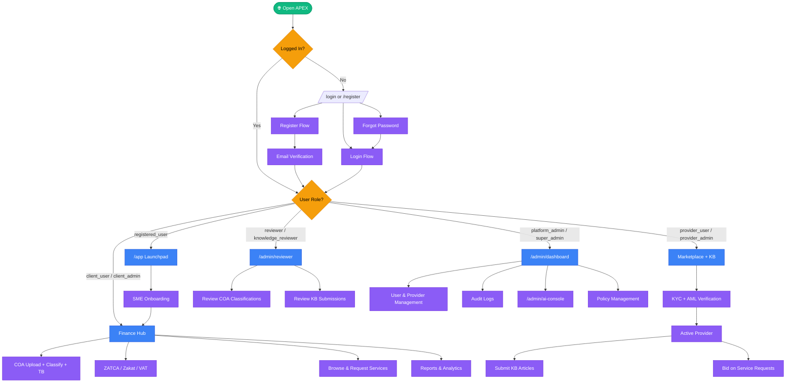
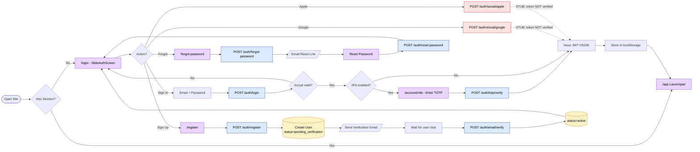
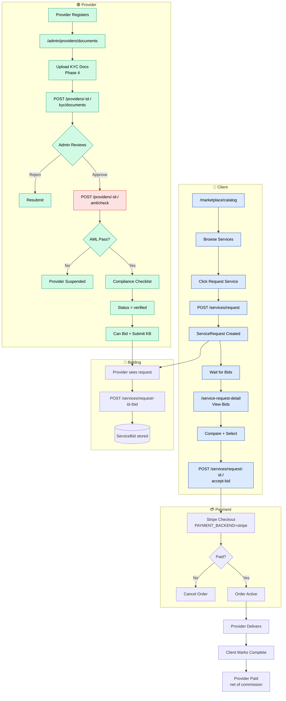
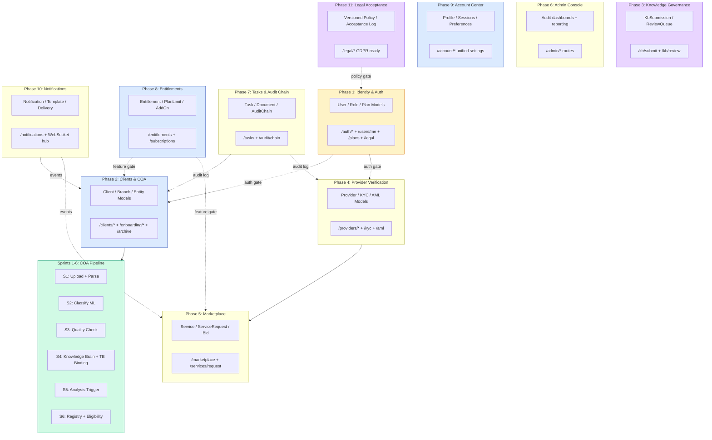
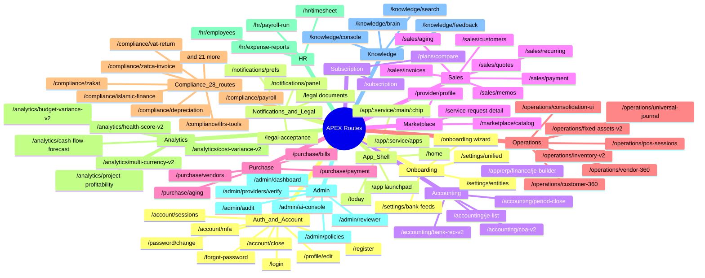

# APEX — الواقع الحالي (As-Is)

> مخطط شامل لكل ما هو منفّذ فعلياً في الكود اليوم. مبني على استكشاف عميق لـ 11 Phase + 6 Sprint + 37 راوت أساسي في GoRouter.

---

## 1. النظرة العامة — كل الأدوار والرحلات الأساسية

---

## 2. تدفق المصادقة (Authentication)

**نقاط مهمة في الواقع الحالي:**
- ✅ JWT HS256 شغّال + bcrypt للباسورد
- ✅ 2FA TOTP منفّذ
- ✅ Forgot password كامل
- ⚠️ Google/Apple sign-in **stub** (التوكن مش متحقق منه — راجع `app/core/social_auth_verify.py`)
- ⚠️ SMS verification **stub** (دايماً يرجع success)

---

## 3. تدفق الـ Onboarding للعميل (SME)

```mermaid
flowchart TD
    Login([User Logs In]) --> Launchpad["/app - Launchpad"]
    Launchpad --> ClickFinance[Click Finance Hub]
    ClickFinance --> EntitySetup["/settings/entities"]

    EntitySetup --> EntityForm[Enter: name, industry,<br/>country, tax ID]
    EntityForm --> CreateEntity[POST /clients]
    CreateEntity --> CoaWizard["/app/erp/finance/onboarding<br/>PilotOnboardingWizard"]

    CoaWizard --> Step1[Step 1: Upload COA File<br/>Excel / JSON]
    Step1 --> UploadAPI[POST /clients/-id-/coa/upload]
    UploadAPI --> StoreFile[(Store in S3/Local<br/>storage_backend)]
    StoreFile --> ParseJob[Parse Job Sprint 1]

    ParseJob --> Poll{Status?}
    Poll -- pending --> Wait[Frontend Polls]
    Wait --> Poll
    Poll -- error --> ErrorScreen[Show Parse Errors]
    ErrorScreen --> Step1
    Poll -- completed --> AccountsList[GET /coa/uploads/-id-/accounts]

    AccountsList --> Step2[Step 2: Auto-Classify<br/>Sprint 2]
    Step2 --> ClassifyAPI[POST /coa/uploads/-id-/classify]
    ClassifyAPI --> MLJob[ML classification<br/>SOCPA/IFRS]
    MLJob --> ReviewClass[User reviews<br/>confidence scores]

    ReviewClass --> NeedsOverride{Manual override?}
    NeedsOverride -- Yes --> OverrideAPI[PUT /coa/uploads/-id-/<br/>classifications/-account-]
    OverrideAPI --> ReviewClass
    NeedsOverride -- No --> Step3

    Step3[Step 3: Quality Check<br/>Sprint 3] --> QualityAPI[POST /coa/uploads/-id-/<br/>quality-check]
    QualityAPI --> Issues{Issues found?}
    Issues -- Yes --> AutoFix{Auto-fixable?}
    AutoFix -- Yes --> FixAPI[POST /coa/uploads/-id-/<br/>quality-fix]
    AutoFix -- No --> ManualFix[User fixes manually]
    FixAPI --> Step3
    ManualFix --> Step3
    Issues -- No --> Approval

    Approval[Reviewer Approval<br/>required] --> ApproveAPI[POST /coa/uploads/-id-/approve]
    ApproveAPI --> ApprovedFlag[(coa_approved_at = now)]

    ApprovedFlag --> Step4[Step 4: TB Binding<br/>Sprint 4 TB]
    Step4 --> UploadTB[Upload Trial Balance]
    UploadTB --> CreateTB[POST /tb/create]
    CreateTB --> BindAPI[POST /tb/-id-/bind-coa]
    BindAPI --> VarianceAPI[GET /tb/-id-/variance]
    VarianceAPI --> HasVariance{Variance found?}
    HasVariance -- Yes --> Reconcile[POST /tb/-id-/reconcile/-account-]
    Reconcile --> VarianceAPI
    HasVariance -- No --> ClosePeriod[POST /tb/-id-/close-period]

    ClosePeriod --> Step5[Step 5: Analysis Trigger<br/>Sprint 5]
    Step5 --> TriggerAnalysis[POST /analysis/trigger]
    TriggerAnalysis --> Done([Onboarding Complete])
    Done --> Reports[Reports + Statements ready]

    classDef stage fill:#dbeafe,stroke:#1e40af,color:#000
    classDef decision fill:#fef3c7,stroke:#d97706,color:#000
    classDef api fill:#e9d5ff,stroke:#7c3aed,color:#000
    classDef done fill:#d1fae5,stroke:#059669,color:#000

    class Step1,Step2,Step3,Step4,Step5 stage
    class Poll,NeedsOverride,Issues,AutoFix,HasVariance decision
    class UploadAPI,ClassifyAPI,QualityAPI,FixAPI,ApproveAPI,CreateTB,BindAPI,VarianceAPI,Reconcile,ClosePeriod,TriggerAnalysis api
    class Done,Reports done
```

---

## 4. تدفق الـ Marketplace (Provider + Client)

> **ملاحظة:** AML check حالياً integration stub — لازم تربط بمزوّد فعلي للإنتاج.

---

## 5. تدفق Knowledge Brain + Copilot (AI)

```mermaid
flowchart LR
    User([User Asks Question]) --> ChatUI["/knowledge/brain<br/>or inline chat"]
    ChatUI --> AskAPI[GET /copilot/ask?q=...]

    AskAPI --> KeyCheck{ANTHROPIC_<br/>API_KEY set?}
    KeyCheck -- No --> Fallback[Hardcoded Fallback<br/>Response]
    Fallback --> Render

    KeyCheck -- Yes --> Embed[Anthropic Embeddings<br/>Semantic Search]
    Embed --> KbSearch[POST /kb/search]
    KbSearch --> Found{Match found?}

    Found -- Yes & high confidence --> Cite[Return KB Article<br/>+ Citations]
    Found -- Yes & low confidence --> Synth[Claude API Synthesis<br/>+ KB Context]
    Found -- No --> Synth
    Synth --> Cite

    Cite --> Render[Render Answer in UI]
    Render --> Rate{User Rates?}
    Rate -- 👍 --> SaveGood[POST /kb/rate helpful]
    Rate -- 👎 --> Feedback[POST /coa/<br/>knowledge-feedback]
    Feedback --> ReviewerQueue[Knowledge Reviewer Queue]
    ReviewerQueue --> AuthorRevise[KB Author Revises]

    SaveConv[POST /copilot/conversation] -.save history.-> SaveGood
    SaveConv -.-> Feedback

    classDef ai fill:#fce7f3,stroke:#be185d,color:#000
    classDef stub fill:#fee2e2,stroke:#dc2626,color:#000

    class Embed,Synth,KbSearch ai
    class Fallback stub
```

---

## 6. تدفق الإدارة (Platform Admin)

```mermaid
flowchart TD
    AdminLogin([Platform Admin Login]) --> Dashboard["/admin/dashboard<br/>Phase 6"]

    Dashboard --> Tabs{Action?}

    Tabs --> Users[User Management]
    Users --> ListUsers[GET /admin/users]
    Users --> AssignRole[POST /admin/users/-id-/role-assign]
    Users --> Suspend[POST /users/-id-/suspend]

    Tabs --> Providers[Provider Management]
    Providers --> ProvList["/admin/providers/verify"]
    Providers --> ApproveKyc[Approve KYC]
    Providers --> SetStatus[PUT /admin/providers/-id-/status]

    Tabs --> Audit[Audit & Compliance]
    Audit --> AuditLog[GET /admin/audit-log<br/>Phase 7 audit_chain]
    Audit --> Suspicious[GET /admin/activities/suspicious]

    Tabs --> AI[AI Console]
    AI --> AiInbox["/admin/ai-suggestions"]
    AI --> AiQueue["/admin/ai-suggestions-v2"]
    AI --> AiConsole["/admin/ai-console"]

    Tabs --> Policies[Policy & Legal<br/>Phase 11]
    Policies --> PolicyMgmt["/admin/policies"]
    Policies --> CreatePolicy[POST /admin/policies/create]
    Policies --> Supersede[POST /legal/supersede]

    Tabs --> Knowledge[Knowledge Governance<br/>Phase 3]
    Knowledge --> Reviewer["/admin/reviewer"]
    Knowledge --> ReviewQueue[GET /kb/pending-review]
    Knowledge --> ApproveKb[POST /kb/review/-id-]

    classDef admin fill:#fce7f3,stroke:#be185d,color:#000
    class Dashboard,Users,Providers,Audit,AI,Policies,Knowledge admin
```

---

## 7. هيكل الـ Backend (Phases + Sprints)

---

## 8. خريطة الراوتس (Frontend - 37 رئيسي)

---

## 9. الفجوات والـ Stubs الحالية

```mermaid
graph LR
    subgraph Stubs["⚠️ STUBS / TODOs"]
        S1[Social Auth<br/>Google/Apple<br/>token NOT verified]
        S2[SMS Verification<br/>always returns success]
        S3[Redis OTP Backend<br/>fallback to in-memory]
        S4[Bank OCR L4<br/>vendor matching]
        S5[AP Agent Processors<br/>logs only]
        S6[Invoice Creation AI<br/>ZATCA wiring WIP]
        S7[WhatsApp Notifications<br/>console only]
        S8[Multi-currency L4<br/>FX matching]
        S9[Period Close Lock<br/>partial enforcement]
        S10[Email-to-Invoice<br/>not implemented]
        S11[GraphQL API<br/>REST only]
        S12[Real-time Collab<br/>WebSocket limited]
    end

    classDef stub fill:#fee2e2,stroke:#dc2626,color:#000
    class S1,S2,S3,S4,S5,S6,S7,S8,S9,S10,S11,S12 stub
```

**التفاصيل في** [`04-gap-analysis.md`](04-gap-analysis.md).

---

## مرجع سريع — الأدوار العشرة

| # | Role Code | المسؤوليات الأساسية |
|---|-----------|---------------------|
| 1 | `guest` | غير مسجّل — صفحات عامة، تسجيل، دخول |
| 2 | `registered_user` | حساب مجاني، Dashboard، Profile |
| 3 | `client_user` | عضو فريق العميل — COA, Reports, TB |
| 4 | `client_admin` | إدارة المؤسسة — فريق + اشتراكات + فواتير |
| 5 | `provider_user` | مزوّد خدمة/معرفة — Marketplace + KB |
| 6 | `provider_admin` | قيادة المزوّد — فريق + KYC/AML + Audit |
| 7 | `reviewer` | مراجع محتوى — يعتمد COA classifications |
| 8 | `knowledge_reviewer` | مراجع MoBرفة — يعتمد KB articles |
| 9 | `platform_admin` | موظف APEX — Admin Console |
| 10 | `super_admin` | مالك النظام — DB migrations, emergency actions |
