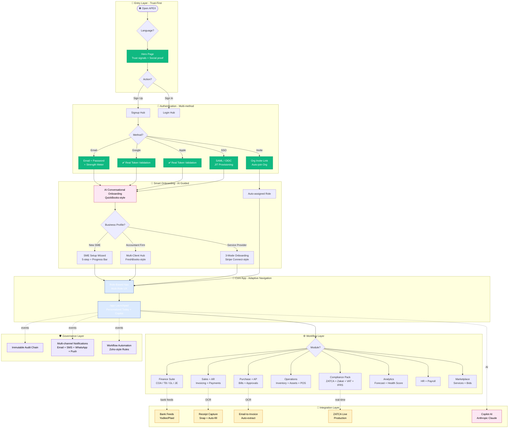
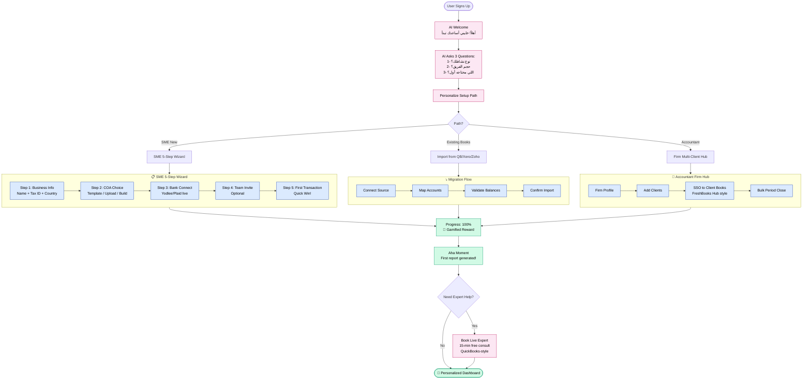
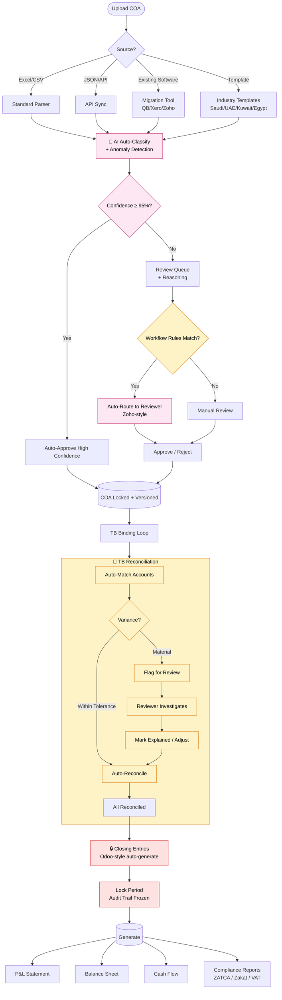
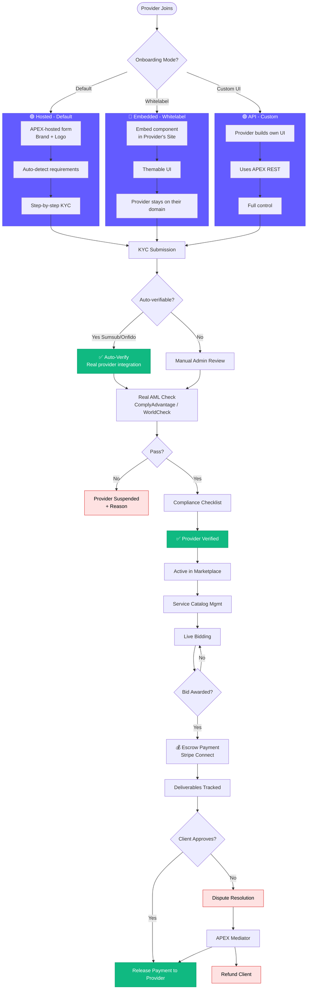
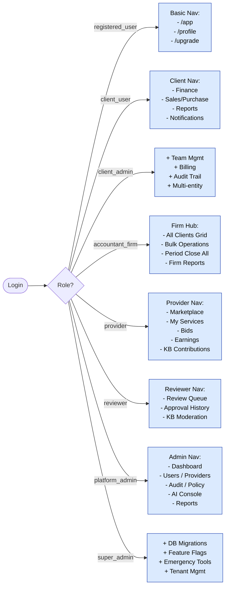
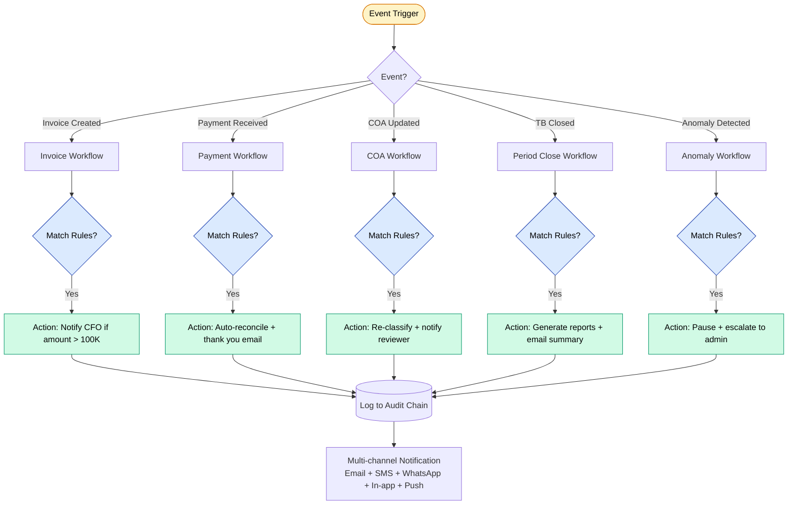
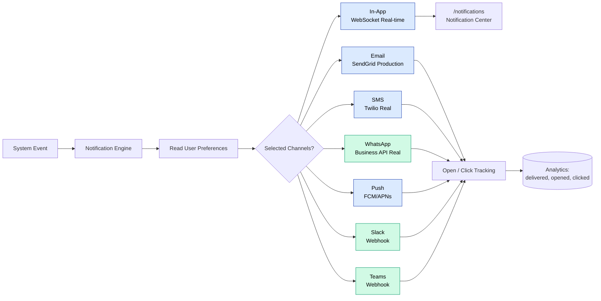
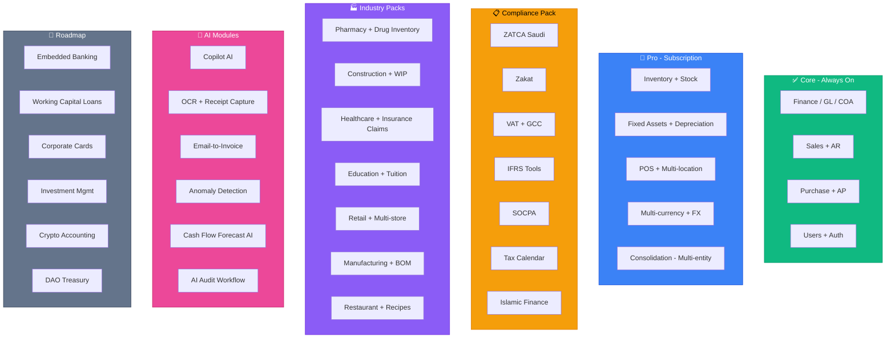
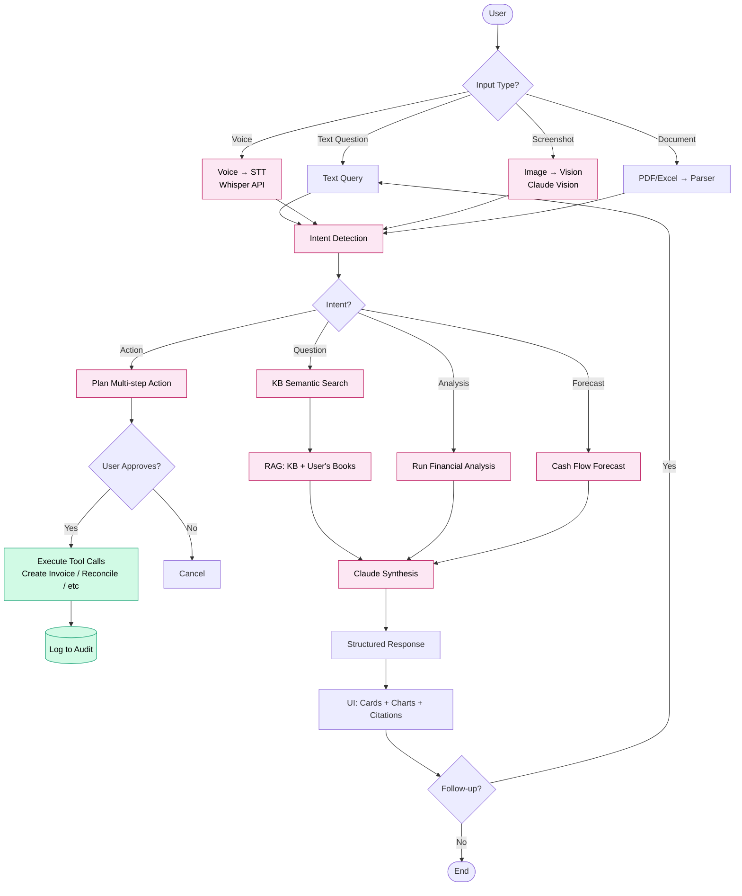
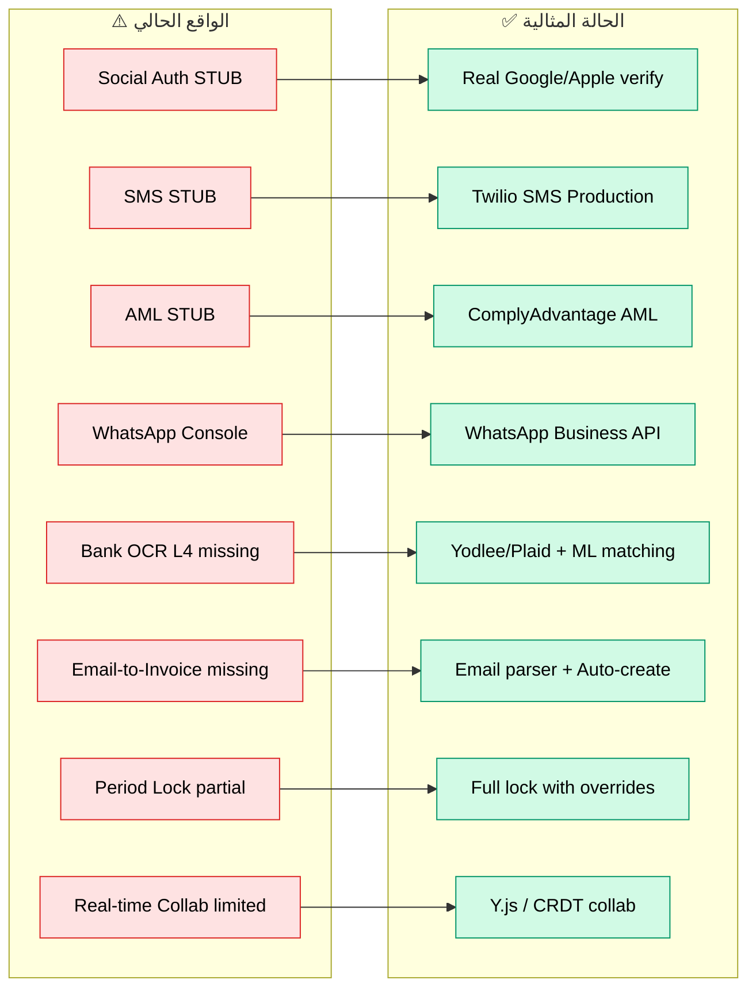

# APEX — الحالة المثالية (To-Be)

> مخطط APEX الكامل والمحسّن، مبني على **10 موجات بحث** عالمية على QuickBooks, Xero, Zoho Books, Wave, FreshBooks, NetSuite, Odoo, SAP, Stripe + معايير SaaS B2B 2026.

> **مبدأ التصميم**: في FinTech، الـ onboarding UX يبني الثقة بقدر ما يبني الاستخدام — كل خطوة لازم تطمئن المستخدم على بياناته (Wave 6).

---

## 1. النظرة الكلية المحسّنة

---

## 2. تدفق الـ Onboarding المحسّن (AI Guided + Trust-First)

> **مرجع البحث**: QuickBooks 2026 (AI conversational + Intuit Expert) + Stripe Connect (3 modes) + SaaS 2026 (gamification + JIT provisioning)

**التحسينات الرئيسية:**
- 🤖 **AI conversational onboarding** بدل النموذج المعقد (QuickBooks 2026)
- 📊 **Progress Bar + Gamification** (SaaS 2026 standard)
- 🏦 **Bank Auto-Connect** عبر Yodlee/Plaid (Wave/Xero pattern)
- ⤵️ **Migration from competitors** — استورد من QuickBooks/Xero/Zoho بضغطة
- 👨‍💼 **Live Expert booking** — 15 دقيقة مجاناً (QuickBooks Intuit Expert)
- 🏢 **Accountant Firm Hub** مع SSO بين العملاء (FreshBooks Accountant Hub)

---

## 3. تدفق الـ COA + TB المحسّن (Workflow Engine)

> **مرجع البحث**: Zoho Books (Workflow Rules + Approvals) + Odoo (Period Close) + SOCPA/IFRS standards

**التحسينات الرئيسية:**
- 🤖 **AI confidence threshold** — auto-approve عند ≥95% (يقلل الجهد اليدوي)
- 📋 **Workflow Rules Engine** بـ Zoho Books style (شروط + إجراءات + مسارات اعتماد)
- 🔄 **Auto-reconciliation tolerance** — variance صغير يتسوى تلقائياً
- 🔒 **Period close lock** كامل (Odoo pattern) — مايقدرش حد يعدّل في فترة مقفلة
- 📊 **Industry templates** عربية (Saudi/UAE/Kuwait/Egypt) — out of the box
- ⤵️ **Migration tools** — استيراد جاهز من QuickBooks/Xero/Zoho

---

## 4. الـ Marketplace المحسّن (Stripe Connect Style)

> **مرجع البحث**: Stripe Connect 3-mode onboarding + multi-org access (FreshBooks)

**التحسينات الرئيسية:**
- 🚪 **3 onboarding modes** (Hosted / Embedded / API) — Stripe Connect pattern
- 🤖 **Real KYC automation** عبر Sumsub أو Onfido (مش stub)
- 🛡️ **Real AML** عبر ComplyAdvantage أو WorldCheck (مش stub)
- 💰 **Escrow Payment** — الفلوس محتجزة لحد التسليم (يحمي الطرفين)
- ⚖️ **Dispute Resolution** — وسيط من APEX

---

## 5. Adaptive Navigation - حسب الدور

> **مرجع البحث**: Multi-Role UX (Wave 10) — "Permissions defined by task, not feature"

**القاعدة الذهبية**: لا تُظهر زر لمستخدم لا يقدر يستخدمه. شريط التنقل يتغيّر بناءً على:
- الدور (Role)
- الخطة (Plan / Entitlements)
- الـ Onboarding state (هل أنهى الإعداد؟)
- الفترة المحاسبية (هل مفتوحة أم مقفلة؟)

---

## 6. Workflow Automation Engine (Zoho Books Pattern)

**خصائص المحرّك المحسّن:**
- 📋 **Custom Rules Builder** — UI no-code (Zoho-style)
- 🔁 **Approval Chains** — multi-level approvals
- 📜 **Scripting Hook** — لمن يحتاج logic معقّد (Deluge-like)
- 🎯 **Trigger Library** — 50+ event triggers جاهزة
- 📊 **Workflow Analytics** — كم مرة شغّلت rule X، نتائجها

---

## 7. Multi-Channel Notifications المحسّن

**مكتمل في النموذج المثالي:**
- ✅ SMS عبر **Twilio** فعلي (مش stub)
- ✅ WhatsApp عبر **WhatsApp Business API** فعلي
- ✅ Push عبر **FCM/APNs**
- ✅ Slack + Teams webhooks (ميزة جديدة)
- ✅ Open/Click tracking + Analytics

---

## 8. الـ Modules الجديدة (Odoo-Style App Marketplace)

> Odoo عنده 80+ app — APEX يقدر يفعّل modules حسب الخطة

---

## 9. AI-First Copilot (مكتمل)

**ميزات Copilot المكتمل:**
- 🎤 **Voice-first** — اتكلم بالعربي والـ Copilot يفهم
- 👁️ **Vision** — صوّر إيصال أو جدول، يفهمه ويصنّفه
- 🔧 **Tool calling** — ينفّذ مهام (إنشاء فاتورة، تسوية بنكية) بعد موافقتك
- 📊 **RAG على دفاتر العميل** — مش بس KB، كمان بيانات حساباتك
- 🔮 **Forecasting AI** — توقّع التدفّق النقدي + سيناريوهات

---

## 10. الفجوات المُسدّة (مقارنة بالواقع الحالي)

التفاصيل والـ priorities في **[`04-gap-analysis.md`](04-gap-analysis.md)**.
