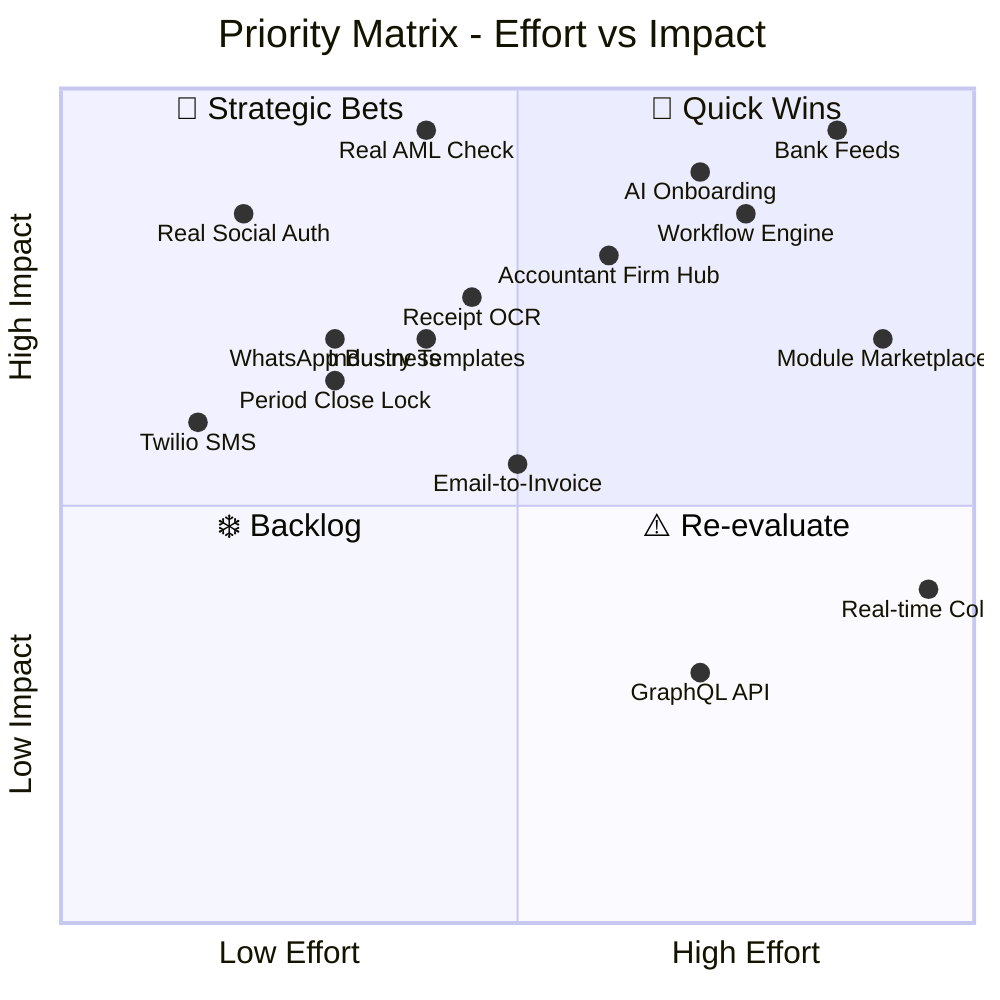
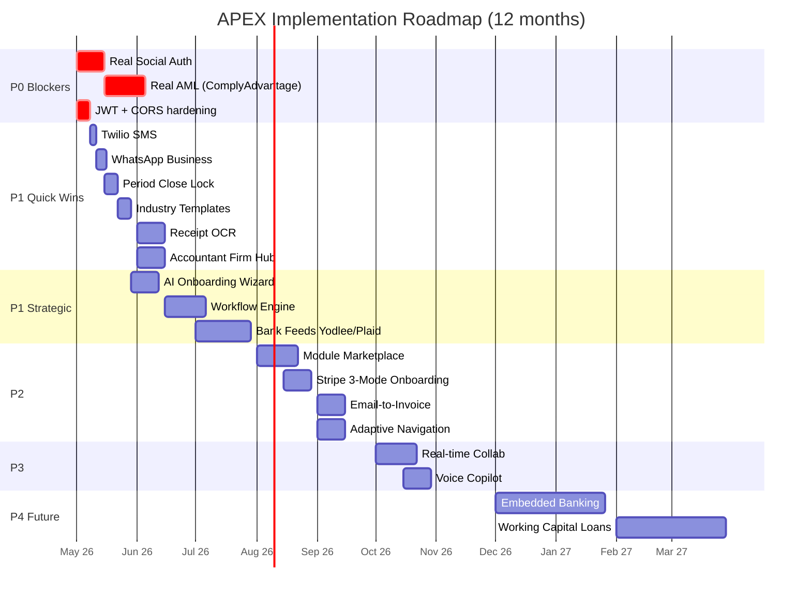

# تحليل الفجوة — APEX Now → APEX Target

> قائمة عملية بكل ما يحتاج تحسين/تكميل، مرتّبة حسب الأولوية والتأثير.

> **تحديث 2026-04-29**: جلسة migration نُفِّذت (8 commits). تركّزت على **codebase cleanup** (تنظيف 1700+ سطر dead code، أرشفة 30+ شاشة orphan، إضافة RBAC للـ demos). الـ **P0/P1 Backend Hardening** أدناه لسه مفتوح ويحتاج جلسة backend منفصلة. تفاصيل الـ executed work في [`../MIGRATION_SUMMARY.md`](../MIGRATION_SUMMARY.md).

---

## ✅ المُنفَّذ في جلسة 2026-04-29

| الإجراء | الـ commit | الحالة |
|---------|-----------|--------|
| Bug fix `/financial-statements` route | `ac35477` | ✅ |
| 13 demo route gated behind `platform_admin` (Adaptive Nav partial) | `b2f2737` | ✅ |
| GOSI + EOSB موصولين كـ production HR features | `895437b` | ✅ |
| 30 orphan files archived (V4 drafts, V5.2 drafts) | `5ec2c10` | ✅ |
| 8 orphan classes removed from multi-class files | `f3b2199` | ✅ |
| Sprint 40 + 42 archived (100% production coverage) | `7c32400` | ✅ |
| 9 architecture documents + 21 rendered Mermaid diagrams | various | ✅ |

**ملاحظة**: الـ P0/P1 الباكي backend work (real OAuth, AML, Twilio, etc.). جلسة الـ migration ركزت على cleanup + governance. التفاصيل في [`../MIGRATION_SUMMARY.md`](../MIGRATION_SUMMARY.md).

---

## مصفوفة الأولويات

---

## P0 — حرجة (Block المنتج للإنتاج)

| # | الفجوة | الموقع الحالي | الإصلاح المقترح | التأثير |
|---|--------|---------------|-------------------|---------|
| 1 | **Social Auth STUB** | `app/core/social_auth_verify.py` | تحقّق فعلي من توكنات Google/Apple باستخدام مكتبات `google-auth` و `apple-auth` | أمان: حالياً أي حد يقدر ينتحل شخصية أي حد |
| 2 | **AML Check STUB** | `app/phase4/routes/...` | ربط ComplyAdvantage أو WorldCheck API | قانوني: لا يمكن إطلاق Marketplace فعلي بدون AML |
| 3 | **JWT_SECRET prod** | `app/core/auth_utils.py` | فرض env var في الـ production startup (fail-fast) | أمان: dev secret لا يصلح production |
| 4 | **CORS_ORIGINS = `*`** | `app/main.py` | تقييد على origins محددة في prod | أمان: open CORS = CSRF attack vector |

---

## P1 — عالية (تحسن جوهري للـ UX)

| # | الفجوة | الإصلاح المقترح | الجهد |
|---|--------|-------------------|--------|
| 5 | **AI Onboarding Wizard** | Replace static form with conversational AI wizard (QuickBooks pattern) | أسبوعين |
| 6 | **Bank Feeds Integration** | Yodlee/Plaid API + ML matching (Wave/Xero pattern) | 4 أسابيع |
| 7 | **Workflow Automation Engine** | Zoho-style rules + actions + scripting hook | 3 أسابيع |
| 8 | **Accountant Firm Hub** | Multi-client SSO grid (FreshBooks pattern) | أسبوعين |
| 9 | **Receipt OCR Pipeline** | Claude Vision + structured extraction (Wave pattern) | أسبوعين |
| 10 | **Real Twilio SMS** | استبدل stub بـ Twilio SDK | يومين |
| 11 | **Real WhatsApp Business API** | استبدل console logger بـ WhatsApp Business Cloud API | 3 أيام |
| 12 | **Period Close Lock Enforcement** | منع الـ posting في فترات مقفلة + closing entries auto | أسبوع |
| 13 | **Industry COA Templates** | 7 templates: Saudi/UAE/Kuwait/Egypt × Retail/Service/Pharma | أسبوع |

---

## P2 — متوسطة (تحسينات قيّمة)

| # | الفجوة | الإصلاح المقترح |
|---|--------|-------------------|
| 14 | **Module Marketplace** | Toggle modules حسب الخطة + UI لتفعيل/تعطيل |
| 15 | **Email-to-Invoice** | Email parser → extract → auto-create invoice draft |
| 16 | **Stripe Connect 3-Mode Onboarding** | Hosted + Embedded + API options للـ providers |
| 17 | **Bank OCR L4 (Vendor Matching)** | ML model يطابق transactions مع vendors محفوظة |
| 18 | **AP Agent Real Processors** | فعّل `app/features/ap_agent/real_processors.py` |
| 19 | **Tax Calendar Auto-Population** | Backend events لتذكير المواعيد التشريعية |
| 20 | **Adaptive Navigation** | Frontend nav يتغيّر حسب الـ role + entitlements + onboarding state |

---

## P3 — منخفضة (Nice to have)

| # | الفجوة | الإصلاح المقترح |
|---|--------|-------------------|
| 21 | **Real-time Collaboration** | Y.js / Yjs CRDT للـ JE multi-user editing |
| 22 | **GraphQL API** | بديل أو إضافة للـ REST (يقلل over-fetching) |
| 23 | **Voice Copilot** | Whisper STT + voice response (TTS) |
| 24 | **Mobile Native Apps** | iOS/Android من Flutter Web موجود (نفس الـ codebase) |
| 25 | **Slack/Teams Webhooks** | إشعارات لـ corporate channels |

---

## P4 — مستقبلية (Roadmap 12-18 شهر)

| # | الفجوة | الفائدة الاستراتيجية |
|---|--------|------------------------|
| 26 | **Embedded Banking** | حسابات بنكية داخل APEX (شراكة مع Standard/Riyadh Bank) |
| 27 | **Working Capital Loans** | قروض قصيرة بناءً على دفاتر العميل (مفتاح الاحتفاظ) |
| 28 | **Corporate Cards** | بطاقات شركات مرتبطة بالمصروفات |
| 29 | **Investment Management** | تتبّع الاستثمارات + portfolio reporting |
| 30 | **Crypto Accounting** | متابعة العملات الرقمية + الزكاة عليها |

---

## خطة التنفيذ المقترحة (Phased Roadmap)

---

## مؤشرات النجاح (KPIs مقترحة)

| المؤشر | الوضع المتوقّع (As-Is) | الهدف (Target) |
|--------|--------------------------|----------------|
| Time to first transaction | غير معروف | < 5 دقائق |
| Onboarding completion rate | غير معروف | > 85% |
| KYC auto-approval rate | 0% (يدوي) | > 60% |
| AML check accuracy | 0% (stub) | > 99% |
| Bank reconciliation auto-match | غير موجود | > 70% |
| Receipt OCR accuracy | غير موجود | > 90% |
| Workflow rule adoption | 0 rules | > 5 rules per active client |
| Notifications delivery rate | console only | > 98% |
| Period close time | غير معروف | < 1 يوم لـ SME |
| Copilot useful response rate | غير معلوم | > 75% |
