# المخططات كصور (Rendered PNGs)

تم رندر كل المخططات تلقائياً باستخدام `@mermaid-js/mermaid-cli`. الصور حجم عالي (PNG) جاهزة للعرض المباشر أو التضمين.

> **لإعادة الرندر بعد أي تعديل**: شغّل `npx -y -p @mermaid-js/mermaid-cli mmdc -i 01-current-state.md -o rendered/01-current-state.md -e png -p .puppeteer-config.json --backgroundColor white` من مجلد `architecture/diagrams/`.

---

## 📂 الواقع الحالي (As-Is) — 9 مخططات

| # | المخطط | الصورة |
|---|--------|--------|
| 1 | النظرة العامة — كل الأدوار | 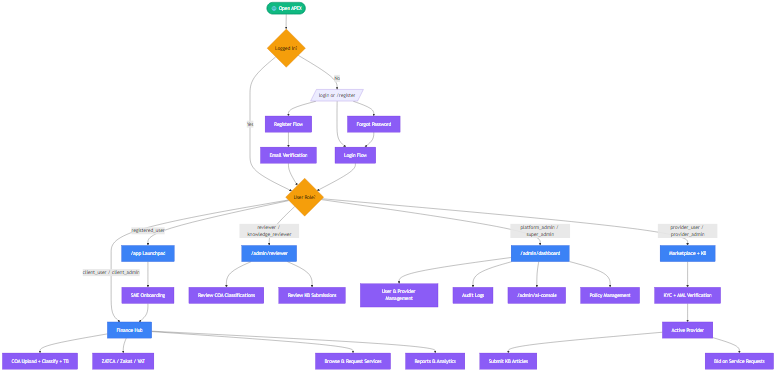 |
| 2 | تدفق المصادقة | 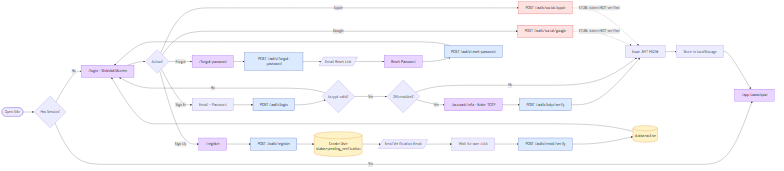 |
| 3 | Onboarding للعميل (SME) | 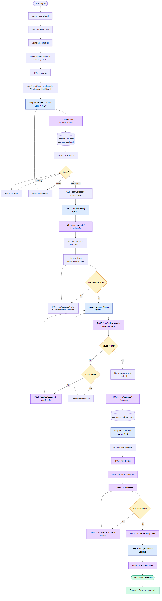 |
| 4 | Marketplace (Provider + Client) | 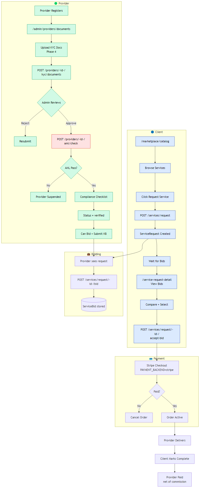 |
| 5 | Knowledge Brain + Copilot | 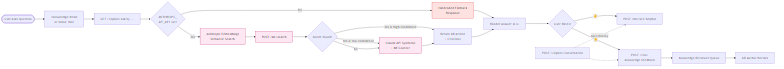 |
| 6 | تدفق الإدارة | 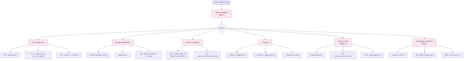 |
| 7 | هيكل الـ Backend (Phases + Sprints) | 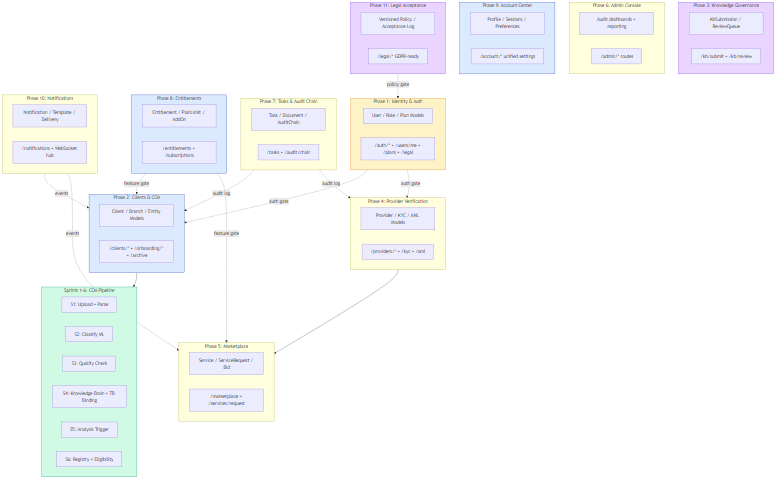 |
| 8 | خريطة الراوتس (Mind Map) | 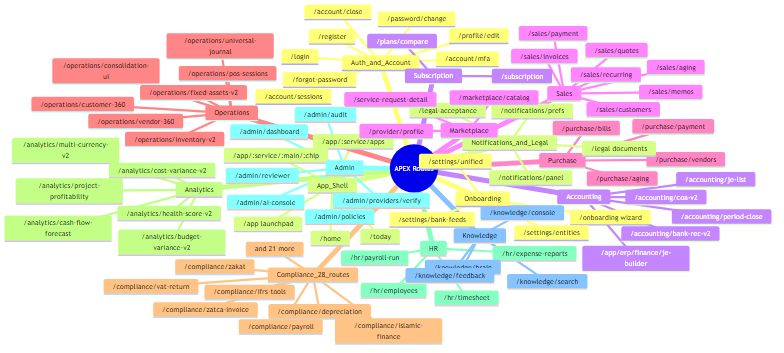 |
| 9 | الفجوات والـ Stubs | 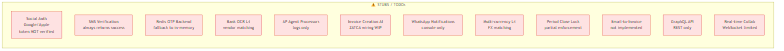 |

---

## 🎯 الحالة المثالية (To-Be) — 10 مخططات

| # | المخطط | الصورة |
|---|--------|--------|
| 1 | النظرة الكلية المحسّنة | 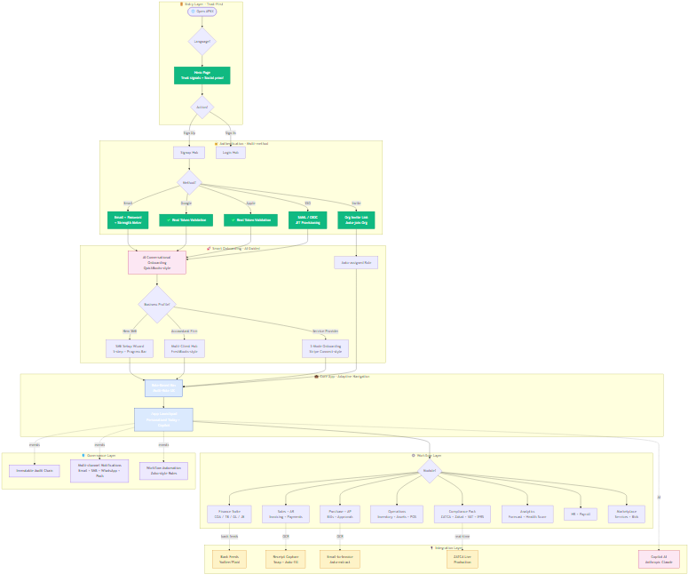 |
| 2 | Onboarding المحسّن (AI Guided) | 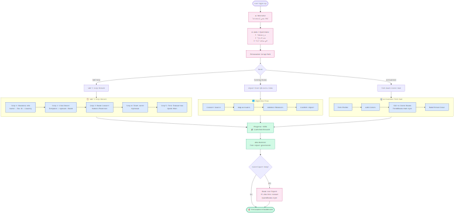 |
| 3 | COA + TB Workflow Engine | 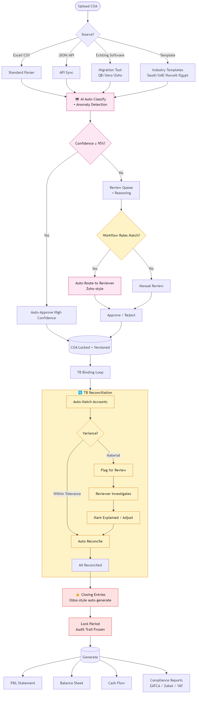 |
| 4 | Marketplace (Stripe Connect Style) | 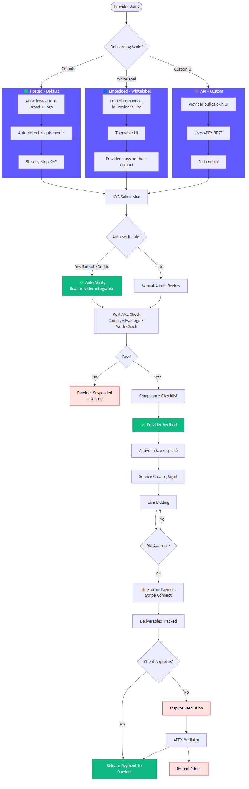 |
| 5 | Adaptive Navigation حسب الدور | 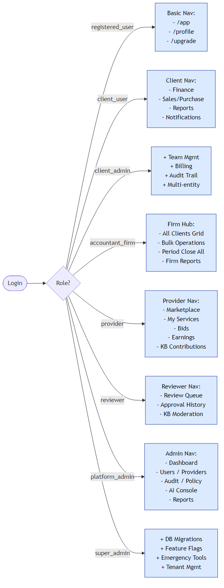 |
| 6 | Workflow Automation Engine | 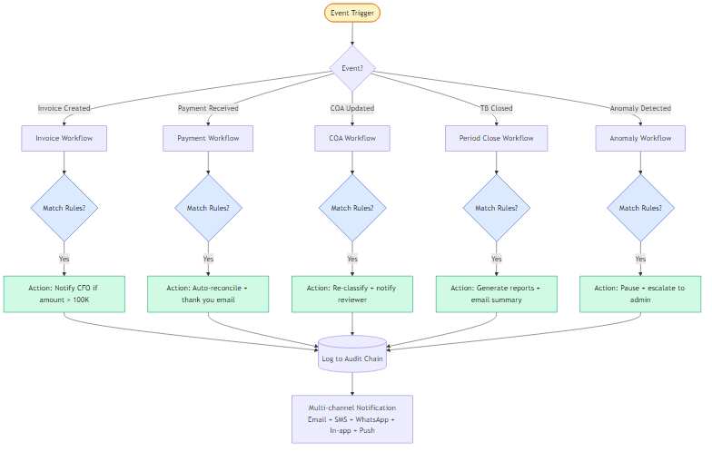 |
| 7 | Multi-Channel Notifications | 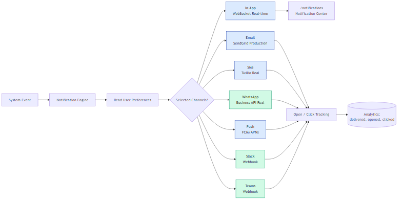 |
| 8 | Module Marketplace (Odoo Style) | 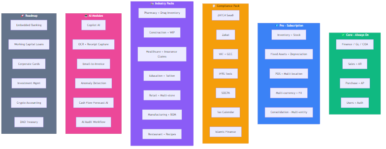 |
| 9 | AI-First Copilot | 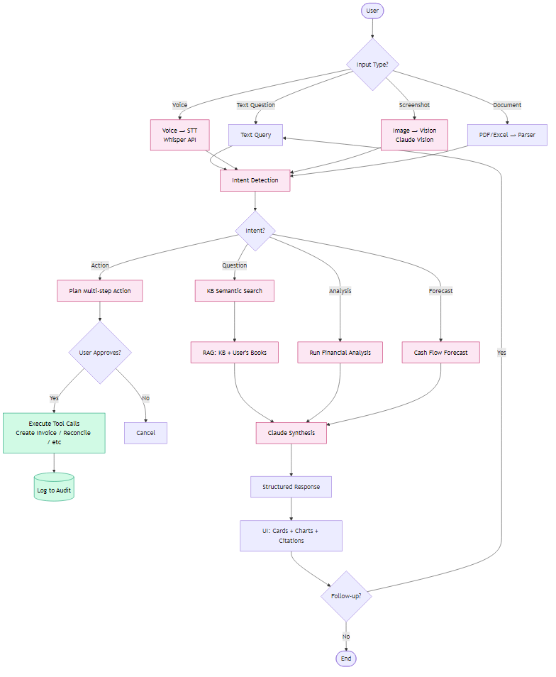 |
| 10 | الفجوات المُسدّة | 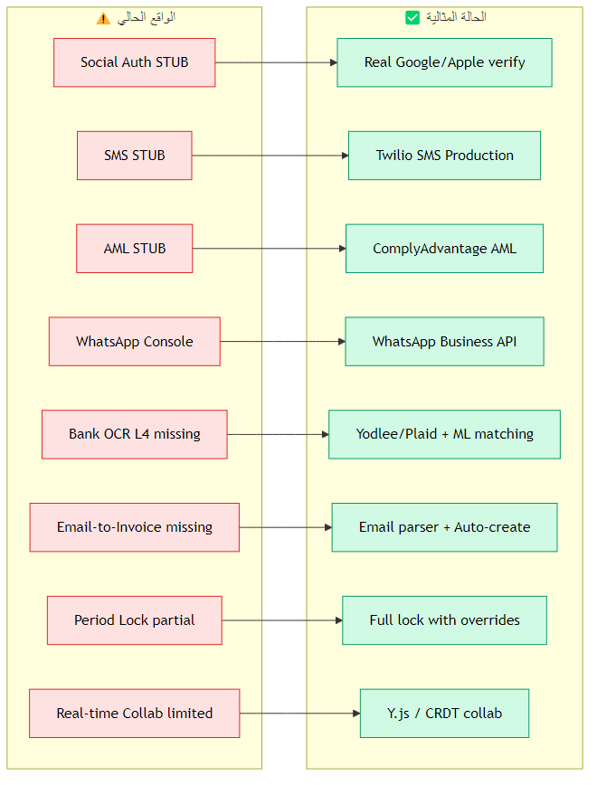 |

---

## 📊 تحليل الفجوة (Gap Analysis) — مخططان

| # | المخطط | الصورة |
|---|--------|--------|
| 1 | Priority Matrix (Effort vs Impact) | 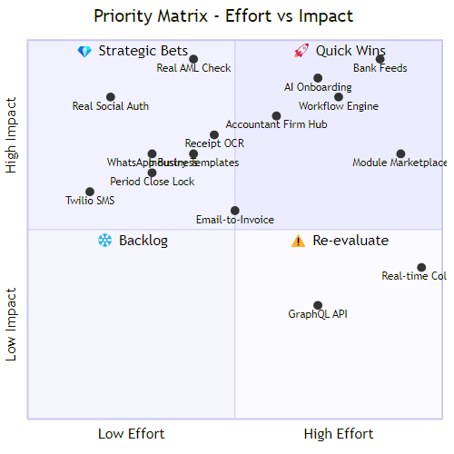 |
| 2 | Roadmap Gantt — 12 شهر | 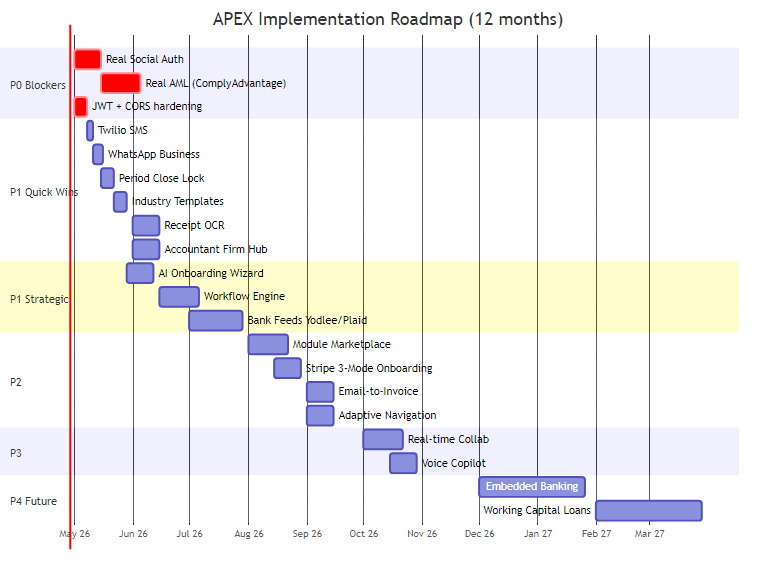 |

---

## كيف تستخدم الصور

- **عرض مباشر**: انقر على أي صورة، GitHub أو VS Code يفتحها بحجم كامل
- **تضمين في عرض تقديمي**: انسخ ملف PNG وألصقه في PowerPoint / Keynote / Google Slides
- **تصدير بصيغ ثانية**: لو محتاج SVG (vector، يكبر بدون فقد جودة) أو PDF، شغّل:
  ```bash
  npx -y -p @mermaid-js/mermaid-cli mmdc -i 01-current-state.md -o rendered/01-current-state.md -e svg
  ```
  استبدل `-e png` بـ `-e svg` أو `-e pdf`.

## الملاحظات

- الصور مولّدة بخلفية بيضاء (`--backgroundColor white`) لتظهر جيداً في أي ثيم
- بعض النصوص العربية قد تظهر معكوسة في Mermaid (محدودية الـ RTL في الأداة) — في النص الأصلي بـ `.md` تظهر صح
- المخططات في `03-research-findings.md` نصية فقط (مصادر وجداول)، فمفيش صور لها
