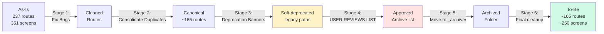

# خطة هجرة APEX من الواقع الحالي إلى الحالة المثالية

> **المبدأ الذهبي**: لا تُحذف أي شاشة شغّالة وموصولة. كل عملية أرشفة تتم **بعد موافقتك** على القائمة المقترحة.

## الإحصائيات الحالية (Apr 2026)

| البند | العدد | الوضع |
|-------|------|-------|
| إجمالي GoRoutes | **237** | (203 canonical + 34 redirect) |
| إجمالي ملفات الشاشات | **351** | بعضها orphaned |
| Service Hubs (Active) | 13 | محتفظة |
| Compliance Suite | 34 | 23 canonical + 11 redirects |
| Demo / Sprint Routes | 27 | للمراجعة |
| V4 Wired Screens | 7 | للهجرة لـ V5 |
| **Duplicates مكتشفة** | **18 مجموعة** | تتجمّع في canonical واحد |
| **Bug**: `/financial-statements` | **مرتين** | معرّف في 2 سطور — لازم يتصلح |

## الفلسفة

## الـ 6 مراحل (مع Safety Gates)

| Stage | الوصف | الخطر | يحتاج موافقة؟ |
|-------|-------|------|----------------|
| **0. Inventory** | جمع كل الراوتس + الشاشات (✅ تم) | 🟢 لا تغيير | لا |
| **1. Fix Bugs** | تصليح `/financial-statements` المكرر | 🟢 آمن | لا |
| **2. Consolidate** | جعل كل دواب الـ duplicates تروح للـ canonical (عبر redirects) | 🟡 يحتاج اختبار | نعم |
| **3. Soft Deprecate** | إضافة banner "هذه الشاشة قديمة" + فترة 30 يوم | 🟢 آمن | لا |
| **4. User Review** | تعرض القائمة، أنت توافق على كل عنصر | 🔴 **توقّف هنا** | **نعم — قبل أي حذف** |
| **5. Archive** | نقل الملفات لـ `lib/screens/_archive/` (مش حذف!) | 🟡 reversible | نعم |
| **6. Final Cleanup** | بعد 90 يوم من نجاح الإنتاج، حذف نهائي | 🔴 **irreversible** | نعم — مرة أخيرة |

## الملفات

| الملف | المحتوى |
|------|---------|
| [`01-screen-categorization.md`](01-screen-categorization.md) | تصنيف كل شاشة: 🟢 KEEP / 🔵 MERGE / 🟡 DEPRECATE / 🔴 ARCHIVE |
| [`02-archive-candidates.md`](02-archive-candidates.md) | **قائمة المراجعة قبل الأرشفة** — لكل شاشة: السبب، البديل، الـ inbound links، الـ rollback path |
| [`03-redirect-map.md`](03-redirect-map.md) | جدول old → new path للحفاظ على bookmarks وlinks خارجية |
| [`04-rollback.md`](04-rollback.md) | كيف نسترجع أي شاشة في أي مرحلة (git restore + script جاهز) |

## ضمانات السلامة

🛡️ **لن يحدث أي شيء من الآتي بدون موافقتك:**
1. حذف ملف شاشة
2. إزالة redirect
3. تغيير راوت في حالة استخدام (مرتبط من زر/قائمة)

✅ **ما يحدث تلقائياً (آمن):**
- إصلاح الـ bug (راوت مكرر)
- إضافة deprecation banners
- إنشاء `lib/screens/_archive/` folder

## كيف تستخدم هذه الخطة

1. **اقرأ** [`01-screen-categorization.md`](01-screen-categorization.md) — لتفهم كل شاشة وضعها
2. **راجع** [`02-archive-candidates.md`](02-archive-candidates.md) — قائمة الأرشفة المقترحة
3. **علّم** على كل عنصر بـ ✅ (موافق) أو ❌ (احتفظ)
4. **رجع لي** بالقائمة المعتمدة وأنفّذ المرحلة 5 (نقل لـ `_archive/`)
5. **بعد 90 يوم** من نجاح الإنتاج، نقرّر معاً المرحلة 6 (حذف نهائي)
